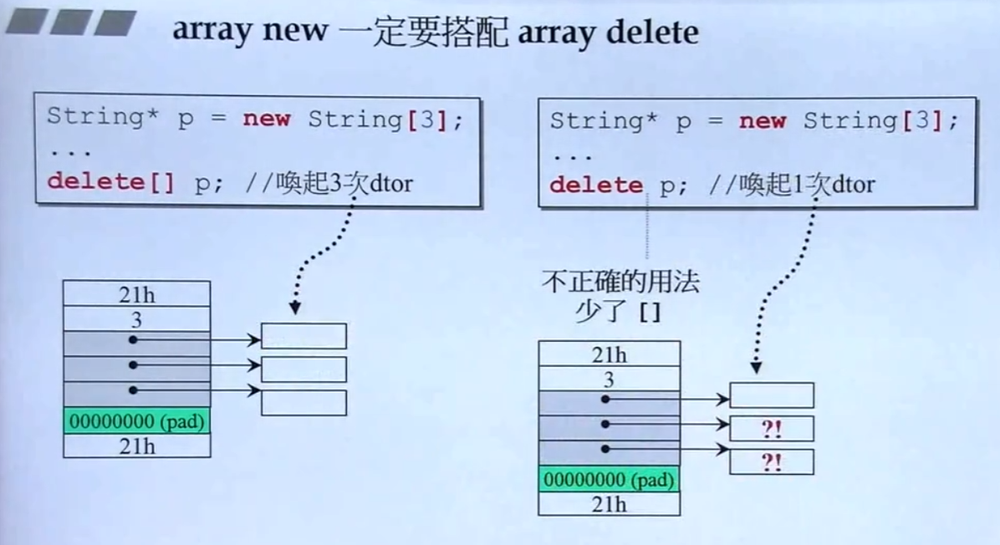
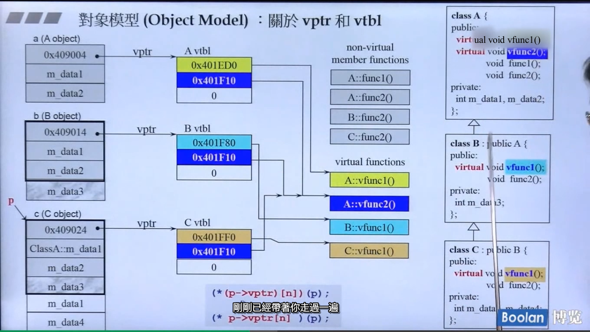
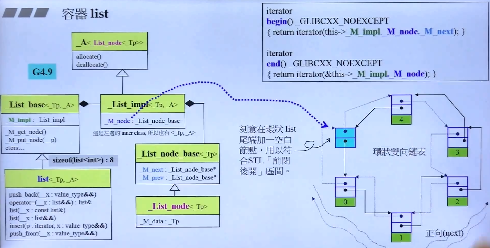
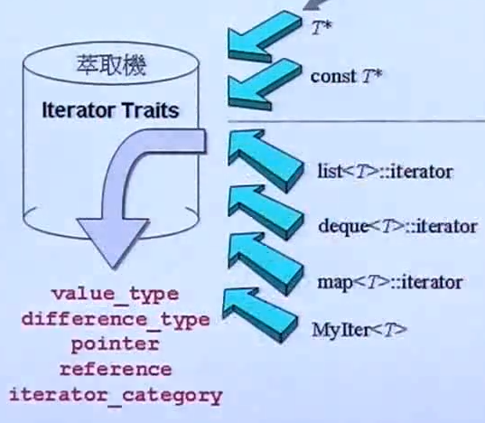
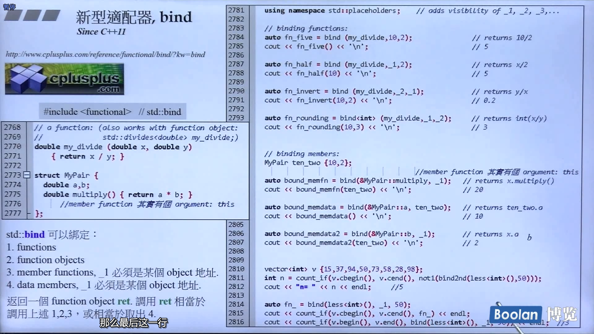
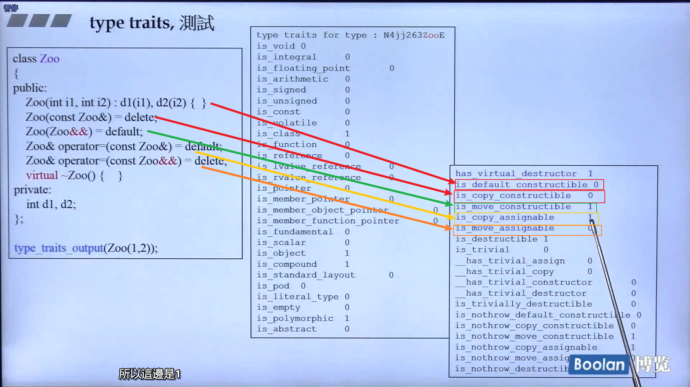
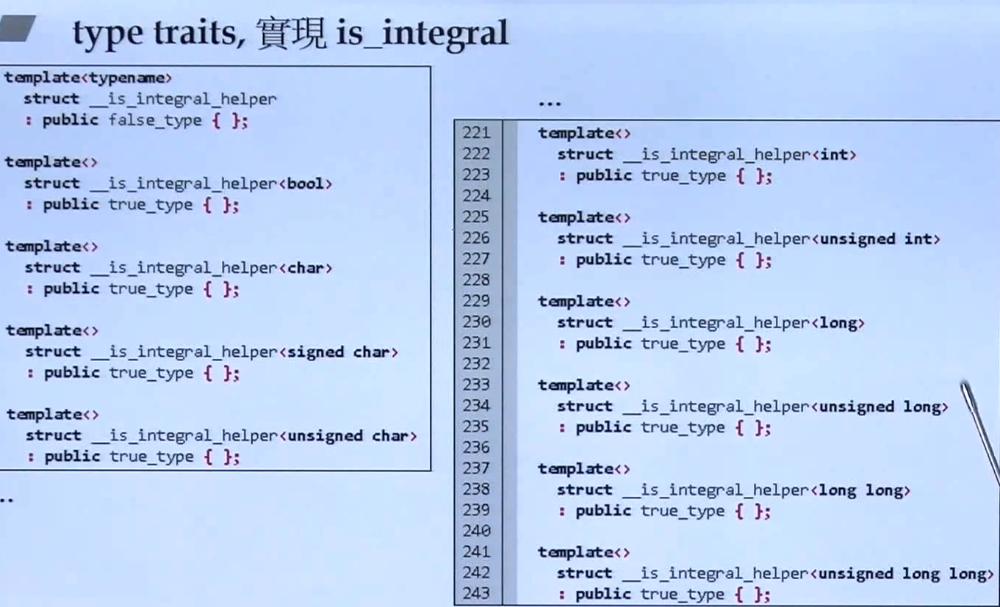

侯捷 C++ 课程笔记
CPP Houjie

Created: 2023-11-25T10:40+08:00
Categories: C-CPP

[toc]

# 面向对象编程（上）

1. Intro
2. 头文件和类的声明
    1. 类内部是指针成员（string）还是真的有一个 Object（本节课的复数的例子）
    2. Guard
    3. Friend
    4. 初识模板
3. 构造函数
    1. access level
    2. constructor
        1. 默认参数
        2. Initialization List
        3. 函数重载
        4. 像复数这个例子没有指针来管理一般不用写析构函数
        5. 构造函数放到 `private ` 里的例子：单例模式，使用 `static` 关键字
4. 参数传递和返回值
    1. `const` 修饰函数
    2. pass by value 和 pass by reference
    3. return by value 和 return by reference，需要考虑返回的对象是否 valid
    4. 相同类的各个 objects 互为友元（friends）
5. 操作符重载和临时对象

    1. 成员函数的重载，以 `+=` 为例
       重载复数的 `+=`，比如 `lhs += rhs;`，`+=` 会把指向 `lhs` 的指针作为 `this` 传进去

        ```cpp
        // `lhs += rhs` will call function below
        inline complex&
        complex::operator += (const complex& rhs) { // += is a function
            return __doapl(this, rhs); // do assignment plus
        }
        ```

        这种写法考虑了链式使用 `c3 += c2 += c1;`

    2. 非成员函数的重载，以 `+` 为例，

        1. 参数没有 `this`
        2. 不 return by reference，通过 `type()` 返回临时对象

        ```cpp
        inline complex
        operator (const complex& x,const complex& y) {
            return complex(real(x) + real(y),
                        imag (x) + imag(y))
        }

        inline complex
        operator + (const complex& x, double y) {}
            return complex (real (x) + y, imag (x));
        }

        inline complex
        operator + (double x,const complex& y)
            return complex (x + real (y), imag (y));
        }
        ```

        还有 `<<` 等操作符的重载，就不赘述了。

6. 复习 `Complex` 类的实现，Jump
7. 拷贝构造，拷贝赋值，析构，也就是「big three」以 class with pointer 的 String 为例
   `string s1(s); string s2 = s;`
   编译器会自己给拷贝构造和拷贝赋值函数，那就是逐比特复制，不适用于类内带指针的情况，否则两个对象内部的指针将指向同一块内存区域
   拷贝赋值需要 override assignment operator
    1. 拷贝构造：`string s(src);`
        1. 使用 `new` 来获得内存：`data = new char[strlen(src.data) + 1]; strcpy(data, src);`
           因为兄弟之间互为 friend，所以拷贝构造可以直接访问参数的 private 成员
        2. 使用 `delete` 来释放：`delete[] data;`
    2. 拷贝赋值：`string s1 = s;`
        1. 检测自我赋值，否则将释放自己的内存，导致空指针
        2. 释放自己原有内存，再做拷贝
8. 堆、栈和内存管理
    1. 栈内对象销毁会自动调用析构函数，所以 `{string s1 = s;}` 离开作用域就会调用析构，这种叫做 auto object
    2. 堆上的对象用 `new` 关键字创造，需要自己 `delete`
    3. 静态对象，`static`，等程序结束后销毁，如 `static string s1;`
    4. 全局对象，不在任何花括号中定义，`main()` 结束后销毁
    5. `new` 做了什么：
        1. 用 operator new，底层是 malloc 得到 sizeof(obj) 大小空间
        2. static cast
        3. 调用构造函数
    6. `delete` 做了什么
        1. 调用对象本身的析构函数，将对象外部引用的内存释放
        2. delete 对象本身，底层是 `free`
    7. array new 和 array delete 一定要配对使用
        <!--  -->
        
        1. `new` 底层调用了 `malloc`，在 TCPL 中提到了，malloc 得到的内存前面是会记载分配的内存有多大，图中是 3，因为 string 使用的 data 只有一 32 位的指针
        2. `delete p` 只会把 p 指向的对象，也就是 `string[]` free 掉，对象内部还指向了 `char[]`，这个需要调用 string 的析构函数才行
9. String 类复习，Jump
10. 类模板等
    1. `static` 关键词：
        1. 用在 data member，说明不属于任何一个对象，比如银行账户的利率，每个账户都有，但是每个账户都一样
        2. 用在 member function，那么调用的时候不会传入 `this` pointer，只能处理类的 `static` data member，调用的方式有两种：`Account::set_rate();` 或者通过 instance 调用 `a.set_rate()`，这个时候编译器就不会帮我们传入 `this`
        3. 单例模式：这个类只有一个对象，放到 static function 里管理
    2. 类模板 class template，使用一个头，告诉编译器类型还不确定，到时候再生成对应的代码，会导致「代码膨胀」，比如 complex 的实部虚部类型还不确定
    3. 函数模板 function template，比如 `max(T, T)`，类模板用户指定，函数模板类型推导
11. 组合与继承：

    1. Composition（组合）：一个类里面有另外一种东西（has-a），就是组合，比如 queue 里面有 deque
       note. 提到了 adapter 这种设计模式，queue 只是包装了 deque，所以它是一个 adapter

    ```mermaid
    classDiagram
    queue *--> deque
    ```

    2. Delegation（委托）: Composition by reference

    ```mermaid
     classDiagram
     String o--> StringRep
    ```

    String 内部只有方法，具体的实现（Implementation）交给 StringRep

    3. Inheritance（继承）:表示 is-a

    ```mermaid
    classDiagram
    Base <|-- Derived
    ```

    内存上，就是子类「包了」一个父类，父类的析构函数要加上 `virtual` 关键字

12. 继承与多态：
    1. 数据的继承是直接 copy 一份下来，函数的继承是继承了调用权，调用权也分三种：
        1. non-virtual: 不希望被 overriding
        2. virtual：希望被，而且自己有定义
        3. pure virtual：希望被，但是自己没有默认定义，函数 body 直接写 `=0`
    2. 继承的实例：CDocument 和 CMyDoc，`CDocument::OnOpenFile()` 需要子类的 `Serialize()`
    3. 委托 + 继承的实例：Observer 和 Subject，Subject 内部存储 `Observer*[]`，自己更新后 notify 他们，Observer 是父类
13. 委托相关设计

    1. Composite: 类似于文件系统，

        ```mermaid
        classDiagram
        Component <|-- Primitive
        Component <|-- Composite

        class Composite {
            - c: vector &lt Component* &gt
            + add(e: Component)
        }
        ```

        Primitive 就像文件，Composite 就像文件夹

    2. Prototype: 父类可以创造指定的子类，外界也只能通过父类来创建子类
       每一个子类都有一个 static self 对象（因为 static 不属于任何一个实例，所以可以这样做），这个对象创建后父类要知道（父类可以使用数组保存子类对象的指针），所以要调用父类的一个函数把该实例添加到父类的数组中。
       父类创建子类的时候，需要子类提供 `clone()` 方法。

# C++ 程序设计（Ⅱ）兼谈对象模型

1. Intro，Jump
2. 转换函数：分数分为分母和分子，重载 `double()` 函数，不用写返回值：`operator double() const{...}`，编译器遇到 `4+f` 会查找可能调用的函数，先查找`+` 有没有被重载，没有，然后是想办法把 fraction 转换为 `double`，这样 f 就可以和 4 相加
3. non-explicit-one-argument constructor：如果没有提供转换函数，但是提供了一个构造函数，`Fraction(int num, int den=1)` 和重载 Fraction 的加法，编译器遇到 `f+4` 就可以尝试把 F 构造成一个 `Fraction`，这样就可以和 Fraction 相加。
   但是如果转换和构造同时存在，编译器对于 `4+f` 会报 ambiguous 的 error。所以引出了 `explict` 关键字，编译器不要悄悄地转换 4 到 Fraction
4. pointer-like classes: 一个类长出来像一个 class，为什不直接用原来的 class，因为希望比原来的指针多做一些事，这里介绍 `shared_ptr` 和迭代器，要重载 `*` 和 `->` 操作符。`->` 直接返回内部的指针。
5. function-like classes：仿函数，C++ 里面有一些奇怪的 struct，只是重载了一个操作符`()`，这样对象产生实例后再使用 `()` 运算符，还有这类 struct 还继承一些奇怪的类。
    ```cpp
    template<class T>
    struct plus: public binary_function<T,T,T> {
        T operator() (const T& x, const T& y) const {return x + y;}
    }
    ```
    使用；`plus<int>()(1,2);`
6. namespace 经验谈：jump
7. class template：侯捷说非常简单，Jump
8. function template：Jump
9. member template：使用的例子是 `pair` 的，但是除了多了点类型作为参数外，我没看出来和 class template 有什么特别的地方。
10. specialization 模板特化：当类型为 xxx 的时候，可以做特殊的处理，比如 `hash<long>`
11. 模板偏特化：
    1. 个数上的偏，比如需要指定两种类型，我要特殊处理其中一种类型：从 `vector<T, Alloc>` 到 `vector<bool, Alloc>`
    2. 范围上的偏：比如当传入的是一个指针，希望做特定的操作
        ```cpp
        template <typename T>
        class C<T*> {...};
        ```
        使用：`C<string*> obj`
12. template template parameter（模板模板参数）：一个模板需要接受另一个模板作为参数，比如想要： `XCls<long, auto_ptr> p;`
    ```cpp
    template<typename T,
        template <typename T>
            class Container // 不适用于 list 等，因为它们需要 allocator 模板参数
    >
    class Xcls {Container<T> c;}
    ```
    有个辨析什么是真正的模板参数，看不懂，就不深究了
13. C++ 标准库：Jump
14. 三个主题
    1. 数量不定的模板参数
    2. `auto`
    3. range-base for
15. reference: 引用要制造一种假象，地址（&）、大小（sizeof）都和引用对象的结果一样。
16. 复合、继承关系下的构造和析构：参考代码在文末，construct 顺序是 Base -> Comp -> Derived，析构顺序相反，可能不同编译器顺序不一样，但是构造由内而外，析构由外而内
17. 对象模型：关于 vptr（虚指针）和 vtbl（虚表）
    1. 父类几个虚函数，子类就至少有几个虚函数
    2. vptr 指向 vtbl，vtbl 里面放的都是函数指针，指向虚函数（也就是继承来的函数）
        <!--  -->
        
    3. 编译时候，是动态绑定机制，满足以下三个条件，就会编译成虚函数调用的形式
        1. 指针调用
        2. 向上转型
        3. 调用虚函数
18. 关于 this：用了 MyDoc 的 `OnFileOpen()` 和 `Serialize()` 的例子，
    `MyDoc` 子类调用 `OnFileOpen()`，函数内部需要执行子类的 `Serialize()`，在编译父类的 `OnFileOpen()` 就需要动态绑定 `Serialize()` 为虚函数调用
19. 关于 Dynamic Binding：通过例子告诉大家一定要符合三个条件才会使用动态绑定
    note. 这部分还需要看附录的虚表
20. 讲述函数声明中的 `const` 关键字，这个 CPP Primer 讲过了，使用的例子是 string 的 `operator[]` 要区分常量调用还是非常量调用（要考虑 copy on write）。
    `const` 也是函数签名的一部分
    有一条规则：「當成員函数的 const 和 non-const 版本同時存在，const object 只會（只能）調用 const 版本，non-const object 只會（只能）調用 non-const 版本」
21. 关于 `new` 和 `delete`，`new` 是 expression，不能重载，new 会调用 operator new，这个可以重载，先分配内存再 ctor。delete 先调用 dtor，再释放 memory
22. 重载 new 和 delete：既可以重载全局的 `new`、`new[]`、`delete` 和 `delete[]`，也可以通过成员函数重载单个类的这四种操作符。若无 成员函数重载则使用全局的。
23. 示例：可以通过 `::new` 和 `::delete` 强制使用全局的 `new` 和 `delete` operator。
    使用 `new[]` 得到的指针的第一个字节会记录后续有多少个对象，也正是因为记录了多少个对象，`delete[]` 才知道需要调用多少次析构。
24. 重载 `new()` 和 `delete()` 示例：还有一种重载形式是 placement new，比如 `Foo* pf = new(300, 'c') Foo;`，也可以重载多种 delete，但是只有 ctor 抛出 exception 时候被调用。
25. basic_string 使用 new(extra) 扩充申请量：重载 placement new，为的是能够多申请一个 extra 的空间，用来放真正的字符串的内容，还有一部分用来放 ref count

# C++ 标准库体系结构与内核分析

1. 认识 headers、版本、重要资源：标准库（Standard Library）大于 STL（Standard Template Library），6 大部件是 STL，还有一些小东西，加上才是标准库
2. STL 有 6 大部件：Container，Allocator，Algorithm，Iterator，Functional，Adaptor
3. 容器之分类与各种测试（一）：
    1. 容器的分类，sequence、associative 之类的
    2. 使用 `<ctime>` 测试排序、二分查找的耗时
4. 容器之分类与各种测试（二）：Vector，我学到的点是，用了 try-catch 捕获 bad-alloc 异常并且 `abort()`
5. 容器之分类与各种测试（三）：总结顺序容器（sequence），用顺序查找，也就是全局 search，然后再排序再二分查找观察用时
    1. 对 List 这个双向链表测试效率，有个注意点是，List 本身有 `sort()` 方法，有些容器本身就有排序方法，所以不必调用全局的排序
    2. 单向链表 `forward_list` 没有 `push_back`，因为持有的指针是 head，尾部插入需要遍历整个链表，太慢就不要了，所以只有 `push_front`，每次先进来的反而在头部，有 `stack` 的感觉
    3. deque，分段连续
    4. stack 和 queue，都只有 `push`，是 adapter
6. 容器之分类与各种测试（四）：测试各种 multi unordered set/map
    1. 测试 Set，底层是红黑树，自己提供了 `set.find()` 方法。
    2. 测试 `multi unordered_set`，有 bucket 的概念，也就是篮子，当篮子个数小于元素时候就要打散，篮子数量扩充为原来的两倍，也有自己的 `find` 方法
7. 分配器之测试：
    1. 容器有一个默认参数是分配器，有标准库之外的分配器，比如介绍的 GNU 的分配器
    2. 通过向 list 不断 push_back 测试用时，各种分配器的效率
    3. 分配器应该和容器搭配使用，而且不应该直接使用分配器索要内存，原因之一是释放的时候还要告诉分配器释放多少内存，不方便。
8. 源代码之分布：大概是 GNU 源代码在哪一个文件夹
9. OOP（面向对象编程）vs GP（泛型编程）：
    1. OOP 将 data 和 method 放在一起，GP 将 data（Container）和 method(Algorithm) 分开，通过 Iterator 联系在一起
    2. 为什么 list 自己有 sort 而且不能用 ::sort，因为 ::sort 需要随机访问迭代器，支持 `first + (last -first)/2`，list 的迭代器不支持随机访问，每次只能 +1
10. 操作符重载和模板
    1. 操作符重载可以在类内重载，也可以在全局重载，有些不支持全局重载，还有些操作符不支持重载
    2. 模板分为：类模板、函数模板和成员模板（不介绍）
    3. 模板的特化：有些类型希望独立出来处理，语法就是把 `<>` 里面的 type 抽出来，这里介绍的是 hash 的特化，有 `hash<int>`、`hash<char>`
    4. 模板的偏特化（partial specialization）：一个类模板接受多个参数，希望当部分参数满足条件的时候处理，比如 `vector<bool>`，因为 `vector`这个模板类接受的是两个参数。
    5. 还有一种范围的偏特化，比如接受的是指针，指针指向的类型无所谓，如果是指针的话，希望进行特化
11. 分配器（Allocators）：
    1. 看了 VC6 的 allocator，有 allocate 和 deallocate 两个函数，没有任何特殊设计。
       我们不直接使用 allocator 的一个致命原因是，deallocate 需要告诉他返回多少个元素，没有人会记得自己曾经索要过多少内存。
    2. 还看了 BC 和 GNU C 的 allocator，都只是包装 malloc 和 free，没有任何特殊的设计，这样会导致 overhead 大。
    3. GNU2.9 C 还有一个类 alloc 才是真正用来分配内存的，通过内部链表管理申请的特定大小的内存，到了 4.9 版本变成 `__pool_alloc`，STL 用的变成原来简单包装的，使用：
       `vector<string, __gnu_cxx::__poll_alloc<string>> vec;`
12. 容器之间的实现关系与分类：Jump
13. 深度探索 list 上：GNU2.9
    1. list 内部数据只有一个 node，指向一个节点
    2. 每个 container 内部要定义 iterator 类型，比如 `list::iterator` 这个 iterator 为了模拟指针要实现 5 个函数
    3. 重点讲解 `++`，通过 int 参数区分 `i++` 和 `++i`，后加加返回 copy 对象
14. 深度探索 list 下
    1. GNU4.9 版本的 list，iterator 的模板参数只有一个，节点不再是 `void*`
    2. list 被设计成环状，并且最后一个为空节点 end
        <!--  -->
        
15. iterator 设计原则和 traits
    1. traits 的作用是回答 algorithm 的「提问」，有 category、difference_type、reference、pointer 和 reference，根据 iterator 的 trait（特点）来决定如何操作。
    2. 为了能够让算法区分传进来的是 iterator 还是裸指针，如果是 iterator，就应该直接返回 iterator traits 的回答，如果是指针就不能直接问，此处设计一个偏特化来实现类型的区分。这个中间层 traits 被形容为「萃取机」
        <!--  -->
        
16. vector 深度探索：
    1. 就是要扩容，把原来的内存空间都释放掉，所以需要大量地调用析构函数
    2. 评价 GUN4.9 版本，说太复杂了没必要
17. array、forward_list: array 没有 ctor 和 dtor。Jump
18. deque、queue 和 stack 深度探索（上）：
19. deque、queue 和 stack 深度探索（下）：
    1. deque 分段连续，iterator 在每一段内移动的时候，要判断在不在边界然后跳到另一段去，是 `random_access_iterator_tag`，`insert()` 可以判断要插入的位置离尾端近还是头端近，
    2. iterator 要模拟随机移动的操作，包括 `++`、`+=` 等
    3. 里面的控制器是一个 vector，每次扩容 copy 到中段去，这样就可以在 vector 中间向两边扩充
    4. queue 和 stack 都只是 adapter，定义的时候第二个模板参数是真正的 container，默认是 deque。它们不提供遍历，也不提供 iterator。stack 可以用 list 和 vector，queue 可以用 list。所谓不可以用其他容器做为底层结构，意思是只要不调用不支持的那个函数，比如 queue 用 vector 作为底层结构，在调用了 `pop()` 的时候是没法通过编译的，如果不调用就可以通过编译。
20. RB-Tree 深度探索：讲解内部 iterator 的移动
    1. 有个模板类叫做 `rb_tree<Key, Value, KeyOfValue, Compare, Alloc>`，`value = key | data`，要告诉红黑树，如何从 value 中取出 key 来。
    2. 最简单的 `rb_tree<int, int, identity<int>, less<int>, alloc>`
    3. map 和 set 通过 composite 拥有 rb_tree
    4. 每一个节点拥有 left、right、parent 和 color
21. set、multiset 深度探索
    1. 底层都是 rb_tree，可以认为是一种 adapter
    2. 区别是调用 insert_unique 还是 insert_equal
22. map、multimap 深度探索：`<class key, class T, class Compare, class Alloc>`
    1. 对应到 rb_tree 底层 value 是用 `pair<const key, T>`
    2. `map` 有一个独特的操作，就是 `[]` 找不到就插入一个新的元素，这是使用 `lower_bound()` 完成的，该函数返回「不破坏排序得以安插该元素的第一个位置」。
23. hashtable 深度探索（上）：
    1. 模板参数要 hash function，可以计算出一个 hashcode
    2. 篮子（bucket）和链（chain）的概念。大家一起约定，当元素个数超过篮子个数，就扩容篮子两倍左右的一个素数，这些素数已经预先存储好了。这相当花时间，所有元素落在哪一个篮子要重新计算。
    3. bucket 用 `vector` 实现，chain 用自己写的链表
24. hashtable 深度探索（下）：
    1. 利用模板的偏特化为 int 等数据类型提供 hash function
    2. 使用 `%` 计算落在哪一个 bucket 里
25. hash_set, hash_multiset, hash_map, multi_multimap 概念：和 23 重复了
26. unordered 容器概念：从 C++11 后，hash 就改名字了
27. （第三讲）算法的形式：算法通过 迭代器（iterator）接触到容器，因为是「闭门造成」，所以之恶能问迭代器有什么性质，根据性质提供最快的算法
28. 迭代器的分类（category）：使用了 5 种分类，每一种分类都是 struct，而且通过继承表示能力的兼容
29. 迭代器分类（category）对算法的影响：举例子:
    1. 比如 `distance`
    2. 比如 `copy` 通过 traits 检查，使用 memmove 还是一个个拷贝
    3. 其他，不写了
30. 算法源码剖析（11 个例子）：
    1. sort 和 find 有的容器会自带，有的用全局的
    2. 其他
31. 仿函数和函数对象：函数对象就是一个对象只重载了 `()` 操作符，function object，也叫 functor
    1. 仿函数只为 algorithm 服务，为什么要把 `+-*/` 设计成函数（或者说是「函数对象」），因为要作为函数的参数传入，而参数不能是运算符
    2. 仿函数 functors 的可适配（adaptable）操作，STL 里面的比如 `unary_function` 有什么用——继承里面的 typedef
32. 存在多种 adapter：容器 adapter，迭代器 adapter 和 仿函数 adapter，仿函数 adapter 需要能够回答问题，比如 binary_function 的「3 个问题」：
    ```cpp
    template<class Arg1, class Arg2, class Result>
    struct binary_function {
        typedef Arg1 first_argument_type;
        typedef Arg2 second_argument_type;
        typedef Result result_type;
    }
    ```
33. 函数适配器：binder2nd：例子：计算 vector 中小于 40 的元素个数，40 可以作为 `less<int>` 的参数。如果可以在使用内置的 functor 时候指定参数为 40 就好了，这样以后可以处理 100、200 或者更多的情况。
34. not1: Jump
35. bind：新型适配器，可以绑定各种东西，functions, function objects, member functions, data members
    <!--  -->
    
36. reverse_iterator: 逆向迭代器，这是一种迭代器适配器。jump
37. inserter：把一个链表插入到另一个链表中间： `copy(list1.begin(), list1.end(), inserter(list2, it));`。奥妙之处在于重载了 `copy` 中的 `=` 为 `list` 的 `insert()`。
38. ostream_iterator: 不知道要归到哪一类的 adapter，可以绑定到一个 output stream
    重写 `=` 和 `*` 操作符
39. istream_iterator: `++` 操作就是读入一个值到内部的 `value` 变量中，`*`就是取出这个值。
40. 第四讲，一个万用的 Hash Function：`hash_val(seed, ...args)` 的递归调用，逐渐将 seed 和每一个 arg 合并起来，有点像函数的柯里化。
41. tuple 用例：可以用 tuple 放任意个数任意类型的对象，比如 `tuple<int, double, string>`，也是类似于柯里化的实现，利用可变模板参数（Variadic template parameters）实现，逐级继承，`<int, double, string> -> <double, string> -> <string>` 实现元素的放置
42. type traits: 介绍一些 type_trait，可以理解为是否重要的特点，比如是否需要自己的构造函数，我们可以为自己的对象写 type traits，在编译时后可以知道类型的特点，比如是不是 POD（Plain Old Data，如 struct，只有数据），has_virtual_destructor
    <!--  -->
    
43. traits 实现：
    1. 通过泛化和特化 remove const: 如果是 const 对象，就直接取其原来类型，否则九十七本身，同理 remove volatile，合称 remove_cv
    2. is_integral: 对数值类型特化
        <!--  -->
        
    3. 比如 `is_class` 没出现在源代码里，但是编译器本身知道
44. cout：Jump
45. movable 元素对容器速度效能的影响：
    1. move constructor 的语法：`&&`，内部原理：打断传入对象的引用的外部指针，自己指向它，实际是完成了一次浅拷贝
46. 测试函数：感觉有文章讲得更好，就是左值右值，临时对象那一套

# 附

## Component 和 Inheritance 的构造和析构顺序

```cpp
// comp-base-derived
class Comp {
public:
    Comp() {
        std::cout << "Comp construct()" << std::endl;
    }

    ~Comp() {
        std::cout << "~Comp()" << std::endl;
    }
};

class Base {
public:
    Base() {
        std::cout << "Base construct()" << std::endl;
    }
    ~Base()
    {
        std::cout << "~Base()" << std::endl;
    }
};

class Derived : public Base {
public:
    Comp c;
    Derived() {
        std::cout << "Derived construct()" << std::endl;
    }
    ~Derived() {
        std::cout << "~Derived()" << std::endl;
    }
};

int main()
{
    Derived d;
    return 0;
}
```

## 虚函数、虚表、虚继承的内存布局

核心问题是，如何实现：当父类类型持有子类指针时，调用父类函数，实际调用子类函数。

```cpp
class Base {
public:
    int bx = 0;
    virtual void print() {
        std::cout << "bx: " << bx << std::endl;
    };
};

class Derived : public Base {
    int dx = 1;
    void print() {
        std::cout << "dx: " << dx << std::endl;
    }
};
int main()
{
    Base* pb = new Derived();
    pb->print(); // dx: 1
    delete pb;
    return 0;
}
```

1. 调用父类函数时候的 this 指针指向的对象符合父类的内存布局（解决方法是 offset-to-top）
2. 调用父类函数的时候要访问子类成员变量的时候，this 指针指向的对象符合子类的内存布局（解决方法是 thunk）

还有更复杂的菱形基础、虚拟继承的问题，再牵扯出一系列的术语：thunk、offset-to-top、vbase-offset 和 vcall-offset，以及在类的构造和析构过程中，对虚表内各个实体的调整。

# 参考资料

1. [C\+\+中虚函数、虚继承内存模型 \- 知乎](https://zhuanlan.zhihu.com/p/41309205)
2. [C\+\+多态与多继承（二）\- VTT \- 知乎](https://zhuanlan.zhihu.com/p/659201673)
3. [C\+\+多态与多继承（三）\- 虚继承 \- 知乎](https://zhuanlan.zhihu.com/p/659931564)
4. [C\+\+的对象布局 \- 知乎](https://zhuanlan.zhihu.com/p/156880783)
