Games101 课程笔记

Created: 2023-06-07T20:54+08:00

Published: 2023-08-16T21:05+08:00

Categories: ComputerGraphics

[ToC]

# Lecture01: Overview of Computer Graphics

本节课教授了 CG 的应用领域以及课程的安排。

给我的感受是，请牢记不要做 OpenGL 那样的 api user。

## motivation: 学了有什么用？

-   游戏的渲染
-   电影的特效
-   电影的人脸捕捉
-   动画，如《疯狂动物城》中每一根头发和光线的作用
-   设计（Design），如室内设计
-   模拟：线上换装
-   ……

介绍了 CG 的应用领域

note. 我觉得这个很重要，艺术是追求，做不下去的时候就要默念

the key is，方向这么多，总得选一个吧

## 课程内容

-   光栅化（rasterization）: 把空间中的物体放到屏幕上
-   curves and meshes：如何表示曲线和曲面
-   ray tracing：光线追踪可以生成真实的画面
-   animation/simulation：如何让物体在动起来的时候保持拓扑结构，比如拿起一块布

## 课程资源

https://sites.cs.ucsb.edu/~lingqi/teaching/games101.html

# Lecture02: Review of Linear Algebra

-   点乘和投影、投影矩阵：$\frac{aa^T}{a^Ta}b$
-   叉乘的计算可以写成矩阵乘法的形式
-   叉乘判断左右、判断一个点是不是在三角形内部

单位向量：$\hat{a} = \lVert \vec{a} \rVert$

## 点乘

note. 在知道什么是点乘的基础上，需要知道点乘的应用。这个应用是倒过来的，比如倒推角度，计算投影。

-   投影：把 $\vec{b}$ 投影到 $\vec{a}$ 上，投影后得到的向量记作 $\vec{b_{\bot}}$，有 $\vec{b_\bot} = \vec{b} \cdot \hat{a} \hat{a}$。有一个 trick，点乘一个单位向量，就直接得到了在这个向量方向的投影长度
-   点乘可以用来求光线之间的夹角，如 Lambert 模型

## 叉乘

叉积：$\vec{a} \times \vec{b}$，

-   叉积遵循右手螺旋定则
-   叉积可以表示为矩阵的形式 $\vec{a} \times \vec{b} = A \vec{b}$

所谓右手坐标系，就是 x 叉乘 y 得到正 z。

### 叉乘的作用

叉积可以判断左右。在确定的坐标系中，给定 $\vec{a}$ 和 $\vec{b}$，确定“人头方向”和 z 轴方向一致，那么 $\vec{a} \times \vec{b}$ 结果为正，说明在左边。

原理是看叉乘出来的新的向量的 z 轴的 scale，为正说明 $\vec{b}$ 在 $\vec{a}$ 的左边。

衍生出可以判断点是否在三角形内部，原理是绕三角形首位衔接的三个向量，分别和顶点到判定点的向量叉积，同为正或者同为负，则说明在内部。三个向量的定义与顺时针和逆时针无关。

# Lecture03: Transformation

1. 变换的应用：摄像机移动，关节的移动，物体的缩放（PIXAR 动画），成像
2. 二维变换：旋转，缩放、反射和斜切的矩阵表示
3. 平移变化没法写成矩阵乘法，引入齐次坐标
    1. 向量和点的区别是最后一位，原因是向量仿射变换以后最后一位还是零
    2. 两个点加起来要除以二归一化，这样两个点的加法结果就是两个点的中点
4. 齐次坐标的 trade off：引入了一个额外的数字
5. 仿射变换：$a\cdot x + b$，可以类比，就是矩阵的乘法和一个平移的加法
    1. 给定两个仿射变换前后的空间求仿射变化：先平移到原点，再线性变换，再移回去

---

变换包括 model 和 view

## 线性变换

Scale Matrix: 缩放，如其名，坐标乘上一个 scale 系数即可，对角阵

Reflection Matrix: 反射，$x = -x$，镜子

Shear Matrix: 斜切，竖直方向不发生变换，y 不变；水平方向，x 被拉开。结果相当于正方形变成平行四边形。可以认为是「基」发生了变换，$(1,0)^T$ 不变，$(0,1)^T$ 变成$(a,1)^T$。

<!-- 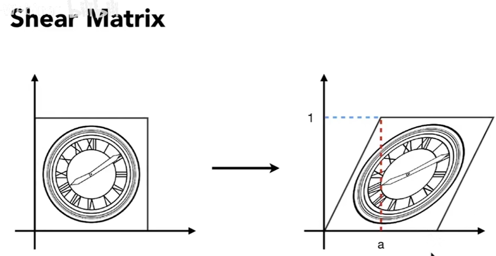 -->


$$
\begin{matrix}
1&a\\
0&1\\
\end{matrix}
$$

Rotation Matrix:

对于二维的旋转，默认逆时针，绕原点

三维的旋转，是绕轴旋转，使用右手定则，比如绕 y 轴旋转，是 $\vec{z} \times \vec{x} = \vec{y}$，是从 z 轴指向转到 x 轴去。

## Homogeneous Coordinates

引入齐次坐标的好处和带来的问题：

1. 统一了平移变换和其他几种变换
2. 为什么向量的最后一位是 0，因为平移变换以后以后还是向量
3. 利用 0 和 1 区分一个列向量表示的是 **向量** 还是 **坐标**，并且恰好：
    - 向量 + 向量 = 向量，此时标志位 0 + 0 = 0
    - 向量 + 坐标 = 坐标，此时标志位 0 + 1 = 1
    - 向量 - 向量 = 向量，此时标志位 0 - 0 = 0
    - 向量做了平移变换，还是原来的向量

同时，引入新的规定，当标志位不等于 0 和 1 的时候，表示一个点，需要归一化

$$
\begin{pmatrix}
x\\
y\\
w
\end{pmatrix}
=
\begin{pmatrix}
x/w\\
y/w\\
1
\end{pmatrix}
$$

这样，在原来 向量 和 点 的运算中诞生了新的含义：

点 + 点 = 两点中点

仿射变换（Affine Transformations）：线性映射 + 平移

note. 关于仿射变换的得名，可以参考 [StackExchange](https://english.stackexchange.com/questions/363015/what-is-the-origin-of-the-word-affine-in-the-context-of-mathematics)，affine 表示「有关系的」，比如函数 $y = a * x + b$ 就是仿射函数，点和矩阵有联系的，你看都是乘法和加法。仿射旨在表明变换后两个空间都是有联系的，保持了共线性和距离比。简单来说，affine 就是一个乘法，一个加法。

可以直接用齐次坐标表示仿射变换

## Inverse & Composite

组合一系列变换，然后可以再倒着乘上逆矩阵变换回去

注意矩阵作用的顺序，从右往左作用于向量：

note. 我觉得这种符号的表达巧合的是，一开始 $T$ 平移矩阵在前面，写到齐次矩阵后，$T$ 跑到后面去了

$$
T_{(1,0)} \cdot R_{45}
\begin{bmatrix}
x\\
y\\
1\\
\end{bmatrix}
=
\begin{bmatrix}
\cos{45\degree}&-\sin{45\degree}&0\\
\sin{45\degree}&\cos{45\degree}&0\\
0&0&1
\end{bmatrix}
\begin{bmatrix}
x\\y\\1
\end{bmatrix}
$$

给定两个仿射变换前后的空间，求仿射变化：先平移到原点，再线性变换，再移回去

## 3D Transformation

jump

# Lecture04: Transformation Cont.

1. 3D Transformation
    1. 齐次坐标的推广
    2. 分别绕 xyz 轴旋转的矩阵，有一个特例绕 y 是不一样的，为什么
    3. 绕向量 $\vec{n}$ 旋转 $\alpha$，也就是 Rodrigues（罗德里格）旋转的推导思想
2. 拍照的过程：M（model）V（view）P（projection）：place camera，then "cheese"
3. View Transformation，also Know as ModelView Transformation
    1. 确定一个相机的姿态：$e, \vec{g}, \vec{t}$
    2. 求从任意姿态变换到原点看 -z 的矩阵 $M_{view}$：先平移，再旋转，可以利用逆矩阵的性质
4. Projection Matrix：正交投影（Orthogonal Projection）和透视投影（Perspective Projection）
    1. 所有投影的输出是 $[-1, +1]^3$
    2. 正交投影是平移然后缩放
5. 透视投影：转换为正交投影去解
    1. Frustum 的定义，原点看一个平行于 xoy 平面的长方形，far，near 之类的参数
    2. Frustum 到长方体那个变换矩阵的理解：
        1. 俯视图看出变换后 xy 关系
        2. 齐次坐标同时乘以 z
        3. 两个特殊面上的点带入猜测

## 3D Transformation

齐次坐标的类比，可以 jump

主要是表示旋转的那个矩阵，有三种旋转：绕 x 轴、绕 y 轴和绕 z 轴，表示绕 x 轴旋转的矩阵长这样：

$$
\begin{bmatrix}
1 & 0 & 0 \\
0 & \cos{\alpha} & -\sin{\alpha}\\
0 & \sin{\alpha} & \cos{\alpha} \\
\end{bmatrix}
$$

可以看到 x 坐标不变，所以那里有一个 $[1,0,0]$ 向量，剩下的部分就是普通的旋转矩阵了。

但是有一个特殊的地方，就是绕 y 轴旋转，是：

<!-- 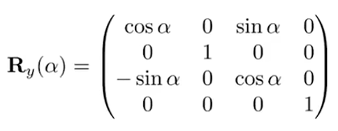 -->


因为 $xyzxyz$，y 轴是 $\vec{z} \times \vec{x}$ 得到的，而非按顺序。

旋转的组合：欧拉角：$\alpha, \beta, \gamma$

罗德里德旋转公式：绕向量 $\vec{n}$ 旋转 $\alpha $ 角度，这个变换怎么写？

推导的思想是将要被旋转的向量分解到 $\vec{n}$ 上。

<!-- 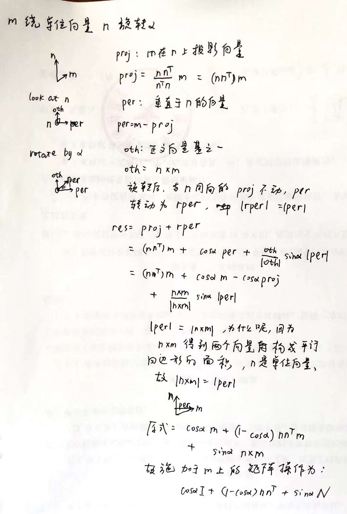 -->


## MVP

为什么分出这些变换来，是从拍照的角度来思考的：

1. Find a good place and arrange people (model transformation)
2. Find a good "angle" to put the camera (view transformation)
3. Cheese! (projection transformation)

note. 之前学习图形学课程的时候，我记得有这么些东西，MVP 矩阵

## View Transformation

view transformation: place the camera to origin

确定一个相机的姿态：

1. Position: 相机位置，记作 $e$
2. Gaze Direction: 相机对准哪个点，这是一个向量，记作 $\hat{g}$
3. Up Direction: 防止相机在 1 和 2 确定的平面上转动，如横屏拍照和竖屏拍照，人头朝天方向记作 $\hat{t}$

当场景和相机做同样的变化时，拍出来的图片是一样的，所以约定让相机摆放到原点，看向 -z 方向，这就是最终相机的姿态。当所有的场景也跟着相机动到最终的姿态，就新得到一个 Transformation Matrix

Question: 给定相机的原姿态，可能是随意的，相机摆到原点后看着 $-z$ 方向是最终姿态，如何计算该变换矩阵？

1. 平移
2. 将 $\vec{g}$ 旋转到 $-Z$，$\vec{t}$ 旋转到 $Y$，$\vec{g} \times \vec{t}$ 旋转到$X$，这个矩阵很难写，但是它的逆好写，所以解 ${R}^{-1}(\vec{x}, \vec{y}, \vec{-z}) = (\vec{g}\times\vec{t}, \vec{t}, \vec{g})$

## Projection Transformation

在我看来，投影就是把一个盒子映射到另一个盒子

现在，我们得到了一个很好的场景，相机就在原点，看着摆放好的物体（相机在最终姿态上）

<!-- 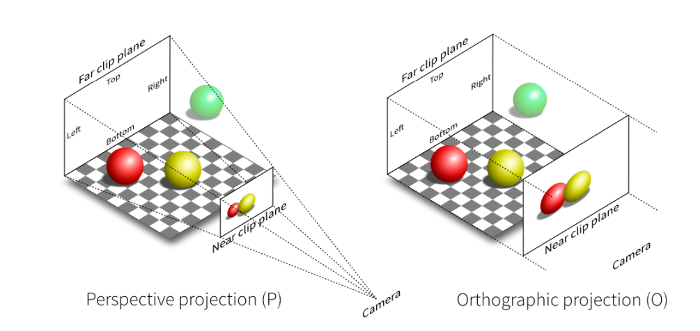 -->


这张图参数标注错了，Left 等参数应该在 Near clip plane 上

给定 6 个参数： <u>T</u>op，<u>B</u>ottom，<u>L</u>eft，<u>R</u>ight，<u>F</u>ar，<u>N</u>ear，我们可以

1. 确定两种不同的立方体
2. 确定两种不同的最终投影的平面

最终的问题是如何把两种立方体内部的点，通过一个矩阵，变换到 z = Near 上

但是这节课我们不解决这个问题，而是解决一个中间问题：

找到一个矩阵，把这个立方体映射到 $[-1,1]^3$

再陈述一遍：

输入：6 个参数，t，b，l，r，f，n

输出：一个矩阵

效果：把 6 个参数确定的立方体（棱台或者长方体），映射到 $[-1, 1]^3$

### Orthogonal Projection（正交投影）

该长方体可能处于一个任意的位置

1. 不考虑旋转，长方体所有棱和轴平行
2. 确实会导致拉升

先平移，再缩放（scale）

<!-- 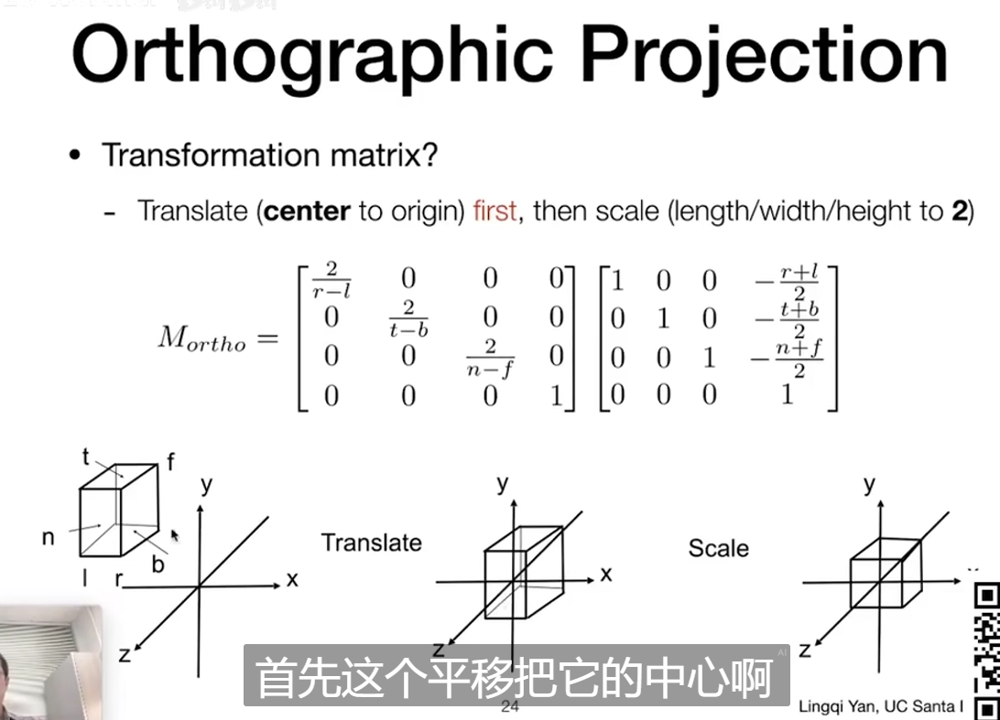 -->


$$
\begin{bmatrix}
\frac{2}{r-l} & 0 & 0 & -\frac{r+l}{r-l} \\
0 & \frac{2}{t-b} & 0 & -\frac{t+b}{t-b} \\
0 & 0 & \frac{2}{n-f} & - \frac{n+f}{n-f} \\
0 & 0 & 0 & 1
\end{bmatrix}
$$

### Perspective Projection（透视投影）

先把那个棱台转换成长方体，再做正交投影，转换成已知的问题。

note. 重在理解推导过程，因为有一个步骤比较逆天没人想得出来。

首先要知道什么是棱台（Frustum），原点看着一个位于 $z = n$ 的长方形，远处 $z = f$ 是棱台的远端，可见棱台的位置没有必要关于平面对称。

下图是一个放在 $-x, -z, +y$ 内的 frustum，粉色圆点在前

<!-- 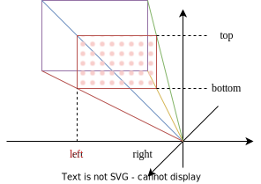 -->


把棱台变成长方体需要一个矩阵，通过输入输出，猜测中间这个矩阵，通过俯视图看这个棱台，棱台内部任意一个点和原点连线交于 near 于一个点，这个点的横坐标就是投影后的横坐标，纵坐标同理。

$\forall x \in 棱台，x' = \frac{n}{z}x, y' = \frac{n}{z}y$

<!-- 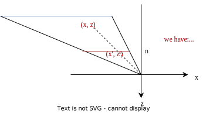 -->


最逆天的一步是齐次坐标同时乘上 z，$(x,y,z,1) \rightarrow (\frac{n}{z}x, \frac{n}{z}y, ?, 1) \rightarrow (nx, ny, ?, z)$

欲求矩阵使得 $(x,y,z,1) \rightarrow(nx, ny, ?, z)$

然后就是两个特殊条件，在 平面 $z = n$ 和 $z = f$ 上的点经过投影后仍然在各自的平面上

-   $(x,y,n,1)$ 经过这个矩阵映射后，保持不变
-   $(0,0,f,1)$ 经过这个矩阵映射后，保持不变

能得到 $M_{persp\rightarrow ortho}$ 为

$$
\begin{bmatrix}
n & 0 & 0 & 0 \\
0 & n & 0 & 0 \\
0 & 0 & n+f & -nf \\
0 & 0 & 1 & 0
\end{bmatrix}
$$

相乘得到 $M_{persp}$ 如下：

之后将两个矩阵相乘得到 $M_{orth} \times M_{persp \rightarrow ortho}$，切记点的坐标乘上 $M_p$ 得到的结果中，齐次坐标最后一个是 $z$ 而不是 $1$，所以说乘上这个变换矩阵后还要做一个对 z 的除法

$$
\begin{bmatrix}
\frac{2n}{r-l} & 0 & -\frac{r+l}{r-l} & 0\\
0 & \frac{2n}{t-b} & -\frac{t+b}{t-b} & 0\\
0 & 0 & \frac{n+f}{n-f} & -\frac{2nf}{n-f}\\
0 & 0 & 1 & 0
\end{bmatrix}
$$

# Lecture05: Rasterization 1(Triangles)

1. 假设 frustum 对称前提下的概念

2. 视口变换

    1. 屏幕坐标系是 $[0, width] \times [0, height]$
    2. 视口变换把 $[-1, +1] ^ 3$ 变换到屏幕坐标系

3. 基于采样的光栅化

    1. 像素：从 math 到 code 到 reality，像素就是内存（显存），需要 indices，范围是 $[0, width -1] \times [0, height - 1]$，`image[i][j]` 表示一个像素
    2. 利用叉积判断每个像素的中心坐标是否在三角形内部，若在，通过 indices 将像素对应的位置写为 1

## fovY 和 aspect

现在所有东西都在 $[-1,+1]^3$ 内，要画到平面上。

假设 $l = -r, b = -t$，引入新的概念（因为大家 prefer 这种表达方式）：

-   fov: <u>f</u>ield <u>o</u>f <u>v</u>iew
-   fovY: 上下边和原点连线的夹角，也就是抬头和低头能看见的角度
-   aspect（横纵比）: $\frac{width}{height} = \frac{r}{t}$

<!-- 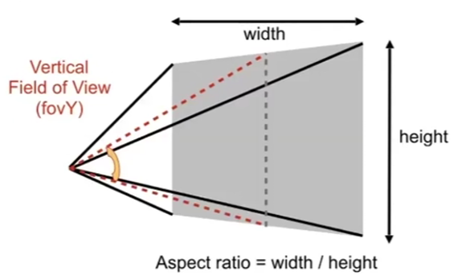 -->


## 屏幕、像素和视口变换

光栅化一词的由来：Raster 是 Screen 的德语

屏幕坐标系被定义为 $[0, width] \times [0, height]$，Games101 定义**像素中心**在非整数坐标上，像素的 **indices** 为 $(0,0)$ 到 $(width -1, height -1)$ 之间，indices 就是说用 $image[x][y]$ 表示一个像素，因为屏幕的显示其实就是一块内存 image array，写像素到一块内存，总要有一个索引的方式。

现在就要把 $[-1, 1]^3$ 映射到屏幕坐标系上，然后下一节介绍从屏幕坐标系映射到都是像素的 image 上。

把 canonical 压扁到屏幕上：视口变换（viewport），最后一个变换，就是平移和 scale

像素是像素，屏幕是屏幕。定义方案也有不同的，只是个人偏好，没有对错。

<!-- 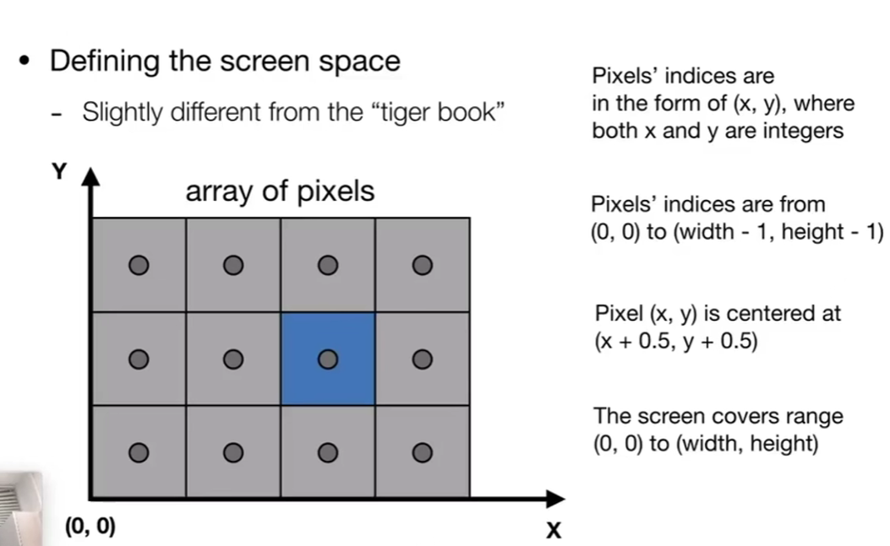 -->


## 采样法对三角形进行光栅化

视口变化后，Frustum 中的物体就从 $[-1,+1]^3$ 到了屏幕坐标系之中，然后就要决定对应的像素的颜色。

<!-- 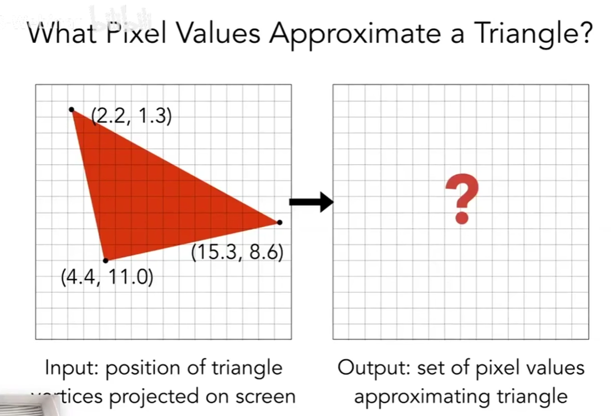 -->


介绍了采样法进行三角形的光栅化

输入：一个三角形的三个顶点坐标，浮点型；image 二维数组

输出：image 数组中，采样结果在三角形的像素填充 1，否则填充 0

可以通过遍历输入 image 的像素中心坐标，若像素中心在三角形内部，就把对应的 `image[x][y]`填充为 1。

```cpp
for (int x = 0; x < xmax; ++x)
	for (int y = 0; y < ymax; ++y)
		image[x][y] = inside(tri, x+0.5, y+0.5);
```

inside 函数：判断一个点是否在三角形内部，可以使用叉积的方法：沿着三角形逆时针（或者顺时针走一圈，叉积符号是有要求的，要点在叉积内部），首位相接的三个向量分别叉乘顶点到内部点。

优化：如果知道三个点的坐标，实际上只需要遍历把这个三角形包起来的长方形就可以了。

这样的结果会导致**走样**（Aliasing），也就是出现锯齿。

# Lecture06: Rasterizations 2(Antialiasing and Z-Buffering)

参考课件：https://www.robots.ox.ac.uk/~az/lectures/ia/lect2.pdf

1. 傅里叶变换：参考知乎回答，
    1. 余弦函数的和，而不是高数中的 $a_n, b_n$，那只是 decode 了相位和振幅
    2. 表示成 $\sum{X_n e^{it}}$
    3. 图像在二维空间的频率表示，可以视作斑马纹的叠加，从而到 frequency domain 的 K-space
2. 卷积
    1. 参考 3Blue1Brown 的视频，卷积的意义就是求新的概率 $X+Y$
    2. 卷积定理：在时域上的卷积等价于谱域上的乘积
3. 反走样：
    1. 采样的本质是在用冲击函数对被采样信号卷积，实际上就是 copy 原有信号
    2. 将被采样对象的高频信息删除，避免 copy 时候不同采样周期混叠
    3. 将屏幕上的像素值的或许视作一次对 4 个子像素的模糊（MSAA）

## Aliasing and Artifact

之前提到的采样方法，会导致看到锯齿状的三角形，学名叫做「走样」。

图形学中把这种达不到预期效果的“瑕疵”称为 Artifact，比如锯齿、摩尔纹、轮子快速旋转无法分辨旋转方向

走样是因为采样的频率不够导致的：信号变化得太快了，对信号的采样太慢了。

## 图像、频谱，卷积和滤波

关于走样的正规定义：

<!-- 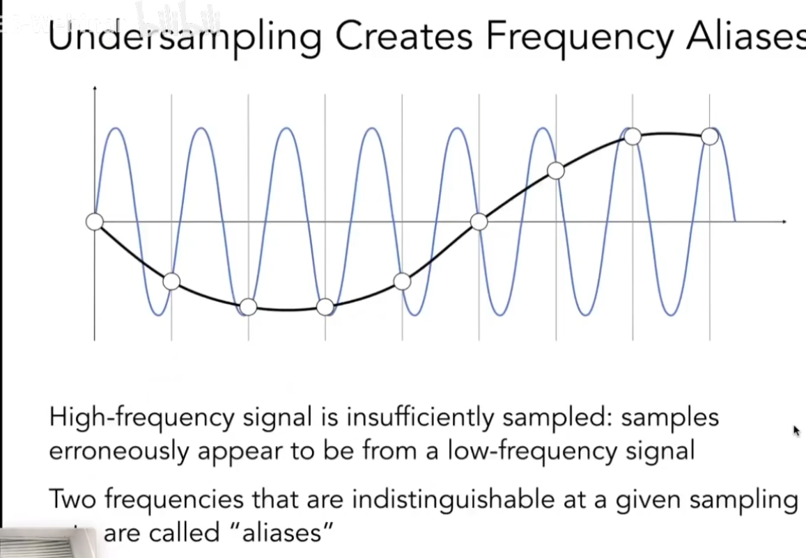 -->


不同的两个正弦函数，蓝色线条和黑色线条，使用某种采样方式，然后再恢复，那个变化频率高的恢复结果竟然和低频一样。

> Aside：
>
> 关于傅里叶变换，最让我困惑的是写成复数形式，但是参考知乎回答：[复数形式傅里叶变换的物理意义中，相位究竟指的是什么？](https://www.zhihu.com/question/20977844/answer/99503904)
>
> 所谓 $a_n, b_n$ 虽然属于 cos 和 sin，但是是在表征一个 cos 波的相位和幅度。
>
> 把信号分解为多个余弦波（现在不要想正弦），每个波的信息就是相位、幅度和频率，可以写作 $X_ne^{2\pi i t} $，因为复平面和 e 的数学特点，$X_n$ 编码了 $a_n, b_n$，也就是一个初相位和幅度，后半部分含有 e 的就是旋转的速度。
>
> 以上是一维的傅里叶变换，二维傅里叶变换参考：[形象理解二维傅里叶变换 - 阿姆斯特朗的文章](https://zhuanlan.zhihu.com/p/110026009)
>
> 图片可以视作二维余弦波的叠加，类似于斑马条纹的叠加，重点是 k-space。

[滤波视频](https://youtu.be/OOu5KP3Gvx0)

滤波：去掉特定的频率。个人理解，比如傅里叶分解以后，再去掉对应的几个频率的函数。

图像也是可以转换为频率的信号的，由此产生高频信息和低频信息，物理意义上，图像中，边界对应的就是高频信号。

note. 我自己想的，低频信号变化慢，可以构造出「块状」，所以不对应边界。

高通滤波就是让高频信号通过，低频信号被过滤不要掉，所以过滤以后的图像只剩下“边界"了，有点像 CNN 的边界提取。

所以，低通滤波就会模糊边界

## 卷积定理

卷积定理：实际上，滤波和卷积是等价的，采样是时域上的乘积，等价于频域上的卷积。

采样本身也是信号，采样可以进行傅里叶变换，采样频率越高，说明变换后频谱图越稀疏（高频）

采样本质是在复制粘贴被采样对象的频谱图，如果采样频率过低，就会导致被采样对象的多次采样结果重叠。

<!-- 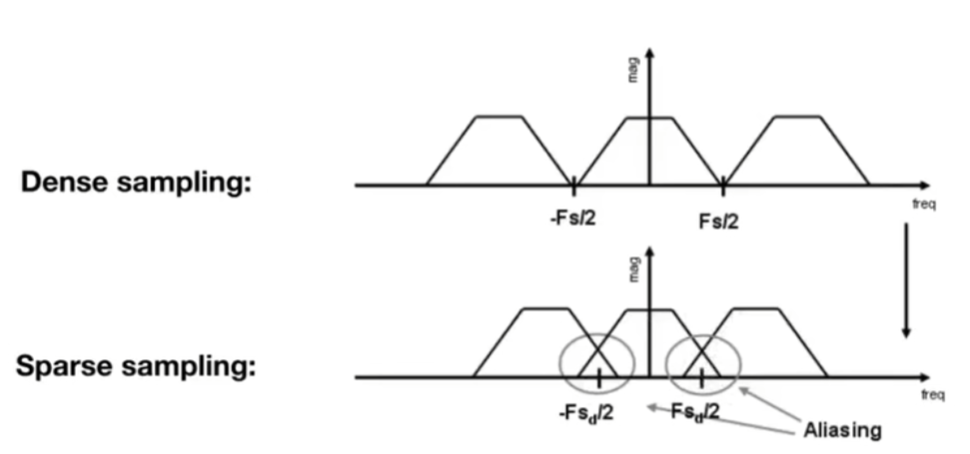 -->


回到三角形光栅化，就是因为像素作为采样的信号，频率太低了，导致原来信号重叠。

## 解决办法

通过低通滤波，消除高频信号，使得较低频率的采样方法不导致重叠。

具体操作，对三角形做卷积类似 CNN 那样，$3\times 3$，每个元素都是 $\frac{1}{9}$ 的卷积核。

理想的反走样技术：每一个像素点，三角形只覆盖了一部分，我们让三角形颜色浓度和覆盖的面积联系起来，而不是简单地让像素取值为 0 或 1，也就是输出的 image 数组也是 float

本节课介绍的反走样技术是 MSAA，假设本来 128 x 128 的图片，假设每个像素可以分成四个子像素，每个像素的取值就是子像素的平均，就可以让像素的取值是 float，类似于一个模糊操作，而非提高分辨率。


# Lecture07: Shading 1(Illumination,Shading and Graphics Pipeline)

1. z-buffer：raster each triangle，record and update each pixel's depth in buffer
2. shading: color and darken
    1. Blinn-Phong model：$\vec{light}, \vec{norm}, \vec{view}$
        1. Diffuse Term：与观察角度 $\hat{v}$ 无关，从能量的角度，cos of light and norm angle
        2. Specular Term: 高光，light and view angle，有指数作为衰减
        3. Ambient Term：常数

# visibility: z-buffer（深度缓冲）

画家算法（painter algorithm）无法解决循环遮挡的问题

使用的算法叫做 `z-buffer algorithm`，套了两个 for 循环。

维护已经被绘制的像素的深度，如果覆盖，就更新深度

```
for T in triangles:
	for sample in T: // sample should be draw to (x, y), and its depth is z
		if (z < zbuffer[x, y]):
			framebuffer[x, y] = rgb;
			zbuffer[x, y] = z;
		else:
			// pass, the sample is occluded
```

# shading: Blinn-Phong Reflection Model

shading，考虑光照后，点的颜色。如果没有 shading，就没有高光，没有明暗变换。

介绍一个算法（模型），叫做 Blinn-Phong，考虑的是局部光照，没有考虑遮挡，也是对复杂场景的简单化。

把光分成三份：specular（镜面的）highlights，diffusion reflection，ambient lighting

建模：light source, shading point, eye

<!-- 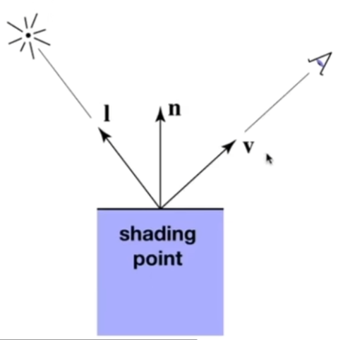 -->


<!-- 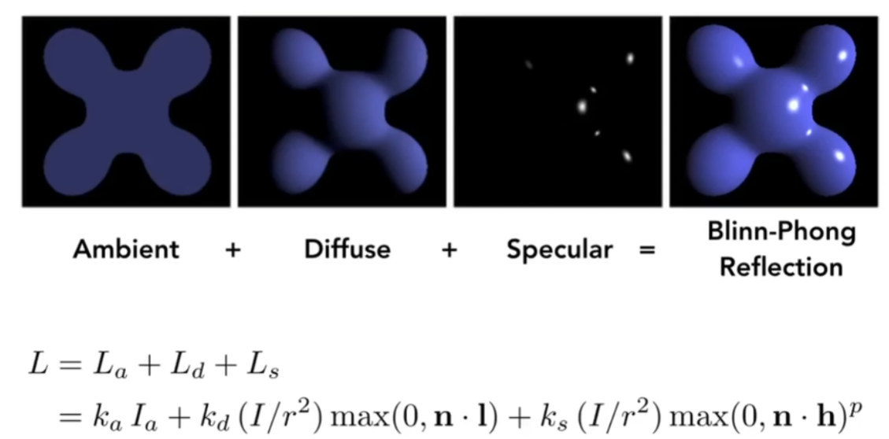 -->


## Diffusion Term（漫反射）

diffuse reflection，考虑物体上的一个点，因为光的照射而产生了漫反射 (向半球均匀地辐射能量，所以和观测角度无关)

note. diffusion 本身有扩散的意思，比如 thermal dye transfer 里的 color ribbon 就是 diffuse 到 paper 上

输入：一个光源的坐标，要 shading 的点的坐标，这个点所在平面的法向量，该点和人眼的连线单位向量

用 $I$ 表示该点和光源的连线，$I/r^2$ 表示光到达这个点所在的传播球面的能量

做 $max$ 的原因是，当点乘的结果为负数时候，说明光源在表面的另一侧，没法接收到光照

$k_d$ 作为漫反射系数，用 color 的 RGB 表示，如果黑色 (0,0,0)，就是都不反射。

$\bold{n \cdot l}$ 表示着色点和光线之间的夹角会影响该点的光线强度，类比夏天热就是因为太阳直射

<!-- 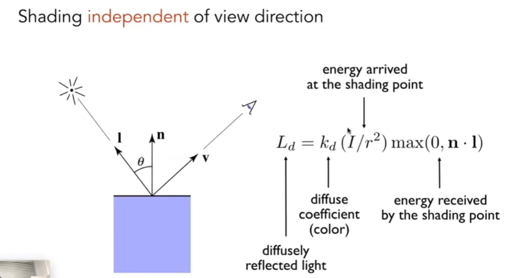 -->


# Lecture08: Shading 2(Shading, Pipleling and Texture Mapping)

1. Shadings Frequencies：
    1. flat shading: 逐三角形着色，用三角形平面本身的 norm，一次就可以 shading 出一整个平面
    2. vertex shading: 先计算三角形一个点的 shading 结果，内部用插值
    3. Phong Shading: 三角形内部像素插值得到 norm，逐像素 shading
2. Pipeline：顶点处理，顶点构成三角形处理，对三角形光栅化，对像素着色，显示着色结果
3. Texture Mapping: 每一个 vertex 都有对应的二维纹理的坐标 $(u,v)$ 以确定该顶点的属性

## Specular terms(镜面反射)

镜面反射和观察角度有关，当观察方向和入射方向接近一个反射角的时候，就要考虑镜面反射。

<!-- 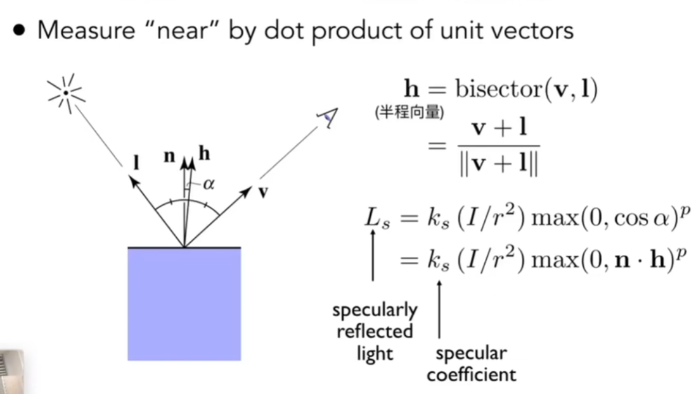 -->


定义半程向量为入射方向和观察方向的角平分向量，当这个向量和法向量夹角很小的时候，镜面反射强度就大。

衡量夹角用点乘，p 做指数衰减。$\cos{\alpha} < 0$ ，p 越大，衰减越快，高光面积越小。

## Ambient Term（环境光）

$L_a = k_a I_a$

# Shading Frequencies

<!-- 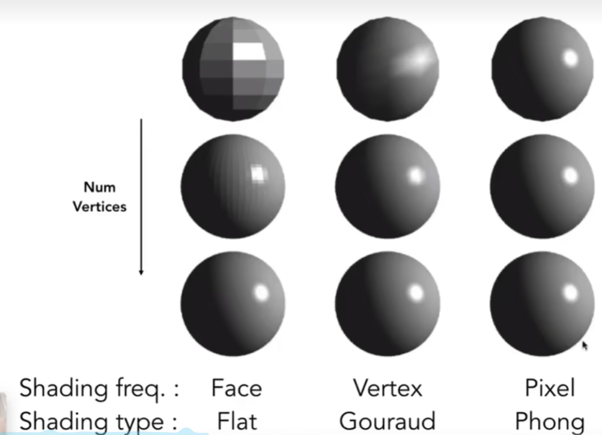 -->


## 三种 shading 方法

-   Flat shading（逐三角形）：着色于每一个平面上，计算每一个平面的法向量，把平面视作 shading point
-   Gouraud Shading（逐顶点）：着色于每一个顶点上，三角形内部的点属性插值得到
-   Phong Shading（逐像素）：在三角形内部插值得到每一个像素的法线，对该像素着色

summary：当模型足够复杂，不见得 Phong Shading 就优于 Flat Shading

## 法线的计算

顶点的法线可以由相交平面的法线加权平均得到

像素的法线可以由 Barycentric Coordinate 插值得到，但是需要做透视矫正。

# Graphics (Real-time Rendering) Pipeline

<!-- 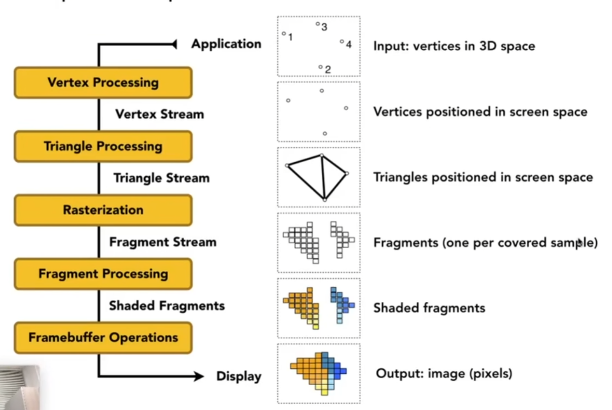 -->


联想下 homework，一次 push 一堆顶点到 buffer 里，并且记录这些顶点对应的多个三角形的 index

然后通过 MVP 和 viewport 变换计算出三角形到屏幕上的像素坐标，就知道哪些像素要被着色了。

下一步是 shader，现代的管线允许对 shader 进行编程，如果对顶点做 shader，比如 Gourand Shading，写的就是 vertex shader，比如对像素做着色，写的就是 Pixel Shader 或者叫做 Fragment Shader。

# Texture Mapping

问题：三角形内部填充某一张图片，比如地板的花纹

为什么要纹理：因为要定义每个 point 的属性，比如用于 Blinn-Phong 模型里，每一个点有自己的颜色等属性。

如何将一个三维物体的表面映射到一个二维平面，这个假设我们已经知道了。在承认这个的前提下，我们有：

每一个三角形顶点都对应一个二维纹理的坐标 $(u,v), u,v\in[0,1]$

<!-- 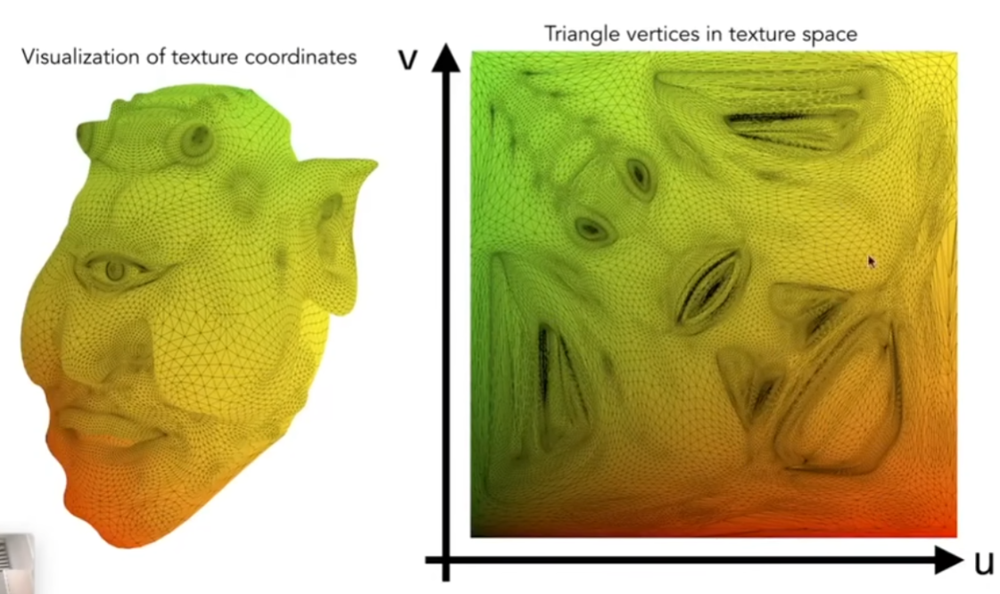 -->


# Lecture09: Shading 3 (Texture Mapping cont.)

1. Barycentric Coordinate: 重心坐标系
    1. 表示方法以及 $(\alpha, \beta, \gamma)$ 的计算，使用面积
    2. 不具备投影前后的不变性，所以计算点在二维的投影结果的插值结果，需要还原到三维空间中
2. Texture Queries：从像素中心坐标到 texture 坐标 $(u,v)$ 本质是一个映射，要求给定一个像素的坐标，返回其对应的纹理属性
    1. Bilinear: 双线性插值，计算非整数 $(u,v)$，但是 artifact 是一个像素应当覆盖一个纹理区域，而不是纹理上的一个点
    2. Mipmap：预先计算不同大小正方形区域（就是不同 level）的纹理查询结果
        1. 通过 $(x,y)$ 的扰动，计算在 $(u, v)$ 的扰动，确定要哪一个 level
        2. 三线性插值可以计算非整数 level 之间的结果
    3. Anisotropic Filtering: Mipmap 的缺点只能处理正方形，有 Ripmap 可以处理矩形以及其他方式

# Barycentric Coordinates

参考 FCG5 2.9.1

重心坐标系，通过面积计算 $\alpha, \beta, \gamma$

note. 为什么叫做重心坐标系，就是因为重心等分面积

$V = V_a + V_b + V_c$，可以是 normal，color 等

> barycentric coordinates are not invariant under projection.

投影前，对于三角形内的某个点，有一组 $\alpha, \beta, \gamma$，；投影后，这个点再通过二维平面计算的 $\alpha, \beta, \gamma$ 和原来不一定一样。

所以对于 object-order rendering，计算像素颜色的时候，要找到像素对应的三维空间中的物体的点，再做插值。

<!-- 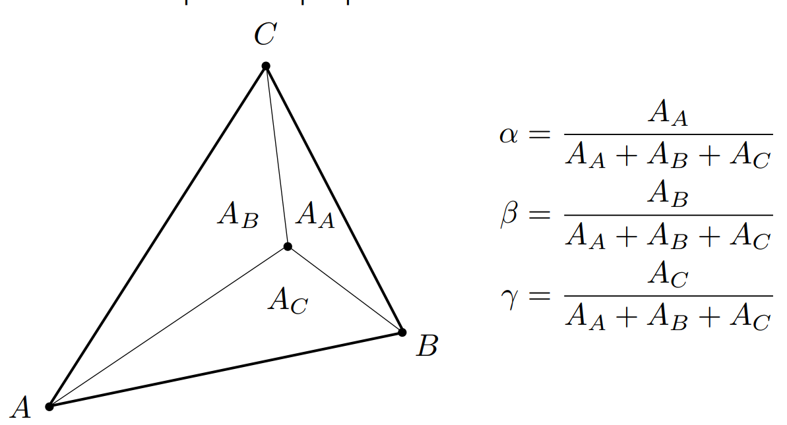 -->


# Texture Queries

假设我们在渲染中的计算像素颜色的那一步骤，如何计算像素对应 object 的颜色？

## Applying Texture Mapping

理想状态下，对于每个 fragment 中的像素，找到对应的三维空间坐标，利用其所在的三角形的坐标，插值得到其 texture 的 $(u, v)$：

```pseudocode
for each rasterized screen sample (x,y):
 (u,v) = evaluate texture coordinate at (x,y)
 texcolor = texture.sample(u,v);
 set sample’s color to texcolor;
```

如果纹理太小，得到了非整数的 $(u,v)$ ，纹理本质是定义在整数 $(u,v)$ 上，给出颜色的函数。

## Bilinear（双线性插值）

note. FCG 中介绍了直线的表达方法，就是使用了插值的方式：$\vec{e} + t \vec{d}$

水平方向插值两次，得到红点上下纵坐标为整数点的值，也就是先确定 $u_0$ 和 $u_1$ 的值，最后通过 t 插值得到红点。

<!-- 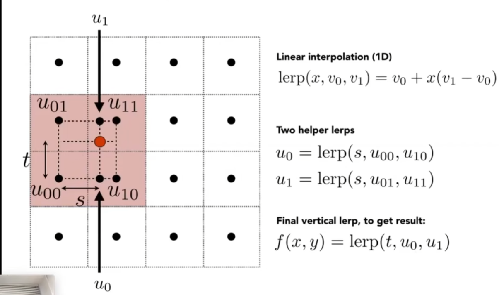 -->


如果纹理太大，那么原处的像素将会覆盖大片的纹理，而一个 Bilinear 或者其他方法使得像素只表示相邻数个整数点。

从信号的角度而言：一个像素相当于一次采样，远处一大片纹理，就是变化十分迅速的信号，像素采样频率对其过低了。

## Mipmap

为了计算一个像素对应到大面积的 $(u,v)$，采用的方法是预先计算一个区域内的点 $(u,v)$ 的平均表示，相较于给定非整数$(u,v)$ 输出属性，这个方法叫做 Range Query，给定 u 和 v 的 range，返回这个 range 的平均属性。

Mipmap 方法，Mip 意思是

> “Mip” comes from the Latin “multum in parvo", meaning a multitude in a small space

<!-- 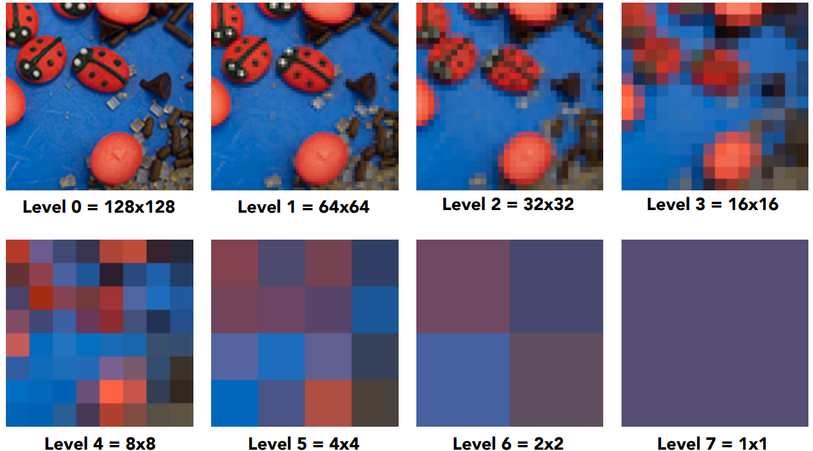 -->


<!-- 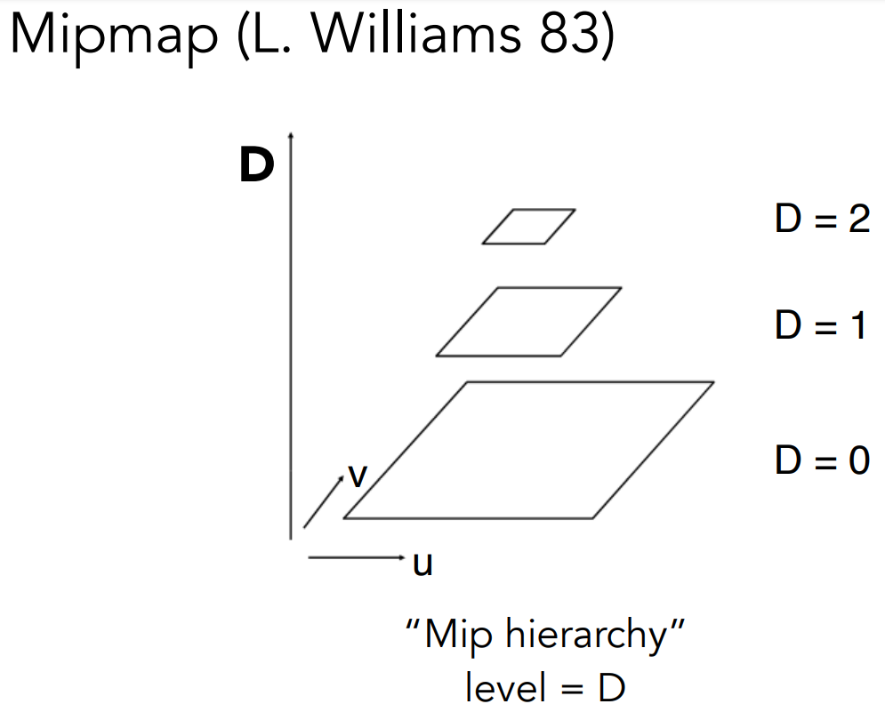 -->


level 0 就是最清楚的，我们直接看 level6，如果一个 pixel 从远处看起来覆盖了四分之一左上角的图片，就是给 Level6 的 query 结果。

如何确定一个像素覆盖的 $(u,v)$ 面积，进而确定它在哪一个 level：

纹理映射本质是建立了像素中心坐标到纹理坐标的映射： $(x,y) \rightarrow (u, v)$，对像素坐标的扰动带来了纹理坐标的变化，这个变化就是一个像素覆盖的范围。比如像素往左走一格，在 $(u,v)$ 上变化的长度，通过长度来匹配对应的 level

<!-- 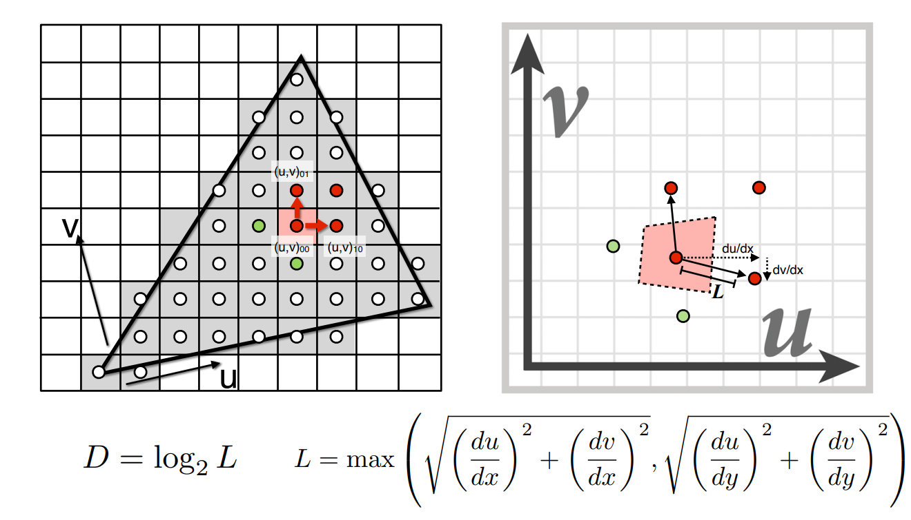 -->


优化：如果对应的 D 是 float，也就是 D 在两个 level 之间，可以通过插值获得更准确的结果，这种插值叫做「三线性插值」：

<!-- 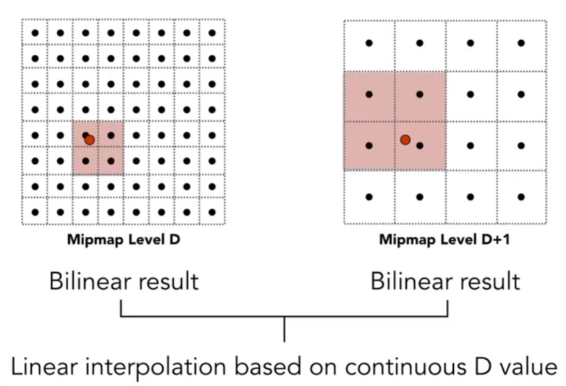 -->


## Anisotropic Filtering（各向异性过滤）

MipMap 查询的是 square，没法查询矩形

<!-- 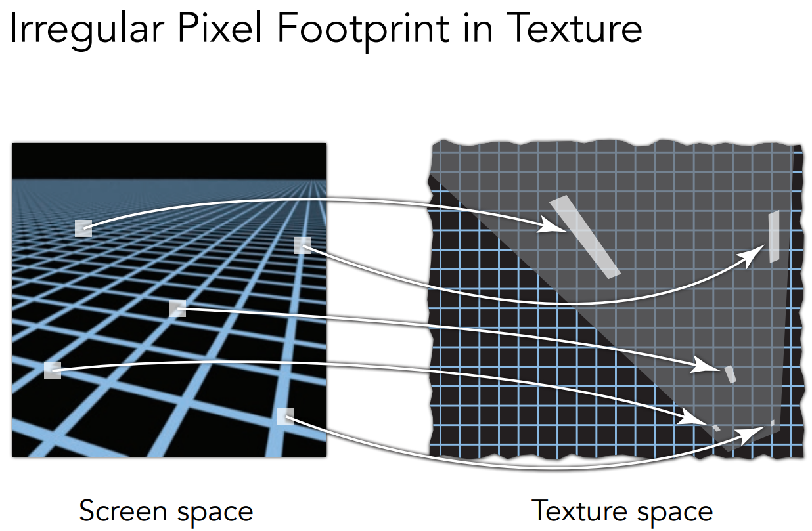 -->


RipMap 查询的是矩形的，但是对于斜边仍然没有办法，存储逐渐收敛到原来的三倍

<!-- 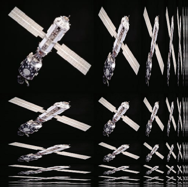 -->


# Lecture10: Geometry1 (Introduction)

1. Applications of Texture：纹理本质是在记录三维点查询对应的属性，可以是颜色、法向量等
    1. 环境贴图：生成环境光的贴图，比如有光的房间的贴图，渲染后得到光照效果
    2. 凹凸贴图：纹理记录相对高度，重新计算法线，缺点是边缘不真实
    3. 位移贴图：真正地修改三维空间中物体的位置
    4. 纹理概念的延申：还有三维的贴图，用于三维扫描结果的展示
2. Geometry：该部分可以参考 FCG
    1. Explicit：显式表达，参数方程
    2. Implicit：隐式表达，比如 $f(x, y, z) = 0$
    3. CSG：一种隐式表达，利用布尔代数
    4. Signed Distance Functions: 符号距离函数，距离函数定义了一个点到物体的符号距离 d，对于两个相交的物体，如果一个点到它们的距离函数值都是 0，说明该点在物体的表面上

# Applications of Textures

texture = memory + range query

## Enviroment Map

用带有光照的贴图作为 texture 渲染结果就好像有光照。

如果把 texture 存储在球面上，就是 spherical，这样 query 一个方向简单了，但是存在高纬度畸变，如果存储在正方体上畸变就会减小，但是 query 需要麻烦一点。

## 凹凸贴图

凹凸贴图，利用贴图的相对高度，导致假的法线，这样计算光照的时候也有变化。法线贴图同理。

```pseudocode
for each obj/fragment/triangle
  for each pixel
    calcuate 3D coordinate, get barycentric paramters, query by texture to get normal/color/...
```

如何计算凹凸贴图上任意一个点的法向量扰动？

<!-- 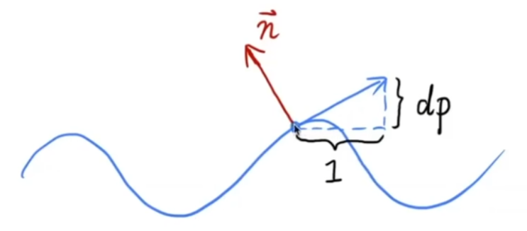 -->


蓝色线表示凹凸贴图定义出来的高度 $height = h(u,v)$，毕竟只能在整数点上定义，所以用曲线把它连起来，计算法向量的方法也是依靠采样：

对于贴图上任意一个点，往 u 和 v 方向各走一步，得到两个方向的高度变化，取 $(-\frac{dh}{du}, -\frac{dh}{dv}, 1)$.

note. 回忆 FCG5，$h(x,y) - height = 0 = s$ 定义了三维空间中一个 surface，沿着 surface 走 s 的值不变，也就是某一点扰动乘以该点的微分得 0，$\nabla{s} \times permutaion = 0$

凹凸贴图的缺点在于没有改变真实的几何形状，导致物体边缘不真实。由此带来位移贴图，真的把几何形状改变了，重新计算光效，这就涉及到采样率的问题：三角形的间隔频率要高于贴图定义的频率。

<!-- 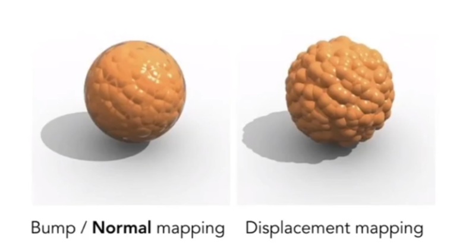 -->


还可以把光照信息放在纹理里。

## 纹理概念的延申

纹理本质是定义了一个函数计算三维空间中某一个点的属性，这个属性最简单的话就是颜色了：$t(x,y,z) = f(u,v)$

二维的纹理就是建立三维空间中的点到二维平面的映射，

如果属性不仅仅是颜色，还可以存储高度、光照等，就可以做出高度的结果，

如果不是映射到二维的平面，而是一些特殊的函数，可以生成一些特殊的、有规律的花纹，比如大理石

如果不是二维的纹理，还可以是三维的纹理，查询三维空间中点的属性，比如 CT 扫描。

<!-- 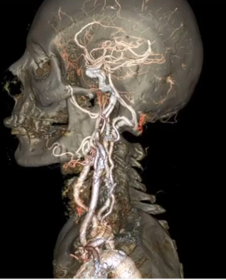 -->


# Geometry

首先介绍了显示表示和隐式表示

显示表示就是形如 $(x(u,v), y(u,v), z(u,v))$ 这种形式，就是参数方程，难以判断内外。

隐式表示就是给出 $x, y, z$ 满足的条件，比如球的隐式表示就是 $x^2 + y^2 + z^2 = 1$

note. 可以参考 FCG

还有其他的表示方法，如几何形状的交并差表示法和符号距离函数表示法。

## Constructive Solid Geometry (CSG)

<!-- 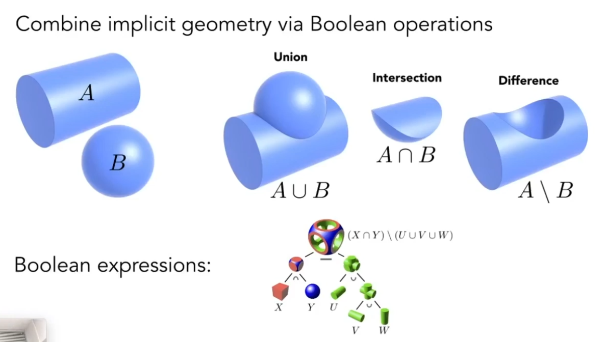 -->


## Distance Functions

距离函数表示法可以用来求物体表面位置。

输入一个三维球 S1，自然三维空间上任意一点到它的距离可以表示为 $d_1(x, y, z)$（相当于给定一个点坐标返回一个距离，在内部就是负数），输入第二个球 $S_2$，任意一个点到他的距离可以表示为 $d_2$。这种想法类似于等高线

我们让两个球小小地相交一下，那么 $min(d_1, d_2) = 0$，表示的就是两个球的表面了。

## Level Set Methods

水平集表示法，类似于距离函数，只是可能我们无法给出距离函数的解析形式，那就离散地表示。

<!-- 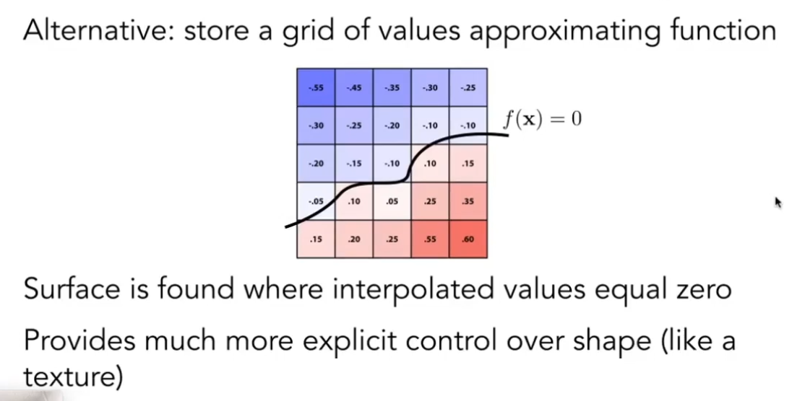 -->


# Lecture 11: Geometry 2 (Curves and Surfaces)

1. obj 文件格式：定义所使用的坐标、法线向量和纹理坐标，再定义面所使用的下标
2. 贝塞尔曲线：递归定义，n+1 个点，t 时刻，n 条线段取比例为 t 的分割点，构成 n-1 条线段，直到剩下 1 个点
    1. 数学形式：二项展开 n+1 个点，推导是 n+1 个点自底向上对最终点公式的贡献比例
    2. 性质：仿射变换后还是贝塞尔，与起点和最终线段相切
    3. 贝塞尔曲面：空间中多条贝塞尔曲线上各取一点，再得到新的贝塞尔曲线

# Explicit Surface

点云：只有点，足够密集时候看起来就是面

Polygon Mesh：多边形面，

obj 文件格式：wavefront object file：

v，vn，vt 表示每个顶点的坐标、每一个法线和每一个纹理坐标，最后通过定义一个 face 有哪些点组合、使用哪些法线和纹理坐标

# Curves

## 贝塞尔曲线

有一个递归找点的算法

比如有三个点 a b c，a、c 分别为起点和终点，对于 $t, t \in [0, 1]$ 时刻的点 p，先找到 a b 之间的点，该点距离 a 占据 ab 的比例为 t，再找到 b c 之间的点，该点距离 b 的距离为 bc 长度的 t。找到这两个点后，再找比例为 t 的店，就是该点。

<!-- 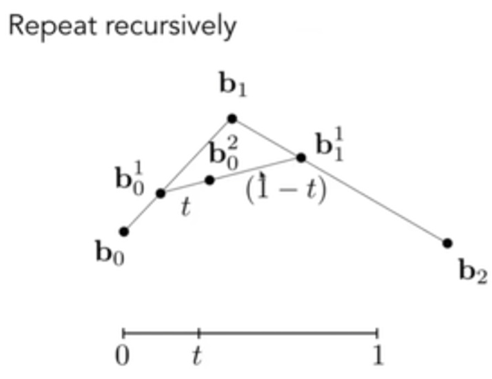 -->


贝塞尔曲线显示表达，对于点数量少时候，可以直接写：

<!-- 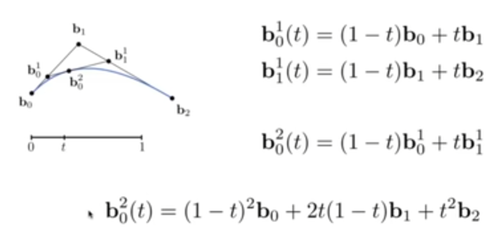 -->


如果 n 个点，得到的贝塞尔曲线就是前 n 个点的线性组合。比如三个点的，三个系数加起来就是 1 $[(1 - t) + t]^2$

从后往前推导：

<!-- 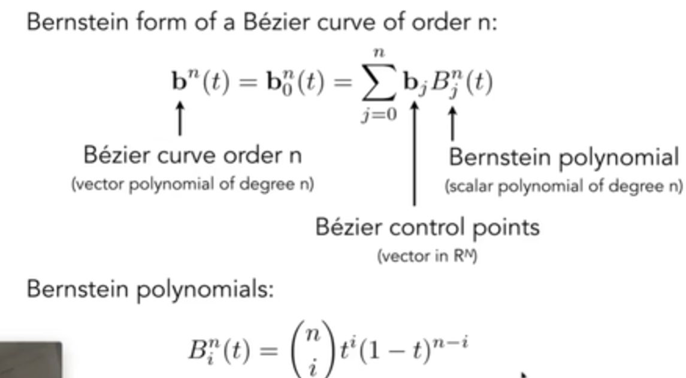 -->


如何证明，考虑每个点有几种途径对最终的点做贡献即可，b2 有多条路径对最终的点影响，b2 到最终点，必须左拐一次，因为到终点必须要走 n 步，何时左拐相当于在 n 个空格里放左拐的点，固有 $C_n^i$

<!-- 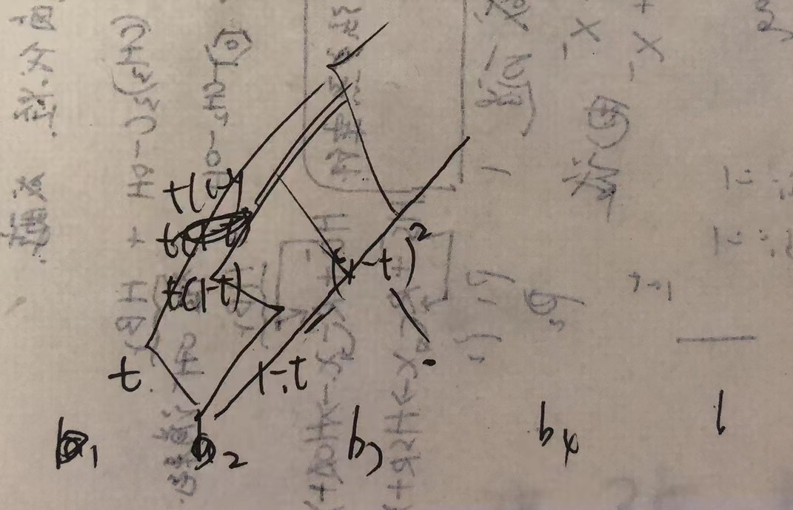 -->


性质：

1. 起始点在起始点
2. 起点和终点的方向和第一段和最后一段相切，可以通过求导得到
3. 仿射变换后是仿射后点的贝塞尔曲线
4. 凸包性质：不超过给定点所定义的凸包

多点定义的贝塞尔曲线难以控制，不太明显

<!-- 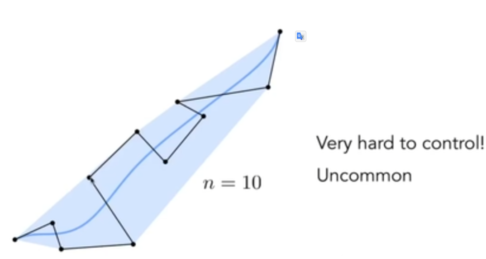 -->


于是每四个点控制，相当于控制杆一样，这就是 PS 里的工具

## Spline（样条）

简单来说，就是可控的曲线就是样条

用的多的就是 B 样条，shorthand for Basis Spline

如何理解局部性：拖动贝塞尔曲线上一个点，那么整条曲线就变化了，所以不好，如果只需要修改局部，又能保证连续，就好

# Surface

## Bezier Surface

贝塞尔曲面，相当多次贝塞尔曲线

<!-- 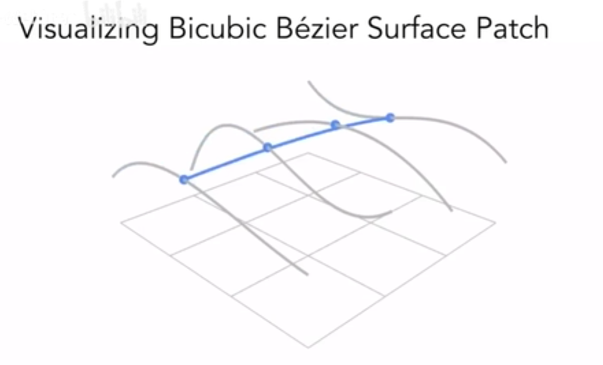 -->


通过两个参数 $u, v$ 得到贝塞尔曲面上的一个点，所以是显示的表示

<!-- 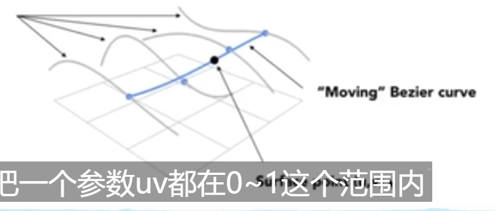 -->


# Lecture12: Geometry 3

1. Mesh Operations
    1. Mesh Subdivision：网格细分，生成新的点，调整其坐标，对旧的点也调整坐标。介绍两种算法：
        1. Loop Subdivision：只能对于三角形处理，新的点是边的中点，点的坐标通过邻接点的加权调整
        2. Catmull-Clark：核心思想是多边形取中点和边中点连线可以变成多个四边形，从而消除了非四边形
    2. Mesh Simplification：网格简化，比如远处的物体不需要很多的三角形来表示。边坍缩（捏边）的方法，计算二次度量误差。
2. Shadow Mapping：利用「光栅化」的思想来做阴影。
    1. 一个点在阴影里，说明以光的视角没法看到，光的角度生成 shadow-map，比较点到光源的距离
    2. 缺点之一是只能生成硬阴影，因为光源是有大小的，有些点可以部分地看到光源

# Mesh Operations

Mesh Operations: Geometry Processing

-   Mesh subdivision: 细分，上采样，更多的面，看起来细节更丰富
-   Mesh simplification: 网格简化，比如距离比较远，没有必要特别多的三角形
-   Mesh regularization：让三角形更像正三角形

## Mesh Subdivision

介绍 Loop Subdivison 算法：

1. 每一条边中点作为新的顶点，计算该顶点的坐标
2. 原来的旧顶点也根据自己的度，更新自己的坐标，这样看起来更加平滑

Catmull-Clark Subdivison: 通过引入新的点，让所有非四边形面变成四边形。

原理：一个 n 边形作为一个面（face），每条边的中点和面的中点连起来，构成只剩下四边形的的图形。

度数不等于 4 的点叫做奇异点。

更新新的点和旧的点的坐标。

## Mesh Simplification

有些时候没有必要用到非常复杂的模型，比如距离远的时候，少量三角形表示模型看起来就够了

<!-- 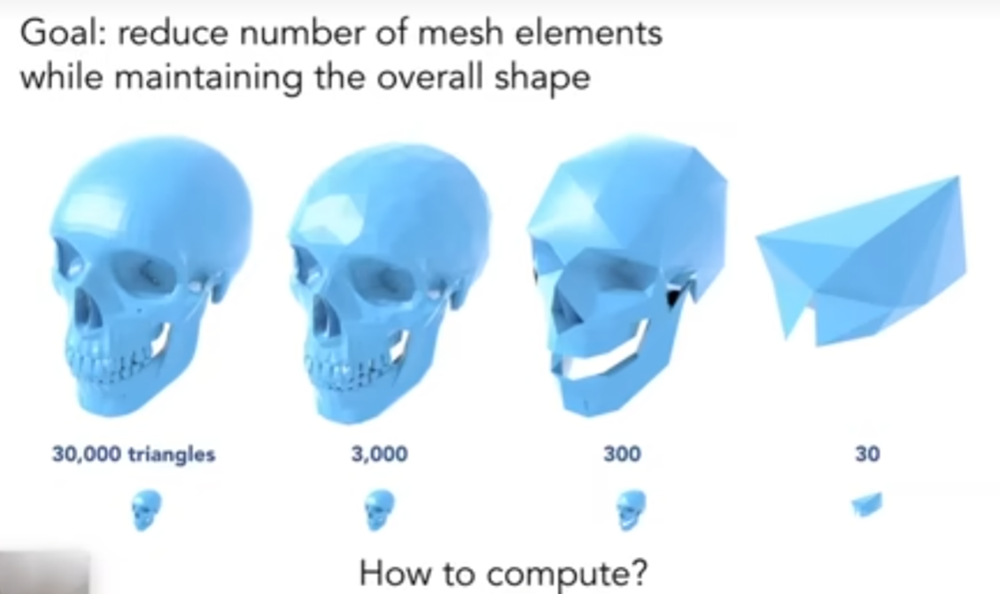 -->


使用的方法是「边坍缩」，相当于捏一条边成为一个点：

<!-- 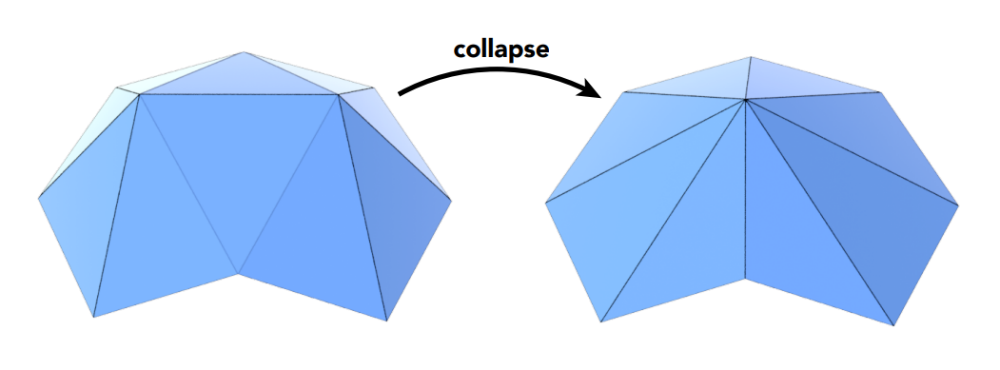 -->


如何选择捏哪一条？计算新顶点的二次度量误差，选择二次度量误差最小的点。利用局部更新的方法达到全局看起来不错的效果。

坍缩了一条边以后，也要重新计算它影响的其他点的二次度量误差，使用的数据结构是堆。

# Shadow Mapping

key idea: 一个点在阴影里，说明能被人看到，但是没法被光看到

缺点就是只能处理点光源，这样做出来的阴影叫做「硬阴影」，否则就是软阴影。

1. 从光源看场景，做 z-buffer，记录深度
2. 从相机看到一个点，通过一个投影矩阵查询该点在光源 z-buffer 的 index
3. 比较点到光源的距离，如果和 z-buffer 里的值相等，就能看到，否则看不到

这个 z-buffer 就叫做 shadow map

问题：

1. 光源的大小
2. 阴影图的分辨率
3. 阴影太硬，没有平滑过渡

note. 老师说，「阴影质量」有时候说的就是 shadow map 的分辨率

软阴影的问题就是：光源有一定大小，一个点可以看到一半的光源

# Lecture 13 Ray Tracing

# Whitted-style ray tracing

关键解决的问题：光线多次反射

1. 软阴影
2. glossy reflection：磨砂玻璃的反射
3. 间接光照
4. ……

我们在追踪进入我们眼睛光线的光路

如果光线只弹跳一次：

<!-- 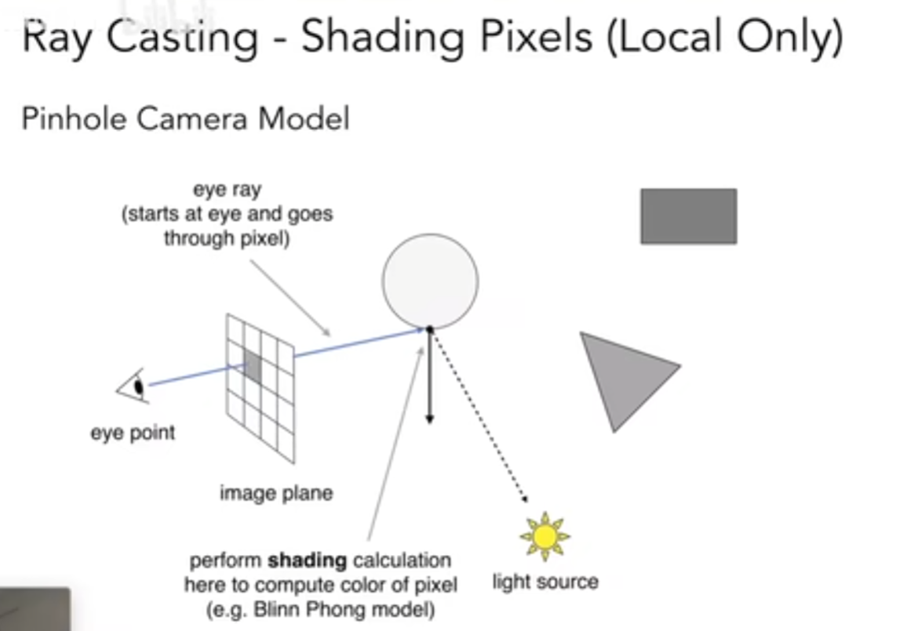 -->


1. 像素投射光线
2. 场景相交
3. 判定是否对光源可见
4. 若可见，计算着色

如果光线包括折射和反射，就需要递归计算，将最终的结果加起来

question: 会不会导致反射回自己？

<!-- 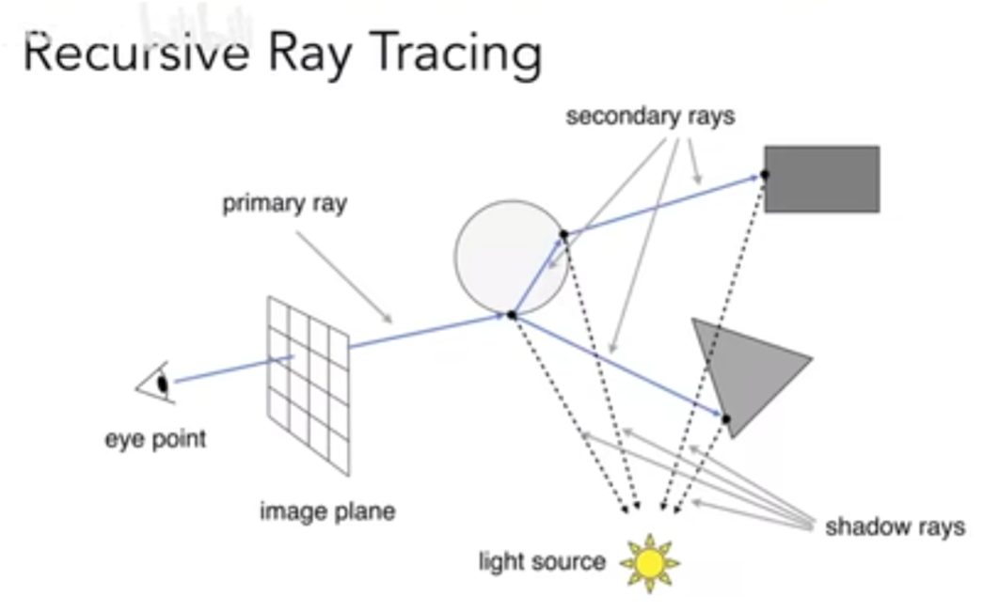 -->


# Ray Object intersections

计算三角形和光线相交，用重心坐标系，见 FCG5

计算的细节，实际上是体积的比值。

重心坐标系中，$\beta, gamma$ 可以看作面积之比，这边拓展一下，就是三角锥的体积之比，三角锥的体积就是行列式，三个向量围成立方体的体积，就是底边两个向量叉乘，得到底面面积，再点乘另一个向量。

<!-- 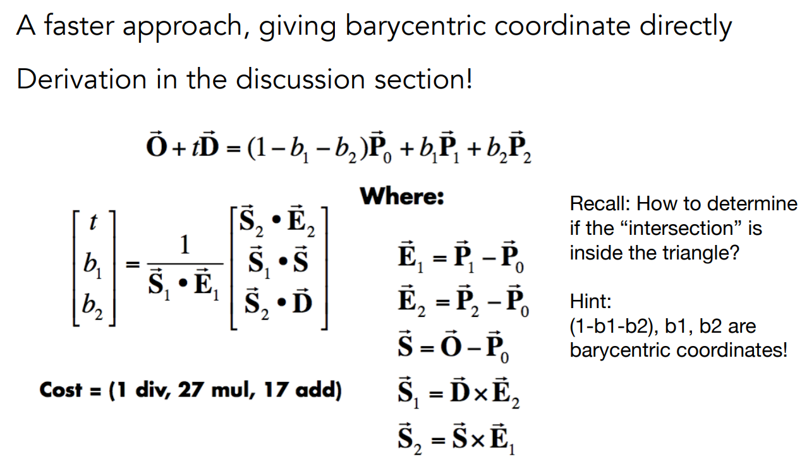 -->


<!-- 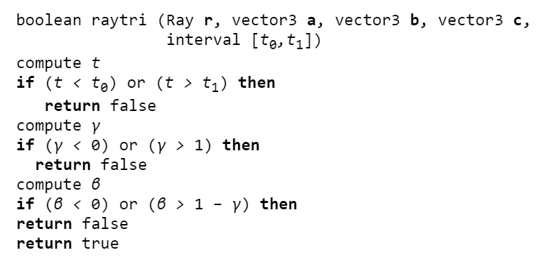 -->


带来问题，就是需要大量计算，如何加速？

# Accelerating Ray-Surface Intersection

Bounding Volume 加速

每一组对面（pair of slabs），都能计算 $t_{enter}, t_{exit}$，一个盒子三组对面，就能计算三组

-   光线进入所有面，才算进入了盒子，进入盒子的时间$t_{enter\ box} = \max{t_{enter}}$
-   光线离开了任意一个面，就算离开了盒子，$t_{exit\ box} = \min{t_{exit}}$

1. 对场景预处理，将场景划分为 AABB，标记物体轮廓所在的 AABB
2. 假设光线与格子的求交是非常快速的，给定一个 ray，能够判定当前格子是否与其相交，还能给出下一个起要穿过的盒子。
3. 如果光线穿过的盒子中存储了物体，就进一步计算是否相交，如果不相交就否则判断下一个格子。

# Lecture 14

## Spatial Partitioning

<!-- 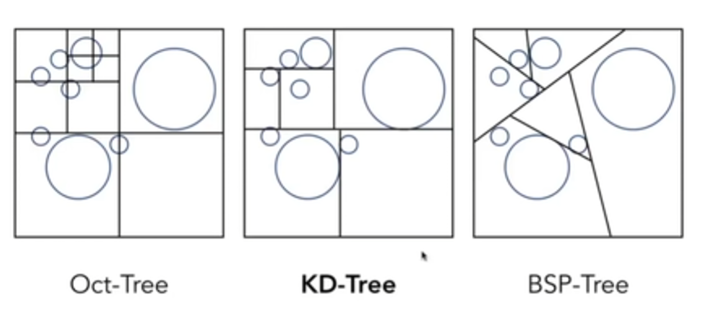 -->


如果是均匀划分场景，带来的问题：teapot in stadium，有大块中空的区域，需要走很久才能相交于一个小物体

对于场景的预处理，不必均匀，允许一些 AABB 大，一些 AABB 小。

重点是 KD-tree，每次沿着一个 axis 切一刀，直到划分出的 AABB 里物体足够少，就像二叉树

<!-- 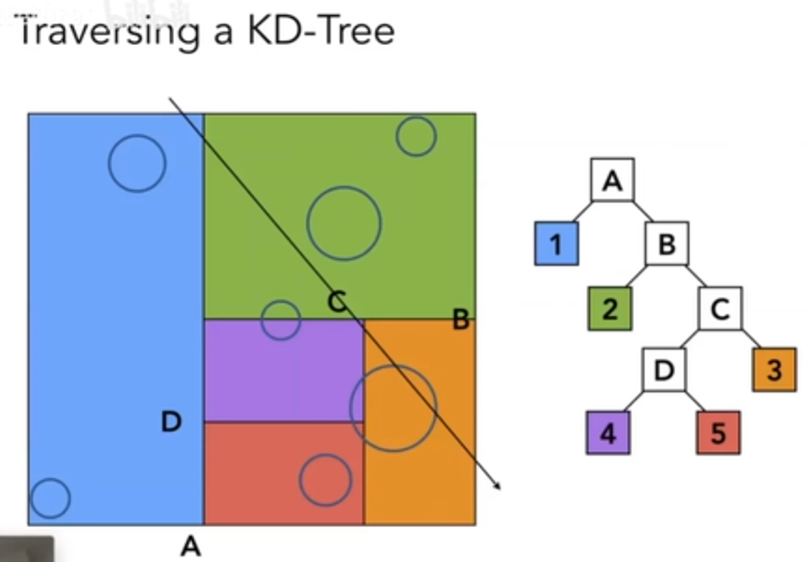 -->


1. 如果光线和一个盒子有交点，也就是说和这个盒子对应的节点有交点
2. 判断光线和节点的子节点是否有交点，无，则 pass
3. 有交点，就继续判断子节点，物体就存储于子节点中

KD-tree 的问题：

1. 如何判断三角形在不在 AABB 里？要知道如果三角形顶点不在盒子里，不意味着三角形与盒子不相交，类似于装书
2. 同一个三角形需要被存储到不同的 AABB 里才能保证光线盒子的时候可以与之求交，要是每个三角形都只在一个盒子里就好了

## Object Partition & Bounding Volume Hierarchy

kd tree 每次直接划分空间而不考虑内部物体分布

BVH 在划分空间的时候，先将内部的物体分为两堆，再划分两个空间

<!-- 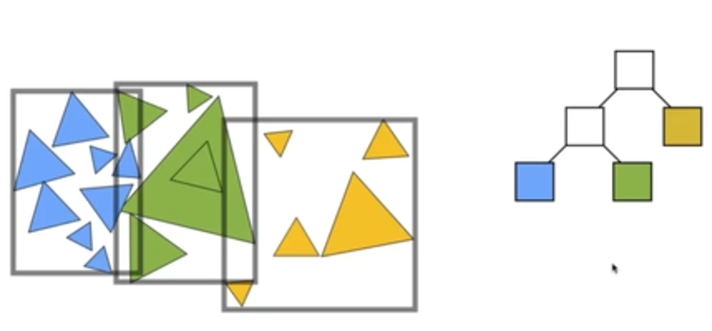 -->


How to subdivide a node? • Choose a dimension to split

1. Heuristic #1: Always choose the longest axis in node
2. Heuristic #2: Split node at location of median object

# Basic Radiometry（辐射度量学）

1. 定义各种概念，radiance 就是 dA 在 dw 上接受到的光 power
2. BRDF 的定义：从一个角度观察 dA，得到从另一个角度的贡献
3. 渲染方程：本身的发光 + 接受到的光的方式
4. 解渲染方程，结果可以理解为光多次弹射的结果，前面教授的光栅化就是直接光照

Radiant Energy：总能量，单位为焦耳

Radiant Flux/Power：辐射功率，单位为瓦特

Intensity: Power per solid angle，单位球体给定一个方向，对应微分立体面元$r^2 \sin\theta d\theta d\phi$，立体角就是 $\sin\theta d\theta d\phi$，单位为 candela

# Lecture 15

irradiance: power per unit area：$\frac{W}{m^2} = lux$，area 需要是垂直到方向的，total power received by area dA

radiance：power per unit area, per solid angle，做两次微分，光是从一个 area 朝着一个 angle 发出，单位是尼特，power received by are dA from direction dw

irradiance 就是各个方向的 radiance 积分起来

<!-- 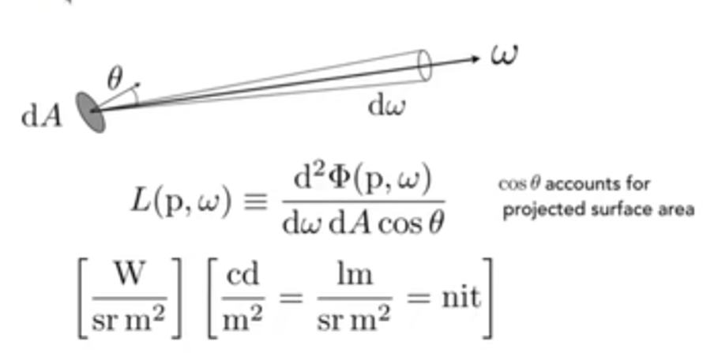 -->


## BRDF

固定一个 dA, 接受到不同微分立体角 dw 的能量，然后再反射出去

incoming: $dE(w_i) = L(w_i) \cos\theta_i dw_i$

L 就是 radiance，因为我们已经固定了 dA

<!-- 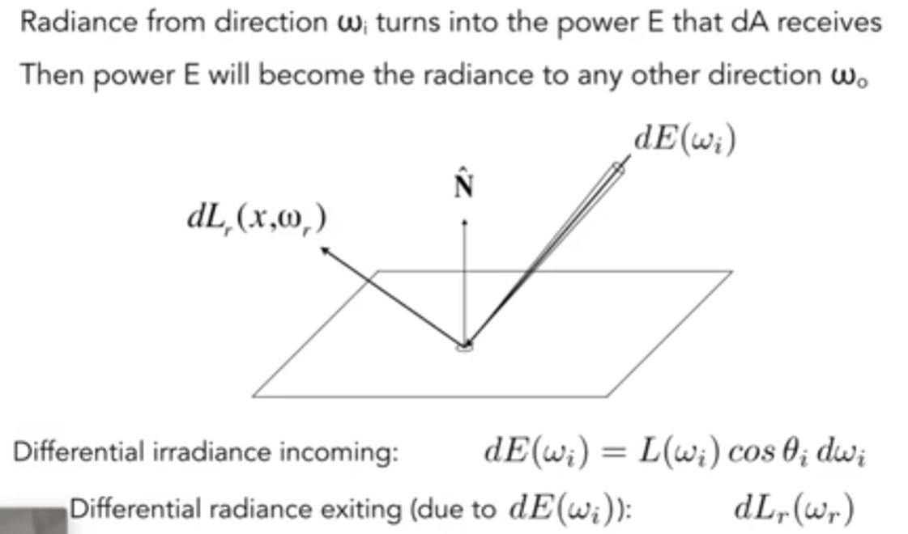 -->


计算不同反射方向的 radiance

BRDF: the bidirectional reflectance distribution function

<!-- 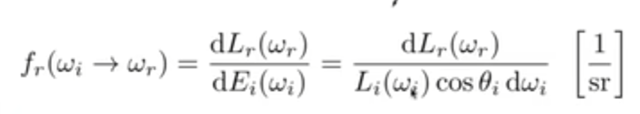 -->


定义了光线的反射方程：当我们从一个角度观测材质的时候，就相当于接受所有可能入射方向对这个反射方向的贡献能量

<!-- 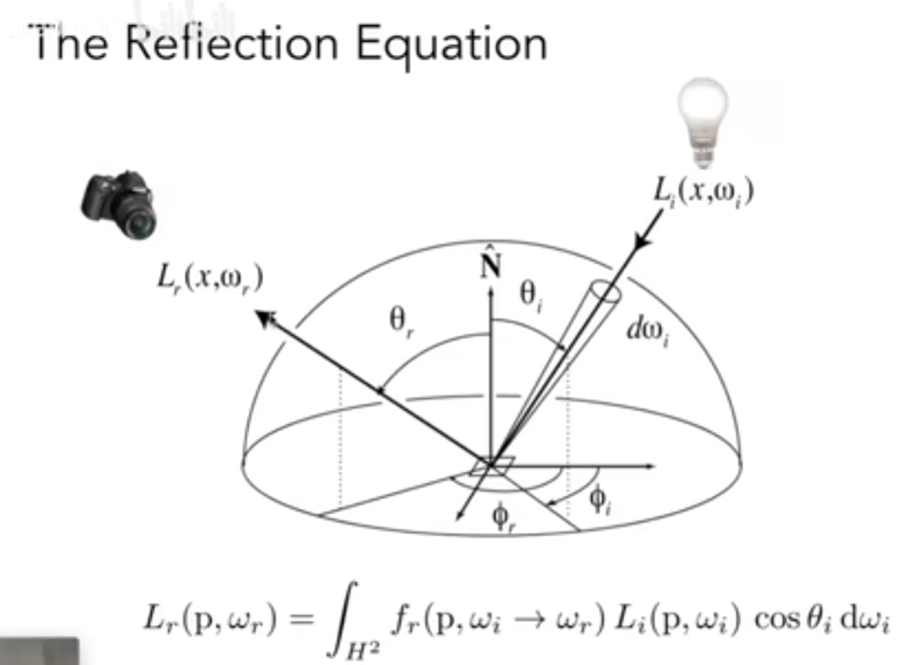 -->


考虑到一个物体不只接受来自光源的光，还可能接收到其他物体反射的光，就是递归了

考虑到物体自己也发射光，就需要再加上一个 term

<!-- 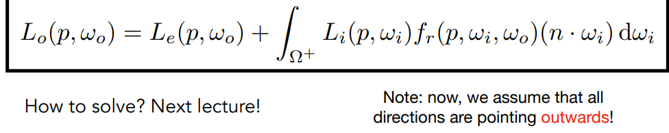 -->


如果只有一盏光：

<!-- 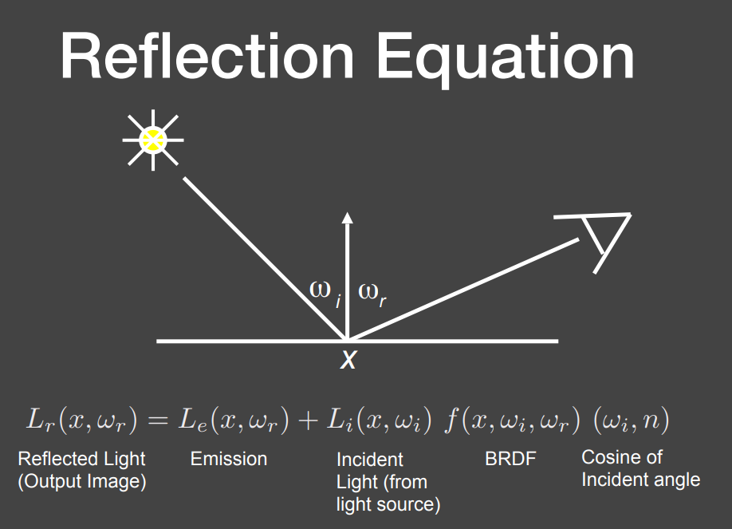 -->


光一多，就是要积分起来：

<!-- 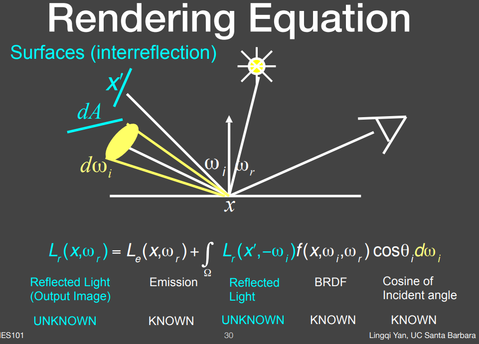 -->


看成算子：

<!-- 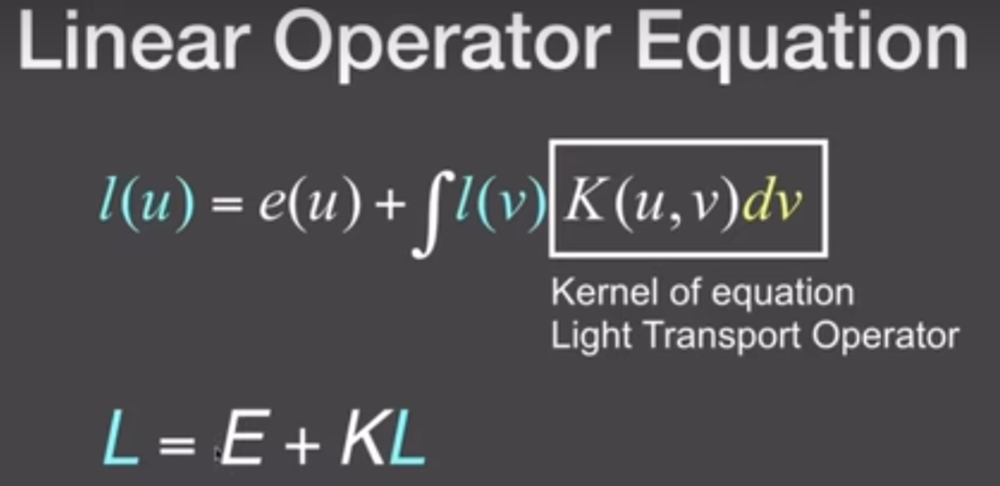 -->


看成算子后解方程，得到的结果是看成光一次次弹射分解的结果，这个结果就叫做全局光照：

<!-- 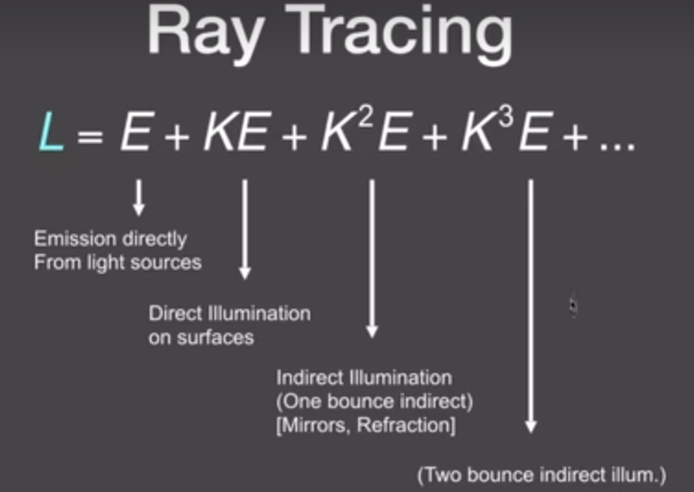 -->


一次叫做直接光照，全局光照就是在累加多次光线弹射的结果

# Probability Review

jump

# Lecture 16

# Monte Carlo Integration

为了求 $\int_a^b{f(x)dx}$，确定一种在 $[a,b]$ 上的采样方法，采样方法的概率密度函数是 $p(x)$，计算 $f(x)$，得到积分结果：

<!-- 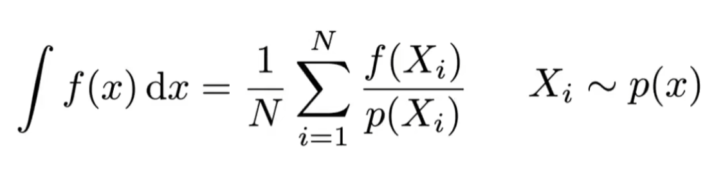 -->


最基本的积分方法，就是用均匀采样，将 $f(x)$ 在区间 $[a,b]$ 上的平均值作为 height，然后乘上 $b-a$ 作为底。

# Path Tracing

渲染方程的 code 实现

1. `shade(p, w_o)` view dir 是 wo，着色点是 p，这是个递归函数
2. 在 p 上的半球均匀发出多条方向为`w_i`光线，如果打到了光，直接计算颜色，如果打到了物体，递归计算，啥都没打到 pass
    1. 递归导致爆炸，所以只考虑一条光线，并且每个像素内多次随机采样，一个像素内一次路径追踪叫做一个 pass
    2. 何时停止，引入俄罗斯赌盘，以一定概率停止
3. 半球上发出的光线被 wasted，只有打到发光的物体才是有效的，直接考虑光源和不发光物体对半球的贡献
    1. 光源只考虑面光源，看看有没有被遮挡
    2. 如何考虑不发光物体，还是传统的半球采样，如果打到发光物体就 pass

Whitted style ray tracing 认为光线打到了 diffuse 上就不再弹射。

比如天花板应该有颜色。这个场景非常有名 cornell box，因为所有物体都是漫反射。

<!-- 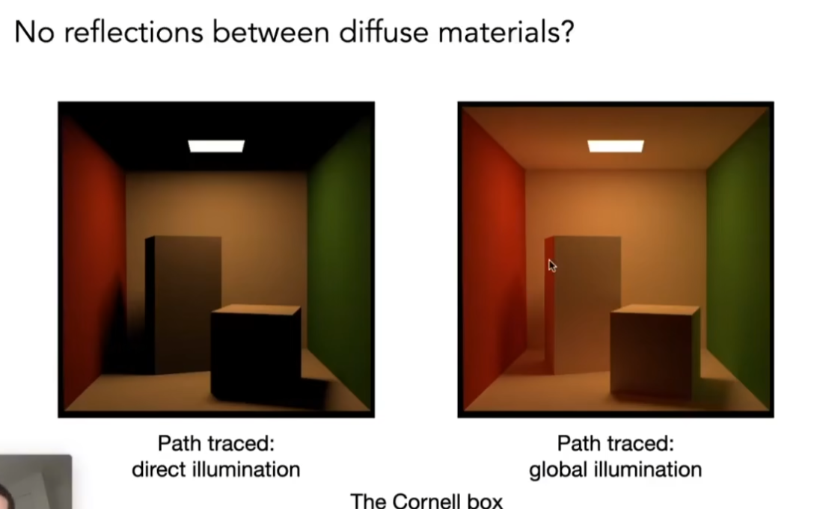 -->


使用蒙特卡洛方法近似求解积分，在半球面上均匀采样

<!-- 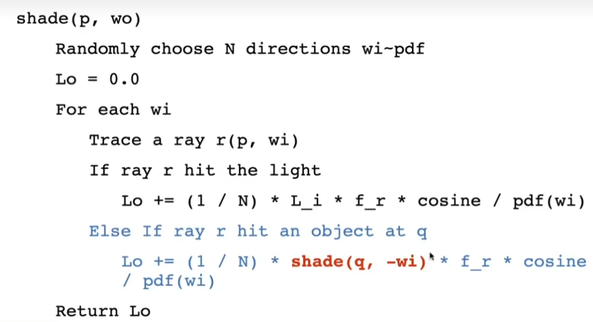 -->


n=1，叫做路径追踪，利用 ray generation 减少噪声，一个像素多少 ray 叫做 pass

利用俄罗斯赌盘（Russian roulette）决定是否停止

问题：SPP 小就不好看，因为光线很难打到光源上，被 wasted

于是在光源上积分，就是拆成直接光照和间接光照

直接考虑光源对该点的贡献，将面光源采样，把采样的结果投影到球面上

theta' 是将面光源法向量旋转到对准半球面的中心，theta 是将入射光线旋转到与表面法向量垂直，要经过两次衰减

```
shade(p, wo)
    # Contribution from the light source
    Uniformly sample the light at x', pdf_light = 1/A
    L_dir = L_i * f_r * cos theta * cos theta' / d^2 / pdf_light

    # Contribution from other reflectors
    L_indir = 0.0
    Test Russian Roulette with probability P_RR
    Uniformly sample the hemisphere toward wi, pdf_hemi = 1/2pi
    Trace a ray(p, wi)
    if ray hit a non-emiitting objection at q
    	L_indir = shade(q, -wi) * f_r * cos theta / pdf_hemi / P_RR

    return L_dir + L_indir
```

# Lecture 17 Materials and Appearance

# Material == BRDF

1. 反射与折射的角度计算，snell's law
2. 菲涅尔项计算反射能量
3. 微表面模型，近看镜面几何，远看材质。镜面是因为微表面的法向量方向集中
4. BRDF 拆成三项，菲涅尔，shadow 和 法向量分布
5. BRDF 的测量，利用 BRDF 的可逆、各项同性等

Material = BRDF

均匀的入射与反射

<!-- 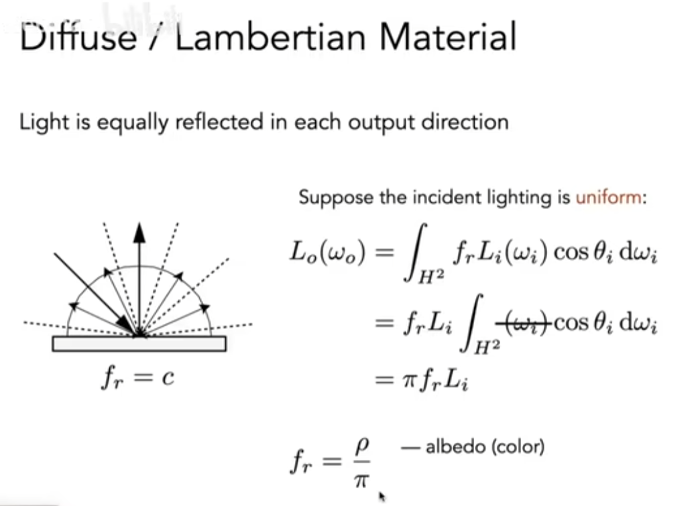 -->


Snell Law

折射率的比值是 $sin(\theta)$ 的反比，

有可能全反射：

<!-- 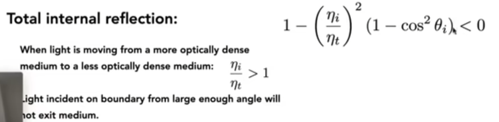 -->


水下部分角度导致全反射导致看不见：

<!-- 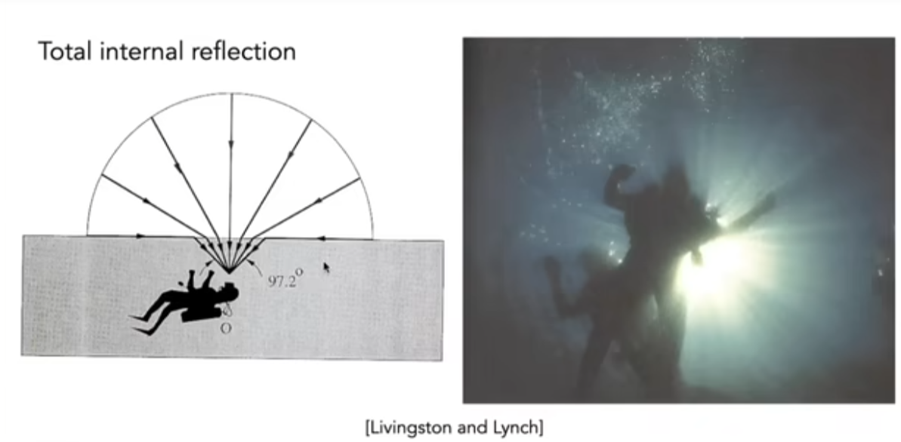 -->


菲涅尔项

当一束光擦着平面反射时候，几乎都被反射了。所以教室边上的人看黑板有反光。

菲涅尔项计算反射的能量

微表面模型：

近处看到的是几何，都是镜面反射，远处看到的是平整的材质

<!-- 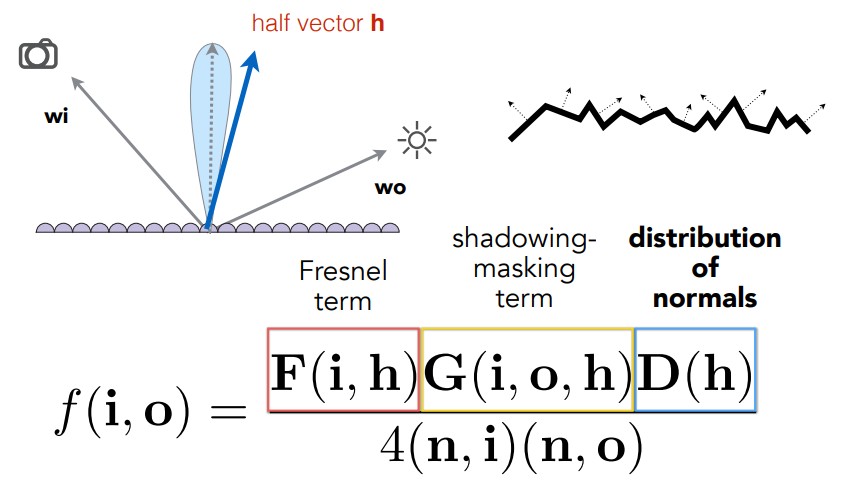 -->


# Lecture 18

1. 无偏光线传播
    1. Bidirectional Path tracing(BDPT)：传统 path tracing 如果光源位置刁钻，很难找到一条路径打到光源上面。如果先让光源传播一次，从而路径不需要打到光源，只需要打到光源直接光照的地方，就可以了。
    2. Metropolis light transport (MLT)：利用马尔可夫链的方法，依据已经有的 path 生成新的 path。好处是对于复杂光路能够依据一条高效的光路找到更多类似的、高效的光路。坏处是不知道什么时候收敛
2. 有偏光线传播
    1. Photon Mapping：从光源发出光子，bounce 到 diffuse 材质停止，从眼发生出 path，bounce 到 diffuse 停止，计算眼所看的 diffuse 界面的光子的密度。这是有偏估计。当发出的光子足够多的时候，期望就算对了
    2. Vertex connection and merging (VCM)：结合 Photon Mapping 和 BDPT
3. Advanced Appearance Modeling
    1. 非表面模型：参与介质 Frog

无偏的估计是，比如蒙特卡洛，有些采样方法的期望是对的，那就是无偏；有偏就是有些采样方法的期望不是真的期望。有偏的一种特殊情况是，当采样个数趋近于无穷的时候，得到的期望是对的，这种特殊情况叫做 consistent。

# Advanced Appearance Modeling

Participating Media：参与介质，比如雾，光线到雾里，遇到冰晶，被散射，被吸收。关键是，有光穿过去了。

<!-- 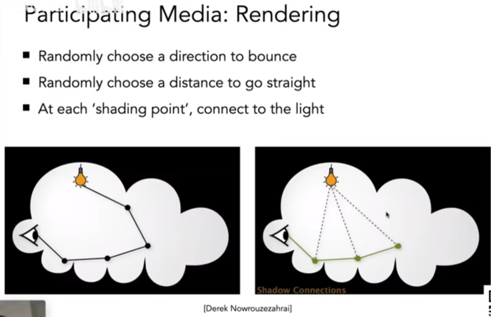 -->


头发：光线打到头发上，散射出圆锥 + 四面八方，Kajiya-Kay Model

真实的头发 Marschner Model，考虑三种光

<!-- 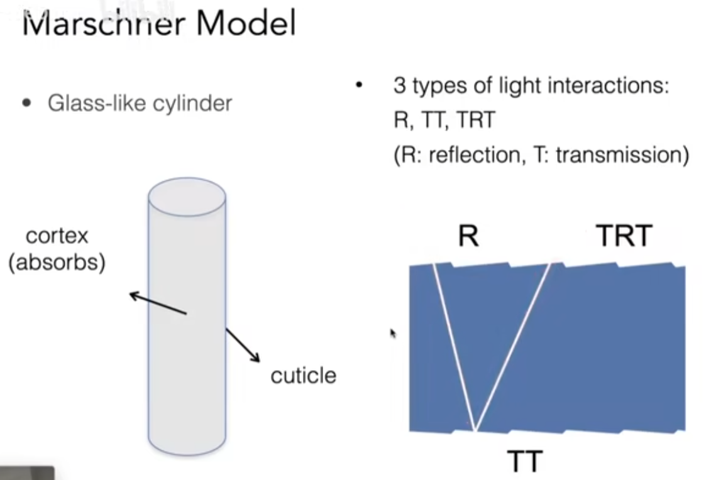 -->


对于动物的毛发（Fur），中间有水质，考虑五种光照

translucent：光线进入后发生了散射，区别于传统的半透明。比如强光照手指，手指发红，说手指头是「半透明」的不够精准，但是还是没有说怎么翻译。

次表面散射方程：BRDF 的泛化

<!-- 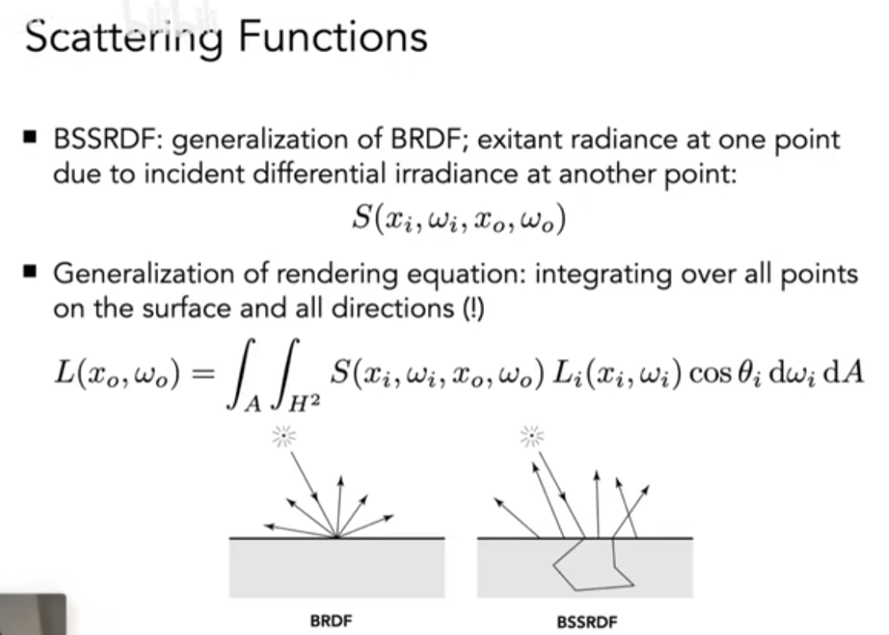 -->


次表面散射的近似：好像物体下面也有一个光源。

Cloth：把材质当成散射介质、或者实际纤维、或者物体表面

不记了，也记不住，走马观花。。。

# Lecture 19: Cameras, Lenses and Light Fields

1. 相机的原理：收集一段时间内 pixel 上的 irradiance 带来的 energy
    1. 快门：控制曝光时间
    2. 光圈：有多少光落入相机，类比人的瞳孔
    3. FOV：焦距和胶片的大小控制，就是所谓「广角」，约定是以 35mm 大小胶片为准
    4. ISO：相当于后期对照片的处理，乘上一个常数，可能导致噪点
2. 模糊和景深
    1. 成像平面没有落在感光器所在的平面上，导致感光器上有个 circle of confusion
    2. 减小光圈大小，就减小了 coc
    3. 景深就是指有一段拍照距离，这段距离内的物体导致的 coc 大小在可允许的范围内
3. 光追：光打到透镜上折射，计算折射后的光线即可

相机的传感器收集 irradiance

针孔相机利用小孔成像原理，直接投影到平面上，导致没有虚化，这就叫做「景深」，光线追踪方法就是利用小孔成像，pinhole

所谓广角就是 FOV

历史原因，不是直接描述 FOV 有多少度，而是描述不同的 f，对应 35mm 的胶片对应的广角大小

<!-- 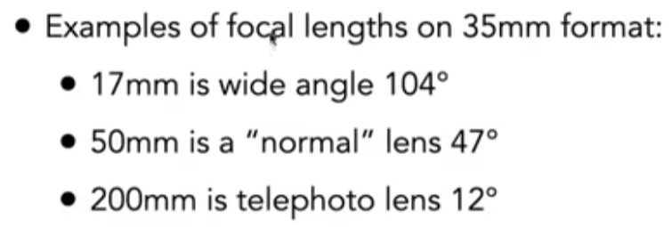 -->


## Exposure

$Exposure = time \times irradiance$

辐射度量学上都在说单位时间，曝光时间控制 time，从而控制一段时间内落在像素上的能量（enery）。

note. 个人理解，比如拍星星，就曝光长一点，让星星的光充分落在像素上。但是太久星星会转圈。

曝光时间就是快门

光圈控制光的多少：类似于人的瞳孔。一般说 F-stop，FN 里的 N，就是直径的逆

ISO gain（感光度）：简单理解为最后的 energy 乘上一个数

ISO 逐渐增大会放大噪声

<!-- 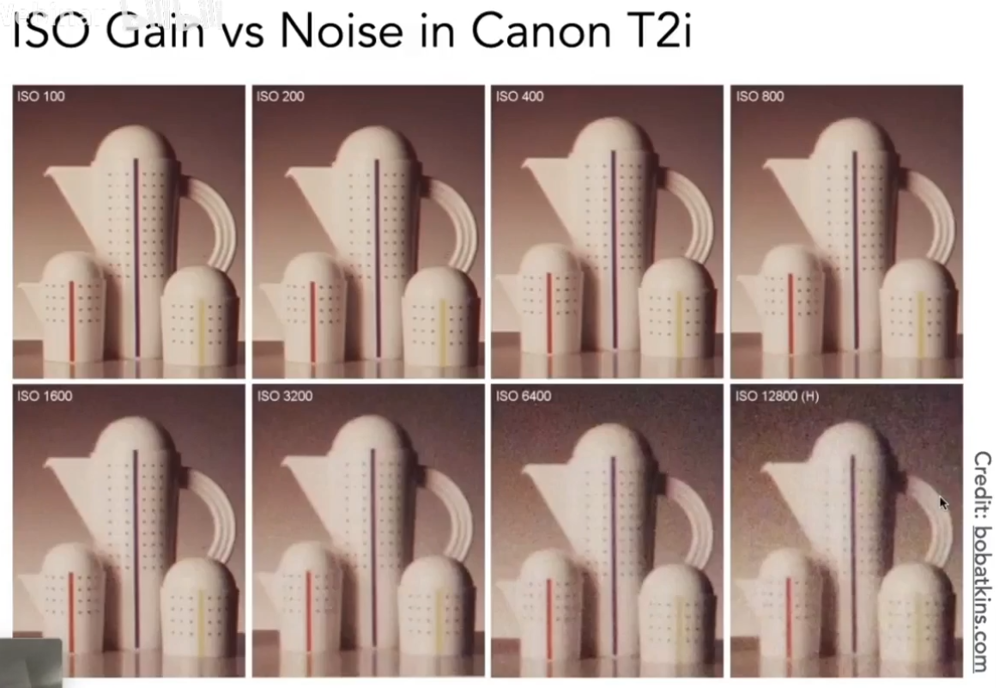 -->


如果拍摄一个运动的物体，物体运动快，那么过长的曝光时间就可能导致运动模糊，为了得到更加锐利的图像，就要减小曝光时间，就要让快门时间更短，但是这样可能会导致照片上的光不够亮，又需要调节光圈。

<!-- 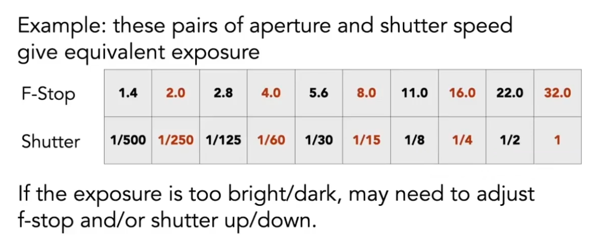 -->


## Lens

相机使用透镜组，从而改变相机的焦距

成像公式 $\frac{1}{f} = \frac{1}{z_i} + \frac{1}{z_o}$，$z_i$ 是像距，$z_o$ 是物距

解释景深（Defocus Blur）：

光圈（Aperture）为什么可以控制景深：

当点成像不在 sensor 的平面上的时候，sensor 得到一个 circle，该 circle 的大小和 A 有关。

<!-- 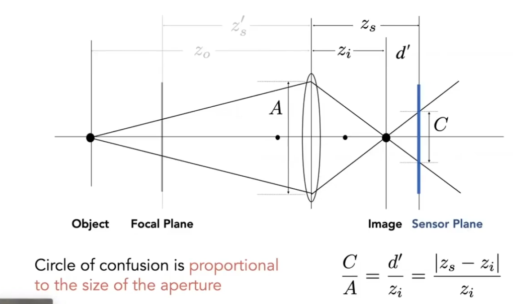 -->


等号的右边是固定的，所以用小光圈，就会减少模糊。

重新定义光圈：$f/N = A$，f 就是焦距，我们关心的就是除数 N，也叫做 f 数，f/2 说明真实的光圈直径是焦距的二分之一。

景深就是指成像的 scene 有一段区域，其导致的 coc 足够小

<!-- 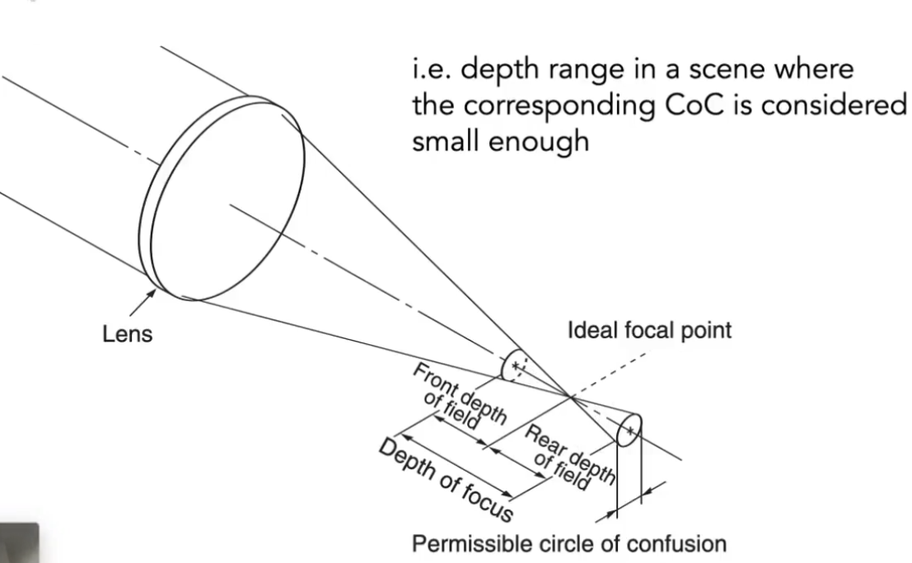 -->


# Lecture 20: Color and Perception

# Light Field/Lumigraph

1. 全光函数：人对世界光线的感知可以表示为一个有七个参数的函数，xyz 表示人眼坐标，$\theta, \phi$ 表示人眼方向，t 表示时间，$\lambda$ 表示对应波长
2. 两个相对的平面，前面为 st，后面为 uv，记录 uv 面上任意一点看到 st 的光
3. 光场相机就是将 uv 放置镜头，通过 sensor，从而记录不同方向的光的信息

全光函数

<!-- 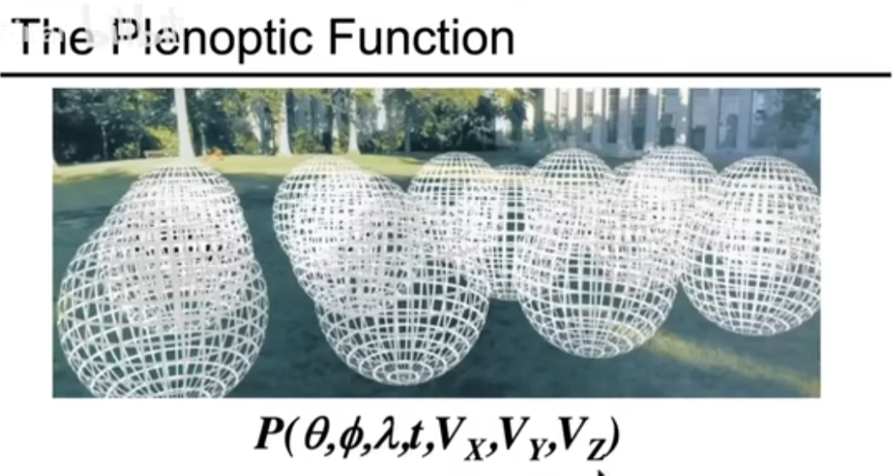 -->


人在任何时间任何地点看任何角度对应的颜色，是一个由 7 个参数的函数

光场：任何一个位置往任何一个方向去的光的强度，是一个四维的函数

物体放到盒子里，描述物体所能被看到的所有情况

光场只是全光函数的一小部分，只是位置和方向。

位置用物体的表面 uv 参数表示，方向用 $\theta, \phi$ 表示

<!-- 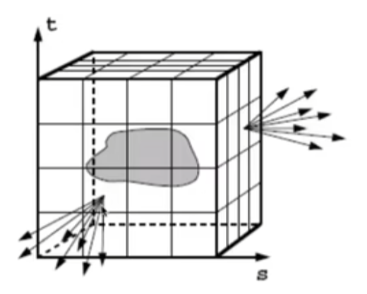 -->


用两个平面 uv 和 st 上的点，连线得到一条直线，记录该直线的光强

<!-- 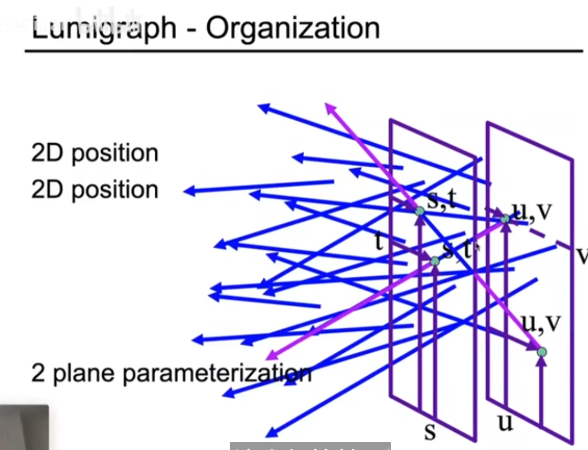 -->


如果相机后面的 sensor 换成透镜，把不同方向的光的分开，不是像素直接接触到的 irradiance，而是不同方向的 irradiance

<!-- 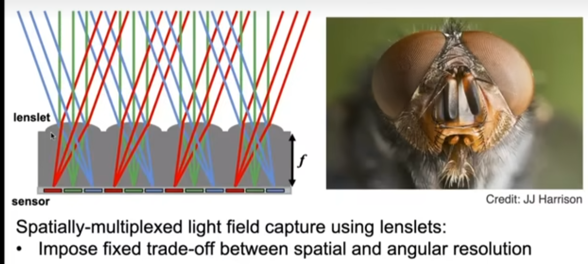 -->


光场照相机的作用：记录各个不同方向的光，后期调节焦距等

内部结构，每一个 sensor 记录来自不同方向的光，就好像复眼

<!-- 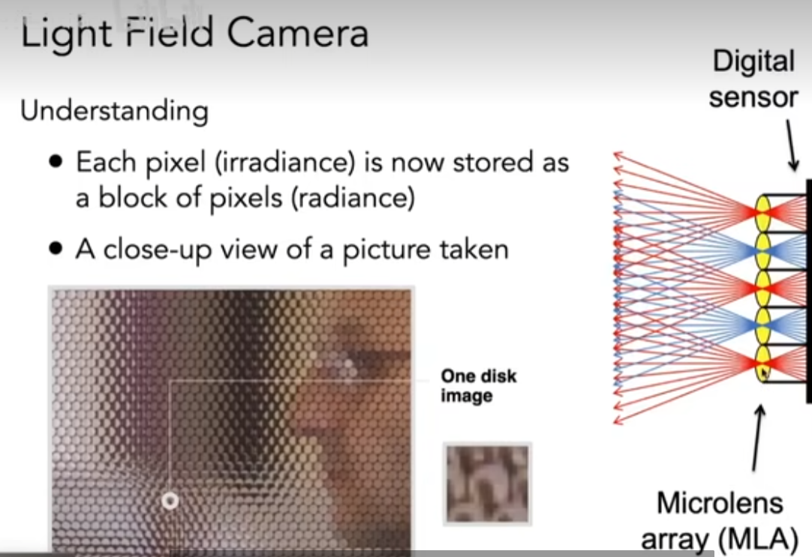 -->


如何从摄像结果回复出照片，就是选择一个方向的光去看。

cons：相当于每个 len 后面有一个 sensor plane，本身 len 的数量就很多，每个 disk image 的分辨率就会更小

通过透镜和 sensor，成功记录了 st 和 uv。

# Physical Basic of Color

1. 可见光是在不同波段的分布函数，SPD
2. 颜色的生物基础是视锥细胞对不同波长有三个响应函数，将 SPD 和响应函数相乘积分，得到三个数，颜色本质就是人眼积分得到的三个数
    1. 同色异谱现象：不同的 SPD 可能人眼看到一样的颜色，这就是调色的基础
3. 加色系统，当我们规定使用三种固定的波长来表示颜色的时候，有些颜色没法通过加法得到，但是可以在其基础上加上已有的颜色，就相当于做减法
4. CIE RGB：选择了三种波长的光表示不同的波长与 SPD
5. CIE XYZ：任意颜色（SPD）表示为 XYZ 三个参数，Y 表示亮度，通过归一化得到色域

介绍 SPD 的概念，能量在不同波段的分布

<!-- 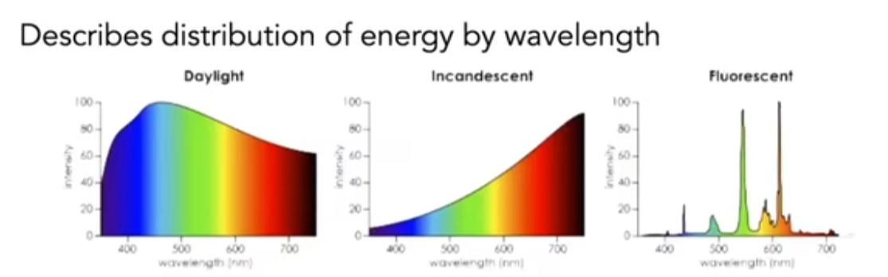 -->


## Biological Basis of Color

视网膜上三种不同的细胞对不同波长的光响应强度不一样

颜色就是细胞的响应强度乘 SPD 积分，三种细胞结果分别为 S，M，L

<!-- 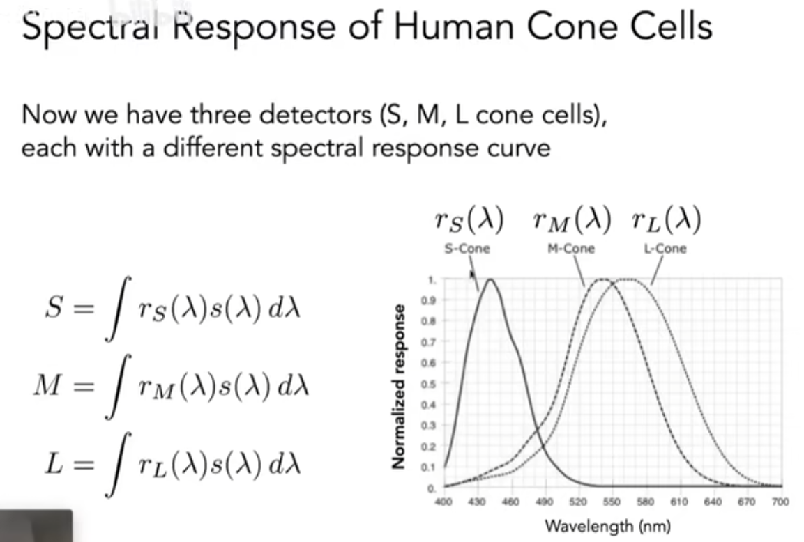 -->


同色异谱现象：不同的 SPD，因为人的感知，结果看到的三个数是一样的，这就是调色的基础

正是因为人眼的这种机制，所以才设计了颜色系统：通过定义响应函数，对不同 SPD 积分得到结果。

加色系统：光颜色的叠加符合加色系统，输入 color-in，用 RGB 加色出来，但是只通过加色有些颜色没法调出来，可以在给定的颜色 color-in 上加色再用 RGB 表示，就相当于在得到的 RGB 上做减法。

CIE RGB：对于任意输入波长，怎样用 rgb 对应的三种颜色的波长表示：

<!-- 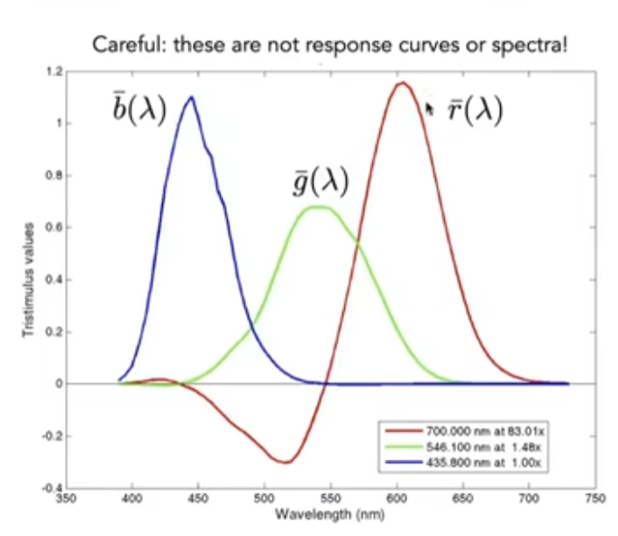 -->


因为对于任意的波长的可以分解为 RGB，那么给定 SPD 也可以表示为 RGB

<!-- 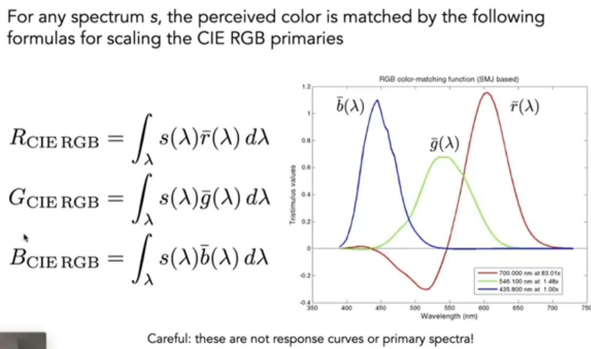 -->


sRGB 表示 standard RGB，可能没法表示所有颜色。通过一台机器为标准，其他机器对齐校正

CIE XYZ 系统，通过人造的颜色匹配函数，积分得到的结果 XYZ 来表示颜色（没说 X 就是绿色……），特别的，Y 表示亮度

<!-- 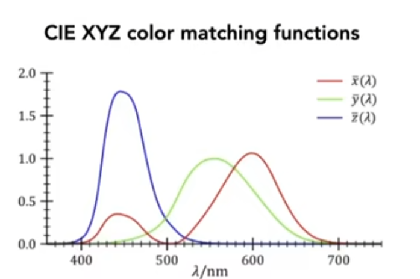 -->


可视化 XYZ：归一化后，自由度为二，固定大写的 Y，改变 X 和 Z，使用 x 和 y 绘制：

<!-- 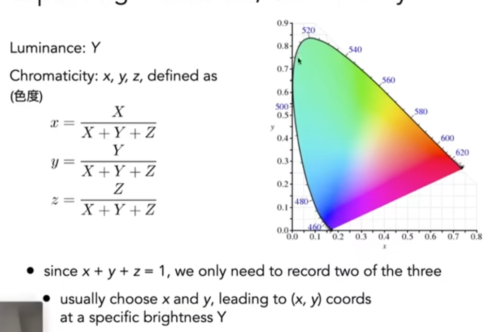 -->


边界的颜色是最纯的

不同颜色系统的色域不一样，sRGB 只占据一小部分。

介绍了互补色，LAB 空间

CMYK：减色系统

# Lecture21：Animation

关键帧就是比较关键的帧，，其他帧其实就是在描述关键帧之间的过渡。过去手绘就是大佬画关键帧，助手画过渡。flash 就是自动生成过渡帧。

<!-- 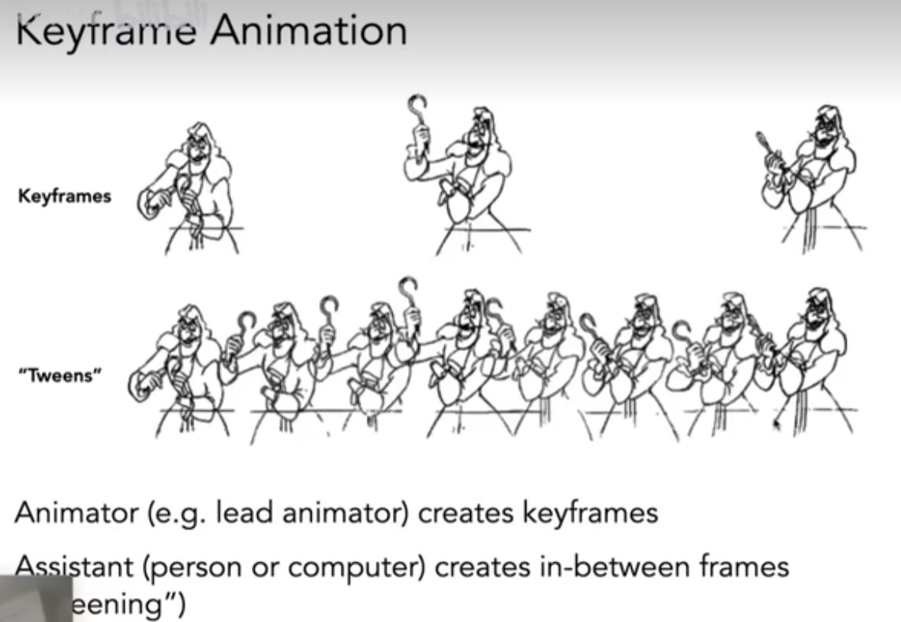 -->


## A Simple Spring

质点弹簧系统

<!-- 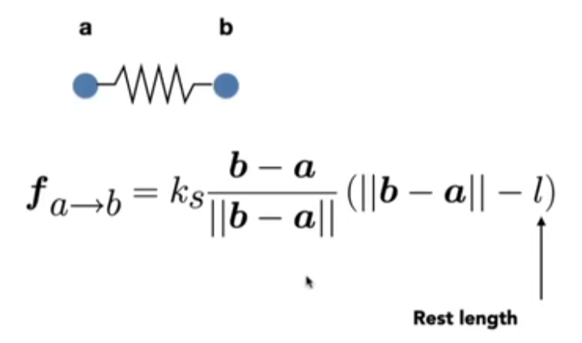 -->


在胡克定律的基础上，引入弹簧内部的损耗，这个损耗和两点之间的相对速度有关，和弹簧长度无关。

<!-- 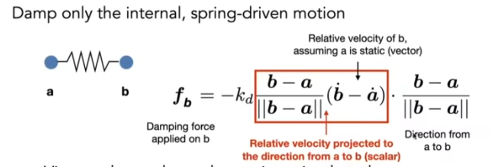 -->


通过简单的建模模拟布料的形变，有两种力：

1. 同一个平面内的 sheer，布料可以抵抗这种力，所以有蓝色的弹簧
2. 布料可以抵抗折叠，所以有红色的线

<!-- 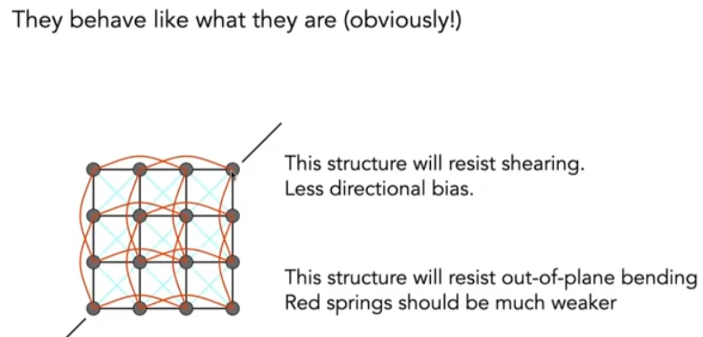 -->


除此以外还有有限元系统，考虑力的传导。

## Particle Systems

灰尘、雾、水可以使用粒子系统

For each frame in animation

1. [lf needed]Create new particles
2. Calculate forces on each particle
3. Update each particle's position and velocity
4. [lf needed]Remove dead particles
5. Render particles

说起来非常的简单：先模拟，后渲染，可能要考虑粘滞力、引力、碰撞等。

粒子系统本质是个体与群体的关系，可以模拟鸟群的运动

## Forward Kinematics

运动学

关节的种类：

1. pin：只有一个自由度，比如分针秒针
2. ball：两个自由度，手和手臂连接处
3. Prismatic joint：平移，比如小腿与大腿之间可以拉伸

逆运动学：告知骨骼最后的位置，反向计算各个关节运动的参数

<!-- 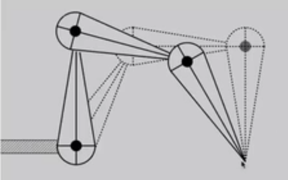 -->


比如使用梯度下降的方式求解，减小起点和终点之间的距离

## Rigging

> Rigging is a set of higher level controls on a character that allow more rapid & intuitive modification of pose, deformations, expression, etc.

给一个角色分配控制点，通过控制点的位置，调整角色的表情、动作。

## Motion Capture

给真的人分配控制点，记录下人运动过程中控制点的位置变化，反应到模型上

# Lecture 22 Animation Cont.

常微分方程（Ordinary Differential Equation），就是没有偏微分，所以叫「常」，$\dot{x} = f(x,t)$。

Euler's Method：欧拉法

一种迭代的方法，利用当前粒子的状态 $x, v, a$，计算下一个时间的 $x, a$。

$$
x^{t + \Delta t} = x^t + \Delta t \dot{x}^t \\
\dot{x}^{t + \Delta t} = \dot{x}^t+ \Delta t \ddot{x}^t
$$

缺点：

1. 不够精确。可以通过较小步长解决
2. 不稳定。比如圆周运动，将导致例子离开圆。

改进方法比如使用泰勒二阶展开。

隐式欧拉方法：使用下一个时刻的速度和加速度计算当前的位置和速度：

$$
x^{t+ \Delta t} = x^t + \Delta t \dot{x}^{t + \Delta t} \\
\dot{x}^{t + \Delta t} = \dot{x}^t + \Delta t \ddot{x}^{t+\Delta t}
$$

但是下一个时刻的状态还不知道，所以就解方程了，解方程也是用比如牛顿法之类的。

如何衡量误差？考虑局部误差（Local truncation error）和累计误差（Global Truncation Error）关于 $\Delta t$ 的阶数。

隐式欧拉法的累计误差是线性的。

## Runge-Kutta Famlies

这是一类方法，其中有一个方法叫做 RK4

<!--  -->


数值分析会教。

Rigid Body Simulation（刚体的模拟），一笔带过，也是解微分方程，和粒子的模拟一样。

## A Simple Position-Based Method

基于物体的方法来模拟流体，也是粒子的模拟，最后通过渲染出画面。
假设流体的「密度」是不变的，也就是单位体积内的粒子个数是不变的，
再定义一种密度改变的方式，考虑每个粒子附近的密度对其的影响。

这就是一个梯度下降的过程

## 质点法和网格法

质点法：对于集群，模拟每个个体。
网格法：将集群所在的空间划分为不同的单元，考虑每个单元的状态。

# Supplementary Material

# 透视矫正

在投影前的三维空间（view space）中，三角形 ABC 内一个点$D$有其重心坐标表示 $(\alpha, \beta, \gamma)$，通过透视投影后在二维屏幕上，也能得到一个 $(\alpha', \beta', \gamma')$ 表示，求二者之间关系。

设投影前，$\bold{A} = [x_A, y_A, z_A, 1]^T$，透视矩阵为 $M$

投影后 $MA$ 记为 $[x'_A, y'_A, z'_A, w_A]$

$MD = M(\alpha A + \beta B + \gamma C) =\alpha MA + \beta MB + \gamma MC$：

$$
\begin{bmatrix}
\alpha x'_A + \beta x'_B + \gamma x'_C \\
... \\
... \\
\alpha w_A + \beta w_B + \gamma w_C \\
\end{bmatrix}
$$

齐次除法后，为了简化表示，有：

1. $\alpha w_A + \beta w_B + \gamma w_C = \sum (iw)$
2. $\alpha x'_A + \beta x'_B + \gamma x'_C = \sum(ix')$

D 坐标为如下，记为坐标 1：

$$
\begin{bmatrix}
\sum (ix') / \sum(iw) \\
\sum (iy') / \sum(iw) \\
\sum (iz') / \sum(iw) \\
1
\end{bmatrix}
$$

投影后再齐次除法的 A 坐标为：

$$
\begin{bmatrix}
x'_A/w \\
y'_A/w \\
z'_A/w \\
1
\end{bmatrix}
$$

视口变换前后计算重心坐标不变，记齐次除法后得到 D 的重心坐标为 $(\alpha', \beta', \gamma')$，D 的坐标用齐次坐标系表示如下，记为坐标 2：

$$
\begin{bmatrix}
\frac{\alpha' x'_A}{w_A} + \frac{\beta' x'_B}{w_B} + \frac{\gamma' x'_C}{w_C} \\
\sum(i'y'/w) \\
\sum(i'z'/w) \\
1
\end{bmatrix}
$$

欲使用 $(\alpha', \beta', \gamma')$ 表示 $(\alpha, \beta, \gamma)$，观察 D 的坐标 1 和坐标 2 的 x 分量，其他分量同理：

$$
\sum (ix') / \sum(iw) = \frac{\alpha x'_A + \beta x'_B + \gamma x'_C}{\alpha w_A+ \beta w_B + \gamma w_B}

=\frac{\alpha' x'_A}{w_A} + \frac{\beta' x'_B}{w_B} + \frac{\gamma' x'_C}{w_C}
$$

有：

$$
\alpha' = \frac{\alpha w_A}{\alpha w_A+ \beta w_B + \gamma w_B} \\

\beta' = \frac{\beta w_B}{\alpha w_A+ \beta w_B + \gamma w_B} \\

\gamma' = \frac{\gamma w_C}{\alpha w_A+ \beta w_B + \gamma w_B}
$$

记 $v_1 = [\alpha, \beta, \gamma]$, $v_2 = [w_A, w_B, w_C]$，$v_3 = [\alpha', \beta', \gamma']$，现在是知道 v2 和 v3 要求 v1，real weight = $v_1 \cdot v_2$

$\frac{\alpha'}{w_A}, \frac{\beta'}{w_B}, \frac{\gamma'}{w_C}$ 的比例关系就是 $\alpha, \beta, \gamma$，求出它们后，因为 $w$ 都是已知的，$v_1 \cdot v_2$ 也可以求

实际处理中，w 保存了深度信息，最后一个分量不应该除以 w，而是直接用于存储深度信息。

最后的结果就是：

$$
\frac{\alpha'}{w_A} + \frac{\beta'}{w_B} + \frac{\gamma'}{w_C} = \frac{1}{real\ weight}
$$

先把 real weight 算出来，这个太重要了，直接记作 $w$，就是在投影前的深度，而且 $\alpha = \alpha'/w_A \times w$

所以我们要插值的时候，使用 $(\alpha'/w_A, \beta'/w_B, \gamma'/w_C)$ 作为 $(\alpha , \beta, \gamma)$ 作为权重最后在乘上 $w$ 即可
