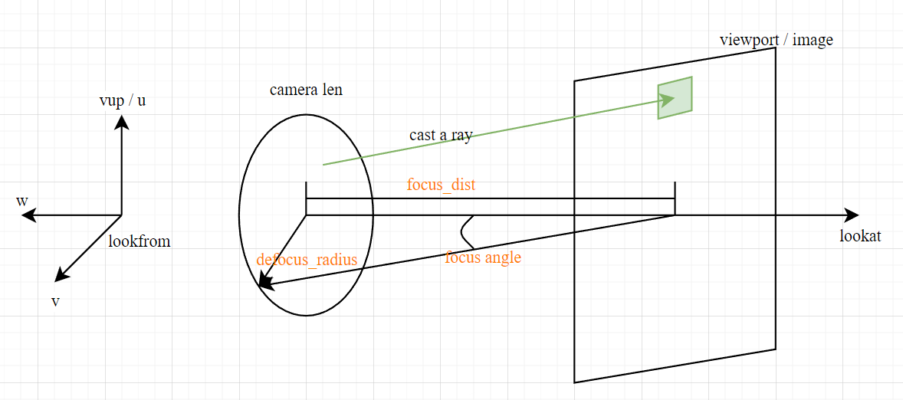

reproduce-ray-tracing-in-one-weekend

-   Created: 2023-12-24T22:08+08:00
-   Published: 2023-12-26T09:38+08:00
-   Categories: ComputerGraphics

成像模型：

<!--  -->


-   `vec3`, `ray`
-   image 和 viewport 大小
-   几何约定，up-y,right-x, back-z
-   camera 和 viewport 中的各个点和向量
    -   viewport 边向量
    -   单位 pixel 边向量
    -   camera 位置
-   球体求交：符合条件的 $t>0$。
    $$
    \begin{align*}
    & \text{ray: } A + tB \\
    & \text{sphere: } (P-C) \cdot (P- C) = r^2 \\
    & \text{inter: } (A + tB - C) \cdot (A + t B - C) = r^2
    \end{align*}
    $$
    trick: half_b
-   `hit_record`，`hittable` 和 `sphere` 类，`bool hit(ray, tmin, tmax, hit_rec)`
    -   决定 front 或者 back face，让 normal 永远 against ray
    -   object 的 normal 和 hit_record 的 normal 不必相同，通过 bool front 区分是内部打到还是外部打到
-   `hittable_list`，并实现 `hit` 方法
-   `main.cpp` 中添加 `hittable_list world`
-   `interval.h` 用其改写所有的 `hit()`

    -   `surrounds(), contains()`
    -   `static const empty, universe`

-   使用 random 对每个 pixel multi-sample 来抗锯齿
-   在 `ray_color()` 中使用 random-hemisphere 添加 diffuse 反射（反射向量随机），递归调用 hit
    -   递归的 bug 是反射线的 origin 可能位于表面以下，所以 `interval.min = 0.001`
    -   最关键的代码：
    ```cpp
    if (world.hit(r, interval(0.001, infinity), rec)) {
        color  attenuation;
        ray scattered;
        if (rec.mat->scatter(r, rec, attenuation, scattered)) {
            return attenuation * ray_color(scattered, depth - 1, world);
        }
        else {
            return color(0, 0, 0);
        }
    }
    ```
-   gamma correction: 线性空间到 gamma 空间，0-1 的值要变大
-   material：如何表示一次反射 `scatter(ray_in, hit_rec, attenuation, ray_out)`
    -   如何理解颜色？我们看到的颜色不是物体的固有属性，教程中给出的物体的固有属性叫做 $albedo$（反照率）和 $attenuation$（衰减）
        光（rgb）打到物体上，乘上物体的反照率然后衰减。比如不是特别亮的光 `(.8,.8,.8)` 达到折射率为 `(.5,.5,.5)`，出来的颜色就是 `(.4,.4,.4)`
        除此以外还要计算反射光的方向，漫反射可以随机，镜面反射就是反射，电介质需要 Snell's Law 决定是否全反射
    -   Lambertian: 小心 Lambertian 反射导致的 zero vector
    -   mirror 和 dielectric
-   camera defocus

code: [rfhits/reproduce\-raytrace\-in\-one\-weekend: reproduce raytrace in one weekend](https://github.com/rfhits/reproduce-raytrace-in-one-weekend)

[toc]

# `vec3.xyz`

使用 `union` 更加方便：

```cpp
class vec3
{
public:
    union {
        struct {
            double x;
            double y;
            double z;
        };
        double e[3];
    };
    vec3() :e{ 0,0,0 } {}
    vec3(double x, double y, double z) : e{ x, y, z } {};
}
```

# 255.999

`color.h` 中使用 `255.999` 的可能原因：

> 在给定的代码中，为了将颜色分量的浮点值转换为在 [0, 255] 范围内的整数值，使用了 `static_cast<int>(255.999 * pixel_color.x())` 的形式。
> 这种做法是为了防止舍入误差。由于浮点数表示的有限精度，乘以 255 可能会导致舍入到较低的整数值，例如 254.9999 可能会舍入为 254。为了避免这种情况，我们可以使用 `255.999` 来确保浮点数在乘以 255 后能够正确舍入到最接近的整数值。
> 例如，假设 `pixel_color.x()` 的值为 1.0，直接乘以 255 将得到 254.9999，舍入为 254。而使用 `255.999 * pixel_color.x()` 将得到 255.999，舍入为 255。
> 这样做可以确保最终计算得到的整数值在 [0, 255] 范围内，以便正确地表示颜色分量。
> -- poe
