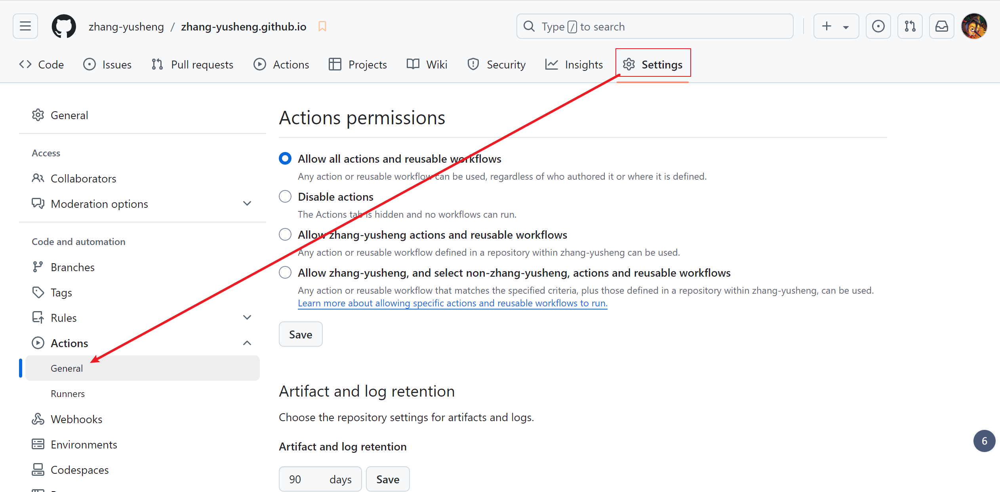

# 使用 GitHub Actions & Pages 托管 Honkit 发布的网站

Created: 2024-09-22T13:48+08:00
Published: 2024-09-22T14:28+08:00

Category: DevOps

作为张雨生的骨灰级粉丝，我一直想把雨生的资料尽可能地收集起来，用网站或者电子书的形式发布。
一番查找后，我选择了 honkit 制作电子书和网站，GitHub Actions & Pages 作为网站托管。

# GitHub Actions & Pages

只要在 repo 的 `/github/workflow` 目录下放 yml 文件，GitHub 就会查找其中 jobs 执行。

我写的这个 yaml 极为简单，只有一个 job，该 job 下的 step 就是跑脚本。

```yml
name: "honkit-publish"
on:
  push:
    branches:
      - main
jobs:
  build-and-publish:
    runs-on: ubuntu-latest
    env:
      USER_NAME: zhang-yusheng
      USER_EMAIL: zhang-yusheng@qq.com
    steps:
      - uses: actions/checkout@v4
      - uses: actions/setup-node@v4
        with:
          node-version: 20
      - name: Run package installation script
        run: |
          chmod +x ./scripts/install_packages.sh
          ./scripts/install_packages.sh
      - run: honkit build ./
      - name: build books
        run: |
          chmod +x ./scripts/build_books.sh
          ./scripts/build_books.sh
      - name: Deploy
        uses: JamesIves/github-pages-deploy-action@v4
        with:
          folder: _book # The folder the action should deploy.

```

要注意：

1. 我们可以直接使用别人提供好的 action，通过 `with` 加参数。
   我使用了 checkout、setup-node 和 github-pages-deploy-action 三个 action，分别用来 clone repo，安装 node 和发布打包好的文件夹。
   这些 actions 都是在 GitHub 上的，要关注其 repo，里面会有 usage 和最新版本。
   比如 setup node 的 action 就在 [actions/setup\-node: Set up your GitHub Actions workflow with a specific version of node\.js](https://github.com/actions/setup-node)
   用了别人的 action 就不用自己再写脚本了
2. job 本身就是以 root 权限运行的，不需要输入密码确认
3. 一定要在 repo 的 setting 里面授予 action 对 repo 的 Workflow permissions
    1. Allow GitHub Actions to create and approve pull requests
    2. Read and write permissions



# Honkit

我本来想使用 GitBook 作为网站的发布工具
但是 GitBook 停止更新了，node 下载 gitbook-cli 没有 gitbook init 这个命令了。
[Honkit](https://github.com/honkit/honkit) 是 GitBook 的 fork，可以兼容原来 GitBook 的那些插件。
所以网络上 gitbook 那些教程也适用 honkit，这里就不多说了，只提一些自己踩到的坑：

1. honkit@4.0.1 ~ honkit@5.0.0 渲染 `<br>` 错误
   解决方法：用 honkit@4.0.0
2. Ubuntu 上需要 ebook-convert
   解决：`sudo apt update & sudo apt-get install calibre`
3. Ubuntu 导出 pdf 没法显示中文
   解决：安装一种中文字体[^1]，然后在 `book.json` 中指定 pdf 的 fontFamily[^2]
   我选择了 `sudo apt-get install fonts-arphic-ukai`
    ```json
     "pdf": {
       "fontFamily": "AR PL UKai CN"
     },
    ```

# 成品

网站地址：[Introduction · Yusheng Zhang Archive](https://zhang-yusheng.github.io/)
仓库地址：[zhang\-yusheng/zhang\-yusheng\.github\.io](https://github.com/zhang-yusheng/zhang-yusheng.github.io)

[^1]: [Ubuntu\-Chinese\-Font\.md](https://gist.github.com/erain/0c13b452f7104e6a4b83)
[^2]: https://honkit.netlify.app/config
