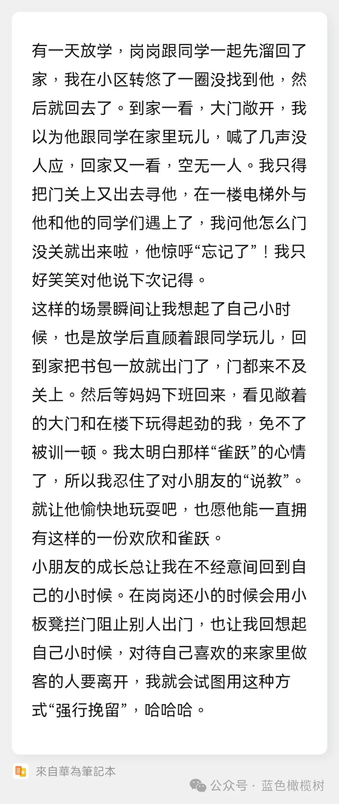
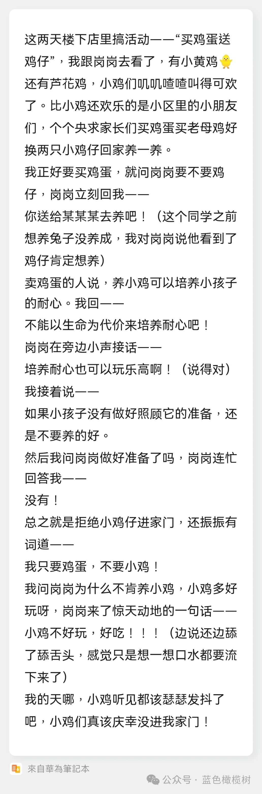

想起一些非常久的事情

Subtitle: 2024-01-16 recall
Created: 2024-01-16T18:52+08:00
Published: 2024-01-16T20:08+08:00
Categories: Essay
Tags: Diary

可能是看[书](https://book.douban.com/subject/26585065/)的影响，也可能是前天被我妈嘱咐要吃好点（至于为什么是前天，检查日历和身份证），也可能是看了某公众号的文章，晚上（凌晨）醒来忽然想起好多年前的事情。

小时候在江西，爸妈比我晚睡，自己只能先上床。一天晚上，不想一个人睡，可能觉得在妈妈腿上睡觉更舒服，就拿起自己的**小**被子到楼下去。记得我妈在小太阳旁边，然后中间过程忘记，结果是成功在我妈怀里被颠着睡着了。

现在想起来我妈真好，竟然没把一二年级的我赶楼上去。

还想起来初中时候，班主任说班上有俩孩子一男一女他蛮喜欢的，结果到了吃毕业饭那天，让我猜是谁（天哪我怎么会知道）……更狗血的是，我现在还记得答案的另一半。

Zzz...zzz...（这是一条在睡觉的分割线，所以不要吵醒 ta）...Zzz

最近又想起张雨生的歌，《[还以为](https://www.bilibili.com/video/BV1MR4y1E735/)》：「我今夜思念/从小桌前/陡然一跃而起」

我最喜欢这一句：「我看见我的眼睛/散在你的眼睛里」

[岗岗语录](https://mp.weixin.qq.com/s/KPYDAw7IIe2mdlG-Q2a8Qw)

