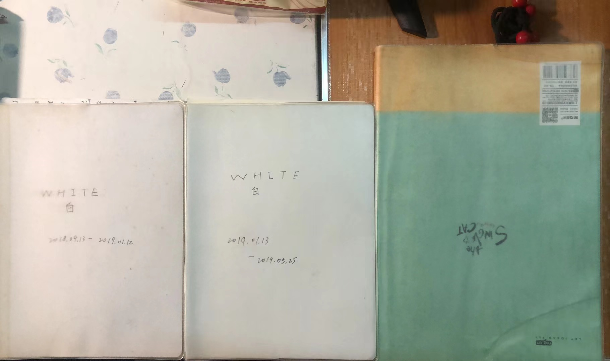

高三日记感想

Created: 2023-07-06T07:46+08:00

Published: 2023-07-14T21:52+08:00

Modified: 2023-07-15T19:00+08:00

Categories: Essay

Tags: Diary

[toc]

> 我不能相信 情难自己的一种离愁别绪 让我泫然欲泣
> ……
> 我不能相信 循着记忆的一生如是鲜明
>
> —— 张雨生 · _风留给春天_

# 日记缘起

翻开日记本第一页，找到了当初写日记的原因：学习高中化学竞赛准备写一本笔记本，但是课业太繁重了，所以没有写多少，于是就打算做成随笔，希望自己不要忘记这一段时光。

写日记的直接原因是非常直白的，但是根本原因是非常神秘的，空白的本子做草稿本也可以啊（即使这样看起来很奢侈），但是感觉来了就来了吧，不去管它了。

还有一个重要的事情已经忘记了，就是为什么突然想回看自己的日记，还要做成电子版。这是大学时候的事情，可能是人越长大越怀念小时候的快乐时光吗？大学舍友说我是他见过唯一一个坚持写日记的人，让我小小地自夸一下放在这里 `^_^`

看自己过去的日记，就好像穿越时空一样，用一个第三者的镜头拍摄着过去的自己和别人，自己在相机之后，却什么也无法干涉，只能看着自己和别人因为一件件事开心、生气、懊恼和沮丧……我认为大众口中「情绪稳定」的人不是那种迟钝的人，恰恰相反，「情绪稳定」是能够敏感捕捉到别人甚至自己情绪并采取措施引导和控制的人。当然这一切的前提就是——他自己能够捕捉到情绪。写日记也能够帮助自己记录当下的心情。

有时候看到高中同学说的话，非常好笑，比如「球场上的一条野狗」之类，但是有的话真是能够给人以启迪，比如物理老师的真挚发言，就像过去的声音跨越了时间来到了自己的耳边，有点像余音绕梁，但又不是余音绕梁。

# 学长的问题

曾经和一群同学被叫到办公室和清北来的学长交流，而学长感觉也不知道要交流什么，我还记得他问了一个问题，大意是：你们有人写日记吗？

然后我和文科班里的一个女同学一起弱弱地举了手（她甚至还是我高一的同班同学！）一堆人里我记得就我俩举了手，这也算是我第一次在（半）公开的场合表示过自己写日记（舍友倒是知道，但是不知道同桌知不知道）。真是神奇，既不知道学长为什么要这么问，也没想到还真有人和自己类似。

学长还问，那一天没什么事的话，这一天日记里会写「今日无事」吗？我好像没有翻到，哪怕是自己非常无聊或者今天非常无聊，我也会记一下流水账，顺便感叹：「今天是无聊的一天」。

在看日记的时候，我还发现自己竟然把日记本带到教室去写了？这实在是太危险，要是被哪个好奇的同学拿起来看见该咋办啊？但是一想到太阳落山时候，或者是懒洋洋的一个下午，阳光撒进教室里，在青春里，女同学几乎是最美的时候，男同学几乎是最矫健的时候，我拿着笔记录着自己、班级的一天，就是非常温馨的；而如果在周六的夜晚，自己一个人在教室用 MP3 放着喜欢的歌曲，还会有一种自由又孤独的感觉。

# 题目、考试和成绩

竞赛是考试，小测是考试，高考也是考试（只不过是最后一场），而考试的最终目的就是——成绩！

在日记里，我把班级比喻为「以题为纲」的小社会，关于考试，内容多是对自己粗心的责备和对考好同学的羡慕，前者更重一些。

舍友评价考试常说「这有什么意义？」现在回看，好吧，确实没啥太大的意义。

还记得一堆同学上去围着老师问题目，有时候要下课了，老师只能表示下次一定，有些快要轮到的同学甚至会问到下一节课开始。总之，听听别人的问题对自己也是有所启发的。不过我很少上去问问题，我的问题大多数都先被身边的同学解决（身边有一堆大佬的好处啊）。日记本里还记录了我曾经问过语文老师的问题，大意是，「青铜做的虎符，那么硬，也可以被完整地劈成两半吗？」想想自己真是一个特别的人呢……

发现自己高三的时候还看过巴金的《随想录》，他的孙女端端也不是出类拔萃的学生，于是他老人家就说：

> 我想，进不了重点学校，做一个普通人也好，不论在中国或者其他大小国家，总是普通人占多数，而且正因为有很多、很多的普通人，“重点”人才可以在上面发号施令。要想把工作做好，就得先把多数的普通人教育好，因为干实事的是他们。孩子既然进不了重点学校，那么规规矩矩地做一个普通人有什么不好？！
>
> —— 巴金 · _随想录_ · [三说端端](https://mp.weixin.qq.com/s/jh0SU7Q_amRkE94fSwtTvA)

高中的时候，我非常羡慕那些可以把成绩看得很淡的同学，哪怕十二道选择题错十一道半 ta 也可以放声高歌。而在经历过大学的考试，以及看了一点点书以后，我想，如果可以带着自己的思想回去的话，面对那些题目，可能会更加从容一点吧。毕竟：

> 真正能成为我们上课理由的，只有我们对科学文化知识的渴望。
>
> ——[上海交通大学生存手册](https://survivesjtu.gitbook.io/survivesjtumanual/)

# 听歌

大四下学期的一天下午我在听歌，突然像触电一样，想起高中的某一个时刻，自己对同桌说，有时候听听歌一个下午就过去了，然后同桌说，对。

这件事一直在我记忆里，别人和我有相似的经历会让我感到惊讶，就像分班以后才得知自己的高一同学也写日记一样，这种讶异会加深我对这件事的印象。可我却记不清楚这是高几的事情，就像我们在时间的洪流中或许可以清晰地记住彼此的面容、抓住那些精心的时刻，却难以想起第一次相见和最后一次离别在什么时候发生。和同桌说起听歌感受这件事给我的感觉，就像是在泛黄纸片上斑驳的字迹，只要时间再用力擦拭一下，它们就会模糊不清、无法辨认，甚至消失不见。

> 2018 年 9 月 16 日 星期天 台风天 八月初七
>
> 听歌时，A 神的 waiting for love，Simon & Garfunkel 的 the sound of silence、Scarborough Fair、唐纳德的 American Pie、张国荣的当爱已成往事、李健的传奇……都是韵律十分美妙的歌曲，一遍遍在我脑海中回荡，甚至直到现在。

> 2018 年 9 月 19 日 星期三 大太阳 八月初十
>
> 晚安，晚安。睡前听舍友哼了好多旋律优美的歌！！

> 2018 年 9 月 25 日 星期二 晴 八月十六
>
> 第二天。神奇的生物钟再次让我第二觉到 7:30。早饭后，怀着神圣的心情，认真地抄了一遍 American Pie 的歌词，不愧是“史诗”，一寸长，一寸强。

……

> 2019 年 6 月 1 日 四月廿八 周六 小雨
>
> 我还讲了课前 3 分钟，推荐了《那些花儿》，丽华说她很喜欢朴树三首歌，还有两首是《平凡之路》和最喜欢的《清白之年》，我还是觉得花好。

> 2019 年 6 月 14 日 五月十二 周五 晴
>
> 记得今天逛知乎，发现一首好歌，《Lemon》，日本人米津玄师唱的，日语歌，一下就把我拉进广播站的音乐，多少次中午放学、下午放学、跑步、拉杠都有这首歌，我明白，一首深入人心的歌一定能勾起人内心的回忆。

我还记得有一回广播站放了不知道谁翻唱的《The Sound of Silence》，太折磨了，还有一天广播站放了好几首自己听过的歌，比如《Lemon Tree》，蛮开心的。

# 字迹

高中的时候不知道如何握笔，手还容易出汗导致笔老是往下滑，所以字写得一塌糊涂。非常巧的是，字迹娟秀的语文课代表就坐在我的后面，所以我常常转过来观摩她的握笔姿势，希望能够学到一招半式，可惜我天资愚钝，什么都没有学到。后来换了一支笔，看了 B 站的握笔教学视频，加上使用 OCR 软件来电子化日记，字迹也（被迫）逐渐变得清晰。

其实，字写得丑也有几个好处：

1. 除了自己以外，几乎没人可以认全，算是对日记进行了部分加密
2. 在阅读的时候，减少了走马观花的可能，必须投入精力辨识字迹
3. 写地很快，同样的时间可以记下更多的内容

坏处是有些字自己都认不出来，因为电子化日记依赖于 OCR，[白描](https://web.baimiaoapp.com/)是我经常使用的网站。让我惊讶和愧疚的是，有些字自己都不认识它反而能认出来——我写下了你们，却叫不出你们的名字，还要让别人来帮忙。

特地写这一段的原因是，我实在没想到下面写的是「氓之蚩蚩」，白描至少认出了「氓」：

<!--  -->

# 懵懂的情愫

> 氓之蚩蚩，抱布贸丝。匪来贸丝，来即我谋。

你以为我是过来给你讲题或者问问题的，实际上大家都心照不宣地别有用心。

八卦真是日记中最好玩的部分，不过也是最让人感慨的部分，要如何描述自己对这种东西的感受呢？真的很难啊。

首先，这种感情非常纯粹和纯洁，和大部分现代人相亲有车有房这种要求比起来真是有辱她的圣洁。所谓「只要能够想着你，我就欢喜」，说的就是这种感受吧。

但是，这种感情能否经得起时间的考验是非常值得商榷的。高中时候，大家生活是单调的，难免感到寂寞，有人看书，有人看电影，有人听歌，还有人直接找别人……我们没有见过更大的世界，没有见过更多的人，对爱情的理解可能还停留在未成年，难以分清楚自己是太寂寞还是真的喜欢上了一个独一不二、不可替代的人……

但是书里说，没有什么天生一对：

> There may be 10,000 women on the planet with whom you can have a really satisfying lifelong love relationship. So there’s not “the one,” but many potential ones.
>
> —— _The Man's Guide to Women_

而且欢愉的激情有着自己的保质期：

> Unfortunately, the eternality of the in-love experience is fiction, not fact. The late psychologist Dr. Dorothy Tennov conducted long-range studies on the in-love phenomenon. After studying scores of couples, she concluded that the average life span of a romantic obsession is two years. If it is a secretive love affair, it may last a little longer. Eventually, however, we all descend from the clouds and plant our feet on earth again. Our eyes are opened, and we see the warts of the other person. Her “quirks” are now merely annoying. He shows a capacity for hurt and anger, perhaps even harsh words and critical judgments. Those little traits that we overlooked when we were in love now become huge mountains.
>
> —— _The Five Love Languages_

物理老师和班主任也三令五申不要谈恋爱，可是还是有人「锦衣夜行」（这个成语用在这真是太妙不过）。从未想过会和[教导主任](http://www.fjptyz.com/jsfc/mszc/20180928/97800053.shtml)有交集的某位同学也迎来了面对她的一天，我印象里目前也只有一对还在相处，还几对已经不是情头，甚至确定有新欢了。

但是我相信这种宝贵的经历会给当事者带来更多的人生感悟，对于那些曾经在一起过的人，他们肯定摆脱了「母胎 solo」这样的标签，有人欣赏自己，有人接纳自己，两情相悦本身就是很开心的事情吧；而对于那些「无声的哑剧」，让我想到张雨生的《风留给春天》，里面写道：

> 如果在乎 就有意义
> 如果忘掉 只是逃避
> 这些回声又该如何

让自己平心气和地去接纳这段过去的经历吧，忘掉就是逃避了。

P.S. 我还是蛮希望高中同学能成，这样可以请我吃席（指红事）。

# 回忆又玄又是漩！

> 2018 年 10 月 13 日 星期六 还是阴 九月初五
>
> 人在流逝的时光面前总是会感到一阵无力

看日记的时候，一定要牢记，不要陷进去，好景当前莫留连！

> 這一年　這一夜　回憶溫暖我疲憊　小黃燈書桌前
> 細數有心人情淚　看似清實迷離　情路又玄又是漩
> 為你　我更舉杯　好景當前莫留連
>
> —— 张雨生 · _这一年这一夜_

最后

> 2018 年 10 月 12 日 星期五 阴到晴到阴 九月初四
>
> 我 10 年后看到这会有感触吗？

<!--  -->

未来，就像我自己也不能料到，三本笔记本全部「中道崩殂」被用来当作日记本了，我实在算不得一个好学生。
