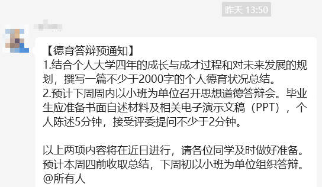
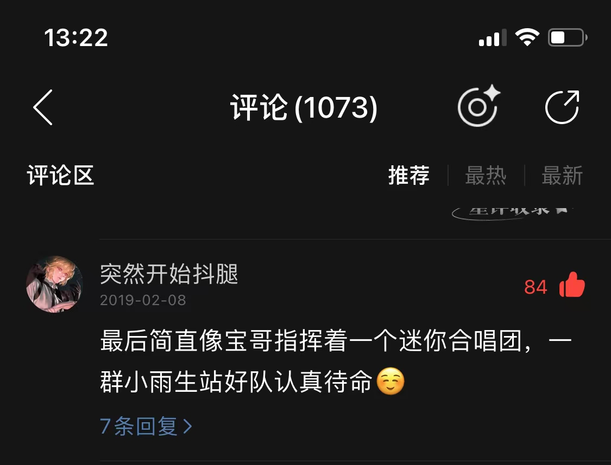

4a.m., 玫瑰之名和兰花草

Created: 2023-06-05T18:59+08:00

Published: 2023-06-26T19:35+08:00

Categories: Fragment

[toc]

# 跳一段忠字舞

<!--  -->

第二点实在是太有意思了，我第一次要写 PPT 为自己的思想道德水平进行答辩。让我想起王小波的话：

> 我怎么能没感情呢，不过要我用这个感情跳出个忠字舞，就是杀了我也跳不出，就是拿出来喊成个口号也不成。
> —— _爱你就像爱生命_

# 唯有凌晨四点才能诉说最美丽的语言

《如燕盘旋而来的思念》里歌词：

> 我是**月落的聲音** 你是**乍醒的黎明** 密密會合於天井 也交還迴映的光暈
> 與我的愛戀走唱星系 以你的深情如影隨形
> 如燕盤旋而來的思念 如燕盤旋而來的思念 如燕盤旋而來的思念
> 總在**凌晨四點** 唯有凌晨四點 才能訴說最美麗的語言

为什么是凌晨四点，我之前不知道，直到今天凌晨四点多醒来看了一下天空，月亮在西边要落下，东边泛起微光，和歌词的描述如出一辙。

# 想读和在读

现在很少读纸质书籍，所以那句「买书如山倒，看书如抽丝」要改一改：

想读如山倒，在读如抽丝。

# 玫瑰的玻璃罩

> "At night I want you to put me under a glass globe. It is very cold where you live. In the place I came from--"
>
> But she interrupted herself at that point. She had come in the form of a seed. She could not have known anything of any other worlds. Embarrassed over having let herself be caught on the verge of such a naïve untruth, she coughed two or three times, in order to put the little prince in the wrong.
>
> "The screen?"
> "I was just going to look for it when you spoke to me..."
> Then she forced her cough a little more so that he should suffer from remorse just the same.
> -- Antoine de Saint-Exupéry · _The Little Prince_ · chapter 10

> 玫瑰多情也多刺 竟与妳似曾相识
> 有多少次我尝试写首诗 留下妳那婀娜多姿的样子
> 有时候**娇横伤人** 有时候**娇柔依人**
> 我只能用**最奢侈的玻璃** 为妳筑起不惧风雨的天地
> —— 张雨生 · _玫瑰的名字_

我想起《[风之谷](https://movie.douban.com/subject/1291585/)》里那个红色短发女孩（感觉自己因为一个动画人物可以接受短发了）拿到了王虫蜕壳后眼睛的那个地方，就像一个 glass globe。

# 秦海碗：杜绝不快乐

> 又一次没有打扰地工作到夜深人静，这时感觉夜很长。似乎还有足够的时间做很多的事。似乎以前赶着上班似得要在睡前做的一些娱乐项目也没必要做。**这段时间在工作时我都断网以及不带手机，只有饭后和睡前会看一下，因为我想要杜绝那些会消耗精力却不增长快乐的事。**每天都想要花时间想一想，哪些事是我真正想做的，哪些是被社会、算法、习惯等等训练出来的让我以为我想做的。本来以为自己所求已经很少，现在发现可以再减，我所求的只是一时一刻的幸福，我也只能感受到一时一刻的幸福，期待未来的幸福只能让此间的幸福流走。只要觉知的状态更多一些，我就更自由些，更能感到意识的馈赠。
>
> —— 秦海碗 · _[浮生·七](https://tianxianzi.me/2023/06/10/floating_life7/)_

# 自我鉴定

实际上，我在想为什么要写「自我鉴定」这种东西，今天看了《The Little Prince》的 chapter 10，国王任命小王子为 Minister of Justice，小王子说：But there is nobody here to judge！国王回应：

> "Then you shall judge yourself, that is the most difficult thing of all. It is much more difficult to judge oneself than to judge others. If you succeed in judging yourself rightly, then you are indeed a man of true wisdom."

哎，我真是不知道要怎么写，鉴定自己，是要像王婆卖瓜一样自卖自夸，还是像教堂里的人那样，说：Forgive me father, for I have sinned？

北航的四年是难忘的四年，翻看日记，有因为考差而感到悲伤，因为保研而感到快乐，我还记得晨兴的毕业合唱，人文讲堂的诗词大会，操场上黑白键一样的蓝色台阶，课堂上怎么也学不懂的操作系统。

我以前喜欢打游戏，现在又喜欢上了看书，我知道把握住现在，就是把握住了未来，做喜欢并且有意义的事，关心身边的人，做诚实的人，用自己的努力回馈社会，我尽力去做，这就是我的[自我期许](https://www.tomchang.cn/archive/article/68.html)。

世界上就是有这样那样不顺心的事，万幸时间可以冲淡一切，认识与承认自己的不完美，并朝着完美的方向去努力，不因为过去的得失而计较，永远憧憬着未来，像歌里唱的那样，「[好景当前莫留连](https://mp.weixin.qq.com/s/8XLRs7YBZj5fEYMOK7LsoA)」，[乐观瞻望于前的勇气](https://github.com/rfhits/Collected-Work-of-Tom-Chang/blob/main/text/%E6%96%87%E7%AB%A0/1989-07-22_%E5%9C%A8%E4%B8%8D%E6%96%AD%E6%89%AC%E5%BC%83%E4%B8%8B%EF%BC%8C%E4%BD%93%E7%8E%B0%E8%87%AA%E6%88%91%E6%88%90%E9%95%BF.md)，一定有其积极的意义。

《The Little Prince》里这一章还写到：

> "Yes," said the little prince, "but I can judge myself anywhere. I do not need to live on this planet."

自我鉴定是一个终生的课题，今天在北航写下这些词句，愿以后常看常新。

# 星光染发

《哈尔的移动城堡》里有句话很好，苏菲银色的头发是染上了星光的颜色。

# 泰戈尔：你微笑着，不对我说什么

> "First you will sit down at a little distance from me-- like that-- in the grass. I shall look at you out of the corner of my eye, and you will say nothing. **Words are the source of misunderstandings.** But you will sit a little closer to me, every day..."
> -- _The Little Prince_

> You smiled and talked to me of nothing and I felt that for this I had been waiting long.
> -- _Stray Birds_

# 小王子和玫瑰的名字

看完了《[The Little Prince](https://book.douban.com/subject/1084336/)》，和张雨生的《玫瑰的名字》有可以对上的地方，用「最奢侈的玻璃」为害怕穿堂风的玫瑰「筑起不惧风雨的天地」，还有「只要能够想着妳我就欢喜」、「即使妳宁可自由自在呼吸那一窗星星」，就像书中作者和小王子离别时候的那些话，一朵在星星上的花儿，就可以让 five hundred million stars bloom。

> "It is just as it is with the flower. If you love a flower that lives on a star, it is sweet to look at the sky at night. All the stars are a-bloom with flowers..."
>
> -- _The Little Prince_ · chapter 26

# 离别的楼道

楼道里放着许多纸箱，再过两天这个楼层就空了（纸箱会是满的）。窗外还下着小雨，和前几天的好天气形成反差，给人一种惆怅的感觉。阅读题里面，如果离开的时候，天气很好，就叫做「乐景写哀情」，如果天气不好，就是「烘托了悲伤的气氛」，类似《声无哀乐论》，天气是没有哀乐的。

# 藏在手心的神采

> 神采 我最爱
> 藏在手心迟迟打不开
>
> —— _神采_

这句歌词让我想起来妹妹小时候，手里抓着玉米粒，家里人叫她放开，她却迟迟不肯松手。

# 洒水车和兰花草

有幸在市区里住一段时间，中午洒水车会带着《兰花草》在街道上穿行，听说洒水车上的歌曲大部分是《生日快乐》、《世上只有妈妈好》之类的，辨识度高，方便人躲避。

想起小时候在于都也有洒水车，但是那个时候放的是什么旋律已经想不起来了，记得洒水车带着两道水柱，小孩会选择跟着洒水车跑（反向躲避了属于是），感受被激流冲刷的快感；还想起同学说《兰花草》是「童年的回忆」……

第一次听到《兰花草》是在网易云的私人 FM 上，后续看了 [B 站关于台湾音乐的介绍视频](https://www.bilibili.com/video/BV1A84y1P712/?p=1)，因为歌曲改编自胡适的诗，所以很自然地猜测这是民歌时代的作品，哪怕是《之乎者也》里面也有唱诗的歌曲，给我一种罗大佑还是不够大胆的感觉。

《兰花草》让我很自然地想起一首更加吸引我的、由张雨生作词作曲、Koji Sakurai 编曲的作品：《再见，兰花草！》，里面非常好的歌词：

> 直到那一天我爱上她 直到那一天我眼泪滑下
> 你只要给我五分钟 我给你完全不同的感受

里面编曲真是让人耳目一新，结尾还有张雨生自己给自己慢慢升 key 的“合唱”，最好笑的是评论区的「迷你张雨生合唱团」：

<!--  -->

我相信每个人都有自己的「[精神家园](https://book.douban.com/subject/1014578/)」，每个人都有自己的一盆兰花草。

> 虽然经过许多年 其人其事渐湮灭
> 我就是不能忘掉那盆兰花草

如果把孩子的玩具（兰花草）抢走、打碎，再给他买新的玩具（杜鹃、木棉），他是否会对原来的玩具念念不忘？
