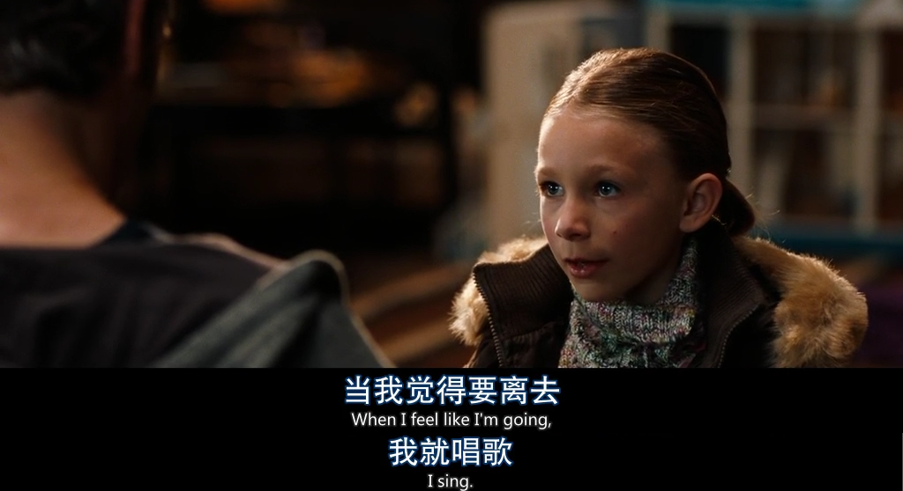
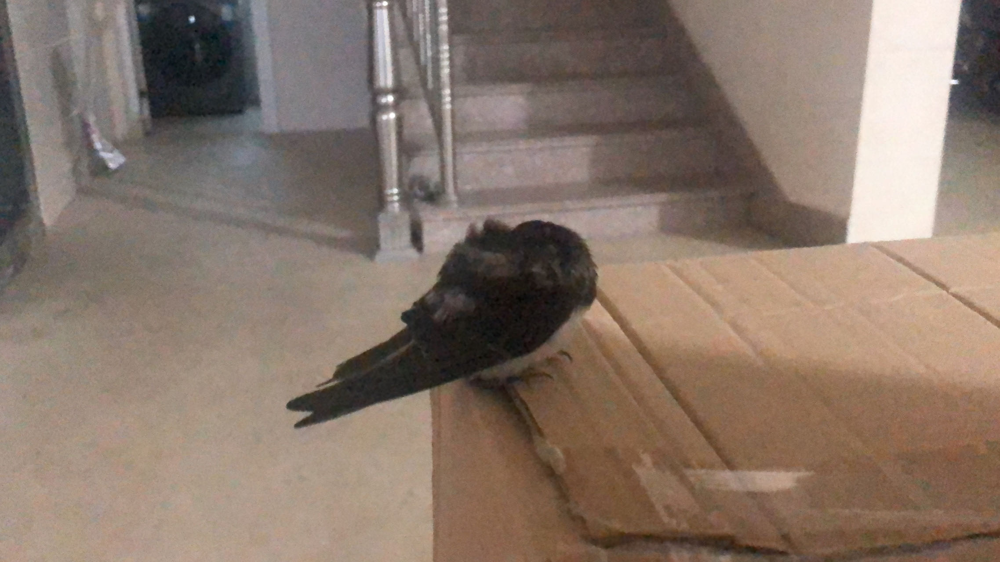
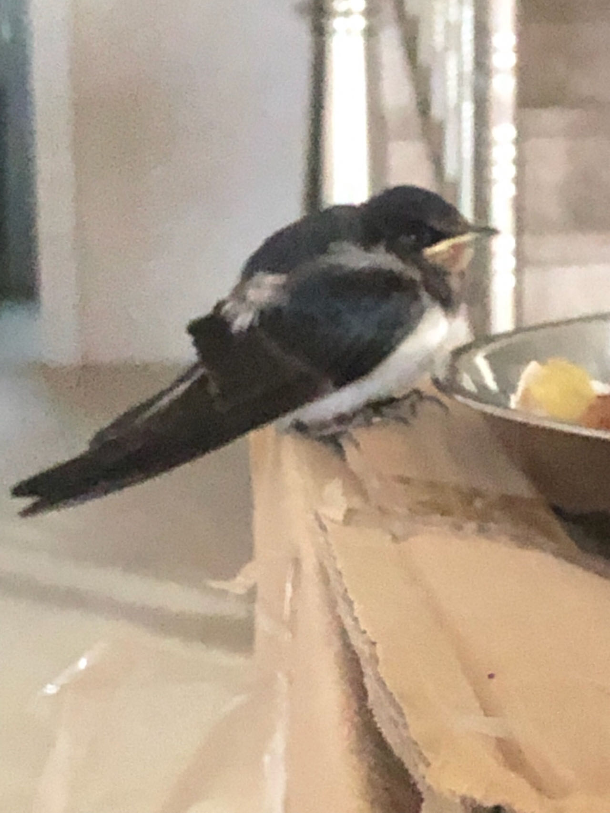
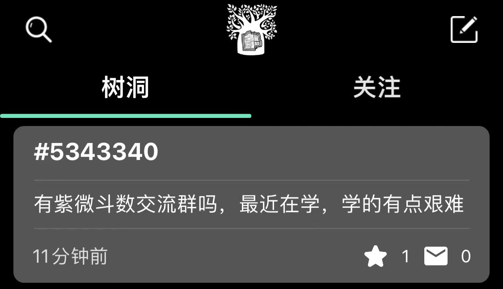

贺卡，燕子和电子云

Created: 2023-07-16T17:52+08:00

Published: 2023-08-15T17:36+08:00

Categories: Fragment

[toc]

# 贺卡

翻日记，看到高三时候班级举行过随机互赠贺卡的活动，对于这件事我只有一点点模糊的印象，也没办法想起来自己写了什么在贺卡上。日记里，我通过字迹认出了我收到的贺卡的主人，但是却没记下贺卡上的内容……

结果是我在大学毕业后加了我高中同学，也就是贺卡主人的微信好友。

下午草稿纸用完翻箱倒柜找新的时候，看到了高中的一些本子和纸张，因为比较节俭和怀旧，所以高考完留下了它们。
里面有我高一时班主任要求书写并上交的周记、歌词本、语文化学等学科笔记……甚至还有语文补差材料（我是多么喜欢语文啊）我把它们全部都翻了一遍，还是没有找到那一张同学给的贺卡。我真的很想知道贺卡上写了什么，或许我以前也收到过贺卡，但是现在手头一张贺卡都没有。

要是问我回忆像什么，我会说，像[夏天握在手心里的冰块](https://music.163.com/#/song?id=188138)，清凉以后不可避免的融化带给人灼烧的痛觉。那些平时看起来微不足道的时刻，在一段时候后才能体会到它的宝贵。

<iframe frameborder="no" border="0" marginwidth="0" marginheight="0" width=330 height=86 src="https://music.163.com/outchain/player?type=2&id=188138&auto=0&height=66"></iframe>

# 两班倒

电线上的燕子，好像五线谱上的音符啊，不过这个比喻已经被太多人使用了。

随着年龄的增长，看到燕子想到的东西也不一样，小时候可能想到的是燕子的尾巴很像剪刀，现在想到的是两句歌词：「如燕盘旋而来的思念」、「燕如针线，在晴空缝编」。

早上起来燕子比较多，到了晚上空中飞的就是蝙蝠了，看起来有点像「两班倒」，好玩的是让我想起堂姐上次烧烤时说过的话，那是快黄昏时候，苍蝇总在伺机降落在食材上，而到了晚上，苍蝇就换成了蚊子，准备落在人的身上——苍蝇和蚊子也是「两班倒」。

自五年级到现在，总有燕子落在家后面的电线上，最多的时候有四十余只，有时还会落在牵的网线上：

<iframe src="https://player.bilibili.com/player.html?aid=786339882&bvid=BV1414y1X7ay&cid=1206029965&page=1&high_quality=1&danmaku=0&autoplay=0" allowfullscreen="allowfullscreen" width="100%" height="500" scrolling="no" frameborder="0" sandbox="allow-top-navigation allow-same-origin allow-forms allow-scripts"></iframe>

看着燕子，或许我见过它们的上一辈甚至上上辈？

> 我小的时候，北京不但有城墙，还有很多古老的院子——我在教育部院里住过很久，那地方是原来的郑王府，在很长时间里保持了王府的旧貌，屋檐下住满了燕子。傍晚时分，燕子在那里表演着令人惊讶的飞行术：它以闪电般的速度俯冲下来，猛地一抬头，收起翅膀，不差毫厘地钻进椽子中间一个小洞里。一二百年前，郑王府里的一位宫女也能看到这种景象，并且对燕子的飞行技巧感到诧异——能见到古人所见，感到古人所感，这种感觉就是历史感。
> —— 王小波 · _北京风情_ · 我的精神家园

# [Time Traveler](https://movie.douban.com/subject/1885124/)

<!--  -->

好神奇啊，sing 就可以控制时间在自己身上的流动吗，这算是一种隐喻吗？

我只觉得自己听歌和唱歌的时候时间过得很快，完全控制不住呐。

# 一切在人

> 就我所见，一切环境问题都是这么形成的：工业不会造成环境问题，农业也不会造成环境问题，环境问题是人造成的。知识分子悲天悯人的哀号解决不了环境问题，开大会、大游行、全民总动员也解决不了这问题。只要知道一件事就可以解决环境问题：人不能只管糟蹋不管收拾。收拾一下环境就好了，在其中生活也能像个体面人。
>
> ——王小波 · _环境问题_

我记得张雨生也提到过，一切在「人」。

# 名字背过又忘记

> 名字背过又忘记 符号充满了神秘
> —— 张雨生 · _玫瑰的名字_

想起《你的名字。》里，泷极力想要记住三叶的名字，最后还是忘记了，实在是太虐了。

# 远来的朋友

台风期间，有只燕子飞到家里来躲雨，在我从北航邮回来的纸箱上睡了一会。

<!--  -->

<!--  -->

后来看到《我是一棵秋天的树》：

> 我是一棵秋天的树 稀少的叶片显得有些孤独
> 偶尔燕子会飞到我的肩上 用歌声描述这世界的匆促
> 我是一棵秋天的树 枯瘦的技干少有人来停驻
> 曾有对恋人在我胸膛刻字 我弯不下腰无法看清楚
> 我是一棵秋天的树 时时仰望天等待春风吹拂
> 但是季节不曾为我赶路 我很有耐心不与命运追逐
> 我是一棵秋天的树 安安静静守着小小疆土
> 眼前的繁华我从不羡慕 因为最美的在心不在远处
> —— 许常德

一整首词都很感人，不过我从来没见到过燕子停留到树上。

燕子分布非常广，北航体育馆也里有一个窝。

<!-- <video controls
    src="./swallow-in-BUAA.mp4">
video not supported
</video> -->

<video controls
    src="https://raw.githubusercontent.com/rfhits/blogs/main/Fragment/card%2Cswallow-and-electron-cloud/swallow-in-BUAA.mp4">
video not supported
</video>

一只南方的燕子停留在来自北方的纸箱上，让想起我张雨生的《远来的朋友》，人和燕子在这一点上也有类似的地方吧。

> 我爱默默在飞霞里想像历史的轨辙
> 总而言之光阴如梭百年终成一页纸张
>
> —— 张雨生 · _远来的朋友_

<iframe src="https://player.bilibili.com/player.html?aid=307843855&bvid=BV1PA411o7oK&cid=964571804&page=1&high_quality=1&danmaku=0&autoplay=0" allowfullscreen="allowfullscreen" width="100%" height="500" scrolling="no" frameborder="0" sandbox="allow-top-navigation allow-same-origin allow-forms allow-scripts"></iframe>

# 书和人

> 在我们年轻时，每一年的经历都能写成一本书，后来只能写成小册子，再后来变成了薄薄的几页纸。现在就是这样一句话：读书、写作。一方面是因为我们远离了动荡的年代，另一方面，我们也喜欢平淡的生活。对我们来说，这样的生活就够了。
> ……
> 人生在世，就如一本打开的书，我们更希望这本书的主题始终如一，不希望它在中途改变题目——到外文化中生活，人生的主题就会改变。
> —— 王小波 · _写给新的一年（一九九六年）_

> 就像把心爱的书搁置在墙角
> 慢慢会忘掉
> —— 张雨生 · _我轻易地结束了一段感情_

# 京吹

事情的起因是这样的，看到关注的博主一篇文章：[吹响悠风号 合奏比赛篇](https://tianxianzi.me/2023/08/05/hibike/)

我忽然想起来好像在哪里看到过「吹响」这个词，想起来是一张头像，高光、颜色、线条……真的很难不让人好奇它的出处：

<!--  -->

第一次看到简介只觉得是一部普通的动漫，再看到博主的文章才能体会到它的特别。

原来高二听前桌聊过的《利兹与青鸟》也是京吹系列的。

> 质疑久美子、理解久美子、成为久美子.jpg
> ……
> 但是作为吹吹人怎么能不看呢，活的！会动的久美子！

二次元，真是美好又可怕。

# 明星与癫狂

观 tfboys 有感：

> 最古怪的是在万人会场里挤满了人，等某位明星上台去讲几句话，然后就疯狂地鼓掌。这使我想起了“文革”初的某些场景。
> 我相信，假如有位明星跑到医院去，穿上白大褂，要客串一下外科医生的角色，肯定会有影迷把身体献上任她宰割，而且要求不打麻药；
> 假如跳上民航的客机要求客串机长，飞机上肯定挤满了把生死置之度外的影迷，至于她自己肯不肯拿自己的生命来冒险，则是另一个问题。
> 总而言之，在我们这个社会里，也开始出现了针对明星的癫狂，表面上没有美国闹得厉害，实际上更疯得没底。这种现象使我陷入了沉思之中。
> —— 王小波 · _明星与癫狂_

# 紫微斗数

大半夜逛树洞，发现一条有意思的帖子：

<!--  -->

最近常听专辑《雨后星空》，我马上想到《咪咪》里的歌词：

> 你看世上许多红男绿女 悲喜情史总在涕泪纵横里缠紧
> 你的太阳星座在哪里 他的狮子合不合我的水瓶
> 还有**紫薇斗数**扑克妙算名人讲座专书 指导如何举止言行
> —— 张雨生 · _咪咪_

<iframe src="https://player.bilibili.com/player.html?aid=673696488&bvid=BV1CU4y1578f&cid=359403601&page=11&high_quality=1&danmaku=0&autoplay=0" allowfullscreen="allowfullscreen" width="100%" height="500" scrolling="no" frameborder="0" sandbox="allow-top-navigation allow-same-origin allow-forms allow-scripts"></iframe>

不得不说，听歌的一大乐事就是把歌词和现实关联起来（当然也可能是悲事）。

# 电子云

午休时候打雷了，隆隆隆地吵，慢慢想起来高中化学里说雷电会产生 $O_3$。
提到 $O_3$，慢慢地想起它的大 Π 键，几个电子在杂化轨道里跑来跑去，「电子云」这个词也浮现出来。
外面打雷、放电的云层，感觉就像一群不安分的电子在云里跑来跑去。

吵得我想，要是有《西游记》里的葫芦就好了，直接把这堆云层水汽、雷公电母给它收进去。
葫芦娃里七娃的法宝也是受了《西游记》的启发吗？
