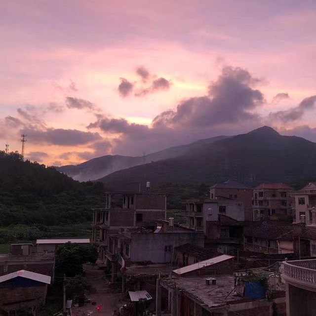
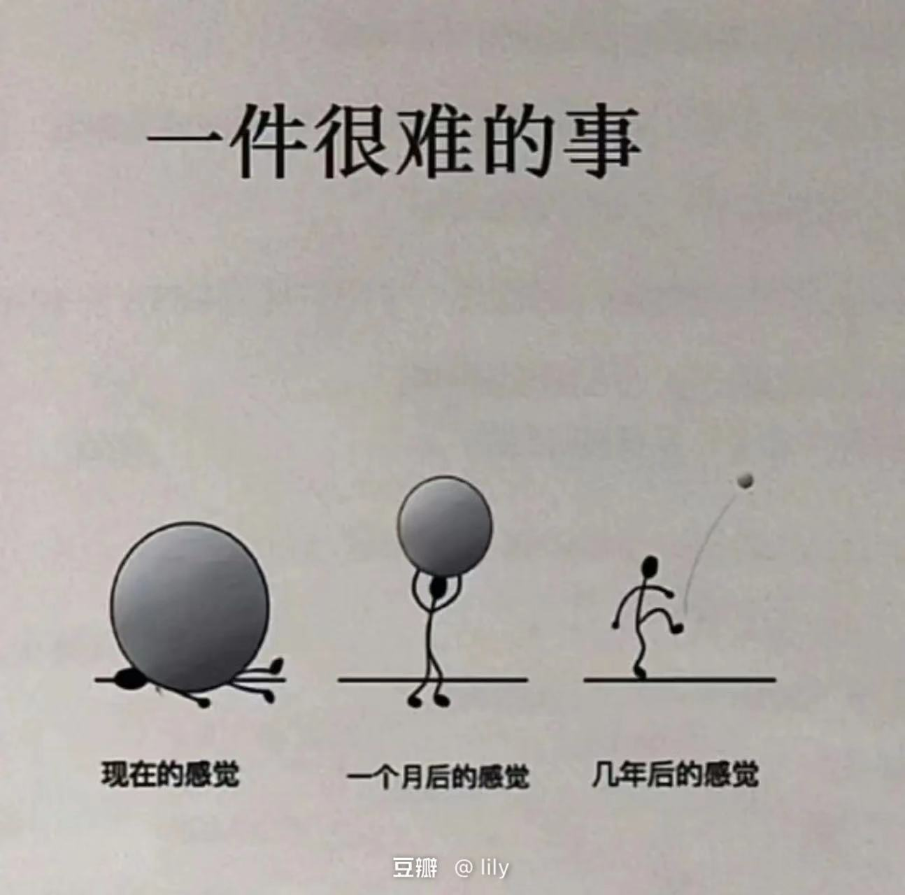
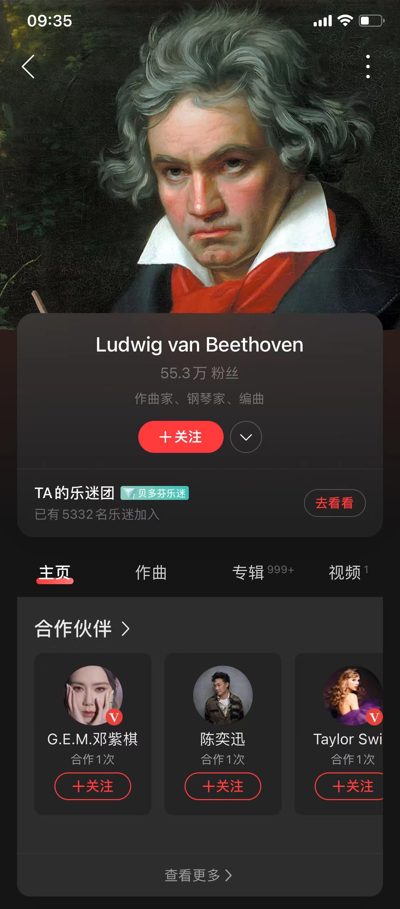

相思，黄昏和星星

Created: 2023-06-27T09:26+08:00

Published: 2023-07-15T19:29+08:00

Categories: Fragment

Tags: Diary

[toc]

# 成长中忽然意识到的事

昨天拜访亲戚，想起自己在某一天忽然意识到，所有亲戚给的礼物，包括过年的压岁钱、上门带的礼物，未来都是要“还”回去的，自己小时候只顾着高兴拿压岁钱了。

# 一整个世界

起因是去亲戚家给妹妹借书，同时也为自己借了一本七年级的书，里面有一篇文章叫做《[散步](https://baike.baidu.com/item/%E6%95%A3%E6%AD%A5/2672005)》，大概内容是作者带母亲、妻子和孩子一块去散步，最后一段是这样的：

> 我决定委屈儿子，因为我伴同他的时日还长。我说：“走大路。”
>
> 但是母亲摸摸孙儿的小脑瓜，变了主意：“还是走小路吧。”她的眼随小路望去：那里有金色的菜花，两行整齐的桑树，尽头一口水波粼粼的鱼塘。“我走不过去的地方，你就背着我。”母亲对我说。
>
> 这样，我们在阳光下，向着那菜花、桑树和鱼塘走去。到了一处，我蹲下来，背起了母亲，妻子也蹲下来，背起了儿子。我的母亲虽然高大，然而很瘦，自然不算重；儿子虽然很胖，毕竟幼小，自然也轻。但我和妻子都是慢慢地，稳稳地，走得很仔细，**好像我背上的同她背上的加起来，就是整个世界**。

晚上读到最后一句的时候，我感觉非常熟悉，但是想不起来在哪儿见过。
我还有一个奇怪的习惯（最近正在改正），就是半夜如果醒来脑子里会放歌，越放越精神的那种，今晚（早）的歌曲是张雨生的《[一想到你呀](https://www.bilibili.com/video/BV1zQ4y1q783?p=4)》，里面写：

> 一想到你呀 就让我快乐
> 就好比猕猴呀 穿梭树林的轻松
> 像阿妈 牵起了童年
> 牵起了我呀 和**一整个世界**

感觉写作这种事情，会有殊途同归的时候。

# 蛋泥儿：音乐就是我的精神家园

> 当如年少时常有的，将自己关在屋中，关上灯，戴上耳机闭上眼睛，听着音乐在屋中打转，久违的感觉再次涌上心头。音乐就是我的**精神家园**，让我可以忘掉一切尘世的烦扰，可以让我的心里世界没变太多。如今，书写完了，我也要回归关心“炒过芥菜几棵”、“家里老幼怎么”的生活了。
>
> ——_[蛋泥儿君：我写的书《张雨生:1994 创作辑》上市了！](https://mp.weixin.qq.com/s/hRQz7WhIUdb8K0eM0McwJQ)_

# 高三日记

从市区回到乡下，第一次也是迫不及待地翻出近五年前的日记。写日记的意义不仅仅在当下，还在于未来（不过要往回看才会有意义，写了就放在柜子里是非常可惜的）。

日记里有很多快乐的事情，我在那时候就已经会和舍友主动回忆一天中有趣的事，再写到本子上（这种记录快乐的方法可不需要谁去教导），有不少文字都是熄灯后就着卫生间的「[小黄灯](https://y.music.163.com/m/song?id=187881)」写下的。除此以外，日记里还有悲伤、沮丧和感动，但最让我感慨的，是在那个情窦初开的年纪里，高中生那种浑然天成的纯情悸动（诸位亦可以称之为狗血与八卦，我相信连老师都八卦得很），那种东西，甚至连 in-love obsession 都算不上！

过去的事、现在的事、还有书里的话，交织碰撞在一起，带给人全新的体会。

男人真是善变的生物，让我想起张雨生的话：

> 因为你的言之有理，让身为男性的我很难告诉你，**其实我的症状比较轻微**。

note. 我现在还是 get 不到，什么叫「症状比较轻微」啊？

> 我只知道，未来是现在的累积，我们把握住存在的好时光，便掌握开启那三座城堡（还记得吗？沉默、知识、志勇）[^1]的钥匙。奋战不懈屡败屡战的精神是必要的，盔甲武士第一次跟火龙挑战时，也被烧成火烤人臀而逃之夭夭。**重要的是在过程中，我们才获得了自信与遭逢横逆的抗压力。就让我们举起葡萄美酒，让杯缘轻轻碰撞，「锵」的一响，仰头一饮而尽，所有苦闷惆怅。**

# 月光

月光直接照在我的床上，窗外只有蟋蟀的叫声，虽然是夏天，却让人想起张雨生的《子夜抒怀》：

> 好一阵山风
> 好一轮秋月
> 好一个梦般子夜
> 细忖我们的是非
>
> 好远的市嚣
> 好近的天籁
> 好一程寄旅人生
> 邂逅我们的情怀

# 《想你》

<iframe src="https://player.bilibili.com/player.html?aid=721327310&bvid=BV1zQ4y1q783&cid=430376383&page=16&high_quality=1&danmaku=0&autoplay=0" allowfullscreen="allowfullscreen" width="100%" height="500" scrolling="no" frameborder="0" sandbox="allow-top-navigation allow-same-origin allow-forms allow-scripts"></iframe>

> 說情話 把情話
> 說得甜就讓你快樂
> **言語淺不如人意深**
> 天花亂墜又如何
>
> **海多深 海非深**
> 比起相思不算什么
> 即使隔在两个地方
> 抬头看 有**欧里昂**
>
> 总是七上八下
> 总是层层复杂
> 然而忽左忽右
> 叫我摸不清方向
>
> 想你成一道轨迹
> 弯弯曲曲没道理
> 一笔一笔看似绢细
> **却相思绵绵无绝期**
>
> 想你成一个球体
> 滚来滚去不能停
> 四方八面全都是你
> **多情却似总无情的眼睛**
>
> —— 张雨生 · _想你_

「言语浅不如人意深」来自刘禹锡的《视刀环歌》：

> 常恨言语浅，不如人意深。
>
> 今朝两相视，脉脉万重心。

「海多深 海非深 比起相思不算什么」来自白居易的《浪淘沙·借问江潮与海水》：

> 借问江潮与海水，何似君情与妾心？
>
> 相恨不如潮有信，相思始觉海非深。

「相思绵绵无绝期」来自白居易的《长恨歌》最后一句：

> 天长地久有时尽，此恨绵绵无绝期。

「多情却总似无情的眼睛」来自杜牧的《[赠别二首之二](https://zhidao.baidu.com/question/1253478)》:

> 多情却似总无情，唯觉樽前笑不成。
>
> 蜡烛有心还惜别，替人垂泪到天明。

欧利昂指的是猎户座（Orion），《这一年这一夜》里有歌词：「猎户星在前方亮」。

即使是这四处，我也是在几天内逐渐发现的，过程大概是：

1. 这一句写得不错
2. 让我搜索一下看看别人怎么评价的
3. 原来是引用/化用啊
4. 欸那一句写得也不错
5. 回到 2

# 日落，黄昏，向晚

> 你笑的一厢情愿
> 绝版的明信片
> 恍惚置我于诸神的纪元
> 谁不在等待他的贝德丽采
> 清秀的佳人在**日落**尽处重现
>
> —— 张雨生 · _发晕_

> 在**黄昏**融化了世界的色彩以前 我们的情绪达到至美的极限
> 当月光歌颂著绝伦的天上诗篇 我们的欢乐涌现节日的境界
>
> —— 张雨生 · _在黄昏融化了世界的色彩以前_

> 阳台如是说
> 约莫**向晚**的时候
> 来呼吸爱的起落
>
> —— 张雨生 · _爱过了头_

<!--  -->

黄昏时候在楼顶看到一架飞机，和平时看到的不太一样，在地上就能看见机身被夕阳镀了一层金色。很羡慕日出和日落时候在飞机上的人，可以直接看晨曦和晚霞。把视角拉远，从宇宙的尺度上看，人和飞机都是宇宙里非常小的点。

> 我裹着被子，想到自己是一个人在这间大房子里，房子在空旷安静的废墟里，废墟在雪野之中，四面荒茫……这是在阿尔泰深山中，阿尔泰在地球上，地球在太阳系里，而整个太阳系被银河系携裹着，在浩瀚宇宙中，向着未知的深渊疾驰而去……
>
> —— 李娟 · _阿勒泰的角落_ · 我们的房子

# 星星

> 2018 年 10 月 1 日 星期一 晴 八月廿二
>
> 洗完澡，听了会儿歌，看了会星星，不得不说，天上星星真多，要是他们有生命，有思想那一定很神奇，毕竟他们也算得上老～老古董了。

最近经常看星星，市区里~~几乎~~没有这样的机会。

<iframe frameborder="no" border="0" marginwidth="0" marginheight="0" width=330 height=86 src="https://music.163.com/outchain/player?type=2&id=5241551&auto=0&height=66"></iframe>

<!--  -->

金星在西方，她就是「夜空中最亮的星」。
北斗七星在西北方，是大熊座的尾巴。

《这一年这一夜》里说：

> 猎户星在前方亮 **双熊盘踞北极光**
> 春分时候无际穹苍银河舞会星宿忙

《有一道彩虹》里说：

> 从你的唇开始初春的夜空
> **天枢天璇天玑天权天衡开阳瑶光**

七星里我最喜欢「玉衡」和「瑶光」这两个名字。
《原神》[^2]里刻晴自称为「七星之玉衡」，游戏里还有个地点叫做「瑶光滩」。

（啊，这是什么戏痴发言？鉴定为：

# 一件很难的事

看自己的高三日记有感：

<!--  -->

转自 https://www.douban.com/people/162800159/status/4292509920/

# 勇猛又胆怯

> 好像突然有了软肋，也突然有了铠甲。
>
> —— [什么是爱？爱一个人是什么感觉？ - 安也闲的回答](https://www.zhihu.com/question/20875474/answer/16603385)

> 在幸福的瞬间 我感觉伟大却又卑微 在绝望的边缘 虽跌宕仍有信念
> 在最爱的面前 我感觉勇猛却又胆怯 在你的凝视下 胜利也等于投降
>
> —— 张雨生·_[说的再多你也不了解](https://www.bilibili.com/video/BV1zQ4y1q783?p=35)_

# 合作

天呐……贝多芬棺材板都压不住了

<!--  -->

[^1]: [盔甲骑士：为自己出征](https://book.douban.com/subject/26728923/)
[^2]: 《原神》是由米哈游自主研发的一款全新开放世界冒险游戏。游戏发生在一个被称作「提瓦特」的幻想世界，在这里，被神选中的人将被授予「神之眼」，导引元素之力。你将扮演一位名为「旅行者」的神秘角色，在自由的旅行中邂逅性格各异、能力独特的同伴们，和他们一起击败强敌，找回失散的亲人——同时，逐步发掘「原神」的真相 `:)`
