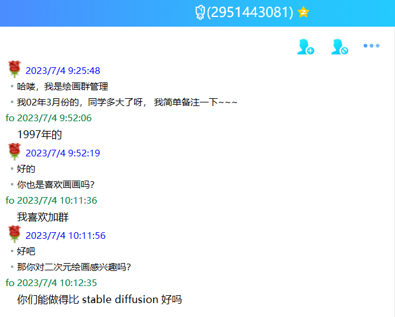

秋分小记

Created: 2023-09-26T09:17+08:00

Published: 2023-10-08T19:41+08:00

Modified: 2023-10-08T22:49+08:00

Categories: Fragment

Tags: Diary

[toc]

# 秋天的树

很感动还有那么多音乐人能记得张雨生。

<!--  -->

# 如果你冷

真希望自己像一团永远燃烧的火，不断给周围的人光和热。
就像《如果你冷》里唱的那样，「如果你冷/我会将你拥入怀中」。
可是就连太阳也会有熄灭光芒的那一天。

<iframe src="https://player.bilibili.com/player.html?aid=739034305&bvid=BV1Sk4y1x7BY&cid=1068950358&p=1&high_quality=1&danmaku=0&autoplay=0" allowfullscreen="allowfullscreen" width="100%" height="500" scrolling="no" frameborder="0" sandbox="allow-top-navigation allow-same-origin allow-forms allow-scripts"></iframe>

「温柔而坚定」

<iframe src="https://player.bilibili.com/player.html?aid=234127568&bvid=BV1n8411C7hL&cid=1287122972&p=1&high_quality=1&danmaku=0&autoplay=0" allowfullscreen="allowfullscreen" width="100%" height="500" scrolling="no" frameborder="0" sandbox="allow-top-navigation allow-same-origin allow-forms allow-scripts"></iframe>

虽然不是焦安溥粉丝，但是她应该是很好的人；
虽然有点唱不上去 + 错词，但是无伤大雅，听起来开心就好（为什么听到她唱不上去我还觉得很好玩甚至直接笑了出来，是联想到唱雨生歌时候的自己吗？

哈哈哈，听到吃力和错词就会觉得是非常真实的 live。

# Say Goodbye

在 1992 年发行的专辑《大海》里，张雨生唱了首《I Don't Wanna Say Goodbye》，后来在自己 1994 年的专辑《卡拉 OK 台北我》里又唱了《我期待》。

有种遥相呼应的感觉，再怎么不想，最后还是说了 Goodbye。

想到有些事情也是这样，尽管一开始有多么不情愿，最后还是在纠结和徘徊中主动选择离开。

# 如此爱你

> 还有我。我是爱你的，看见就爱上了。
> 我爱你爱到不自私的地步。就像一个人手里一只鸽子飞走了，他从心里祝福那鸽子的飞翔。
> 你也飞吧。我会难过，也会高兴，到底会怎么样我也不知道。
> —— 王小波 · _爱你就像爱生命_ · 爱你就像爱生命

> 飞鸟爱上飞鸟，不是自由。
> 天空爱上飞鸟，才是拥有。
> 允许你来，允许你走。
> 我的爱，就这么无怨，这么无忧。
> —— 扎西拉姆·多多 · _如此爱你_

此处悄悄吐槽，某友人说王小波「好舔啊」，哈哈，自己还为[爱情流泪](https://music.163.com/song?id=185937)呢。

# 姊妹

最近逛 B 站，看到关于张雨生《姊妹》的两个版本，一个在专辑《如燕盘旋而来的思念》里，一个在张惠妹的《姊妹》专辑中，
评论提到一句非常感人的歌词：

> 当我终于能站在世人前面 唱着我们的共同心愿
> 我想你一定为我留下眼泪 Oh yeah 这也是我的感觉

让人联想起他的独白：

> 很难想象，这样一个爱唱歌的女孩，从此不能再开口唱歌；这样一个热情的女孩，从此就失去她的温度。
> 妹妹活的时候，带给我很多欢乐时光。
> 妹妹离开这个世界，则带给我「要活就要活得丰富」的启示。
> 现在的我比过去的我，对生命有着更宽阔的眼光与更乐观的态度。
> —— 张雨生 · _[我的童年往事](https://www.douban.com/note/116247217)_

逛互联网也看到类似的文字：

> 第一张自己买的 CD 来自于张雨生，一发而不可收拾。从一张张的碟，到后来网络发达了，各种挖他所有的歌，才懂得他的深刻。据说他选择唱歌是为了早逝的妹妹张玉仙，因为妹妹爱唱歌，他曾说：“我妹妹的猝死，把我从不知人间疾苦的儿童乐园，一脚踢进生老病死的成人世界。”所以终于他唱着：“当我终于能站在世人前面唱着我们的共同心愿，我想妳一定为我流下眼泪，这也是我的感觉。”**这也是我们的感觉**。
> —— Elaine · _[张雨生：你正颔首告知，这里有爱](https://mp.weixin.qq.com/s/iZ7q9Pa2ZTPbUjynqemlzA)_

# 日记一则（有删改）

2019 年 5 月 25 日 周六 阴 四月二十一

不知不觉，又写完一本日记本了，从 9 月 14 日左右算起起，这是我这辈子坚持地最长的事了。

时间就是这么快，一下就（距离高考）十二天了，我带着一丝慌张写下这些文字。

百度了唐寅的“桃花”那首诗，靠后二句，不见五陵豪杰墓，无花无酒锄作田。在极力表现隐居、闲适生活的美好。
其实把这首诗写红布条上也挺好的。

我还下载了《二泉映月》，阿炳的，据说时的小泽征尔（是叫这个吧？）听时，突然跪下，说这曲子应该跪着听，看来我们还太年轻。

想想以后，推开门看见一群同学埋头学习的场景就见不到了，有些伤感，未来总是充满可能。

晚安。

# 你们能做得比 Stable Diffusion 更好吗？

感觉三个月前的自己好无聊啊。

曾经在微博上看到过这样的论调，机器应该把人类从枯燥的重复劳动中解放出来。
也就是说，人应该去创造艺术，让机器去劳作，但是现在看起来好像反了。

<!--  -->

当时可以说几乎所有 NLP 相关的毕业设计，都可以被一句话呛死：你们能做得比 ChatGPT 更好吗？

# 月亮的歌

睡前想到高中老师在朋友圈的月亮图片，配文是许美静唱的《城里的月光》——「城里的月光把梦照亮」。
虽然家不在城里，但是在院子里看月亮的时候也曾经想到过这首歌。
于是在脑海里查找了一下和月亮相关的歌曲，有张雨生的《带我去月球》、《快乐星球》片尾曲《月亮船》、张宇和萧十一郎的《都是月亮惹的祸》与房东的猫的《八月十五》（哈，写的时候发现还有《当时的月亮》
数一数题材，环保、童真、爱情和亲情都有了。

月亮有这么多寄托，我最喜欢《带我去月球》的那种豁达，社会的生产力在发展，但是大部分人过得好像还不如过去的人幸福，用「不求轩不求冕」的态度，「背向地球希望寄托整个宇宙」。
高中时候还喜欢《都是月亮惹的祸》，真是纯真的情愫。

<iframe src="https://player.bilibili.com/player.html?aid=75844892&bvid=BV1pJ411U7u8&cid=129748347&p=1&high_quality=1&danmaku=0&autoplay=0" allowfullscreen="allowfullscreen" width="100%" height="500" scrolling="no" frameborder="0" sandbox="allow-top-navigation allow-same-origin allow-forms allow-scripts"></iframe>

# 催婚？

刷脱单社交软件是不是赛博相亲啊，听完 [podcast](https://mp.weixin.qq.com/s/H87zemlV6xzLUZ_gmtSK9g)，颇有针尖对麦芒之感。

想起一位同学的签名是「I love myself」，太佩服了。

# 野鸭和喜鹊

最近看的书是《沙乡年鉴》，英文名「A Sand County Almanac」，自然辩证法这门课的作业。
想到自己也是那种非常喜欢自然的人。

从小接受的教育是家养的鸭子不孵蛋，但是没有想到北航的鸭子竟然能够自己繁衍，真是神奇。还有软微草坪上一起洗澡的两只喜鹊，不知道是情侣、夫妻，还是朋友……？（多选题）

鸟儿真是太好了，「我不想舒舒服服只要自由自在」。

<iframe src="https://player.bilibili.com/player.html?aid=742092097&bvid=BV16k4y1p781&cid=1158055509&p=1&high_quality=1&danmaku=0&autoplay=0" allowfullscreen="allowfullscreen" width="100%" height="500" scrolling="no" frameborder="0" sandbox="allow-top-navigation allow-same-origin allow-forms allow-scripts"></iframe>

<iframe src="https://player.bilibili.com/player.html?aid=789136800&bvid=BV1JC4y1o7r6&cid=1286815902&p=1&high_quality=1&danmaku=0&autoplay=0" allowfullscreen="allowfullscreen" width="100%" height="500" scrolling="no" frameborder="0" sandbox="allow-top-navigation allow-same-origin allow-forms allow-scripts"></iframe>

# 积雨云

听了政大这几年的金旋奖主题曲，还是《积雨云》最好，这 MV 就是艺术品啊……
可能是有类似的经历，处于一种哭与不哭的边缘状态。

风、雨、云，让我想到一个成语：「友风子雨」

<iframe src="https://player.bilibili.com/player.html?aid=51937707&bvid=BV1j4411Y7CG&cid=90924441&p=1&high_quality=1&danmaku=0&autoplay=0" allowfullscreen="allowfullscreen" width="100%" height="500" scrolling="no" frameborder="0" sandbox="allow-top-navigation allow-same-origin allow-forms allow-scripts"></iframe>

# 听歌口味

一段时间以前，听不惯《永公街的街长》、《子夜抒怀》和《我的心在发烫》，尤其是蓝调。

后来慢慢地就被打动，「不可世俗斗量的情感」、「波浪聚合又散落」、「让我来为你/挑动心弦」

对音乐的感知能力，真的是会随着时间变化的。

# 后知后觉

马上就到 10 月 20 日了，1997 年的那天，张雨生发生了车祸，我也不止一个夜晚躺在床上幻想着穿越到那一天。

相比于周杰伦、林俊杰、陶喆，我丝毫不挂念自己最喜欢的歌手为什么不开演唱会，因为他早就在上个世纪离开了，他在自己演唱会上被点了一首自己写的歌，就高兴地不得了：

<iframe src="https://player.bilibili.com/player.html?aid=651549188&bvid=BV1Ue4y1A7da&cid=1000867132&p=1&high_quality=1&danmaku=0&autoplay=0" allowfullscreen="allowfullscreen" width="100%" height="500" scrolling="no" frameborder="0" sandbox="allow-top-navigation allow-same-origin allow-forms allow-scripts"></iframe>

有人说《后知后觉》是雨生写给妹妹的，不管怎样，不要做后知后觉的人。

---

最近北方入秋，秋雨送寒凉（想起高三一下秋雨就考试，烦死了），
南方也刮台风，偶然看到文章的朋友不管你身处何方、看到文章又是几时，记得保暖或者注意身体哦，love yourself。

如果你冷，我会将你拥入怀中~
