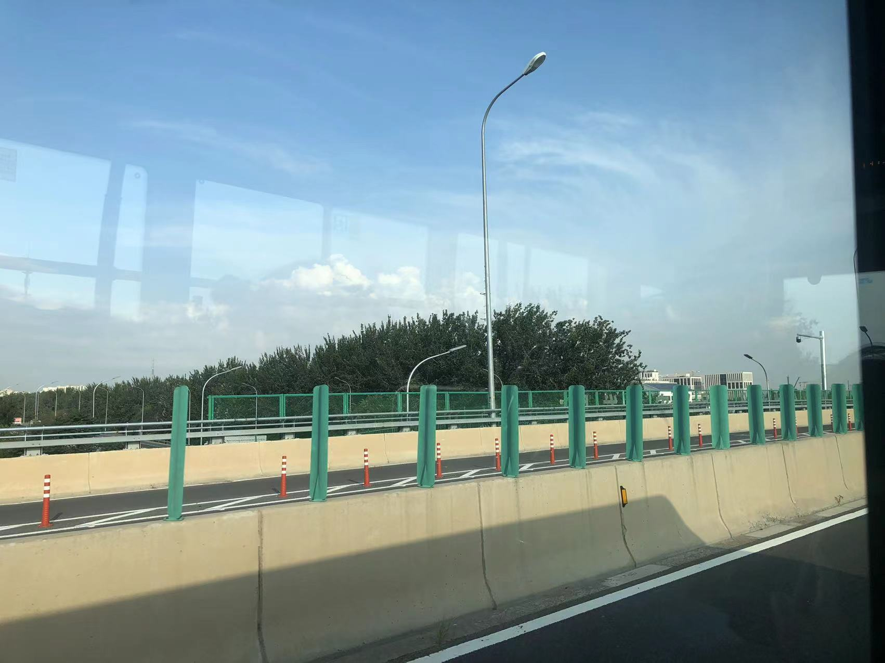
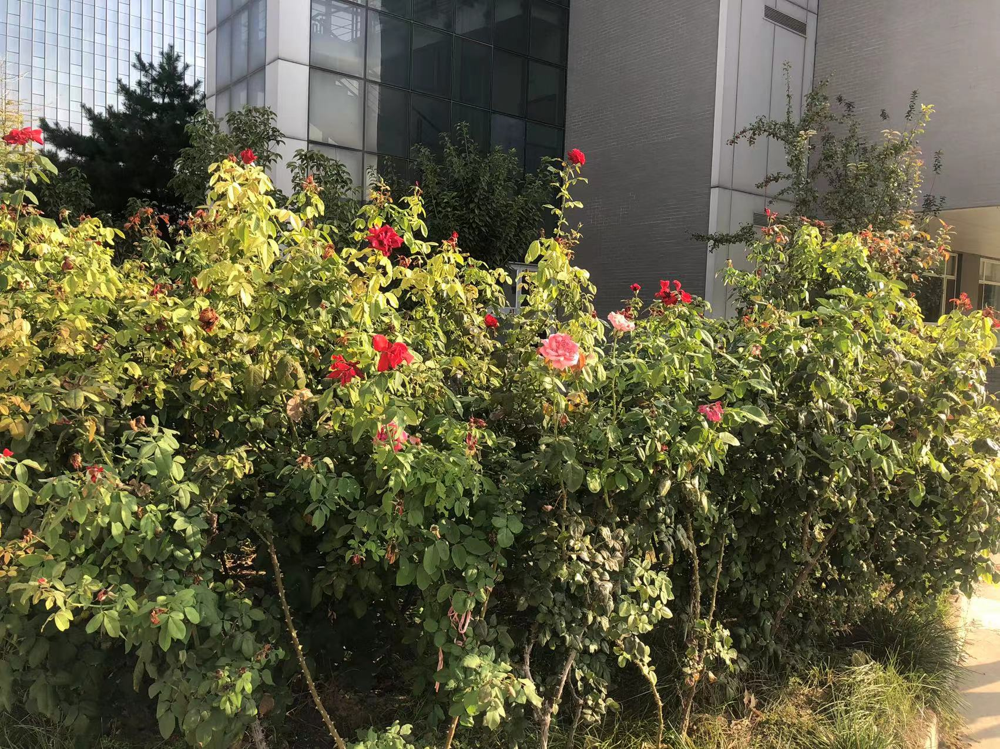

starry clouds

Created: 2023-08-19T19:04+08:00

Published: 2023-09-24T20:59+08:00

Categories: Fragment

[toc]

# 承诺久远

> 占有不是我们爱恋的终结
> 谁敢轻言他的承诺久远
> —— 张雨生 · _我会疯狂_

> 你曾经对我说 你永远爱着我
> 爱情这东西我明白 但永远是什么
> —— 罗大佑 · _恋曲 1980_

# 关于考差

高中日记，至今仍然会梦到考试：

> 2019 年 2 月 17 日 阴 周日 正月十三
> 不幸晚上，平均分我让给知道，627，比我高，我无语了。

> 2019 年 2 月 18 日 一直阴到晚自习下雨 正月十四
> 太可怕了，现在我每天早上一起来就会想到我数学就考了 116，总分 62x，理综看错题。真是太害怕了！

> 2019 年 4 月 13 日 周六 阴杂雨 三月初九
> 回想一天，下午的学生大会就像鞭尸一样，我仿佛省质检缺考。

Que sera sera...

# 爱是瘟疫

> 庇拉尔·特尔内拉告诉奥雷里亚诺，蕾梅黛丝已经作好结婚的准备，他意识到这个消息会给父母带来新的痛苦。但他还是选择面对现实。
> 何塞·阿尔卡蒂奥·布恩迪亚和乌尔苏拉被郑重其事地请到客厅，漠然听着儿子的宣告。但听到那未婚妻的名字时，何塞·阿尔卡蒂奥·布恩迪亚气红了脸。
> “**爱情是瘟疫**！”他咆哮着，“有那么多漂亮又正派的女孩，你偏偏要娶敌人的女儿。”
> —— 马尔克斯 · _[百年孤独](https://book.douban.com/subject/6082808/)_

> **爱是空气也是瘟疫**
> 爱 so sweet 爱 so shit
> 爱是诗人与神经病
> —— 张雨生 · _沉默之沙_ · [白色才情](https://music.douban.com/subject/26990935/)

马尔克斯另一本书，《霍乱时期的爱情》，英译「Love in the Time of Cholera」，太巧了。

# 游泳的鱼

软微偏僻的好处是，可以看到大兴机场起飞的飞机，在家里的时候没法看到那么大的飞机。
而看到天上的飞机，想起张雨生的《一天到晚游泳的鱼》，感觉蓝天就是任飞机遨游的海洋。

<iframe src="https://player.bilibili.com/player.html?aid=930188393&bvid=BV1rK4y1o7Gw&cid=335265238&p=1&high_quality=1&danmaku=0&autoplay=0" allowfullscreen="allowfullscreen" width="100%" height="500" scrolling="no" frameborder="0" sandbox="allow-top-navigation allow-same-origin allow-forms allow-scripts"></iframe>

# 学习态度

> 2019 年 4 月 20 日 周六 小雨 三月十六
>
> 今天是公务员考试的日子，也是我们去找那个湖南数学老师**找罪受**的日子。

> 2019 年 4 月 21 日 周日 阴 三月十七
>
> 老师讲了一早上的作文，押了许多题型，有教育现代化的，她下午讲古诗，结束时，**大家都很开心**。

# 爱没有别的愿望

有时感觉自己被一两句话深深地打动：

> 请你给我一个吻吧 我便不会再惧怕
> 我将贴身藏起酥麻 抛开所有的牵挂

> 除了成全自己，爱没有别的愿望。

> 当我跨过沉沦的一切
> 向着永恒开战的时候
> 你是我的军旗

> 更漫长的永昼来临以前
> 让我 趁着这些微的极光
> 看清妳被雪地晒红的脸

> 相愛容易相處難，否則婚姻怎會成為愛情的墳場？寬容與知足，為什麼要耗費幾十年的光陰才得以領略呢？

> 你淡淡看着我
> 笑我皱纹上额头
> 令我不敢偷看你光灿的面容

> 誰又想得透 絕美的悸動
> 只容剎那的擁有

# 月亮

> 太阳烧红了海洋 海洋包容了太阳
> 向晚天空缺掉一角 月亮探头撒张网
> 眼观鼻观心口上 你那羞涩不能忘
> 我的手臂不胜扭曲靠上你的肩膀
> —— 张雨生 · _这一年这一夜_

> 在我的怀里 在你的眼里
> 那里春风沉醉 那里绿草如茵
> 月光把爱恋 洒满了湖面
> 两个人的篝火 照亮整个夜晚
> —— 李健 · _贝加尔湖畔_

> 月光把天空照亮 洒下一片光芒点缀海洋
> 每当流星从天而降 心中的梦想都随风飘扬
> —— 高博 · _霞光_

张雨生用的是「撒网」的「撒」，其他二位用的是「挥洒」的「洒」。

# 积雨云

<!--  -->

看到厚厚的云就会想，会不会上面住着人呢？后来看了《天空之城》，云里面是城堡。最近还听了《积雨云》：

> 头顶著风 眼望著月
> 我住在积雨云的阴暗面
> 面对著光 背靠著电
> 看雨水流过母亲的容颜
> ……
> 头顶著风 眼望著月
> 等一场近在咫尺的闪电
> 你在这边 我在那边
> 云朵会原谅故乡的善变

写得太好了，古人就过说「云游四方」，只要不在家里，人就是云。
「等一场近在咫尺的闪电」，躺在云上看闪电，太酷了。

「花开此时，花落昨天」一开始不知道什么意思，今天开的花，应该明天才落啊，后来看到了校园里的花：

<!--  -->

# 美如星空

张雨生《雨后星空》名字和《浊水酒》歌词有什么关系吗？

> **纯真情愫美如星空** 当你执意这么做
> 痴到深处的结果 是不堪回首
> 热泪滚烫划破伤口 聚成了湖泊

人在北京，能看到的星星很少，最亮的是东方的木星，暑假在老家最亮的是西方的金星。

# 好久不见

最近见到好多高中同学，exactly the same:

> 好久不见一定是见面的第一句话
> —— 罗大佑 · _同学会_

来自同一故乡的云，在经历各种旅途后，有幸在北京「好久不见」。
