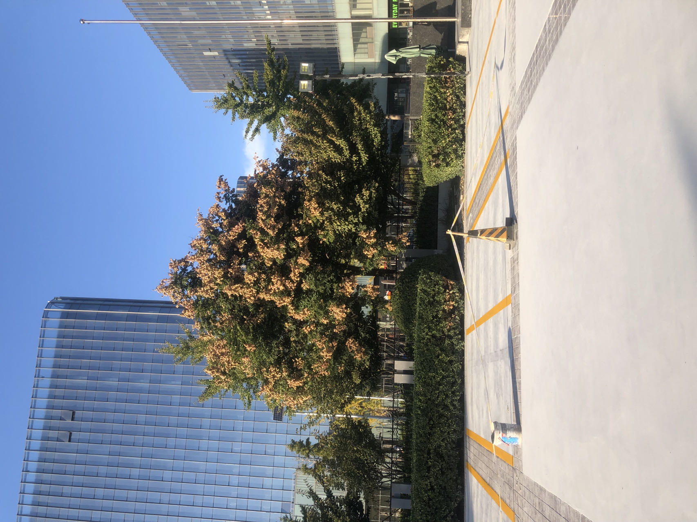
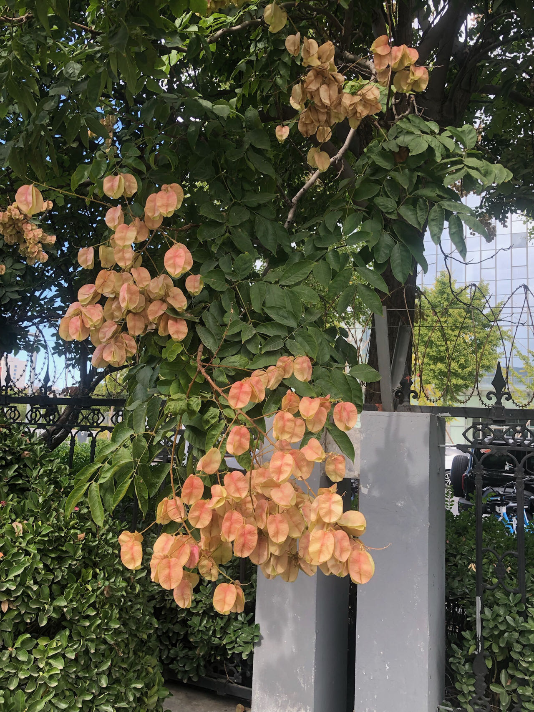
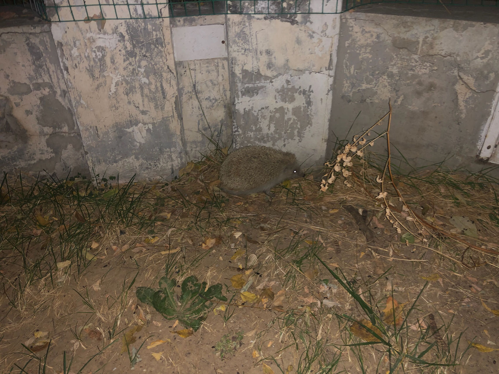
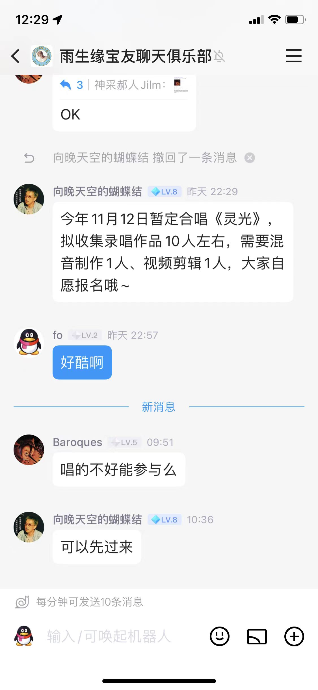

winter comes

Created: 2023-10-10T17:49+08:00

Published: 2023-11-09T21:53+08:00

[toc]

# 志愿活动

参加了一个志愿活动，是协助学工办老师整理文件，来之前不知道志愿内容，然后没有一点点防备地看到了很多过去的材料，在启封之前自己甚至抱着一丝激动，直到被卷入回忆的漩涡。

过去的记忆和现在交杂，好像看到过去的自己，刷题、跑步、引体向上，化学考得很好……

自己高一老师的签名、高三班主任和教导主任的章，高考填报志愿，本科毕业……

几年前的事，时间过得太快，对整个社会系统来说，一个人多年的经历可以被精简成很多张材料：
入团，高考填志愿、高中毕业，上大学，换一个地方考试再毕业，在毕业之前入党……

看着这些文件，有些还可以和自己四年多前的日记再对应上（比如体检和填志愿），
而几个月前（刚）写的毕业生自我鉴定，又再次回到我手里。
（脑海里不断回荡着《稻香》里的歌词：童年的纸飞机/现在终于飞回我手里）

这些自己四年半年前在两千公里外的家乡留下的字迹，虽然很丑，但是很难平静下来，真的。

就像雨生在《Cappuccino》里写的：

> 时间过得快 爱得太奇怪 回忆频频追撞悬浮的未来
> 有欢聚有分开有甜蜜有无奈
> 直到我们一再目送彼此消失于人海之外

给我带来更多思考的，是一些工作十几年后还来读 MEM 的人。
与之形成鲜明对比的是看起来几乎躺平、朝九晚五的学工办老师。

不可否认我看到的这些人很厉害，有字节跳动的小领导、小公司的经理，
但是到底什么是自己想要的生活，自己的本心是什么，快乐吗？

不知道过了很多年以后再听到《清白之年》里朴树唱的，「你得到你想要的吗」，那时的我（们）会得到肯定的答案吗？

<iframe frameborder="no" border="0" marginwidth="0" marginheight="0" width=330 height=86 src="https://music.163.com/outchain/player?type=2&id=500665335&auto=0&height=66"></iframe>

最后，以后这种志愿活动要少参加。

# 自然辩证法课堂摘录

上自然辩证法老师讲话摘录：

「曾经有个化学博士到美国拿全额奖学金，但是每天唉声叹气，美国人就问他怎么了，他说自己其实不喜欢化学，
美国人就很疑惑，不喜欢化学你来这里干什么，去做自己喜欢做的事啊」
「每天挑 20 分钟做自己喜欢的事情」
「把自己表达出来」

记下来是因为自己在看 Happier 的时候读过类似的内容。

# 九月初三

每每写日记到这一天，就会念诗：

「可怜九月初三夜，露似珍珠月似弓」

然后就会去查已经背过但是想不起来的上半句，并且顺带发现是「真珠」：

> 一道残阳铺水中，半江瑟瑟半江红。
> 可怜九月初三夜，露似真珠月似弓。
>
> —— 白居易 · _暮江吟_

# 欧利昂（Orion）

最近在听朴树的专辑《猎户星座》，巧合的是，前几天看到本科导员在朋友圈发了一张猎户星座的照片。
我也忘了自己为什么要听猎户星座，但是看到《平凡之路》和《清白之年》就在这张专辑中时，有些惊讶。
《平凡之路》在我上初中的某段时间特别火，舍友天天哼，可是我们那时候才是十二三岁的小屁孩啊？
然后初次听到《清白之年》就是自己最后一次课前三分钟了。

数学课代表那时还对语文老师说，我以为你点头就是默许放视频了，哈哈哈。

<iframe src="https://player.bilibili.com/player.html?aid=11797743&bvid=BV1kx411B749&cid=19481590&p=1&high_quality=1&danmaku=0&autoplay=0" allowfullscreen="allowfullscreen" width="100%" height="500" scrolling="no" frameborder="0" sandbox="allow-top-navigation allow-same-origin allow-forms allow-scripts"></iframe>

> 那些死去的人 停留在夜空
> 为你点起了灯
> —— 朴树 · _猎户星座_

> 一个冬天的下午，一觉醒来，不见了奶奶，我扒着窗台喊她，窗外是风和雪。
> “奶奶出门儿了，去看姨奶奶。”我不信，奶奶去姨奶奶家总是带着我的；我整整哭喊了一个下午，妈妈、爸爸、邻居们谁也哄不住，直到晚上奶奶出我意料地回来。这事大概没人记得住了，也没人知道我那时想到了什么。小时候，奶奶吓唬我的最好办法，就是说：“再不听话，奶奶就死了！”
> 夏夜，满天星斗。奶奶讲的故事与众不同，她不是说地上死一个人，天上就熄灭了一颗星星，而是说，地上死一个人，天上就又多了一个星星。
> “怎么呢？”
> “人死了，就变成一个星星。”
> “干嘛变成星星呀？”
> “给走夜道儿的人照个亮儿……”
> —— 史铁生 · _奶奶的星星_

> 離人揮霍著眼淚
> 迴避還在眼前的離別
> 你不敢想明天
> 我不肯說再見
> 有人說一次告別
> 天上就會有顆星
> 又熄滅
> —— 厉曼婷 · _离人_

用雨生的欧利昂结尾吧：

> 即使隔在兩個地方 抬頭看有歐里昂
> —— 张雨生 · _想你_

# 复习

复习了一会儿《卡拉 OK 台北我》，想想《口是心非》，真是鲜有专辑可以做到首首动人呐。

为什么张雨生的笑声这么有感染力啊？《[如果你冷](https://www.bilibili.com/video/BV1Sk4y1x7BY/)》后的「你们是一对吗？哈哈哈」、被点《蝴蝶结》时惊诧的欢呼……

他甚至笑一笑就能到 high C，真是天赋异禀。

# 重阳节和朋友

写日记到这一天，想知道五年前发生了什么，好在已经完成了高三日记的电子化，过去的日子好像触手可及。

发现自己在重阳节前一天晚上非常伤心，在洗衣物时候被舍友看出来了。
这个场景至今存在我的脑海里，平时只是在某一个角落安静地呆着，在某一个时刻好像附身到了另一个时空的自己，心情一下就穿越回到过去。
好像舍友就在旁边对我说：「你今天看起来有点惆怅」。
而被人安慰所带来的情绪起伏甚至远大于自己跌落谷底的那种感觉。
在情绪的低谷自己还不至于哭出来，但是被人安慰一下就会鼻子发酸。

后来看到张雨生填写的档案，他写道：「最感动的是：有人看出我的心事而安慰我」，真是深有体会。
不必看出心事，记得最近一次心情特别糟糕，选择和这位舍友安静地在操场旁，看着跑步的人，多多少少能缓解一些。

# 巴黎圣母院

做 2021 年的六级题目，看到了巴黎圣母院被烧的文章，隐隐约约好像自己在高中食堂的电视和《新闻周刊》上看过，不出所料果然是高三时候的事。
过去的日子倒真是像巴黎圣母院一样。

# 毕导毕业

高一在外校培训的时候（虽然啥也没训出来），看到了毕导写的一篇文章——《[外套应该穿到秋衣里面？看清华博士的最新科研成果](https://www.sohu.com/a/118636984_189344)》，没想到我高中毕业、本科毕业，七年过去了，他终于毕业了。

说来神奇的是，我在高一时候看到文章时，不知道作者是毕导，后来看到了他的视频，感觉文案的风格和曾经看到过的一篇文章很像。这种「好像我在哪里见过」的感觉真是奇妙。

<iframe src="https://player.bilibili.com/player.html?aid=280129629&bvid=BV19c411o7os&cid=1313429825&p=1&high_quality=1&danmaku=0&autoplay=0" allowfullscreen="allowfullscreen" width="100%" height="500" scrolling="no" frameborder="0" sandbox="allow-top-navigation allow-same-origin allow-forms allow-scripts"></iframe>

# 一棵开花的树

有一天和舍友出校门去提水，看到门口的树，

<!--  -->

因为不知道上面黄色的部分是枯叶还是什么，所以一起走近看，真是梦幻的颜色和渐变。

<!--  -->

前几天又和高中舍友在人大逛，我说你看那棵树就跟花菜一样。

突然就想到，一棵树上如果有果实，那它一定开过花了，想起席慕容的诗：

<iframe src="https://player.bilibili.com/player.html?aid=872520357&bvid=BV1iN4y1d7Kp&cid=1241530792&p=1&high_quality=1&danmaku=0&autoplay=0" allowfullscreen="allowfullscreen" width="100%" height="500" scrolling="no" frameborder="0" sandbox="allow-top-navigation allow-same-origin allow-forms allow-scripts"></iframe>

关于软微的植物，还有从夏天开到秋天的玫瑰，舍友说宿舍楼前的花开得太好，以为是假的。

<!--  -->

高中舍友说像大耗子的刺猬：

<!--  -->

# 脸红

背单词背到 blush 和 flush

> 我珍藏的记忆 随风轻抚心灵
> 我钟爱的旋律 随意朗朗行吟
> 那面泛酡红的人啊 总是让我情不自禁
> —— 张雨生 · _灵光_

> 人间的真话本来不多，一个女子的脸红胜过一大片话。
> —— 老舍 · _骆驼祥子_

<!--  -->

---

最近发现一句好玩的话：

> 我只是一个普通的人，我写作不是我有才华，而是我有感情。
> —— 巴金
