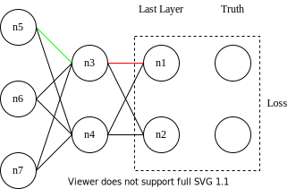
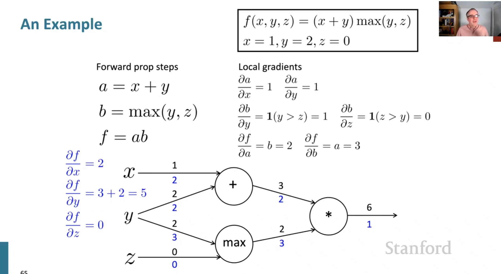
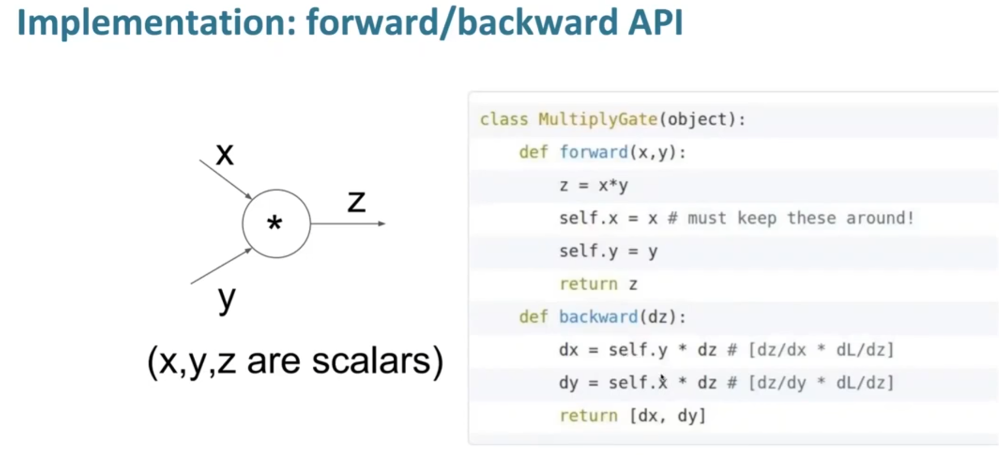

neural networks 3b1b watching notes

Created: 2023-03-26T23:20+08:00
Modified: 2024-03-08T09:30+08:00

Categories: MachineLearning

[Neural Networks Playlist on Youtube](https://www.youtube.com/playlist?list=PLZHQObOWTQDNU6R1_67000Dx_ZCJB-3pi)
[3 \- Backprop and Neural Networks\_哔哩哔哩\_bilibili](https://www.bilibili.com/video/BV1Nf4y1K7kU?p=3)

-   what is mlp?
-   cost function and params
-   gradient descent
-   back propagation
    -   computational graph: forward propagation
    -   pass gradients back along the graph

# serial 1

-   example 以及长什么样
-   weights matrix

wiki 上说 neuron 是 cell，3B1B 说是 thing holds a number

举了一个非常简单的例子：手写数字识别

28\*28 的 image，两个全连接的 hidden layer，各 16 个 neuron，最后一个 10 output

notation:

neuron: a thing holds a number

activation: the number itself, light if big

output: the proba

the hidden layer might work:

we HOPE: each component represents a neuron

pixels to edges, edges to patterns, patterns to digits

如果把整个 image 给 flatten 了，那么 784 个 weights 将施加于 neurons

like a matrix do a wise-multi on the image and outputs one number, the only one number will contrib to the one neuron in the next layer,

so we have 16 neurons in the first hidden layer, we have 16 28\*28 matrixes,

我想到卷积核，最原始的就是全连接的，卷积核大小和图片大小相等。

这样的 matrix 可以用来识别 edge，就好像吴恩达的那个 3 \* 3 的卷积核一样。

为了 activate 这个 output，所以加上 bias，bias 可以 negative，表示一个 threshold

3b1b 认为将 hidden layer 看作 pattern 的识别会更好较于 black box, 因为这样让人对 bias 和 weights 有更好的理解，虽然后续会提到，not at all

最后是请到了 Lisha Li 讲 ReLU v.s. Sigmoid

ReLU means rectified linear unit, it's easier to train and works better

本节的收获是，需要在大脑中想象整个神经网络的工作过程。

# serial 2

梯度下降

-   cost function and its params
-   does nn learn patterns?

loss function 和 weight/bias，记作 $\vec{w}$，we adjust w to minimize loss function

Cost function, cost of a single sample

cost function takes parameters of nn as input, and output the average cost of each sample

how to get the params? we need to calculate $\frac{\nabla{C}}{w}$, use a method called "gradient descent"

所以 dimensions 非常的大，联想到现在的超级大模型，就是一个非常高维度空间的 cost function 的梯度下降

gradient decode how much each param rules, 哪些参数更加重要

we can visualize the matrix for each neuron in second layer, as mentioned before, each neuron takes 28\*28 weights and 1 bias, those weights can be display as a matrix, 就像一个 28\*28 的卷积核一样。

最后又提到 how network work

并非如前面所想，找到 edge、pattern，实际上给一张 random image，nn 也可能非常自信地做出预测，而且，nn can't draw digit

以上就是多层感知机，最 plain vanilla 的形式，CNN 和 LSTM 就是后面的改进

# serial 3

-   intuitive walkthrough
-   derivatives in computational graphs

本章介绍 back propagation 的概览。

如何传播，哪些重要。

我觉得图画的很好，neuron 的 lightness 表示数值大小，不同 layer 之间的连线表示 weight，线的亮度表示 weight 大小，颜色表示正负。

最重要的是，本章提出了一个思想，是我以前未曾想到的，就是：

最后一层的 layer 就是 output，直接和真实 label 交互得到 loss，倒数第二层 layer 的梯度求出来以后，可以把倒数第二层的 layer 的梯度看作是 loss，这样就陷入 iteration 中，所以严格来说，反向传播只需要学会倒数两层就够了，其他倒着推就行。

# serial 4

求 cost 对 weight 的梯度，实际上就是在求 cost 对那一条线的梯度

<!--  -->

Loss 是一个 scalar，求 loss 对红色那条线的梯度非常简单

可以先求出 loss 对 n1 的梯度：

$cost = loss\_fn(n_1, n_2, \vec{truth})$

然后考虑 n1 对 weight 的梯度

$n_1 = ReLU(w \times n_3 + sth\_we\_don't\_care)$

就是 loss 对 n1 的梯度，乘一个 ReLU 的导数再乘 n3

what does change 是求绿色 weight 的梯度，也就是倒数第三层的 weight

因为要先求 n3 对 loss 的梯度，而与红色 weight 不同，n3 影响了 n1 和 n2

所以

$$
\frac{\partial{loss}}{\partial n_3} = \frac{\partial{n_1}}{\partial n_3} + \frac{\partial{n_2}}{\partial n_3}
$$

就前向传播的表示而言，weight 和 neuron 没有区别，写成 1\*2 + 3，谁知道 1 和 2 哪个是 neuron 哪个是 weight，所以求 weight 梯度的方法用在求 neuron 上也是通的

$$
ReLU(w\times n_3 + b) = n_1
$$

$\frac{\partial n_1}{\partial n_3} = ReLU'(...) \times w$

最后求绿色的 weight，就是把 n3 和 n4 看作 n1 和 n2，repeat。

在反向传播的过程中，虽然我们在结果上只需要更新 w 和 b，但是每个 neuron 也要求梯度，由于每个 neuron 对最终结果的贡献路径不止一条，所以 neuron 的求梯度式子中会有 `+` 号，就好像多元微积分里的对参数求导一样。

# review & implement

来自 Stanford 的 slide

<!--  -->

<!--  -->

