关于抛物线版本的《口是心非》

Created: 2023-08-19T19:10+08:00

Published: 2023-09-19T14:19+08:00

Modified: 2023-09-22T22:02+08:00

Categories: Music

[toc]

# 信

<!-- 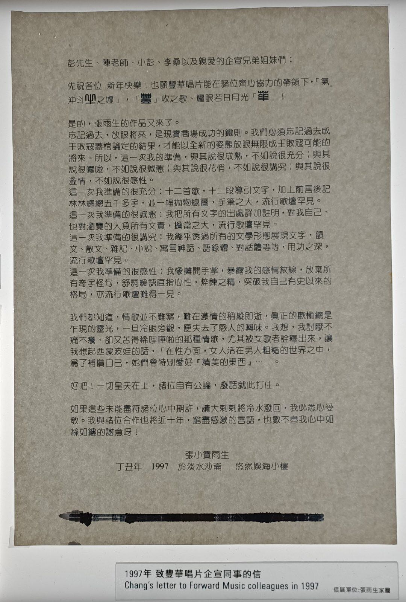 -->

彭先生、陈老师、小彭、李桑以及亲爱的企宣兄弟姐妹们：

先祝各位 新年快乐！也愿丰华唱片能在诸位齐心协力的带领下，「气冲斗牛之墟」，「丰」收之歌、耀眼若日月光「华」！

是的，张雨生的作品又来了。

忘记过去，放眼将来，是现实商场成功的铁则。我们必须忘记过去成王败寇盖棺论定的结果，才能以全新的姿态放眼无限成王败寇可能的将来。所以，这一次我得准备，与其说很成熟，不如说很充分；与其说很啰嗦，不如说很诚恳；与其说很花俏，不如说很讲究；与其说很滥情，不如说很感性。

这一次我准备的很充分：十二首歌，十二段导引文字，加上前言后记林林总总五千多字，并一幅抛物线图，手笔之大，流行歌坛罕见。

这一次我准备的很诚恳：我把所有文字的出处详加注明，对我自己、也对浏览的人负所有文责，担当之大，流行歌坛罕见。

这一次我准备的很讲究：我几乎透过所有的文字形态展现文字，韵文、散文、杂记、小说、寓言神话、语录体、对话体等等，用功之深，流行歌坛罕见。

这一次我准备的很感性：我像摊开手掌，暴露我的感情纹线，放弃所有奇字怪句，舒词缓语直指心性，淬炼之精，突破我自己有史以来的格局，亦流行歌坛难得一见。

我们都知道，情歌并不难写，难在激情的稍纵即逝，真正的欢愉总是乍现的灵光，一旦冷眼旁观，便失去了感人的兴味。我想，我讨厌不痛不痒、却又苦得稀里哗啦的那种情歌，尤其被女歌者诠释出来，让我想起了西蒙波娃的话，「在性方面，女人活在男人粗糙的世界之中，为了补偿自己，她们会特别爱好『精美的东西』…」。

好吧！一切皇天在上，诸位自有公论，废话就此打住。

如果这些未能尽符诸位心中期许，请大剌剌将冷水泼回，我必悉心受教。我与诸位合作也将近十年，穷尽感激的言语，也数不尽我心中如丝如缕的谢意呀！

张小宝雨生

丁丑年 1997 于淡水沙崙 悠然娱海小楼

<!-- 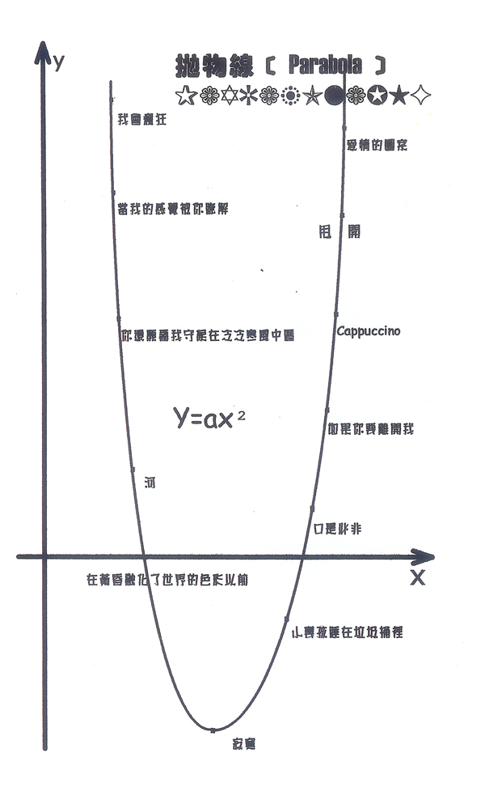 -->

《口是心非》最早的构想是抛物线，随着 2016 年《雨后星空》中《你还愿为我守候在冷冷寒风中吗》的重见天日而完整，但遗憾的是歌曲虽然完整了，十二段导引文字互联网却上没有完整的记载。

2016 年我才是个高中生啊，一想到这件事，我就懊恼怎么没有早一点知道张雨生。

B 站上有按照抛物线构想的《口是心非》专辑：

<iframe src="https://player.bilibili.com/player.html?aid=736970839&bvid=BV16D4y1w7dn&cid=1009563773&page=1&high_quality=1&danmaku=0&autoplay=0" allowfullscreen="allowfullscreen" width="100%" height="500" scrolling="no" frameborder="0" sandbox="allow-top-navigation allow-same-origin allow-forms allow-scripts"></iframe>

也有 UP [聊过了自己的感受](https://www.bilibili.com/video/BV1Q84y1H7fc/)，本文写~~一点~~自己的感受。

UP 提到抛物线的方程应该是 $y = a x^2 + bx + c$，张雨生数学不好，想起他的[独白](https://www.douban.com/note/116247217/)：

> 念丰南国中的时候，我比较感兴趣的是国文和历史，
> **如果我们数学老师不要长得那么好看，我想我的数学可以念得好一点。**

所有歌曲的英文名来自 Koji Sakurai 的 [Facebook 动态](https://www.facebook.com/koji.tw/posts/pfbid02TsY6fL9whhukJN6yw2ipvPdUaXsKAkmMzM15ZK7MZ1EukqKG6xwwnQpGUe3soBCal)

<!-- 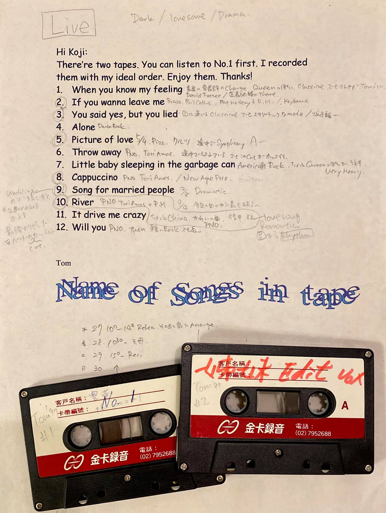 -->

# 我会疯狂（It drive me crazy）

这首歌放在开始有一点奇怪的，如果从爱情的角度来说，一段感情的开始，侧重的是初见的那种惊鸿一瞥：

> 你的模样 今生最美丽的图像

但是后面歌词又好像经历轮回一样：

> 就像走了一圈又绕过一圈 你跋涉长远却回到原点
> 最初的狂喜与最终的宁谧如此和谐
> 就像走了一圈又绕过一圈 你跋涉长远却回到原点
> 更替的季节与变换的日夜去不复回

里面还有一句奇怪的歌词：

> **如果有爱违背了道德**
> 在心灵千山万水 孰是孰非谁理得出来

为什么爱会「违背道德」啊？后来阅读了发行版《口是心非》里《随你》引导词提到的《母亲初恋的人》：

> 「从民子到雪子对于他的爱的闪电，划过佐山的心里。」
> —— 川端康成（1899 ～ 1972）· 母亲初恋的人 · 伊豆的舞娘 —— 川端康成十五篇短篇精选集 · 黄玉燕译

《母亲初恋的人》讲的是一个少女爱上自己母亲初恋的故事，我感觉这段文字配合《我会疯狂》比较合适。

再后来逛歌迷群看到了此曲的初稿，又在 Facebook 小组成功问到了引导词：

<!-- 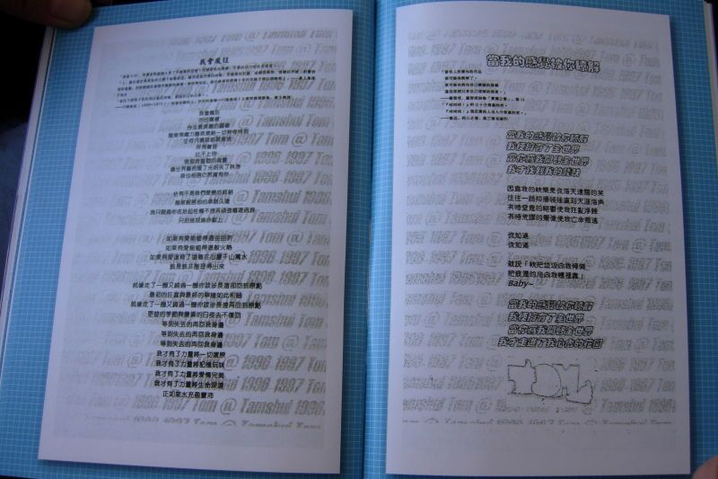 -->

> 「凌晨 4:50，早覺者與邊緣人有了不經意的交會。同樣惺忪的睡眼，生命的活力卻此消彼長。」
> 「人，總在滿足和貪多的火網下匍匐前進，總有成為俘虜的時候，受盡酷刑折騰，或繙（幡）然悔悟，或樂此不疲 ⋯ 相愛容易相處難，否則婚姻怎會成為愛情的墳場？寬容與知足，為什麼要耗費幾十年的光陰才得以領略呢？」———某人某夜於淡水
>
> 「從民子到雪子對於他的愛的閃電，劃過佐山的心裡。」
> ———川端康成（1899 ～ 1972）· 母親初戀的人 · 伊豆的舞孃 ——— 川端康成十五篇短篇精選集 · 黃玉燕譯

第二段就是写给《母亲初恋的人》里的民子吧。

还有爱与闪电的比喻，在《如果你冷》中也出现了：

> 我的爱 为你奔驰
> 像白色的闪电划破天际
> 我的爱为你奔驰
> 像红色的血液充满身体
> —— 杨立德 · _如果你冷_

<iframe src="https://player.bilibili.com/player.html?aid=739034305&bvid=BV1Sk4y1x7BY&cid=1068950358&p=1&high_quality=1&danmaku=0&autoplay=0" allowfullscreen="allowfullscreen" width="100%" height="500" scrolling="no" frameborder="0" sandbox="allow-top-navigation allow-same-origin allow-forms allow-scripts"></iframe>

# 当我的感觉被你了解（When you know my feeling）

<!-- 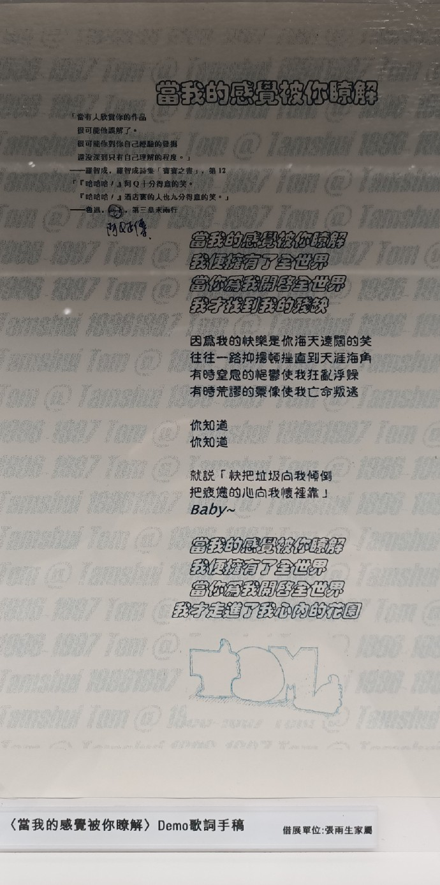 -->

后来因为这首歌没有出版，引导词给了在正式版中的《若我告诉你其实我爱的只是你》：

> 「当有人欣赏你的作品
> 很可能他误解了。
> 很可能你对你自己经验的发掘
> 还没深到只有自己理解的程度。」
> —— 罗智成 · 罗智成诗集「宝宝之书」· 第 12

> 「『哈哈哈！』阿 Q 十分得意的笑。
> 『哈哈哈！』酒店里的人也九分得意的笑。」
> —— 鲁迅 · 阿 Q 正传 · 第三章末两行

罗智成非常好（笑）的一段话，每当我想起「女为悦己者容」，就会顺带想起它。

原来张雨生也会看鲁迅啊，哈哈哈，全中国人的共同记忆了。

《[宝宝之书](https://book.douban.com/subject/1466020/)》可以在 zlib 用繁体搜索找到，第一首诗是：

> 我們必須在長大之前
> 展開我們的戀愛

还有写得很好的第十三首，让我想起李娟的书名「走夜路请放声歌唱」：

> 下小雨时，请接近草地……

歌曲后半段，张雨生自己的声音一层一层的交叠，也是他的特色了。

# 你还愿为我守候在冷冷寒风中吗（Will you）

来自专辑《雨后星空》，不知道怎么评价只能说很好的歌。

单生狗暴击，张雨生至少谈了五年的恋爱（他 1992 年就在信中向女朋友抱怨《大海》这张专辑）。

我想知道在「胡语乱言」什么：

> 微微贴触我的耳缘呵痒说情话
> ……
> 我们手握着手背靠背胡语乱言

张雨生写爱情常常提到的一点就是激情过后的那种平淡：

> 你还愿为我守候在冷冷寒风中吗
> 微微贴触我的耳缘呵痒说情话
> 即使当初你最爱 傻楞楞的笑
> 日子依旧难免看惯那单调
>
> 你还愿将我美好华年赞颂入诗吗
> 相处总会产生距离安全而疏远
> 即使当初我坚持 相思应成痴
> 想不起那些年冲动的直觉

# 河（River）

<!-- 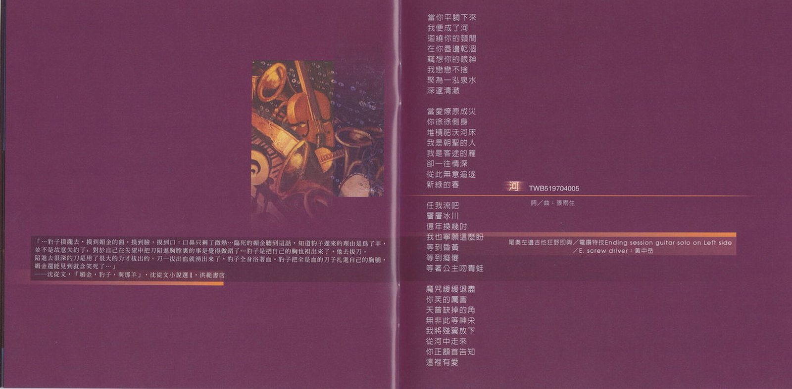 -->

最出彩的一首歌

张雨生的嗓音天生适合这种歌曲，由钢琴开始；提琴的音色非常温暖；呜呜的人声真是让人起鸡皮疙瘩。

电吉他是我非常喜欢的乐器，非常高亢激昂。到了「任我留吧」，雨生自己的高音和声出现，颇有河流一往无前的感觉。

周杰伦在《土耳其冰淇淋》里有一段：「换个乐器就像换个兵器，电吉他这个时候出来干嘛到底」，
《河》在「你正颔首告知，这里」还是钢琴和提琴，等到「有爱」，一个高音过去就把电吉他带出来了。

尾奏的左右声道的吉他也没啥好说的，专辑上的描述是「吉他狂野即兴」，不过只标注了左边的乐手是黄中岳——可能的言外之意：右边的吉他是张雨生自己弹的。

<iframe src="https://player.bilibili.com/player.html?aid=213690224&bvid=BV13a411a7gJ&cid=589325349&p=1&high_quality=1&danmaku=0&autoplay=0" allowfullscreen="allowfullscreen" width="100%" height="500px" scrolling="no" frameborder="0" sandbox="allow-top-navigation allow-same-origin allow-forms allow-scripts"></iframe>

# 在黄昏融化了世界的色彩以前（Song for married people）

<!-- 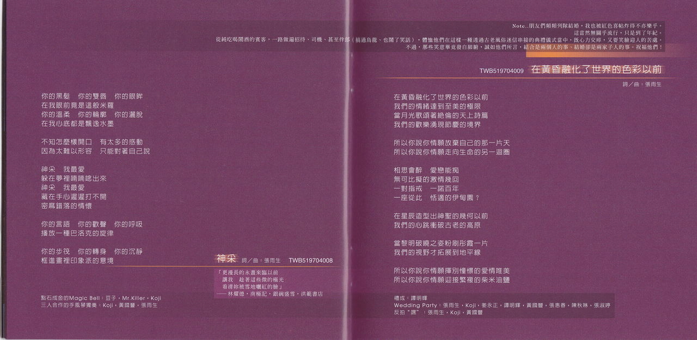 -->

陶喆的《今天你要嫁给我》可以一起听，在《口是心非》这里介绍陶喆的歌，有点砸场子的意思。巧的是，1997 年的金唱片就是在张雨生的《口是心非》和陶喆的《陶喆》之间产生。
陶喆的可以听出编曲的细腻，比如「阳光照耀美满的家庭」，后面马上跟了孩子的欢笑，张雨生的这首是跟着婚礼上亲友团的欢呼。

最好笑的地方是，专辑出版的时候，甚至标注了「礼成」是谁唱的，非常开心的一首歌。至于「反拍」，我没听出来 orz。

> 礼成：谭明辉
> Wedding Party: 张雨生 · Koji · 姜永正 · 谭明辉 · 黄国丰 · 张惠春 · 陈秋琳 · 张淑婷
> 反拍“嘿”：张雨生 · Koji · 黄国丰

乘机介绍下张雨生玩得好的朋友[^1]：

-   Koji: 编曲 + 键盘
-   姜永正：鼓手，外号「豆子」
-   谭明辉：贝斯，雨生高中同学
-   张惠春：张惠妹的妹妹，「阿妹妹」组合成员
-   陈秋琳：张惠春的表妹，「阿妹妹」组合成员
-   王俊杰：混音师，外号「小 K」，前面的《河》介绍过了

遗憾的是谭明辉也出车祸去世了。

# 寂寞（Alone）

来自《雨生欢禧城》，画风急转直下。结婚以后就会寂寞吗？

张雨生参加过一个访谈，「[台北真寂寞](https://www.bilibili.com/video/BV1cT411k78j/)」，不知道二者之间有没有什么联系。

有时候起床看到上山的雾，就会想起歌词：「我是凌晨的薄雾，疯狂迷恋失温的感觉」。

让人想起《百年孤独》

# 小婴孩睡在垃圾桶里（Little baby sleeping in the garbage can）

张雨生的特别之处在于，不妥协于流行市场，就像《卡拉 OK 台北我》里的《我是多么想》和《永公街的街长》，人文关怀。

下面是张雨生写的引导词：

> 这个故事是得不到汲汲营营于争权夺利的衮衮诸公的注目的。我一直觉得，我们的问题不在那些理也理不清、辩也辩不明的狗屁倒灶议题上面，那只是乱象纷纭之一。我们的病绝对是从根腐烂型的绝症，大家临于无底深渊，立于危墙之下却还一味自慰式的欺蒙自己「慢慢来，没关系，从长计议」。四百年岛民心态乘以千年傅承的封建恶习，造成今日短视近利的、恶狗争食的、血气狂热的、盲目崇拜的、迷信落伍的、以暴易暴的、公德沦丧的、昧于未来的亚洲乃至世界民主开发国家的公民奇观。《庄子》写着：「宁为庙堂文绣之牺牲乎？抑为泥涂曳尾之乌龟乎？」小婴孩呀，为人难、难于上青天！不如学我，就做只摇摇摆摆的乌龟吧！

<!-- 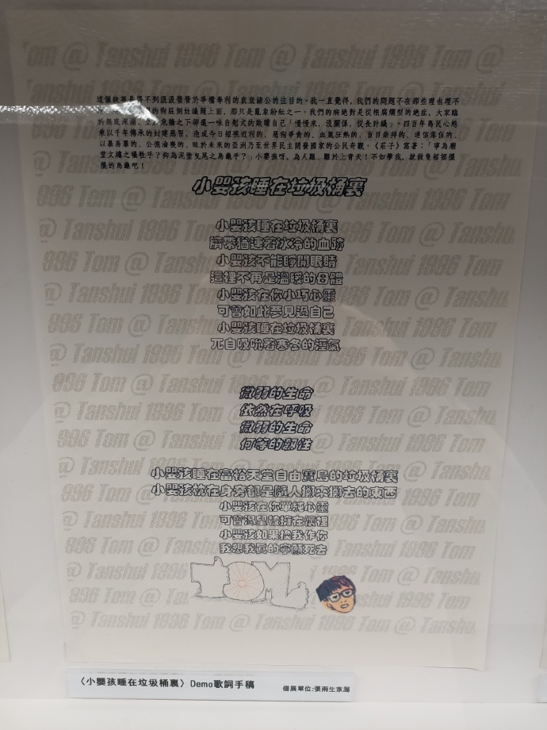 -->

# 口是心非（You said yes but you lied）

张雨生给「口是心非」起的英文名字叫做「You said yes but you lied」，使用的引导词来自《1984》，本书最出名的文本可能改编自 Glenn Miller 的 [The Chestnut Tree](https://www.youtube.com/watch?v=O4HHKnLc8lc&ab_channel=MrRJDB1969)。

<iframe frameborder="no" border="0" marginwidth="0" marginheight="0" width=330 height=86 src="https://music.163.com/outchain/player?type=2&id=1410312650&auto=0&height=66"></iframe>

《1984》摘录：

> Under the spreading chestnut tree
> I sold you and you sold me
> There lie they, and here lie we
> Under the spreading chestnut tree

豆瓣选择的书籍评价是「栗树荫下，我出卖你，你出卖我」，顺便一提，我见过最好笑的评价是《唐诗三百首》的——「熟读唐诗三百首，不会吟诗也会吟」。

开头一分钟的前奏非常喜欢，乐器一件件地加入，告诉我们这不是一首简单的口水流行歌。

「于是爱恨交错人消瘦/怕是怕这些苦没来由」里，前句是自己给自己和声（不知道我的用词准确吗），后句是独唱，不管是独唱还是合唱，张雨生的声音都很好听。

此曲中吉他和人声的穿插实在是妙不可言，在 3:06 左右，「就像残破光秃的山头」结束后，电吉他响起，此后，张雨生每唱完一句，电吉他就跟着和一声，最后也是由电吉他收尾。

<!-- 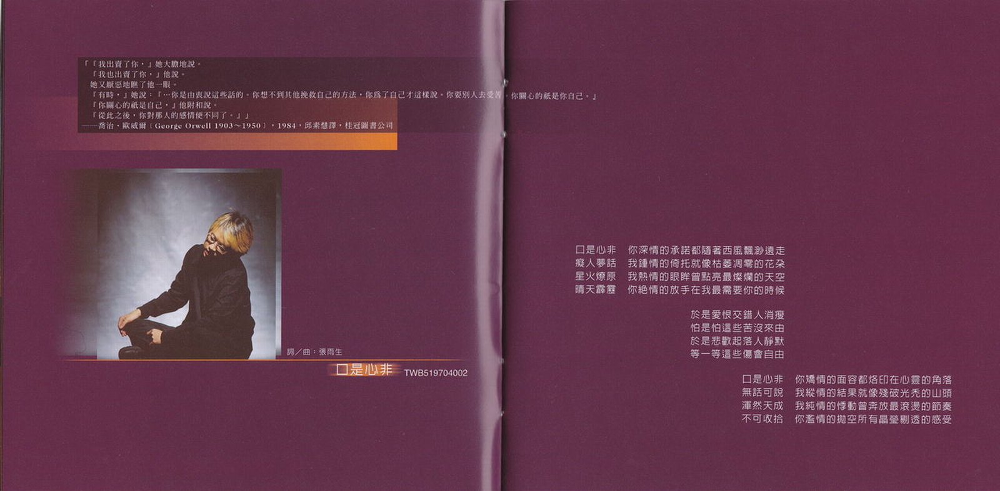 -->

深情，钟情，热情，绝情，矫情，纵情，纯情，滥情，张雨生真是诗人啊。

# 如果你要离开我（If you wanna leave me）

引导词：

> 如果太阳此刻熄灭光茫，地球上的人要八分钟后才会知道…
> 「Beatrice: 『I am gone, though I am here: there is no love in you: nay, I pray you let me go.』」
> —— William Shakespeare, Much Ado About Nothing, ACT
>
> 「泉涸，鱼相与处于陆，相呴以湿，相濡以沫，不如相忘于江湖。」—— 庄子 · 大宗师

张雨生向陶晶莹解释庄子[^2]：「如果两个人不能在一起就不要 gyang 了」。

<!-- 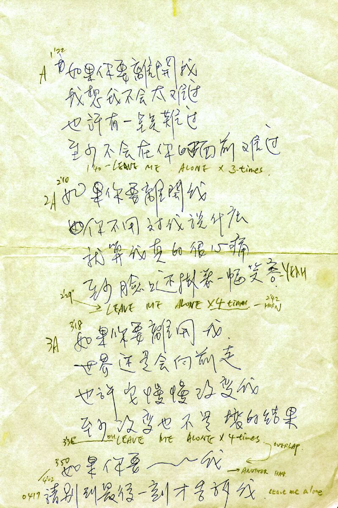 -->

有意思的是，「如果你要离开我」中的「离」字和「leave me alone」的「leave」第一个音节发音一样，而且也使用了左右声道。

「如果你要离开/请别到最后一刻才告诉我」，这个高音，只有张雨生能唱（好），给我的感觉就像他是在玩（音乐）一样，想唱多高就顺着唱上去，即兴的味道。

全歌最多的一句歌词是「如果你要离开我」，有些歌曲就是两段歌词相同旋律唱一遍就结束了，但是在这里我们可以看到张雨生是怎样玩出不同的花样。

# Cappuccino

根据张雨生和陶晶莹的访谈[^2]，Cappuccino 是收到了朋友的一幅画后创作出来的，画里有一个桶子，里面有星星。

歌曲是先有 melody，然后再算拍子，最后幸苦鼓手豆子。

这种随手写歌的能力真是非常让人敬佩和羡慕，比如《后窗》的创作由来[^2]：
「远远地看到有一个窗户，然后一个女孩子在那边梳妆、在那边打扮，然后我就突然就慢慢地想想想，看一看就想出这个歌词来」。

> 愈看我愈觉痴傻
> 愈看我愈形癫狂
> 学飞蛾扑向火光
>
> 我想化身作一只青鸟
> 偎着窗棂盼她回眸笑
> 在眉羽之间啼吟她的羞娇
> 直把眼前作蓬莱仙岛

<iframe src="https://player.bilibili.com/player.html?aid=23008927&bvid=BV1JW411G7Nz&cid=38256299&p=1&t=721"&high_quality=1&danmaku=0&autoplay=0" allowfullscreen="allowfullscreen" width="100%" height="500px" scrolling="no" frameborder="0" sandbox="allow-top-navigation allow-same-origin allow-forms allow-scripts"></iframe>

# 甩开（Throw away）

应该是专辑概念的起源，通过将爱「甩开」，绘制出了抛物线。

想到王小波：

> 你说我这个人还有可原谅的地方吗？我对你做了这样的坏事你还能原谅我吗？我要给你唱一支好听的歌，就是我这一次猜忌是最后的一次。我不敢怨恨你，就是你做出什么样的决定我都不怨恨。
> 我把我整个的灵魂都给你，连同它的怪癖，**耍小脾气，忽明忽暗，一千八百种坏毛病**。它真讨厌，只有一点好，爱你。
> —— 王小波 · 请你不要吃我，我给你唱一支好听的歌 · _爱你就像爱生命_

> 不再拥有你与所有回忆
> 曾经如影随形的一切点点滴滴
> 不再拥有你
> 包括灵魂和你的胴体
> 不再拥有你欢愉或心悸
> 曾经发自肺腑的那些至美情绪
> 不再拥有你
> 包括你的**毛病和你的脾气**

## 概念手稿

<!-- 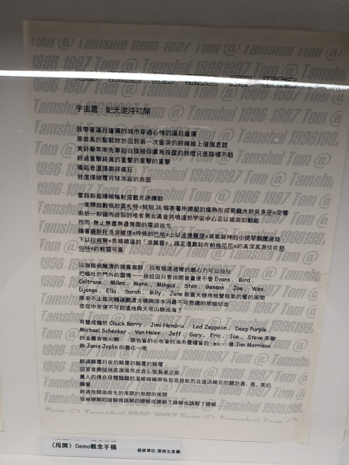 -->

宇宙历 纪元混沌初开

我带着满目疮痍的城市穿过心情的满目疮痍
那崇高的圣战终于回到第一次冲突的经纬线上偃旗息鼓
美好华年率先举起白旗被俘虏为四窜的狼烟只是阴魂不散
经过重击纯真的重撃的重击的重击
独裁者选择崇拜疯狂
我选择披复月球冷寂的表面

当超新星爆破幅射搭载光速扩散
一度释放数倍于莫扎特短短 36 个寒暑所挤压的燃热形成更庞大于贝多芬交响曲于一秒钟内迸裂的唯有男女高音共鸣达于宇宙中心足以媲美的动能
然而 无止无尽无边无际的电波巡弋
随着罗斯托洛波维琪呼吸的巴哈上以孟德尔颂屏息凝神的小提琴翻腾迴旋下以拉威尔思绪绵远的「波丽露」踢足漫舞起在帕格尼尼的高深莫测伏在舒伯特的轻灵可喜

以为脆弱腌渍的发臭宿醉 只有急速过弯的离心力可以拉扯
把呕吐于门外的灵魂一一捡拾回只要扭开音量便不管 Evans、Bird、Coltrane、Miles、Monk、Mingus、Stan、Benson、Joe、Wes、Django、Ella、Sarah、Billy、June 都震天憾地粗声粗气的响的房间
原来不止每次转过关渡大桥与淡水河最不可思议的那个切面
悲从中来便不可抑遏地与大屯山脉出海了

耳聋成痛于 Chuck Berry、Jimi Hendrix、Led Zeppelin、Deep Purple、Michael Schenker、Van Halen，Jeff、Gary、Eric、Joe、Steve 串联的金属吉他火网
眼也盲的心也盲的海市蜃楼盲的（妈的？）像 Jim Morrison 与 Janis Joplin 的昙花一现

经过颠复日夜的颠复的颠复的颠复
回首音乐从地底滚滚而出自 L 型长桌之前
熏人的传自母体醖酿的温暖硫磺原味包容我乾烈且进退维谷的关于真、善、美的触觉
经过甩开张雨生的甩开的甩开的甩开
我被瞭解的误解为误解的瞭解成了解了误解也误解了了解……

## 引导文字

> 「伽利略（Galileo Galilei 1564~1642）指出，抛射物的运动轨迹，由于受到动力及重力两种力的影响，会呈现曲线状。这种曲线称为抛物线（Parabola）」——摘自牛顿出版股份有限公司所发行之《改变世界的科学家》第 11；现代实验科学之父——伽利略，Michael White 原著，李元绮译
>
> 「一个抛物线的二次函数基本式：$y＝ax^2$：或表为$（甩多远）=（它多重）（用的力）^2$」 
> 「对几个字的思索：『甩，很有力量主动攻撃；丢，冷酷无情的动作；放，显得是无奈之举；弃，觉得到心灰意冷；拾，太慈善家式的犬儒；割，自虐虐人的心理反映…』」
> ——某人某夜某地

<!-- 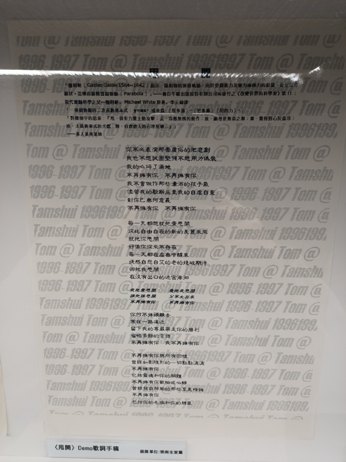 -->

# 爱情的图案（Picture of love）

<!-- 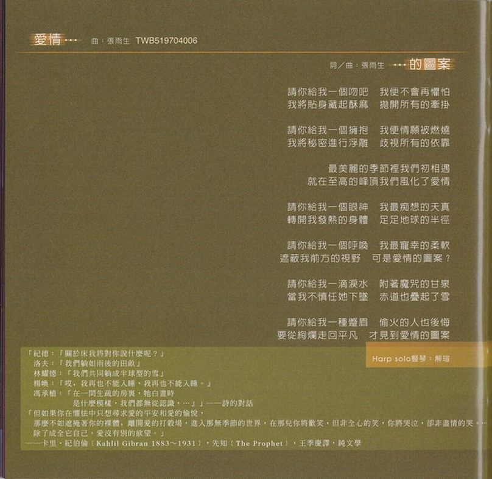 -->

引导词是集句[^3]：

1. 安德烈 · 纪德 (André Paul Guillaume Gide 1869 ~ 1951) · 地粮 · 盛澄华译 · 上海译文出版社
2. 洛夫 (1928 ~ 2018) · 去夏的汗 · 因为风的缘故 · 江苏凤凰文艺出版社
3. 林燿德 (1962 ~ 1996) · 上邪注 · 银碗盛雪 · 洪范书店
4. 杨唤 (1930 ~ 1954) · 雨
5. 冯承植 (1905 ~ 1993) · 我们有时度过一个亲密的夜

本专辑中比较好唱的一首歌，最好的乐器是竖琴，烂漫主义色彩非常浓厚：

「当我不慎任她下坠/赤道也叠起了雪」，叠雪一词也有[出处](https://baike.baidu.com/item/%E5%8F%A0%E9%9B%AA/9282237)。
「请你给我一种蹙眉/偷火的人也后悔」，应该是普罗米修斯，可以看到张雨生的词贯穿了中西方文化，比如《发晕》中的「你笑的一厢情愿/绝版的明信片/恍惚置我于诸神的纪元」，《这一年这一夜》中「眼游神游老与庄/你那无语不能忘」。

最后一句歌词是：「要从绚烂走回平凡/才见到爱情的图案」，我一度非常看好某对同学的恋情，结果还是分手了，连朋友都没得做。

> 相愛容易相處難，否則婚姻怎會成為愛情的墳場？寬容與知足，為什麼要耗費幾十年的光陰才得以領略呢？

# Special Thanks

1. [想念雨生](https://www.tomchang.cn/)：许多雨生文字的备份
2. [蓁芯 0607@weibo](https://weibo.com/u/2567125954): 提供了许多《想你到月球》特展照片

[^1]: https://www.ptt.cc/man/Metal_kids/DF32/D.899796293.A/M.900060223.A.html
[^2]: [19971014 飞碟电台\_陶色新闻\_1.介绍雨生创作历程与口是心非专辑介绍](https://www.bilibili.com/video/BV1JW411G7Nz/)
[^3]: https://www.ptt.cc/man/poem/D6E7/D6A/D93/M.1287776694.A.0DA.html
