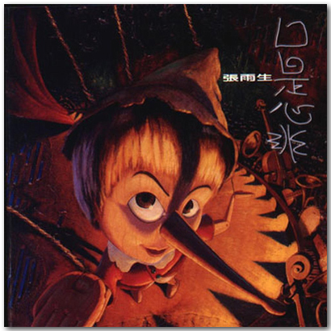

专辑《口是心非》小记

Datetime: 2023-02-09T20:47:00+08:00

Categories: Music

Tags: Diary

最近机缘巧合，因为《河》这首歌再次接触到了张雨生。至于机缘是啥，如果你（我）想不起来，请查看 2023 年 2 月 1 日手写随笔里提到的 archive。张雨生既有《河》，也有《大海》，不知道这之间是否有什么联系呢？

《河》的歌词确实很好，和我平时接触到的都不一样，不过网易云没版权，QQ 音乐要钱，只能听 demo。

后来再次“机缘巧合”，在过张雨生在网易云的的热门歌曲时候，我听到了《口是心非》这首歌，我想我肯定听过，只是没细听。在我印象里，张雨生**只是**一个会唱高音的歌手，已经去世了。

短短的时间接触到张雨生两次，我觉得需要花点时间了解他。

《口是心非》是张雨生最后一张专辑，封面是鼻子变长的匹诺曹。我推测，可能是这张专辑叫做《口是心非》，而匹诺曹每次口是心非时候，鼻子都会变长，可谓是“口是心非”的代表“人物”，所以选用匹诺曹作为封面。

也有文章提到[^1]，张雨生在录制自己不太喜欢的商业歌曲，对公司就像提线木偶一样，“口是心非”。嗯，木偶 + 口是心非，匹诺曹太吻合了。

<!--  -->

令人唏嘘的是，张雨生也在专辑对“同学”的特别感谢中提到，这张专辑“当然不会是最后一张”，结果成了自己的最后一张[^2]。

百度百科上提到，张雨生专辑里的每一首歌都会附带对应的文案[^3]，我很想知道《口是心非》的文案是什么。百度一下，2008 年的帖子给出了答案[^4]：

《口是心非》附带文案出自邱素慧翻译 George Orwell 的《1984》，可惜我没有看过，所以也不知道背景是啥：

> “我出卖了你。”她大胆的说。
>
> “我也出卖了你。”他说。
>
> 她又厌恶地瞧了他一眼。
>
> “有时，”她说：“…你是由衷说这些话的。你想不到其他挽救自己的方法，你为了自己才这样说。你要别人去受苦。你关心的只是你自己。”
>
> “你关心的只是自己。”他附和说。
>
> “从此之后，你对那人的感情便不同了。”

《河》附带文案出自沈从文的《媚金‧豹子‧与那羊》：

> …豹子扑拢去，摸到媚金的额，摸到脸，摸到口：口鼻只剩了微热…临死的媚金听到这话，知道豹子迟来的理由是为了羊，并不是故意失约了，对于自己在失望中把刀陷进胸膛里的事是觉得做错了…豹子是把自己的胸也袒出来了，他去拔刀。陷进去很深的刀是用了很大的力才拔出的。刀一拔出血就涌出来了，豹子全身浴着血。豹子把全是血的刀子扎进自己的胸脯，媚金还能见到就含笑死了…

Bilibili 上有关于这本书的[视频总结](https://www.bilibili.com/video/BV1EU4y1X7SX/)[^5]，有人觉得沈从文这小说太扯了，不过小说嘛，人物性格既可以真实而复杂，也可以单一而鲜明。

由此，不论张雨生是个怎样性格的人，我敢肯定，他一定看过很多小说。

然后我把百度知道上那段文案再扔进 Google，发现了一个[“想念雨生”的网站](https://www.tomchang.cn/)[^6]。全是简体字，网址是 `www.tomchang.cn`，张雨生的英文名就是 Tom Chang。这个网站甚至还有微信公众号，它真的，我哭死。

这个网站收集了张雨生的很多资料，包括图集、文章、信和歌曲等，《口是心非》这张专辑也有对应的[页面](https://www.tomchang.cn/music/album/19.html)[^2]。

在网站上逛了一会儿，我才发现，[“說張雨生只會飆高音，是對他最大的誤解”](https://www.greatage.net/zhang-yusheng-soaring-soprano/html)[^1]。

[《口是心非》](https://www.tomchang.cn/music/album/19.html) 的唱片详情[^2]第一段就让我惊叹：

> 这两年，我都在淡水。朋友告诉我很多好玩的、好吃的、好看的、有趣的地方，有些我去过，有些没有；大半时间，我执意守在面海的一方小天地里，与这里的朝晖夕晕一同呼吸。常常，蓝得发亮的天空一早让我来不及揉开睡眼惺松，惊喜不已的一跃而起！一放眼望尽海天之际，层层白云作弄千奇百怪的造型，清风徐来，更伴着一片绿茸茸的草浪夹带四溢的原野纯香，那一刻，真教人不爽快大喝一声不行！但是，也有冬夜远从地球另一端来紧紧贴在窗外狰狞咆哮的狂风，〔使天地战栗如同发了疟疾〕，那一刻，不着魔似的随之乱舞一阵亦不得也！于是我下放所有情感的起落，又讴歌所有爱恋的绝美。属于荒谬的罪愆，任由子夜银白如洗的月色洁净：属于神秘的口诀，便在夕阳金芒散尽的瞬间领略：属于纠缠不清的、似懂非懂、欲语还休的、交叉质询、欲辩忘言的、泛激情的、泛道德的种种，就丢给天龙八部里的无名老僧吧。

他只是个歌手？张老师退出文坛，我是第一个反对的，虽然我反对也没用。

挑了几篇文章阅读，我只能说，我看不懂。他的文章对我来说有三大特点：

1. 很多比喻，很出人意料的那种，我觉得我这辈子比喻句白学了
2. 前言后语有时候没有明显的逻辑，需要反复阅读
3. 会引用使用古文中的句子，一旦引用而且看不懂的时候，我就得中断文章的阅读，切出去查句子的意思和出处

对了，他还有女朋友，所以有写给女朋友的信札，我随便挑一段，出自 [爱不在最美的时候说那要在什么时候说呢？](https://www.tomchang.cn/archive/letter/85.html)：

> 我一度崇拜爱情的坚贞，以为握紧了就不会松开。直到看见自己心中城堡倾颓的碎石，才发现情感的驰奔像决堤的水已经止不住前冲的劲势，一路扬长而下，真是压抑多少，它就释放多少。终于明白，我原来在心里留着一块空白，不曾为人占据，那里固锁着我活力充沛的热情，使我在外表上一直以『终始如一』自信满满。可是不知道为什么你就像善良、率真的精灵，让我一点也没有警觉的，将那一扇大门敞开了。

会写歌的人都这么牛吗？教练，我想学这个。

挑一段作为文章的尾声吧，也是[第 28 届金曲奖特别贡献奖](https://www.bilibili.com/video/BV1mx41167HZ/)的颁奖词，**拼接**自张雨生的三篇文章：[在不断扬弃下，体现自我成长](https://www.tomchang.cn/archive/article/65.html)、专辑 [卡拉 Ok·台北·我](https://www.tomchang.cn/music/album/15.html) 的制作感言（我也不知道怎么称呼这段文字对于专辑的属性）和专辑 [白色才情](https://www.tomchang.cn/music/album/17.html) 的制作感言，把三篇出处都找到真是有点麻烦。

> 在我呕心沥血浅尝一切以后，我明白，我是幸运的，因为我尚可以焦虑地思索。对于一切我感到是问题的问题，纵然激烈摆荡，纵然五光十色，但乐观地瞻望于前一定有其积极的价值。同时，莫忘了我们困恼、疑惑之际正孕育着历史。我会坚持下去，很多人都在坚持着。状况与变数总会过去，唯有作品会留下来。那些灵光闪动的惊喜，会不断给后继的人带来希望！音乐倘若源自心灵，不过“诚实”而已。

这句话[^1]，我十分认同：

> ……我常常在想，如果不做音樂人，張雨生也一定是個超群的詩人。

# 参考资料

[^1]: [說張雨生只會飆高音，是對他最大的誤解](https://www.greatage.net/zhang-yusheng-soaring-soprano/html)

[^2]: [口是心非 - 想念雨生](https://www.tomchang.cn/music/album/19.html)

[^3]: [口是心非 - 百度百科](https://baike.baidu.com/item/%E5%8F%A3%E6%98%AF%E5%BF%83%E9%9D%9E/3891952)

[^4]: [关于张雨生的《口是心非》 - 百度知道](https://zhidao.baidu.com/question/76773729.html)

[^5]: [13 分钟读完《媚金·豹子·与那羊》：答应我，一定要嫁给爱情 - Bilibili](https://www.bilibili.com/video/BV1EU4y1X7SX/)

[^6]: [想念雨生](https://www.tomchang.cn)
