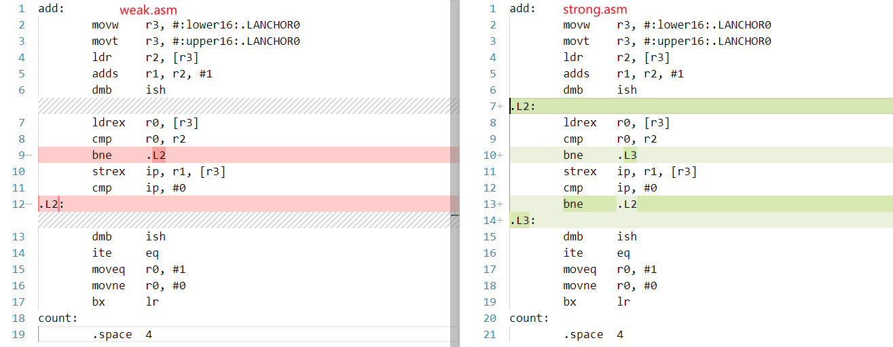

CAS 在 ARM 架构与 x86_64 架构上的实现
cas on ARM and x86_64

-   Created: 2024-11-13T16:25+08:00
-   Published: 2024-11-13T16:36+08:00
-   Categories: OperatingSystem
-   Tags: lock-free

# CAS 的想法从与 x86_x64 上的 cmpxchg 指令

## CAS 背景

为什么我们需要 CAS，因为考虑寄存器和内存，

```cpp
int x;

int add(val) {
    x += val;
}
```

如果有多个线程都在执行 add，以下的汇编代码可能被交错执行，从而导致错误。
注：用方括号`[x]`表示这个值在内存中

```asm
load [x] to reg#0
reg#0 = reg#0 + val
store reg#0 to [x]
```

交错执行：

```
thread A:
load [x] to reg#0
reg#0 = reg#0 + val

thread B:
load [x] to reg#0
reg#0 = reg#0 + val
store reg#0 to [x]

thread A:
store reg#0 to [x] // Thread A 将 reg#0 写入 [x]，thread B 相当于白干
```

于是人们就想，要是每次写入内存前，取出内存中的值和 register 中的 old 值比较一下，才可以写入，就解决了这个问题：

```
load [x] to reg#0
reg#1 = reg#0 + val

---- the load-compare-exchange instructions can't be interrupt, which means they are atomic ----
---- we need address of x, and new val at reg#src, here is reg#1
---- compare_and_exchange(&x, reg#src=reg#1)
load [x] to reg#secret
if reg#secret == reg#0:
    store reg#1 to x
    reg#ret = 1
else:
    reg#ret = 0
----

    jump to begin if reg#ret == 0
```

中间六行代码被抽离出来成为了汇编指令 `cmpxchg [mem_addr] reg#src `

## GPT explain `cmpxchg` instruction

### Syntax

The syntax for `cmpxchg` is as follows:

```
cmpxchg destination, source
```

### Operation

1. **Comparison**: The instruction compares the value in the `destination` operand with the value in the `EAX` register (or `RAX` in 64-bit mode).
2. **Exchange**:
    - If the values are equal, the value in the `source` operand is stored in the `destination`.
    - If the values are not equal, the `destination` value is loaded into the `EAX` register (or `RAX`).

### Flags

The `cmpxchg` instruction affects the zero flag (ZF):

-   **ZF = 1**: The values were equal, and the exchange occurred.
-   **ZF = 0**: The values were not equal, and the original value of `destination` is in `EAX` (or `RAX`).

### Use Case

This instruction is commonly used for implementing lock-free data structures and algorithms. For example, it can be used to safely update a variable only if it has not been changed by another thread.

### Example

Here’s a simple example of how `cmpxchg` might be used:

```asm
mov eax, [shared_variable]   ; Load the current value of shared_variable into EAX
mov ebx, new_value           ; Load the new value into EBX
cmpxchg [shared_variable], ebx ; Compare and exchange
```

### Explanation of the Example

1. The current value of `shared_variable` is loaded into `EAX`.
2. A new value (`new_value`) is loaded into `EBX`.
3. The `cmpxchg` instruction compares the value in `EAX` (original value of `shared_variable`) with `shared_variable`.
    - If they are equal, it sets `shared_variable` to `new_value`.
    - If not, `EAX` is updated with the current value of `shared_variable`, indicating that the exchange did not occur.

### Summary

-   `cmpxchg` is an atomic operation that helps in safe concurrent programming.
-   It allows for conditional updates of shared variables without the need for locks, reducing contention and improving performance in multi-threaded applications.

## 单核多线程下 cmpxchg 示例

以上的讨论适用于于单核 CPU。

假设 Thread A 和 Thread B 在单核上执行如下汇编：

```
.begin:
load [x] to reg#0
reg#1 = reg#0 + 1

// interrupt happens at here
cmpxchg [x] reg#1

jne .begin
```

Thread A 在 cmpxchg 前因为调度而被中断，A.reg#0 和 A.reg#1 都写 A 的上下文内存中，
然后 Thread B 开始执行，成功完成 `[x]+=1`，然后 B 被切换出去，A 再执行
Thread A 从上下文恢复 reg#0 和 reg#1，再执行 `cmpxchg [x] reg#1`，会发现 reg#0 已经不等于 [x] 了。
于是 failed，重新跳转到开头。

## 多核多线程下 cmpxchg 需要 lock prefix

还是一样的汇编代码，Thread A 在 CoreX 上，Thread B 在 CoreY 上，
这次没有任何中断打断 Thread A 或者 Thread B。

```
.begin:
load [x] to reg#0
reg#1 = reg#0 + 1

// both Threads try to access [x]
cmpxchg [x] reg#1

jne .begin
```

cmpxchg 的问题在于，多核心下，可能不同 thread 同时访存，导致同一时刻 cmpxchg 发现 [x] 和两个 core 上寄存器的值都一样，
从而 Thread A 和 Thread B 都被成功执行
为了解决这个问题，x86_64 汇编提供 lock prefix 用于锁定总线/cache，如果一个 core 锁定了，另一个 core 就没法执行 cmpxchg 指令了。

## cmpxchg in C-language and assemble

下面我们在 C 语言中使用 CAS，看看 x86_64 平台会得到什么样的汇编结果。
C 提供了 `atomic_compare_exchange_weak` 和 `atomic_compare_exchange_strong` 两个“函数”
我们暂时不需要知道为什么会有 weak 和 strong 的分别，这两个函数在 `x86_64` 平台得到的汇编结果一样的

为什么“函数”两个字要加引号呢？
因为其调用没有 function stack，只是看起来像个 function，编译器直接将其映射到 cmpxchg 指令。

```c
#include <stdatomic.h>

int count = 0;
int add(int val)
{
    int old, new;
    do
    {
        old = count;
        new = old + val;
    } while (!atomic_compare_exchange_weak(&count, &old, new));
    return new;
}
```

使用 `gcc -S -o look-asm.s look-asm.c -std=c11 -O2` 看汇编

```asm
    .file	"look-asm.c"
    .text
    .p2align 4
    .globl	add
    .def	add;	.scl	2;	.type	32;	.endef
    .seh_proc	add
add:
    .seh_endprologue
.L2:
    movl	count(%rip), %eax            # begins from here
    leal	(%rax,%rcx), %edx
    lock cmpxchgl	%edx, count(%rip)
    jne	.L2                              # ends at here
    movl	%edx, %eax
    ret
    .seh_endproc
    .globl	count
    .bss
    .align 4
count:
    .space 4
    .ident	"GCC: (MinGW-W64 x86_64-ucrt-posix-seh, built by Brecht Sanders, r2) 14.2.0"
```

1. eax 就是 `cmpxchg [X] $src` 用来比较 `[x]` 的寄存器
2. `cmpxchgl` 可以认为是 `cmpxchg` 的 wide-bits 版本
3. 应为多核心，所以使用 lock prefix

# ABA problem

如果要用链表实现无锁栈，需要考虑 ABA problem

这里提供一个简单的 [lock-free stack](./c11-lock-free-stack.c) 例子，使用 C11 标准，通过 version 解决 ABA。
源码来自：[C11 Lock\-free Stack](https://nullprogram.com/blog/2014/09/02/)

# LL/SC, weak/strong, spurious failure

## LL/SC

为了解决 ABA 问题，cmpxchg 被拆开

`cmpxchg [x] reg#src` 就是

```
load [x] to reg#secret       // I call this "load" part

if reg#secret == reg#old:    // reg#old in x86_64 is $eax
    store reg#src to [x]     // I cal this "store" part
    reg#ret = 1
else:
    reg#ret = 0
```

在 load 的时候，如果可以做一个标志位，标识 [x] 被 touch 了，store 的时候检查这个标志位。

当 load 和 store 中间有其他 thread 写入内存，不论其他 thread 对 [x] 修改的结果是否同 reg#secret 一致，store 都将 fail。
这样就能检测 ABA problem

## diff of weak strong at assemble level

为了我们方便查看 weak 和 strong 版本的差异，这次我们直接使用 weak 和 strong 返回值，查看其对应 arm 汇编。

C 和对应汇编地址：https://godbolt.org/z/15Pve87a8

```c
// weak.c
#include <stdatomic.h>

int count = 0;
int add(void)
{
    int old = count;
    int new = old + 1;
    int x = atomic_compare_exchange_weak(&count, &old, new); // <- use weak here
    return x;
}
```

```c
// strong.c
#include <stdatomic.h>

int count = 0;
int add(void)
{
    int old = count;
    int new = old + 1;
    int x = atomic_compare_exchange_strong(&count, &old, new); // <- use strong here
    return x;
}
```

开启 O1 进行编译：

```asm
# weak.asm
add:
        movw    r3, #:lower16:.LANCHOR0
        movt    r3, #:upper16:.LANCHOR0
        ldr     r2, [r3]
        adds    r1, r2, #1
        dmb     ish
        ldrex   r0, [r3]
        cmp     r0, r2
        bne     .L2
        strex   ip, r1, [r3]
        cmp     ip, #0
.L2:
        dmb     ish
        ite     eq
        moveq   r0, #1
        movne   r0, #0
        bx      lr
count:
        .space  4
```

```asm
# strong.asm
add:
        movw    r3, #:lower16:.LANCHOR0
        movt    r3, #:upper16:.LANCHOR0
        ldr     r2, [r3]
        adds    r1, r2, #1
        dmb     ish
.L2:
        ldrex   r0, [r3]
        cmp     r0, r2
        bne     .L3
        strex   ip, r1, [r3]
        cmp     ip, #0
        bne     .L2
.L3:
        dmb     ish
        ite     eq
        moveq   r0, #1
        movne   r0, #0
        bx      lr
count:
        .space  4
```

diff：



区别在于，strex 后是否有 bne

### strex 做了什么

注意：strex 不检查是否 equal（因为前面已经有 ldrex-cmp-bne 来保证内存中和寄存器是 equal 的），只看对应 cache line 是否被 written

`strex   ip, r1, [r3]` 指令检查上次 ldrex 后 `[r3]` 所在 cache line 是否被 written

1. 如果被 written 就直接将 ip 置 1，不写入
2. 如果没有 written 就 ip 置 0，并将 r1 写入 `[r3]`

### weak 和 strong 在 strex 后的区别

-   weak 版本如果发现`[r3]` 所在 cache line 被 written 会直接返回 failed，但是此时 `[r3]`并不一定被修改了，原因如下：
    -   原因 1：`[r3]` 所在 cache line 的其他变量被修改
    -   原因 2：`[r3]` 确实被其他 thread 写入，但是写入前后的值一致
-   strong 版本如果发现 written 会再次尝试，直到 `[r3]` 所在 cache line 没有被 written。

atomic_compare_exchange_weak 会因为 LL/SC 被打断而提前返回，
atomic_compare_exchange_strong 如果发现 LL/SC 被打断会再次尝试，直到一次没有被打断。

网络上流传的说法是，weak 会因为 spurious failure 返回，而 strong 会一直尝试直到没有发生 spurious failure。

# 何时用 weak，何时用 strong？

1. 如果只是应对 x86_64 无所谓，都一样，但是注意避免 ABA problem
2. 如果要在 ARM 上用，read-old, do-a-lot-work, store-if-still-old
    1. 如果并行写入，大概率是要用 weak，因为如果发现 SC 发现 LL 后其他线程动了内存，直接触发重新计算就好
       如果此时用 strong，又再 ldrex 一次，把其他线程改过的值再放到寄存器里，通过 cmp 指令发现不一样才 quit，有点「不到黄河心不死」的感觉，没必要
       （就好像回家发现门被翘了，直接报警就好，不要再进去看东西真的丢了再报警，因为门被撬了，一定会丢东西的）
    2. 如果不在意 ABA problem，也就是其他线程并行写入后的值大概率同 old 一样，而且本线程不 care，那就用 strong
       （有点类似处女/处男情结的意思，但是人都还是那个人嘛）

可以参考：https://stackoverflow.com/a/25217283/20752995

# [小心 LL/SC 带来的 False Sharing](https://cloud.tencent.com/developer/article/1516818)

2.3.3 False sharing(伪共享)
现代处理器中，cache 是以 cache line 为单位的，一个 cache line 长度 L 为 64-128 字节，并且 cache line 呈现长度进一步增加的趋势。主存储和 cache 数据交换在 L 字节大小的 L 块中进行，即使缓存行中的一个字节发生变化，所有行都被视为无效，必需和主存进行同步。存在这么一个场景，有两个变量 share_1 和 share_2，两个变量内存地址比较相近被加载到同一 cache line 中，cpu core1 对变量 share_1 进行操作，cpu core2 对变量 share_2 进行操作，从 cpu core2 的角度看，cpu core1 对 share_1 的修改，会使得 cpu core2 的 cahe line 中的 share_2 无效，这种场景叫做 False sharing(伪共享)。

由于 LL/SC 对比较依赖于 cache line，当出现 False sharing 的时候可能会造成比较大的性能损失。加载连接（LL）操作连接缓存行，而存储状态（SC)）操作在写之前，会检查本行中的连接标志是否被重置。如果标志被重置，写就无法执行，SC 返回 false。考虑到 cache line 比较长，在多核 cpu 中，cpu core1 在一个 while 循环中变量 share_1 执行 CAS 修改，而其他 cpu core i 在对同一 cache line 中的变量 share_i 进行修改。在极端情况下会出现这样的一个 livelock(活锁)现象：每次 cpu core1 在 LL(share_1)后，在准备进行 SC 的时候，其他 cpu core 修改了同一 cache line 的其他变量 share_i，这样使得 cache line 发生了改变，SC 返回 false，于是 cpu core1 又进入下一个 CAS 循环，考虑到 cache line 比较长，cache line 的任何变更都会导致 SC 返回 false，这样使得 cup core1 在一段时间内一直在进行一个 CAS 循环，cpu core1 都跑到 100%了，但是实际上没做什么有用功。

为了杜绝这样的 False sharing 情况，我们应该使得不同的共享变量处于不同 cache line 中，一般情况下，如果变量的内存地址相差住够远，那么就会处于不同的 cache line，于是我们可以采用填充（padding）来隔离不同共享变量，如下：

```
struct Foo {
       int volatile nShared1;
       char   _padding1[64];     // padding for cache line=64 byte
       int volatile nShared2;
       char   _padding2[64];     // padding for cache line=64 byte
};
```

上面，nShared1 和 nShared2 就会处于不同的 cache line，cpu core1 对 nShared1 的 CAS 操作就不会被其他 core 对 nShared2 的修改所影响了。

上面提到的 cpu core1 对 share_1 的修改会使得 cpu core2 的 share_2 变量的 cache line 失效，造成 cpu core2 需重新加载同步 share_2；同样，cpu core2 对 share_2 变量的修改，也会使得 cpu core1 所在的 cache line 实现，造成 cpu core1 需要重新加载同步 share_1。这样 cpu core1 的一个修改造成 cpu core2 的一个 cache miss，cpu core2 的一个修改造成 cpu core1 的一个 cache miss 的反复现象就是所谓的 Cache ping-pong 问题，出现大量 Cache ping-pong 意味着大量的 cache miss，会造成巨大的性能损失。我们同样可以采用填充（padding）来隔离不同共享变量来解决 cache ping-pong。
