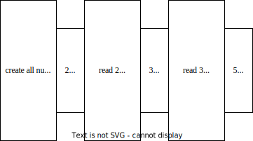
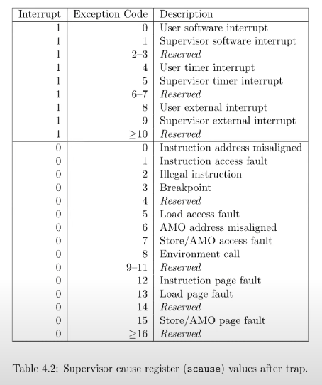
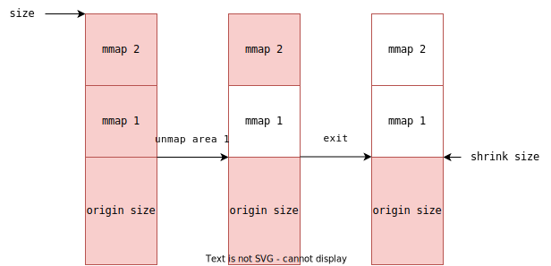

MIT6S081 作业笔记
mit6s081 homework notes

Created: 2023-06-22T16:33+08:00
Published: 2024-05-09T11:17+08:00

Categories: OperatingSystem

[6\.S081 / Fall 2020](https://pdos.csail.mit.edu/6.S081/2020/schedule.html)

`make qemu` 运行
`Ctrl-a x` To quit qemu type

```bash
make CPUS=1 qemu-gdb
gdb-multiarch
```

[TOC]

简单的 debug 宏

```c
#define DEBUG

#ifdef DEBUG
#define debugprint(...)  printf(__VA_ARGS__)
#else
#define debugprint(...)
#endif
```

配环境：https://zhuanlan.zhihu.com/p/624091268

make 报错会有一些包要安装：https://bevisy.github.io/p/compile-qemu-on-ubuntu-20.04/

# util

https://pdos.csail.mit.edu/6.S081/2020/labs/util.html

## sleep

`write(fd, str, len(str))`

`fprintf(fd, str)`：一般让 fd 为 2，向 `std:err` 写

See `kernel/sysproc.c` for the xv6 kernel code that implements the `sleep` system call (look for `sys_sleep`), `user/user.h` for the C definition of `sleep` callable from a user program, and `user/usys.S` for the assembler code that jumps from user code into the kernel for `sleep`.

首先用户态提供函数 `sleep()` 给 process 调用

当 process 调用 sleep 时候，就会进入 kernel，文件名称叫做 `usys.S`，可能是从 user 到 system，这个过程会有一个压栈：

```assembly
# user/usys.S

.global sleep
sleep:
 li a7, SYS_sleep
 ecall
 ret
```

ecall 就是调用 kernel 中的 sleep，所有 kernel 态的函数命名是 `sys_<syscall_name>`

我注意到这里有一个 `tickslock`，意思是 sleep 需要 lock 上，内部的调用就更加复杂了。

Ubuntu 安装 Python，查看 [ubuntu /usr/bin/env: python: No such file or directory

## pingpong

看起来一个管道是用来单向的数据流传输，两个进程通信使用了两个管道实现你来我往。
记得 `close` 不需要使用的那一端的 file descriptor

## primes


pipe then fork then close

没 close，child 不会退出

提前 close，child 看不到这个 file descriptor

## find

每一个目录也是文件，其 byte array 是结构体数组：

```cpp
// Directory is a file containing a sequence of dirent structures.
#define DIRSIZ 14

struct dirent {
  ushort inum;
  char name[DIRSIZ];
};
```

一个文件夹如果从 char 的角度去看，就比如：

```
.
..
foo
bar
```

打开 dir，读取每一个 dirent：` while (read(fd, &de, sizeof(de)) == sizeof(de))`
从取出文件名，再递归检查是文件还是文件夹

`T_DIR` 所表示的 file，里面是 `dirent` struct sequence，dirent 记作 de，`de.name` 就是形如 `cat`、`README` 之类的东西。尤其需要注意的是，这个 sequence 里面有 `.` 和 `..`。

所以如果要读取 dir 下面的文件，需要把 `dir` 的 path 加上 `/` 再加上 `de.name`

值得记录的是 `memmove()` 和 `strcpy()` 和 `strcmp()` 的使用

`memove()` 要担心 src 在 低地址，dst 在高位置，此时要从后往前写

一个 trick 是使用 descent 的 name 数组直接 memcpy()

```c
    strcpy(buf, path);
    p = buf+strlen(buf);
    *p++ = '/';
while(read(fd, &de, sizeof(de)) == sizeof(de)){
      if(de.inum == 0)
        continue;
      memmove(p, de.name, DIRSIZ);
      p[DIRSIZ] = 0;
//    ...
}
```

`strcmp()` 返回 0 才表示相等

`de.inum == 0` 这一步非常关键，因为表示 dir 的 fd 里面，有很多 padding 0，这些 padding 0 也会被解析为 de，要舍弃。

## xargs

我真的是感觉巨坑爹。

如果用 Python 写就容易得多，基本上是把 Python 翻译成 C 语言：

1. getline then split as args
2. use args call and wait
3. continue till not get line

创建一个子进程并在子进程调用：

```cpp
if (fork() == 0)
{
    // show_cmd(eargv);
    exec(ecmd, eargv);
}
```

### exec

exec 这个系统调用，书里说第一个参数是 `file`，可以在 `sh.c` 里看一下 exec 调用的例子，

> int exec(char *file, char *argv[]) Load a file and execute it with arguments; only returns if error.

比如 `exec("echo", ["echo", "a", "b"])` 这样子，查看 exec 的实现，可以知道是找到 echo 这个文件名对应的文件，然后 load 进入内存执行之。

### pits

首先构造奇怪的样例： `\n \n \s \s a b \s \s c`

要处理：

1. 连续的空白符
2. 连续的 `\n` 要不要多次触发 xargs

Unix 规定，每个文件结尾都要有 `\n`，我相信很多人都是闻所未闻：[Why should text files end with a newline?](https://stackoverflow.com/questions/729692/why-should-text-files-end-with-a-newline)，所以读取的文件就会像：`a b \n \0` 这样，只需要保证遇到 `\n` 触发 xargs 就好了。

我犯的错有：

1. 没有考虑连续的空白符
2. 没有考虑连续的前导空白符
3. `ret = read(0, &c, 1);` 可能有这样的结果：ret 为 0，c 却有效
4. 因为不知道保证每一行结尾有 `\n`，所以在 `ret=0` 的时候触发了 xargs

# System calls

收获：

1. 系统调用首先会把参数压栈，调用号在 a7
2. 进程有专门的 proc struct 表示
3. 进入内核态前，会把当前进程的 regs 保存到一个 trapframe 里面
4. 内核空间和用户空间的地址不是互通的，需要专门的内存存放

## trace call

系统调用逻辑：既要为

1. usys.pl 生成了用户系统调用的汇编：li syscall_num 到 a7 里，然后 ecall

2. 此处存在一个 用户态到内核态的切换，把寄存器存储到栈里了

3. kernel/syscall.c 先调用 syscall()，再根据 a7 转发
   通过 extern 关键字声明系统调用函数在外面

4. 添加一个系统调用 trace

    1. user.h 和 user.pl 为用户态使用
    2. kernel/syscall.h 添加调用号
    3. 和 kernel/syscall.c 暴露函数和函数地址数组
    4. sysproc.c 中，添加 sys_trace 修改 proc.h 中定义的 mask，实现参数传递
        1. 参数和返回值都在 a0
        2. p->trapframe->a0
    5. syscall.c syscall() 调用后输出 trace syscall 字符串
    6. proc.h 修改 fork 获得父进程的 tracemask

## sysinfo

### 注意点

1. 在 defs.h 中暴露接口
2. fstat 中提示了，通过 `copyout` 返回值判断是否传入合法的地址

### freemem

看了别人的答案，因为我实在不知道哪里去找有多少空闲的内容。

根据提供的测试样例 `sysinfotest.c` ，也是通过不断地 sbrk 来为进程扩展堆的大小，来测试 sysinfo 是否正确返回。
sbrk 的 调用关系：sbrk -> uvmalloc -> kalloc
kalloc 是维护空闲页面的链表每次分配一个页面

所以答案应该是 walk through 这个链表计数？

### proc num

遍历 proc[] 数组查看非 unused 状态的 proc 计数即可 `procdump()` 如初一辙
不用上锁。

# ptgtb

debug 出不来，放弃 😭

## print a page table

Windows 计算器在 `<<` 和 `>>` 要注意切换到 dec，否在在 hex 下 `<< 10` 就是移动 16 位了。

## a kernel page per process

因为所有的 proc 公用一个 kernel pagetable，所以如果要把 proc 自己的 pages 映射到 kernel 的 pagetable 里面，
不同的 proc .text 都是从 0 开始，再次公用就会导致重叠，
所以每个 proc 都要重新 alloc 一个 pagetable 表示 kernel page table

1. 抽离 kvminit 逻辑，把分配一页并建立 map 的逻辑抽离成函数 `pagetable kalloc_pg_map()`
2. 修改 kvm 逻辑，应该使用指定的 pagetable 建立映射而不是全局的 k_pagetable
3. 注释 procinit
4. allocproc 中 found 使用 proc.kpg 建立 proc 的 kernel stack
5. Modify scheduler() to load the process's kernel page table into the core's satp register (see kvminithart for inspiration). Don't forget to call sfence_vma() after calling w_satp().：我选择在 found=1 后添加，因为还不太懂
   这部分逻辑，怕开了分页以后挂掉
6. 只释放 proc 的 kernel pagetable，只解除映射关系

我的问题：

1. 调度那一段是怎么确定 proc 代码咋放置和 kernel back
2. 忘记释放 kernel proc stack
3. 使用 walkaddr 而不是 walk，因为 walkaddr 只能用在 user mode

## simplify `copyin/copyinstr`

[MIT 6\.S081 Lab3: page tables\-CSDN 博客](https://blog.csdn.net/rocketeerLi/article/details/121524760)

1. 新写一个函数，用来拷贝页面，参考 fork -> uvmcopy
2. 在 uvminit 中使用拷贝
3. 在 exec 和 fork 中使用拷贝
4. sbrk 最后调用 growproc，在 growproc 中使用拷贝 不能到达 PLIC，修改 uvmalloc

# traps

本节的收获是

1. 函数调用的约定，尤其是知道了函数的多的无法使用寄存器传递的参数在 fp 上面
2. trap 的工作流程，尤其是 trapframe 和 trampoline 合作从 user mode 到 kernel
3. 了解时钟中断的产生和进程调度

## function call

函数调用约定：[ARMv7\-A 那些事 \- 7\.栈回溯浅析 \- 知乎](https://zhuanlan.zhihu.com/p/667656237)

1. fp 指向上一个栈帧的 top
2. 多的函数参数就 fp 指的地方
3. caller 只负责给 callee 参数
4. callee 如果要使用 s1 等寄存器，需要保存下 caller 的。
5. fp 下面的第一个就是 ra，再下面是 fp
6. 对于 leaf，不会保存 ra

调用 printf 的逻辑：

### What value is in the register ra just after the jalr to printf in main?

`$ra`: 0xfe
after auipc `$ra` 0x0
`$ra`: 0x30, use $pc to set $ra

then
jalr 1528(ra)

`$ra`: 0x628, where printf located

### alarm

[MIT 6\.S081 Lab4: traps \- 知乎](https://zhuanlan.zhihu.com/p/440454679)

调用 handler 需要备份当前 trapframe，因为 handler 中可能修改 s1 等，而且 handler 不是正常返回，
正常的函数返回会复原上次调用的 s1 等寄存器，
handler 结束调用 syscall_sigreturn，把 s1 等寄存器又写到 trapframe 里面。

注意不要少写了 `*` p->trapframe。

# lazy allocation

## Lazytests and Usertests

bug:

1. 合法地址不能取等 p.sz
2. copyin 和 copyout 中通过 pa0 判断是不是存在映射，新建页面后 pa0 需要改回来

思路：

1. sbrk(negative)：传入 va 后，va 可能索引到 invalid 的 pte，可能导致 unmap，所以 invalid 的 pte 直接放过就好。
2. fork() 会拷贝父进程的内存给子进程，但是父进程里面可能存在 lazy alloc 的 page，重点是处理 fork > walk，可能要重写一个 walk
   如果 pte 不 valid，也不要报错。
3. sbrk 一个 lazy allocation page，然后 read 或者 write 它，最后都会调用 copyin 和 copyout，通过 pa0 判断是不是存在映射并建立映射。

# COW

易错：

1. 初始化 pages 的引用计数我设置为 1，这样调用 kfree 后刚好是 0
2. 传入 va 要 pagedown
3. pgcnt 要从 0 到 PHSTOP 开始 divide 4096，不能从 kernelbase 开始，难道 fork 后会 map 设备的 page？
4. 注意 scause 是 else if 不是 if

流程：

1. riscv.h 中设置 pte_c
2. fork() 调用 uvmcopy，
    1. set flag 中 pte_c, clear pte_w
    2. 把 child 映射到和父亲一样的物理地址上
3. 使用数组维护物理页面的 ref_count，表示多少个进程的 pagetable 中存在该页面
    1. vm.c 设置数组
    2. freerage 设置为 0
    3. kalloc 时候设置为 1
    4. fork 的时候调用 uvmcopy += 1
    5. free 页面的时候，先 -= 1，如果 ref_count 是 0 就直接 free
4. 发生无法写入的 page fault，
    1. 找到 va 对应的 pte，检查是否有 pte_c 且 valid，有才能进行
    2. 如果这个物理页的 ref_count 只有 1，直接把权限修改回去，可以写的，结束
    3. 拷贝该 pte 对应的物理页到新的一页，减少这个物理页的 ref_count，重新映射，结束
5. mappage 的时候，如果 cow page，允许 remap

# Multithreading

## uthread

You will need to add code to `thread_create()` and `thread_schedule()` in `user/uthread.c`, and `thread_switch` in `user/uthread_switch.S`.

One goal is ensure that when `thread_schedule()` runs a given thread for the first time, the thread executes the function passed to `thread_create()`, on its own stack.

Another goal is to ensure that `thread_switch` saves the registers of the thread being switched away from, restores the registers of the thread being switched to, and returns to the point in the latter thread's instructions where it last left off. You will have to decide where to save/restore registers; modifying struct thread to hold registers is a good plan.

You'll need to add a call to `thread_switch` in `thread_schedule`; you can pass whatever arguments you need to `thread_switch`, but the intent is to switch from thread t to next_thread.

1. 仿照内核线程调度，为每一个 thread struct 添加 context 用于保存 ra, sp, fp, s1-s11
2. thread_switch(p1.context, p2.context)，
3. `thread_create()`: 将 thread 的 ra 和 sp 修改就好
4. 记得 sp 要加上 stack_size

## Using threads

每次 insert 前后操作锁。

## Barrier

# lab Lock

## buffer cache

> When two processes concurrently miss in the cache, and need to find an unused block to replace. bcachetest test0 doesn't ever do this.

说明不需要考虑有一种可能死锁的情况：

1. process 1 占据 bucket A，发现没有足够的 buffer
2. process 1 请求占据 bucket B 的锁，希望可以从中发现空的 buffer
3. 但是 process 2 也恰好先占据了 bucket B，所以 process 1 在 bucket B 上自旋
4. process 2 发现 bucketB 中 cache miss，于是请求占据 bucket A
5. 死锁

### 我的尝试

1. 写了一个 bucket 中 buffer 数量固定的 hashtable，不从别的 bucket 中窃取，结果有时候可以 pass，有时候 failed。
2. 所有 bucket 共享一个 free buffer list，每当不需要一个 buffer 时候就放上去，需要的话就从里面申请：结果没有解决 contention 的问题
3. 从其他 bucket 窃取时，`bucketno_it = (bucketno_it + 1) / NBUCKETS`，应该是 `%`

# file system

## bigfile

1. inode，dinode 支持二级地址
2. bmap 可以分配二级间接块
3. itrunc 要释放 data block、一级间接块和二级间接块

```bash
make clean
make qemu
```

## symlink

实现 `symlink(target, path)`

1. create path 新建文件，得到文件对应的 inode
2. 向文件内写入 target

我第一次放着现成 api 没调用，想自己再实现用 ialloc 创建文件还写错了

修改 `open()`

1. 当且仅当 打开 `symlink & !O_NOFOLLOW` 时候，获得 inode 对应的 data content，递归调用 open

# mmap

1. 系统调用号，参考 syscall 的作业
2. vma struct 表示一个进程对文件的映射，根据指导手册，第一次映射区间一定从文件的开头开始
   打算操作系统维护一个大的 `vma[]` 数组，用一把锁保护，然后每个进程 process 存储自己 vma 的指针
3. vma 可能被调用情况：
    1. 一个进程重复调用，每次都要新给一个 vma
    2. 被 munmap，因为 `munmap(unmap_addr_start, length)` 只会在中间打洞，所以需要检查所有 vma 是否在这个区间内
4. vma 结构体
    1. 进程的虚拟地址 start 和 length
    2. 对应的文件 fd，记住要让 fd ref cnt++
        1. open 一个文件
        2. mmap 它
        3. close 一个文件，mmap 必须保证 fd 还在内存里
    3. munmap 当 length 为 0 的时候，就取消掉

file.h::vma

file.c::vmatable

proc.h::mvma

## 处理页面错误

exception code 为

load page fault 为 13，d

store page fault 为 15，f



在 usertrap 里

如果 stval 落在某个 valid vma 中，那么，

kalloc 一页，使用 iread() 读取这个文件的内容到一个页面中，

参考 `fread()`

读取以后，建立好 PTE 的映射，根据 vma.prot = R/W/X

vma:

```bash
length
start ------
  |
f.off ------
```

start

## tip

kalloc 要 memset 成 0

逻辑是这样的：

在 mmaptest 中，写入文件：

```c
char buf[BSIZE];

//
// create a file to be mapped, containing
// 1.5 pages of 'A' and half a page of zeros.
//
void
makefile(const char *f)
{
  int i;
  int n = PGSIZE/BSIZE; // n = 2, BSIZE = 1024

  unlink(f);
  int fd = open(f, O_WRONLY | O_CREATE);
  if (fd == -1)
    err("open");
  memset(buf, 'A', BSIZE);
  // write 1.5 page
  for (i = 0; i < n + n/2; i++) {
    if (write(fd, buf, BSIZE) != BSIZE)
      err("write 0 makefile");
  }
  if (close(fd) == -1)
    err("close");
}
```

写入一个 BSIZE 就是一个 page 的 $\frac{1}{4}$，总共写了 6 次，因为 每次调用 write 都会导致 fd 的 offset 改变，查看 `sys_write() > writei()`。

文件的大小由 write 决定

测试程序认为，这个 1.5 page 的文件映射（读取）到内存中，占据了两个 page，要求是后面的 0.5 个 page 内容应该是 0

但是 kalloc 会分配内存 memset 成 5

## unmap

test 保证 unmap 的长度为 pgsize 的倍数

1. 文件权限和 vma 权限检查匹配

2. unmap 一个还没有 map 的地址，会 panic，需要 addrwalk 检查

## bugs

1. 为进程寻找可用的 vma 时候，找到忘记 break 了

    ```c
    for (int i = 0; i < NMVMA; ++i) {
        if (p->mvma[i] == 0) {
            p->mvma[i] = v;
            break; // don't forget this
        }
    }
    ```

2. proc 被杀死的时候，是另一个进程来 free 它，会判断这个进程的 size 来 free 掉所有页表 `freeproc()`，如果这个时候 proc 内部还有 mmap memory 的页表的空洞在，就很麻烦，
   所以在 exit 时候，free 掉所有 vma，同时 shrink size 到还没有任何一次 mmap 的时候，所以要记录在所有的 mmap 前的 size，不然就要 hack uvmummap，但是 uvmunmap 又是由 initproc 调用的，没有把要 free 的 proc 传入参数，获取不到 被 free proc 的 vma 记录，所以还是在 exit 里 改掉 size 好。
   万幸没有在 mmap 后 sbrk，不然更麻烦
   

# net

难度全在

## Manual Reading

阅读开发手册 Chapter2，Page 7-19

一堆看不懂也不知道有没有用的东西。

2.3.3 简单提到了 DMA，网卡内置 FIFO 用于发送和接受数据，DMA 可以直接 access host memory，并且修改 descriptor。

2.5 说了 MAC 地址存储在两个寄存器里

2.6 迷迷糊糊提到有 Read、Set 和 Mask 寄存器，但是不知道具体的读取机理。
我知道中断发生的原因存储在 Read 里面，Mask 可以控制是否屏蔽中断，但是 Set 寄存器有啥用？
clear-on-read 是一个机制。

参考 13.4.17 和 13.4.21

2.7 硬件支持 checksum 的计算和校验

2.8 和 2.3.3 呼应，软件提供 buffer，有 descriptor 的概念，packet 的发送（transmit，TX）是需要从 host memory 移动到 FIFO 中，接受需要从 FIFO 移动到 host memory 中。

3.2.6

NIC 的寄存器中存储的是 Ring of descriptors 的地址、长度、头尾，NIC 内置 descriptor 的 cache，等到完成传输或者发送以后，将 descriptor on chip 写回（write back）到内存的 descriptor 上。
每个 descriptor structure 内有 buffer address，见 e1000_dev.h，而且为了 fit in cache line，chip 对 ring 的大小也有要求。

这个 ring 的 head 地址交给 NIC 处理，NIC 会把新的 descriptor 写到 head 对应的内存位置，tail 交给软件处理，软件要处理接收到的 buffer

NIC 提供多种灵活的中断，比如 absolute delay timer 和 delay timer，可以设置

-   每收到一个 packet 就中断
-   每收到一个 packet 就等一会再中断
-   收到一个 packet 后，等一小会儿，如果这段时间有新的 packet，就接着等，否则中断

跳过 3.2.9 直接到 3.3

3.3.3 介绍 transmit descriptor 结构，有 legacy 和 non-legacy，根据教授的代码，可以确定是 legacy type
3.3.3.1 说明如何发送一个 buffer，要 set CMD 中的 RS，这样发送完成后，descriptor 中的 status 中的 DD 就会被 set。
3.3.4 就不看了

3.4 介绍 transmit descriptor buffer 的结构，一个 descriptor 大小为 16 bytes
四个寄存器，base,len, head, tail：

-   len 记录 buffer 的长度，单位为 bytes
-   head 和 tail 记录的是 offset，也就是 index

> Software can determine if a packet has been sent by setting the RS bit (or the RPS bit for the
> 82544GC/EI only) in the transmit descriptor command field. Checking the transmit descriptor DD
> bit in memory eliminates a potential race condition. All descriptor data is written to the IO bus
> prior to incrementing the head register, but a read of the head register could “pass” the data write in
> systems performing IO write buffering. Updates to transmit descriptors use the same IO write path
> and follow all data writes. Consequently, they are not subject to the race condition. Other potential
> conditions also prohibit software reading the head pointer.

上文介绍如何判断一个 packet 成功被发送：设置 RS 位，检查 DD。

> All descriptor data is written to the IO bus prior to incrementing the head register, but a read of the head register could “pass” the data write in
> systems performing IO write buffering.

这句话的意思是，虽然先 write back descriptor，然后再更新 head register，但是在使用了 IO write buffering 的系统中，因为 write back 可能写到 IO buffer 中了，导致 head register 被更新，但是内存中的 descriptor 没有被更新，就是 cache coherence。

3.4.1 descriptor 的发送也是从 buffer 中挑选 descriptor，放到 FIFO on chip 上。

3.4.2 write back 发生的条件
3.4.3 介绍发送中断产生的原因，可以是发送完一个 packet 中断一下，适用于想要知道发送进度的场景；可以是发送完了所有的 packet 然后中断，也可以是发送完了一个 packet 后 delay 中断……

跳到第 13 章

## Programming

transmit hints 都告诉大家怎么写了。

recv 中第一个为什么要取出 `E1000_RDT` 再加一呢，因为一开始 head 为 0，tail 为 ring_size-1，当 NIC 收到 packet 发出中断后，head+= 1，但是 tail 还是指向一个 empty descriptor。
所以 tail 要再加一。

recv 有一种可能，就是收到一个包以后，发出中断，CPU 处理中断的同时中断被屏蔽，此时 NIC 继续接受到网络上的包，这些包的到达也会发出中断，但是因为 CPU 中断被屏蔽了，所以没有被处理。
所以如果 CPU 每次中断只处理一个网络上的包，就会漏包，所以每次要尽可能多处理。

最后不知道为什么 DNS 解析不了，换了别人代码也一样。
