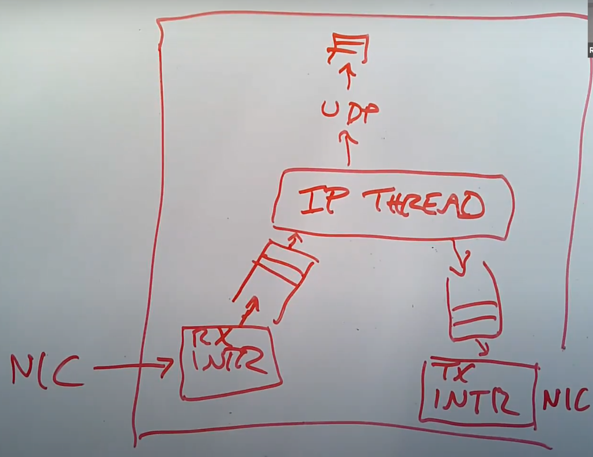
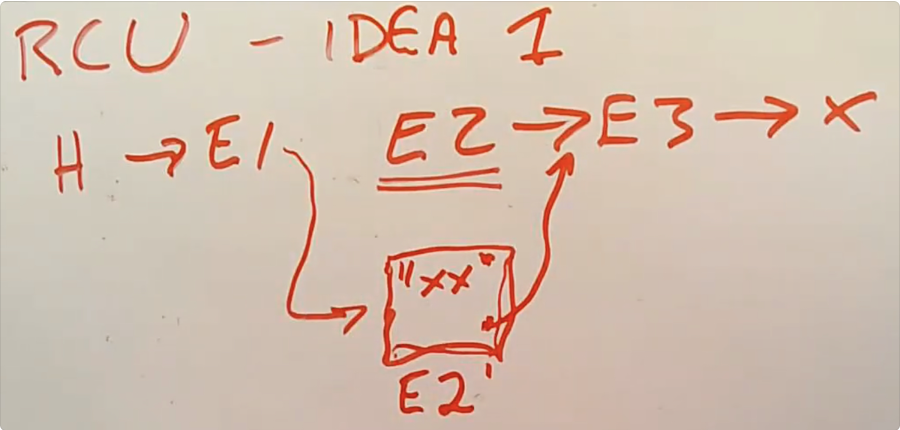

MIT6S081 课程笔记
mit6s081 lecture notes

Created: 2023-06-05T20:26+08:00
Published: 2024-05-12T12:13+08:00

Categories: OperatingSystem

关于这门课程使用到的资料：

-   schedule: https://pdos.csail.mit.edu/6.S081/2020/schedule.html
    schedule 可以认为提供了资源（如 pdf、video）和给出了学习的顺序
-   课程转录：https://mit-public-courses-cn-translatio.gitbook.io/mit6-s081/
-   课程视频：https://www.bilibili.com/video/BV19k4y1C7kA/
-   书籍翻译，实验解析：http://xv6.dgs.zone/tranlate_books/book-riscv-rev1/summary.html

[toc]

# Lecture 01

-   如何建立用户软件和硬件之间的联系？
-   什么是 jump into the kernel？
-   你觉得操作系统课程哪里有趣呢？给出自己的答案，可以参考教授说的。
-   介绍 open、fork 等系统调用，引入 fd、process 和 copy 等概念
-   告诉我们 shell 执行命令，是在 exec

---

比如电脑上有 VI 这个 text editor，CC 这个 compiler，SH 这个 shell

硬件就是 CPU、RAM、DISK 之类的，之间的联系是 Kernel Space，这里面有 File System（FS），FS 作为桥梁，要对那些软件（Process）提供一些接口：

-   Memory Alloc：不同软件的内存多少
-   Access Control：能不能读写这个文件
-   ……

> we are interested in how the applications interact with the kernel and how the interfaces look like

example:

`fd = open("out", 1)` jump into the kernel and kernel achieve the args.

jump into the kernel 是针对函数说的，当函数 jump into the kernel 的时候，它就有了 privilege，可以 modify disk 之类的，而这是普通的 function call 无法做到的。

计算机还是神奇的，在硬件和软件之间提供了物理桥梁，你看相同的硬件可以运行不同的操作系统，比如在主板上装 Win10 或者 Ubuntu

这种硬件和软件建立联系的结果很吸引人。

我们需要自己设计 interface，在 simple 和 efficient 之间做取舍。

教授还展示了 open 等一系列 syscall 的样例

-   open：介绍了 fd，每一个进程都会维护自己的 fd table，一个 fd 就是一个进程打开了一个文件
-   fork：创建一个新的进程
-   exec：替换当前程序

fork 使用的例子比较特殊，会交替`printf`，打印字符

当我们在 shell 中执行命令的时候，比如 `$ echo abc`，把 echo 对应的二进制码让处理器去运行，真的背后是 shell fork 了一个 process，在这个 child process 里面执行了 echo

# Lecture 02 - 16

都写到 [xv6 代码执行流](https://www.cnblogs.com/ticlab/p/18137544) 这篇文章里面了。

# Lecture 17 Virtual Memory for Applications

这一讲介绍的是「应用程序使用虚拟地址」。
让我印象最深的是，可以让应用程序像 kernel 那样处理异常和中断，教授上课介绍了 signal 机制，
我想起对于一些应用程序，按下 Ctrl+C 是无法中止的，因为应用程序自定义了 SIGINT 的处理方式。

来自 GPT 的对话：

> 为什么一些程序无法使用 ctrl + c 中止

有几种可能的原因导致某些程序无法使用 Ctrl+C 中止：

1. 程序没有正确处理中断信号：当你按下 Ctrl+C 时，操作系统会发送一个中断信号（SIGINT）给正在运行的程序。如果程序没有正确处理这个信号，它可能会忽略中断请求，导致无法中止。
2. 程序正在执行一个耗时操作：如果程序正在执行一个耗时的操作，例如计算密集型任务或者长时间的循环，它可能无法立即响应中断信号。在这种情况下，你可能需要等待一段时间才能中止程序。
3. 程序被设计为无法中止：有些程序可能被设计为无法通过中断信号中止，这可能是出于安全性或其他特定需求的考虑。这些程序可能会忽略中断信号或者采取其他措施来防止被中止。
4. 操作系统或终端程序的问题：有时，操作系统或终端程序本身可能存在问题，导致 Ctrl+C 无法正常工作。这可能是由于软件错误、配置问题或其他因素引起的。

如果你遇到无法使用 Ctrl+C 中止的程序，你可以尝试以下方法：

1. 等待一段时间，看看程序是否会在某个点响应中断信号。
2. 尝试使用其他中止程序的方法，例如发送其他信号（如 SIGTERM）或者使用操作系统提供的任务管理器来终止程序。
3. 检查程序的文档或官方资源，了解是否有特定的中止方法或选项。
4. 如果问题持续存在，可能需要进一步调查操作系统、终端程序或程序本身是否存在问题，并尝试修复或寻求其他解决方案。

> 应用程序对于 SIGINT 默认的处理方法是什么

对于大多数应用程序，默认情况下，它们会对 SIGINT（中断信号）采取默认的处理方法。默认处理方法通常是终止程序的执行。
当应用程序接收到 SIGINT 信号时，操作系统会发送该信号给应用程序。应用程序会捕获该信号并执行默认的处理方法，这通常是终止程序的执行。这意味着按下 Ctrl+C 或发送 SIGINT 信号将导致应用程序退出。
然而，需要注意的是，应用程序可以通过注册信号处理函数来自定义对 SIGINT 信号的处理方式。在这种情况下，应用程序可以选择忽略 SIGINT 信号、执行特定的操作或采取其他自定义行为。这取决于应用程序的设计和需求。
总之，大多数应用程序默认情况下会终止执行，但具体的处理方式可能因应用程序的自定义设置而有所不同。

# Lecture 18 OS Organization

微内核的想法，介绍了 IPC，最原始的 IPC 需要两个通信进程分别进出 kernel，将发生用户空间到内核、内核到用户空间的数据拷贝，而且切换到 kernel 需要 flush TLB，是一个开销非常大的动作。
于是介绍了 IPC speedup 的方法，一种 Synchronous 的 send-recv 机制。

通信的两个进程中一者已经在内核中，等待另一者。比如进程 P2 调用 recv 要求进程 P1 send，但是 P1 的 send 还没来，于是 P2 自己就在内核中躺着，等到 send 一发生，就立刻响应这个 send，
让内核直接拷贝 P1 的用户数据到 P2 的用户空间中。
就不用进程切换和两次拷贝的开销。

为了验证性能，做了个 L4/Linux，让 Linux kernel 以一个 process 的形式启动在 L4 中，其他 VI、SH 等进程也是 L4 的 进程，让 kernel 和 process 做 IPC。

Mach 是微内核，像 MacOS 就借鉴了 Mach 部分的实现。

# Lecture 19 Virtual Machine

方法一：纯粹用软件模拟虚拟机的执行，会慢。

方法二：trap and emulate：虚拟操作系统运行在 user space，当虚拟操作系统执行特权指令时候 trap，交给 Virtual Machine Monitor 执行。

分为 Guest Space 和 Host Space，一种实现方式是让 Virtual Machine Monitor 在 Supervisor Mode 运行，每一个 Guest Machine 的指令直接在硬件上执行。
但是 Guest Machine 的指令如果涉及到如 satp 这类寄存器的修改，比如切换页表，那么就会 trap，在 trap 中执行 Guest 的特权指令。VMM 记录特权指令的涉及到的寄存器的值，这个叫做 Virtual State，为每一个 Guest 保存一个 Virtual State。

Virtual State 中记录 s 寄存器的值，Guest 在 kernel 还是 user mode，模拟的 hart 数量。

## 页表转换

satp 的切换 VMM 不能直接在硬件上执行，因为这会把整个机子的内存暴露给 Guest。

GuestPageTable 保存了 gva（Guest Virtual Address）到 gpa（Guest Physical Address）的映射，
VMM 维护一个 shadow pagetable，保存 gpa 到 hpa（Host Physical Address）的映射，
真正使用的 satp 是这两个页表的组合，防止虚拟机从分配的内存中逃脱。

## 设备

三种方法：

1. emulation：为了让 Guest 操作设备，VMM 模拟一个设备，当发现 Guest 要访问特定范围内存时候，VMM 知道了，就模拟一个对应的设备。
2. virtual device: 类似 virtuio_disk.c 的方法，不是模拟真实的物理设备，Guest 也知道自己在使用某种设计好的接口操作设备
3. pass through real device

方法三：硬件层面支持虚拟化，如 intel 的 VT-x 方案，每一个 core 添加一组寄存器 和 EPT，用于给 Guest 运行特权指令。

最后是 Dune，利用 VT-x 让进程直接拥有自己独立的页表，从而不必再使用虚拟机实现沙箱机制。

# Lecture 20 Kernels and High Level Languages

用高级语言开发 Kernel 的得失。

高级语言有高级语言的好处：比如 GC、类型检查、协程、自带的数据结构（string、map）……

课程组用 Go 开发了一个 Kernel，起名叫做 Biscuit。

先在裸机上通过一些 shim code 对硬件做调整启动 go runtime，然后用 go 语言写 kernel。

结果：roughly similar

# Lecture 21 Networking

Ethernet 同级别有 WiFi，Ethernet 是物理层的，比如电脑用网线连接起来组成局域网，这个局域网内的 packet 传输需要表示从哪一个网卡发送到哪一个网卡，每个网卡有 MAC 地址标识。
所以每个 Ethernet 的 packet 数据格式包括 Source, Destination, Type, Payload. Type 标识这个 Packet 交给哪一种上层协议处理，可以是 IP 或者 TCP。
Source, Destination, Type 就是 Ethernet Header。

NIC 是 Network Interface Card（网络接口卡）的缩写，也被称为网络适配器、网络接口控制器或网络接口器。它是一种用于连接计算机与计算机网络之间的硬件设备。

论文中，也就是传统的处理 Packet 的方法：

> 现在我们有了一张网卡，有了一个系统内核。当网卡收到了一个 packet，它会生成一个中断。系统内核中处理中断的程序会被触发，并从网卡中获取 packet。因为我们不想现在就处理这个 packet，中断处理程序通常会将 packet 挂在一个队列中并返回，packet 稍后再由别的程序处理。所以中断处理程序这里只做了非常少的工作，也就是将 packet 从网卡中读出来，然后放置到队列中。
>
> 之后，在一个独立的线程中，会有一个叫做 IP processing thread 的程序。它会读取内存中的 packet 队列，并决定如何处理每一个 packet。其中一个可能是将 packet 向上传递给 UDP，再向上传递给 socket layer 的某个队列中，最后等待某个应用程序来读取。通常来说，这里的向上传递实际上就是在同一个线程 context 下的函数调用。
>
> 通常来说网卡会有发送中断程序，当网卡发送了一个 packet，并且准备好处理更多 packet 的时候，会触发一个中断。所以网卡的发送中断也很重要。



实验中是用 DMA:

> 接下来我将讨论一下 E1000 网卡的结构，这是你们在实验中要使用的网卡。E1000 网卡会监听网线上的电信号，但是当收到 packet 的时候，网卡内部并没有太多的缓存，所以网卡会直接将 packet 拷贝到主机的内存中，而内存中的 packet 会等待驱动来读取自己。所以，网卡需要事先知道它应该将 packet 拷贝到主机内存中的哪个位置。E1000 是这样工作的，主机上的软件会格式化好一个 DMA ring，ring 里面存储的是 packet 指针。所以，DMA ring 就是一个数组，里面的每一个元素都是指向 packet 的指针。
> [21\.7 Ring Buffer \| MIT6\.S081](https://mit-public-courses-cn-translatio.gitbook.io/mit6-s081/lec21-networking-robert/21.7-ring-buffer)

# Lecture 22 Meltdown

介绍了 L1 L2 TLB 的细节：[22\.4 CPU caches \| MIT6\.S081](https://mit-public-courses-cn-translatio.gitbook.io/mit6-s081/lec22-meltdown-robert/22.4-cpu-caches)

前置知识：

1. 用户态可能直接拥有内核态的页表拷贝，这样避免切换到内核态的时候 TLB flush。所以如果不做权限检查，用户可以直接不切换到 kernel 直接读到 kernel 的数据。
2. speculative execution：CPU 预先执行指令，如 load 后面的指令不必等待 load 执行完成；if-else 分支内的指令不必等待 cond 计算完成
3. retirement：预先执行的指令可能是无效的，要 retire 这些指令，比如分支预测错误，修改了 r1，要改回 r3 为原来的值
4. rdtsc（read time stamp counter）指令得到多少个 CPU cycle，clflush 确保某个地址不在 cache 中

Meltdown 利用了预先执行指令却不检查指令的权限的漏洞。

```pseudocode
buf[8192]
// flush cache
clflush buf[0]
clflush buf[1]

<some expensive instruction like divide> // try to defer (1) retirement

r1 = <a kernel virutal addr>
r2 = *r1 						// (1) will pagefault in retirement
r2 = r2 & 1 					// get lowest bit
r2 *= 4096
r3 = buf[r2]					// (2) before retirement try to load into cache

<handle page fault from "r2 = *r1">

// reload of flush+reload
a = rdtsc
r0 = buf[0]
b = rdtsc
r1 = buf[4096]
c = rdtsc

if b-a < c-b:
	low bit was probably a 0
```

为了利用 CPU 预先执行的特点，把 (1)-(2) 之间的指令都执行了，就要推迟 `r2=*r1` retirement 的时间。通过 expensive instruction 延迟 `r2=*r1` 的时间。

一旦 `r3=buf[r2]` 执行，哪怕被 retire，但是 buf 已经被 cache 了，所以最后判断 r2 是 4096 还是 0.

note. 结合 clflush 指令和 rdtsc 指令可以判断 cache 大小。

# Lecture 23 RCU

RCU 的全称是 Read-Copy-Update

## 读写锁存在性能问题

```pseudocode
r_lock(l):
	while 1:
		x = l->n
        if x < 0:
			continue
        if CAS(&l->n, x, x+1):
			return
```

> 所以 r_lock 中最关键的就是它对共享数据做了一次写操作。所以我们期望找到一种方式能够在读数据的同时，又不需要写数据，哪怕是写锁的计数器也不行。这样读数据实际上才是一个真正的只读操作。

如果有 n 个线程在 n 个 CPU 上读一个数据，也会因为要写 `l->n` 导致 $O(n^2)$ 获取锁的开销：

1. 第一次 n 个线程 CAS，但是 1 个成功
2. 第二次 n-1 个线程 CAS，但是 1 个成功
3. ……

## RCU

以链表为例，解决方法是读者完全不需要锁，直接读，但是写者只是修改数据结构的 node，得到读者读完以后，再 commit writing，修改数据结构，free 掉。



规则：

1. reader 读数据不允许被 context switch，通过关闭中断实现，这段代码是 reader 的 critical section
2. writer commit 数据前，要求自己在所有 cpu 上都被 schedule 过，这样 reader 如果在读取修改的 node 时候，必须结束读取。writer 通过 schedule 让所有 reader 结束对修改的 node 持有，这样就可以安全地释放 E2.

[23\.6 RCU 用例代码 \| MIT6\.S081](https://mit-public-courses-cn-translatio.gitbook.io/mit6-s081/lec23-rcu-robert/23.6-rcu-yong-li-dai-ma)
