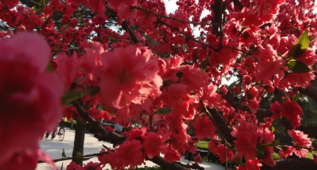
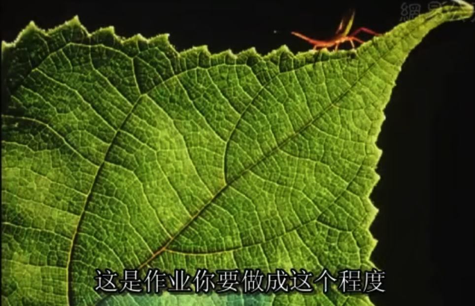
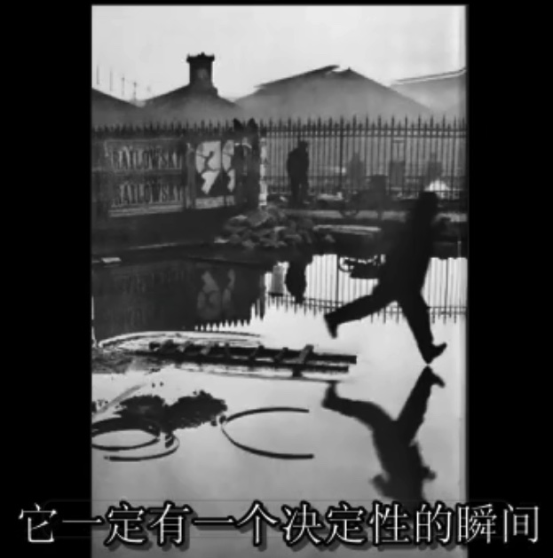
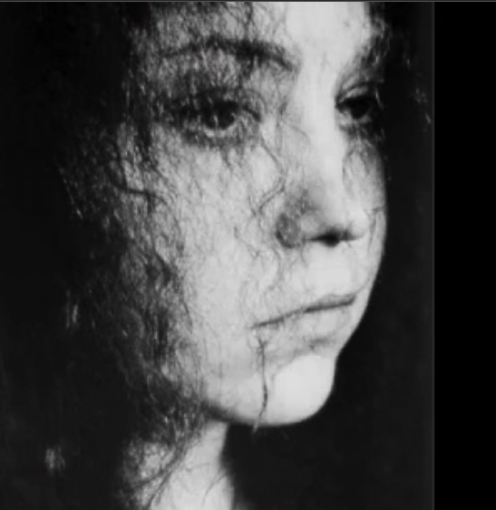

摄影的实用性与艺术性漫谈笔记

来自杨晓利老师的 [北京工业大学公开课：摄影的实用性与艺术性漫谈](https://www.bilibili.com/video/BV1Q441117hi/ "点击查看哔哩哔哩视频")

[toc]

# 摄影的视觉意义

为什么要拍片子？摄影可以讲述故事，摄影可以传播新闻，比如《饥饿的苏丹》，摄影可以记录心情。

摄影的意义：

- 摄影使光线停留
- 摄影使真实永存
- 摄影拓宽视角。要肯趴下，登高、如水，探索不同的视角。微距摄影，拉近拉远等等。

# 摄影的必备器材与拍摄技法

必须先了解自己适合或者打算拍摄什么，人物、建筑、风景等等，这决定了我们要携带什么器材，购置什么样的相机。

## 相机分类

传统胶片相机：

- 135 单镜头反光式照相机
- 135 旁轴取景式照相机
- 120 单镜头反光式照相机
- 120 双镜头反光式照相机
- 大画幅照相机：拍很大照片用的
- 一次成像相机：虽然色彩失真，但是没有底片，色彩很独特。

135、120 什么意思，这个数字是胶卷的序号，柯达公司 1895 年生产的胶卷叫做 101 号，后来生产序号到了 135 号。用 135 胶卷的相机就是 135 相机。有的数码相机名字里也带 135，是因为 CCD 面积是 35mm x 24mm，按照 135 胶片设计的。

单镜头：取景和拍摄使用的是同一个镜头。

反光式：相机中有反光板，使得我们看到的成像是正像而不是倒像。

生活中所谓“单反相机”，就是单镜头、反光式。

取景：旁边有专门的取景器进行取景。

双镜头：一个镜头拍摄，一个镜头专门用于取景。这样的好处是，取景的姿势可以更加灵活，所以数码相机有翻转屏。

传统相机有一个制作过程，自己冲洗、自己装裱，这种体验是数码相机无法带来的。

现代相机：

- 单反式相机
- 微单相机：取消了反光板转置，所以体积较小。有专门的取景部件，可更换镜头
- 类单反：虽然不能更换镜头，但是焦距可调范围广
- ……
- 卡片机：小巧，可以“悄悄地”、快速地拍摄人物、纪实

## 相机部件

光圈：控制光线进入相机。光圈控制景深。

光圈越大，景深越小，光圈越小，景深越大。控制景物清晰的深度范围的。

比如近和远都要清晰，那就用小光圈，只要某一个平面清晰，其他的糊掉，就用大光圈。如果对于景深没有要求，可以考虑用中等光圈，这样可以防止四角发虚。

快门：理解为控制曝光时间。比如夜晚的车流很长的线条，曝光时间就长，还有像圆圈一样的星轨，也需要控制曝光时间。参考 [星轨照片拍摄曝光时间的探讨](https://mp.weixin.qq.com/s/Pj1pZ8Eadu182rFa1D6qbg)。可以用于慢速摄影。

有慢速摄影就有高速摄影，**两万五千分之一秒**的快门，可以拍摄到很多一瞬间的影像，慢了就虚了。

# 摄影的视觉平面艺术构成

如何观察

不要被课本上的构图之类的条条框框限制了，观察是在构图之前的。

摄影造型四个要素：形状、线条、影调和色彩。

形状：考虑物体是否具有鲜明的形状。比如方形的房子，圆形的月亮天池等，形状打动了作者。

线条：水的波纹、稻田中作物的线条、草地中的蜘蛛网线条、海岸线的线条。

下面是一个不好的例子：

<!--   -->

没有线条与形状，杂乱。

影调：如果要从事黑白摄影，需要学习，比如需要使用什么程度的灰色。不是在 PS 里调色出来的。

色彩：冷暖需要我们控制。比如恋人在夕阳下相拥，适合暖调，“孤舟蓑笠翁”听起来就是冷色调。还可以冷暖同时出现。

优秀的示例，线条、形状和色彩都考虑到了。

<!--  -->

# 摄影的光线艺术

光的效果有很多：顺光、侧光、逆光、侧逆光、混合光……

- 顶逆光：光源在物体的后上方
- 顶光：中午 12 点的光线
- 纯逆光：光源在物体的正后方
- 脚光：光源在物体的脚下
- ……

侧逆光来勾画人物，有人物的轮廓和阴影，顺光就太平了

有光就有影，影子也可以有线条、形状、影调和色彩。

# 摄影的瞬间性

摄影的本质

比如青蛙如水，只有一瞬间，要抓住事物发展的决定性瞬间。

<!--  -->

早一点，脚还没离水那么近，晚一点，水就被踩碎了，所以过早过晚都不行，要抓住瞬间。

对于纪实摄影和新闻摄影，伴随瞬间性的还有新闻性和真实性，不能摆拍，要反映现状，绝对不能后期处理，这是原则性问题。

课程的最后，杨老师让同学在 30 秒内拍摄老师自己，目的就是让同学感受到拍摄的瞬间性，要有拍摄的状态，动作要快，多拍几张，防止经典的神态转瞬即逝。

# 摄影的艺术情感与艺术风格

摄影的最高境界

把自己的情感融入摄影作品中

被摄对象和摄影者之间有情感上的共鸣，摄影者会更精心地构思、选择线条、形状、影调等元素来表现被摄对象。

 <!----> 

摄影者利用色调、发丝的形状来表现被摄对象那种犹豫的神态。

杨老师拍摄中国古塔，每拍摄一座前，就要了解塔背后的内涵与文化，在拍摄的照片中倾注自己的情感。
