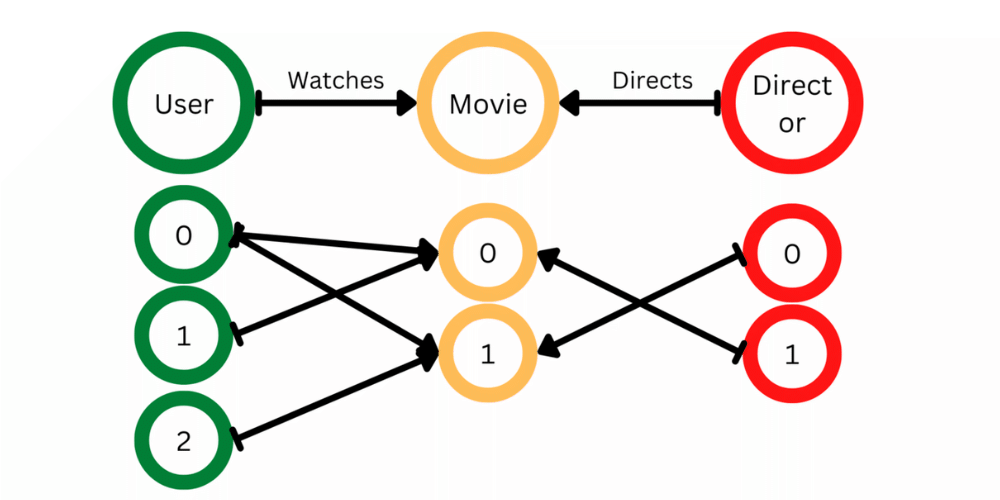

DGL 教程阅读笔记

Datetime: 2023-03-27T17:29+08:00

Categories: Python | MachineLearning

教程网址：https://docs.dgl.ai/en/latest/index.html

毕设的笔记，只能给自己看，换一个人或者过一段时间，估计就看不懂了。

[toc]

```python
import dgl
import torch as th
```

> For absolute beginners, start with the [Blitz Introduction to DGL](https://docs.dgl.ai/tutorials/blitz/index.html).

正确的阅读顺序是先阅读 blitz，然后再阅读 user guide。

但是我都看到 user guide 3.1 了才发现这一句话，气死了。

# 图节点和边

## represents the graph

-   how to create a graph using list/tensor

notation:

-   graph
-   node
-   edge

DGL 使用一维张量表示 nodes，U 是一个 node 的 tensor，int[]。

DGL 中都是有向边，使用两个一维张量构成的元组表示边，`(int[] U, int V[])`，U[i], V[i] 表示有一条边

DGL 使用最大的 ID 推断有多少个点，所以，如果有 id 啥的，需要转换成 [0,1,2] 这样子

```python
u, v = th.tensor([0, 0, 0, 1]), th.tensor([1, 2, 3, 3])
g = dgl.graph((u, v))
print(g) # 图中节点的数量是 DGL 通过给定的图的边列表中最大的点 ID 推断所得出的
Graph(num_nodes=4, num_edges=4,
      ndata_schemes={}
      edata_schemes={})
```

> 对于无向的图，用户需要为每条边都创建两个方向的边。可以使用 [`dgl.to_bidirected()`](https://docs.dgl.ai/en/latest/generated/dgl.to_bidirected.html#dgl.to_bidirected) 函数来实现这个目的。

节点的类型是 int32 或者 int64

```python
th.tensor(data, dtype=th.tensor.int32)
```

## represent the features

在接触 DGL 之前，我以为一张图里，每个点的 feat 就是一个向量罢了，那么整张图的 node 的 features 就是一个 $num\_nodes \times num\_feat$ 的矩阵。一个图上所有节点的特征表示为一个矩阵，这就是我最初的想法。

后来发现自己想错了，DGL 允许图的 feature 有多个矩阵，只需要给「每一种」feat 起名字就好，所有节点的特征可以表示成多个矩阵。

```
feat1:
[
node0:1,1,1;
node1:2,2,2;
node2:3,3,3;
]

X:
[
node0: 3,4,5;
node1: 5,6,7;
node2: 7,8,9;
]

y:
[
node0:0;
node1:1;
node2:0;
]
```

比如图上所有节点的特征向量表示成一个矩阵，起一个名字叫做“X”，所有节点的标签表示成一个矩阵，叫做“y”。这样图节点的特征就可以通过 `dict<str:tensor>` 来管理。

那么索引一个节点的特征，就至少需要两个参数，一个是节点的 id，一个是特征所在 tensor 的名字。

```python
g.ndata['x'] = th.ones(g.num_nodes(), 3)
g.ndata['y'] = th.randn(g.num_nodes(), 5)
g.ndata['x'][1]                  # 获取节点 1 的名字叫做「x」的特征
```

相当于一个矩阵 x 存储了一种 feature，一个矩阵 y 存储了另一种 feature

实现上，叫做 ndata 和 edata，edata 想法类似，不赘述。

## heterogeneous graph

### create

-   三元组关系定义
-   metagraph

> 一个异构图由一系列子图构成，一个子图对应一种关系。每个关系由一个字符串三元组 定义 `(源节点类型, 边类型, 目标节点类型)` 。由于这里的关系定义消除了边类型的歧义，DGL 称它们为规范边类型。

异构图可以拆多个二分图，一定要理解这一点。后续消息传递，也是针对二分图而言。

通过定义有限的边（节点交互）的类型，来定义多个子图，最后定义一个异构图。

子图中，每个节点的编号还是从 0 开始的

<!--  -->


图片与代码来源于 https://www.geeksforgeeks.org/create-heterogeneous-graph-using-dgl-in-python/

```python
import dgl
import torch

data_dict = {
	('user', 'watches', 'movie'): (torch.tensor([0, 0, 1, 2]),
								torch.tensor([0, 1, 0, 1])),
	('director', 'directs', 'movie'): (torch.tensor([0, 1]),
									torch.tensor([1, 0]))
}
hetero_graph = dgl.heterograph(data_dict)
hetero_graph
```

> _metagraph_ 中的一个节点 $u$ 对应于相关异构图中的一个节点类型。_metagraph_ 中的边 $(u,v)$ 表示在相关异构图中存在从 $u$ 型节点到 $v$ 型节点的边。

让我们回到官方的代码：

```python
import dgl
import torch as th
# 创建一个具有 3 种节点类型和 3 种边类型的异构图
graph_data = {
   ('drug', 'interacts', 'drug'): (th.tensor([0, 1]), th.tensor([1, 2])),
   ('drug', 'interacts', 'gene'): (th.tensor([0, 1]), th.tensor([2, 3])),
   ('drug', 'treats', 'disease'): (th.tensor([1]), th.tensor([2]))
}
g = dgl.heterograph(graph_data)
g.ntypes
g.etypes

g.canonical_etypes # [元组形式 rel]
# [('drug', 'interacts', 'drug'),
#  ('drug', 'interacts', 'gene'),
#  ('drug', 'treats', 'disease')]
```

```python
g.metagraph().edges()
```

### set and get ndata/edata

原文说得很好了，通过一个 key 去拿到 subgraph

关键是把整个图的数据存取想象成一个字典，确定好取何种类型的 node，取哪一个 feat

```python
g.nodes['drug'].data['hv'] = th.ones(3, 1)
g.edges['treats'].data['he'] = th.zeros(1, 1)
```

## load graph from disk

I don't care. I have enough memory.

[save_graphs](https://docs.dgl.ai/generated/dgl.save_graphs.html#dgl.save_graphs) 和 [load_graphs](https://docs.dgl.ai/generated/dgl.load_graphs.html#dgl.load_graphs) 挺好的，可以一次保存多个图。

# Node Classification

https://docs.dgl.ai/en/latest/tutorials/blitz/1_introduction.html

这一章可以了解对图卷积的前向传播方法

1. 定义好卷积层
2. 利用好节点和边的数据表示，作为卷积层的输入

```python
from dgl.nn import GraphConv


class GCN(nn.Module):
    def __init__(self, in_feats, h_feats, num_classes):
        super(GCN, self).__init__()
        self.conv1 = GraphConv(in_feats, h_feats)
        self.conv2 = GraphConv(h_feats, num_classes)

    def forward(self, g, in_feat):
        h = self.conv1(g, in_feat)
        h = F.relu(h)
        h = self.conv2(g, h)
        return h


# Create the model with given dimensions
model = GCN(g.ndata["feat"].shape[1], 16, dataset.num_classes)
```

图卷积的写法和普通的 MLP 没有区别。

`self.conv1(g, in_feat)` 和 `F.relu(h)`，`in_feat` 无非就是一个矩阵（tensor），和 `h` 是同样类型的变量，

只是`self.conv1()` 要一个参数 `g`，这个 `g` 表示图结构，告诉了 `conv1` ，`in_feat` 里面哪些 node id 之间是相互连接的。

# construct your own dataset

https://docs.dgl.ai/tutorials/blitz/6_load_data.html

-   `__get_item__()` 和 `__len__()`
-   没有复杂需求，自定义参数越简单越好

作为一个过来人，简单起见，不需要去管`__init__()` 官方参数 `download`、`raw_dir`，我只自己写了 name 这个参数，下面是一个例子：

```python
class StuPsyGraphDataset(DGLDataset):
    def __init__(
            self, name:str, graphs=None, dir=None, dirs=None,  verbose=False,
            device='cpu', add_self_loop=False):
        """初始化 Dataset

        Args:
            name (str): 数据集名称
            graphs (list, optional): 包含 graph 的 list. Defaults to None.
            dir (str, optional): 到 graphs 的路径。Defaults to None.
            dirs (str[], optional): 到多个 graphs.bin 的路劲的列表，将会合并这些路径的图。Defaults to None.
            verbose (bool, optional): 是否输出信息。Defaults to False.
            device (str, optional): 把图加载到对应的 device 上。Defaults to 'cpu'.
            add_self_loop (bool, optional): 是否给图加上自环。Defaults to False.
        """
        # 必须在 super() 前 init 自己的变量
        self.device = device
        self.add_self_loop = add_self_loop
        self.graphs = graphs
        self.dir = dir
        self.dirs = dirs
        super().__init__(name='stu_psy')

    def process(self):
        if self.graphs is not None:
            pass
        elif self.dir is not None:
            self.graphs, _ = load_graphs(self.dir)
        else:
            self.graphs = []
            assert self.dirs is not None
            for dir in self.dirs:
                graphs, _ = load_graphs(dir)
                self.graphs.extend(graphs)
        self.graphs = [g.to(self.device) for g in self.graphs]
        if self.add_self_loop:
            self.graphs = [dgl.add_self_loop(g) for g in self.graphs]

    def __getitem__(self, idx):
        return self.graphs[idx]

    def __len__(self):
        return len(self.graphs)
```

# DGL on GPU

-   graph.to('cuda:0')
-   tensor.to('cuda:0'), graph created from tensor on cuda will on GPU
-   GPU 上的图只接受 GPU 上的数据

check use `graph.device`

# message passing

-   三个函数：message，reduce，update
-   内置函数命名规则：uve，add，sub，sum，min

消息传递的逻辑是：

1. edge 本身有 feat，同时还连接着 src 和 dst 两个点，记做 u 和 v。
   利用 e u v 的 feat，在 edge 上计算边的 message
2. 一个 node 连接到很多 edge，通过第一步 edge 计算出的 message 聚合
3. 利用第二步聚合的结果，更新或者添加 node 的 feat。

notation：

-   $\phi$: edge 的消息函数，message function
-   $\rho$: 把一个 node 连接的 edges 的消息聚合函数，reduce function
-   $\psi$: 更新函数，聚合后的结果加上当前节点作为输入，更新节点的 feat, update function

流程就是，得到消息，消息聚合，更新节点

内置 api

看到 u v 和 e 就要反应过来是节点和边，u 是 src，v 是 dst，记得 DGL 中都是有向边

比如 u_mul_e 就是要用点的某个特征乘上边的某个特征，而 `u_mul_e('ft', 'a', 'm')` 就是用 u 的 ft 特征，乘上 e 的 a 特征，存储到 m 变量中

一个有误导性的操作是，Python 原生的 `sum` 函数只接受两个参数，这就是二元操作符，实际上，sum 应该是一个 reduce function，理论可以接受参数的个数不应当受到限制。

## 异构图上消息传递

https://docs.dgl.ai/en/latest/guide_cn/message-heterograph.html#guide-cn-message-passing-heterograph

这个我也只能说会一点点，但是完成毕设够用了。

最简单也是最基础的异构图就是二分图，消息传递都是以二分图为基础的。

在定义异构图的时候，其实就是在定义多个二分子图，每个子图的类型，就是 edge 的类型

异构图上的消息传递就是定义好每一种二分图上的消息传递方式。

下面是一个例子，nty 是 node_type 的缩写，关键是 `g.multi_update_all(funcs, 'sum')`

```
n1['repr']
|
|e['m']
|
v
n3[<feat_name>]
^
|
|e['m']
|
n1['repr']
```

将 n1 类型节点的 repr 拷贝到 e 的 m 特征上，再取 mean 放到 n3 的 feat_name 上

一种节点可能同时属于多种二分图，比如 n3 的 feat_name 要接受 n1 和 n2 的聚合结果，这里对于不同种类二分图聚合采用 sum 方法。

```python
def forward(self, g):
        # inputs: g.ndata[feature]
        hetero_linear_arg = {
            nty: g.ndata[self.feat_name][nty] for nty in self.nty_to_in_feats.keys()
        }

        out_linear = self.hetero_linear(hetero_linear_arg)

        # print(out_linear)
        # 线性层结果放到 repr 上，repr 传播到 feat_name 上
        g.ndata['repr'] = out_linear

        funcs = {}
        funcs['n1_n3'] = (fn.copy_u('repr', 'm'), fn.mean('m', self.feat_name))
        funcs['n2_n3'] = (fn.copy_u('repr', 'm'), fn.mean('m', self.feat_name))
        g.multi_update_all(funcs, 'sum')
        h = self.conv1(g, {self.nty_homo: g.ndata[self.feat_name][self.nty_homo]})
        h = self.linear_relu_stack(h[self.nty_homo])
        return h
```

# 构建 GNN 模块

就是定义自己想要的图神经网络卷积层，比如 GraphSAGE、GCN 等等，我觉得调包蛮简单的。

类似于 PyTorch 的教程，要写 `__init__`和 `forward`

```python
import torch.nn as nn

from dgl.utils import expand_as_pair

class SAGEConv(nn.Module):
    def __init__(self,
                 in_feats,
                 out_feats,
                 aggregator_type,
                 bias=True,
                 norm=None,
                 activation=None):
        super(SAGEConv, self).__init__()

        self._in_src_feats, self._in_dst_feats = expand_as_pair(in_feats)
        self._out_feats = out_feats
        self._aggre_type = aggregator_type
        self.norm = norm
        self.activation = activation
```

# DataLoader

loader 的作用就是为了在 dataset 上提供 batch 的抽象

比如例子是蛋白质分类，一个蛋白质分子就是一张图，需要把一堆图 graphs 作为一个 dataset

然后所有 dataset 自然就是一个 epoch，每个 epoch 内有多个 batch，那么一个 batch 就是多个 graph 组成

batch 是一堆图，叫做 batched graph，视作一个 bigger graph，所有的特征被 concat

提供了什么抽象呢？

1. sampler 采样
2. dataset 上采样得到 loader
3. 迭代 loader 返回 batch

可以在 loader 上面 next，返回一个 batched graph

https://docs.dgl.ai/tutorials/blitz/5_graph_classification.html#a-batched-graph-in-dgl

```python
batched_graph = next(iter(dataloader))
```

batched_graph 的作用就是写到 train_loop 里，作为 model 的输入，如 `model(g)`。

```python
for batched_graph in dataloader:
    pred = model(batched_graph, batched_graph.ndata['X'].float())
    truth = batched_graph.ndata[y_name]
    loss = loss_fn(pred, truth)
    train_loss += loss.item()

    # Backpropagation
    optimizer.zero_grad()
    loss.backward()
    optimizer.step()
```
