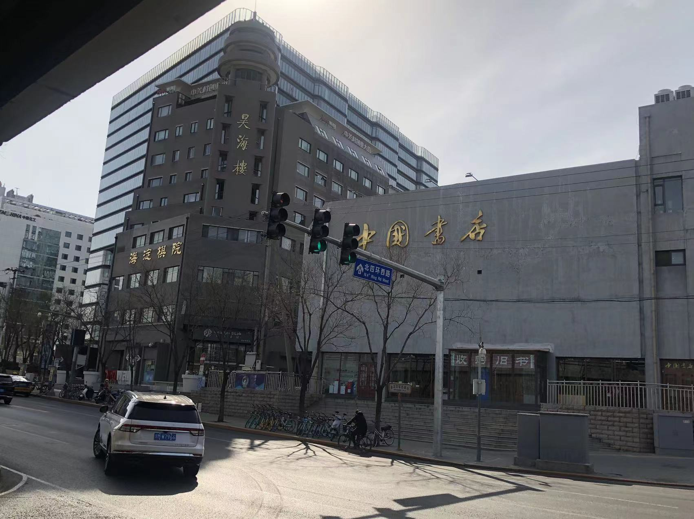
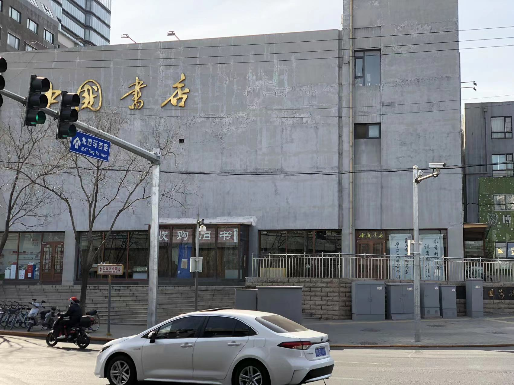
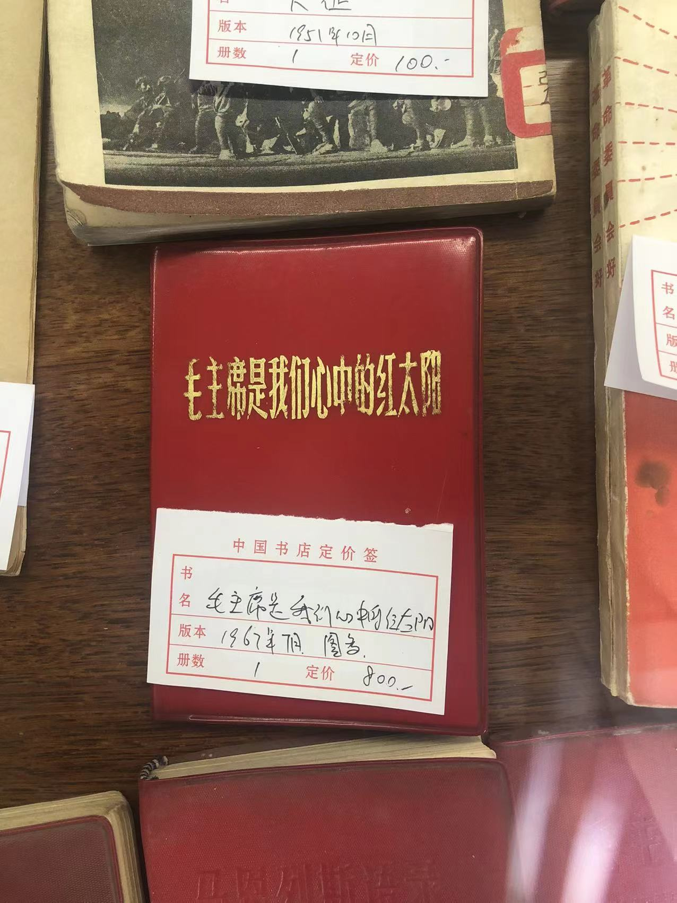
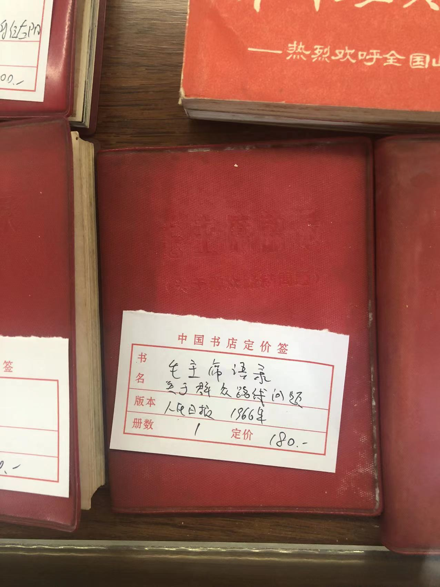
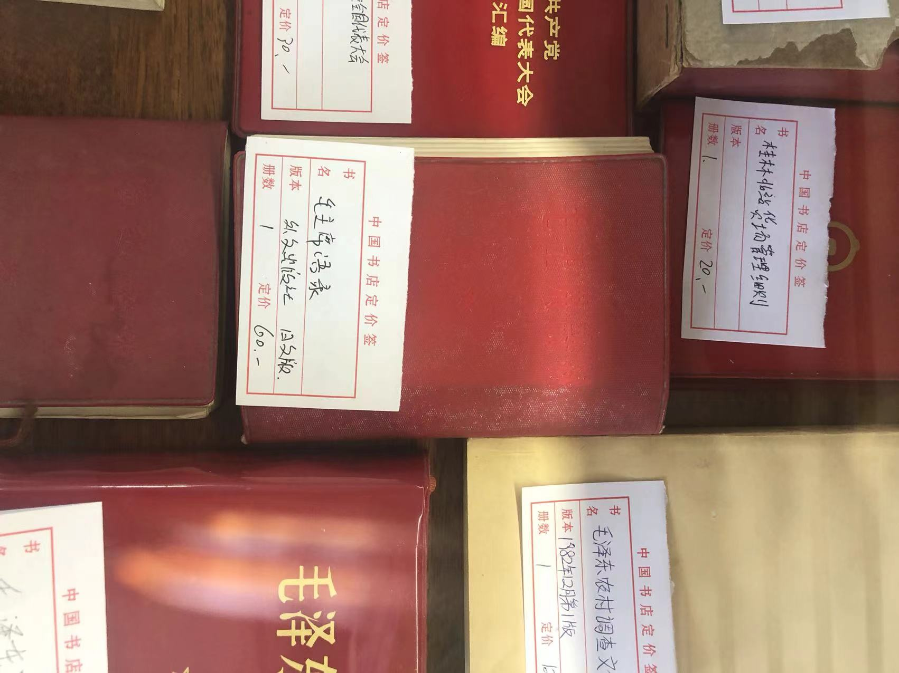
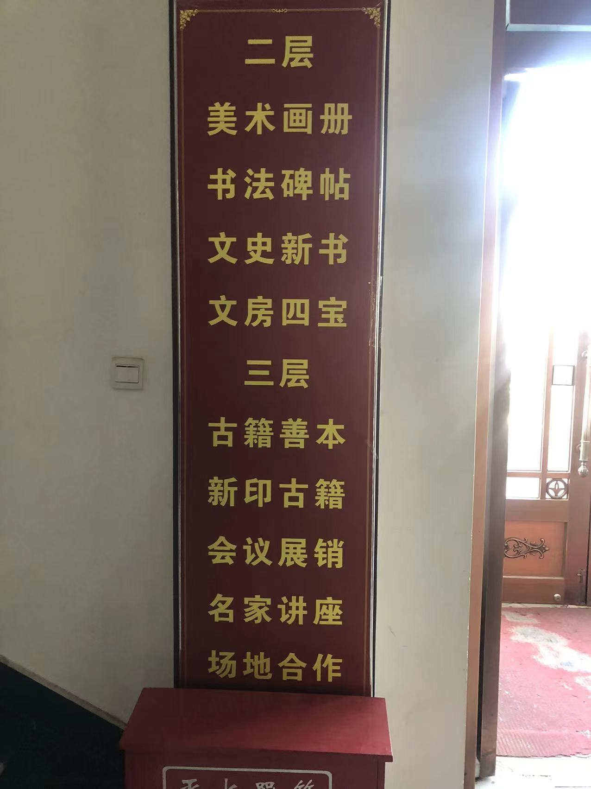
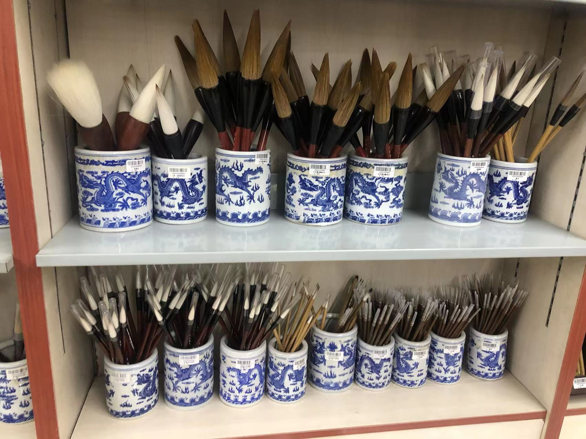
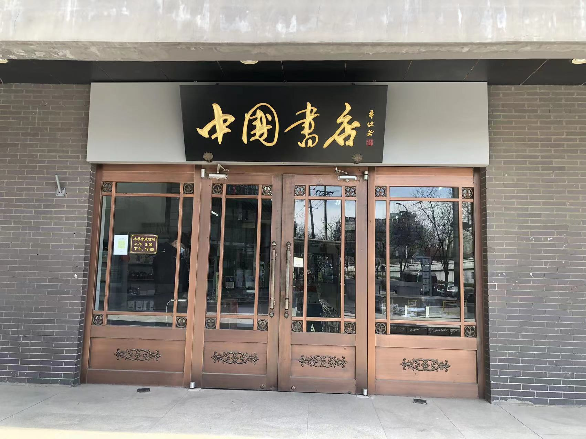

2023 年 3 月 26 日中国书店中关村店游记

Datetime: 2023-03-26T12:44+08:00

Categories: Tour

Tags: Diary

按照日记传统，还需要写上农历的时间 —— 癸（gui）卯年闰二月初五，周日，晴

地址：[Google-Map](https://goo.gl/maps/ng1BpH21Z6oTAdsm8)，[Baidu-Map](https://j.map.baidu.com/00/T1g)

为什么要去这家书店呢？和这家书店初识是在去实习的公交车上，在中关村这个寸土寸金的地方，有一家以「中國」命名的书店很难不引人注目，何况它还占地巨大。它在谷歌地图上的名字就是「China Bookstore」。

从北航旁的「北京城市学院」出发，乘坐 686 路公交车，在「海淀桥北」下车，就可以直接看见书店。

走近了，书店旁边还有一家棋院，让我想起柯洁的饭店。

<!--  -->

大门上写着「收购旧书」四个大字，真让人忍俊不禁。

<!--  -->

走进书店的正门，上面贴着白纸，告诉人们大门坏了，请从东门进（能在中关村开店却没钱修门？），真是一家好不在意形象但是十分真诚的书店。

# 一层

进入书店，先看到的是人，书店里有人。

我先是在旁边的一个小区域看了一会儿，进门是小说和文集，还有草稿本，真的有人会买吗？

看到了两本辞海，上下册，这本书是从右往左印刷的，神奇，让我想起我从后往前使用日记本，不过还是从左往右。

这些书有些是 80 年代的，比如鲁迅、巴金文集，有些书看起来就很有年头，我一来不敢去触摸，怕碰坏了，二来更加注意自己的水壶，怕打湿了。我真担心把我卖了都赔不起，后来发现我想多了，便宜一点的书才会放在这么近的地方。

谈到书的年龄，在这个区域随便抽一本，按辈分我得叫爹，如果精挑细选一番，我得喊爷爷，若是一定要挑，这书店里年纪最大的，我爷爷来了喊爷爷都不够。

浏览了门边区域后，门旁不知什么时候有位保安，他在站着看书。然后我进入了一层的中心，这里有老爷爷、有说着一对说着我听不懂话的情侣，但显然我们可以识别同一种符号 —— 汉字。

看人的年龄，我不是最小的，一开始是，后来来了位带着小男孩的父亲，他很活泼，不过浏览一下就从西门走了。所以我又变成最年轻的辣，不论是书还是人的年龄。

一层的西侧没什么，就是一些把古代的东西印在现代的纸上，当书籍被电子化后，这些现代的材料的意义在哪里？还是说新书也会老去，现在的纸也会变成过去的纸，那时候所谓「意义」才显现出来。

一层的东侧有标了价格的一些书，这是最「庸俗」的，也是我第一次发笑，凡是给物品打上标签与价格，人们的注意力便不在物品本身。

这些打了标签的书籍，有些是连环画，有些是语录，还有一些字我都认得，连在一起我就认不得。

于是我的兴趣就从文字转移到价格上（我也是俗人一个），我很好奇什么决定了一本书的「价格」与「价值」，或许可以训练一个机器学习模型试一试。

我一开始以为最贵的是《程砚秋：赴欧考察戏曲音乐报告书》

<!--  -->

还有只在书上见过的「xx 文章发表」在的《文学杂志》：

<!--  -->

这里面最让我深刻的是「红宝书」，让我想起高一语文老师的那些玩笑，这种东西电子书也有不少，但是它的意义在于它是那个时代的缩影，人们看到、摸到、拿起的时候，那个时代的影像、那个时代的伟人、那个时代的混乱就好像出现在眼前，这是现代纸质材料和电子书没法赋予的。

<!-- 

 -->

# 二楼

<!--  -->

二楼是书画和鉴赏类，如果说一层书籍重在符号的内在含义，二层就是符号的外在表达（让我想起 Eco）。

二层很多都是把过去的文字印在现在的纸上，而且很多都非常厚重，我觉得这样很无聊，还不如电子书呢。一个词非常贴切地形容 —— 「古籍新印」。

我仔细端详了位于南侧的毛笔，我喜欢「聿」这个字，它发音同「玉」，是笔的意思。毛笔大概就是三部分：蘸墨的笔头，手抓的笔杆和二者之间的连接处，这些东西对我而言都是工业品罢了，没有感情的。

<!--  -->

但是可以看着它们打发时间，小小的毛笔就像女子梳妆的粉刷（原谅我的称呼，我从未了解过这些东西），女子打扮自己是为了让自己的外在更好看（这让我想起张雨生的《后窗》），而笔书写文字有时却是在表达自己的内心感情。

接着逛下去，有金石鉴赏书籍，甚至还有「铜镜」鉴赏书籍（我大受震撼，还有人有这种癖好），但是我唯独没有看到教人怎么鉴赏古籍的，我喜欢这种套娃的思考。

世界上有无数本《资治通鉴》、无数本《史记》，有的写在竹简上，有的写在过去泛黄的纸上，有的就像在书店里一样，由机器工业化地印在白纸上。就像人一样，大家都一样，这让我涌起一种平庸和无意义的感觉（我回来后才感觉自己可能弄清楚看到那些重复的书为什么有点不舒服）。

看到了两本绿色的《古代汉语常用字典》，我家里也有呀，还看到翁同龢日记，好几本，超级厚，高中物理老师提过：「每临大事有静气，不信今时无古贤」。

<!--  -->

二楼的书比较现代一些，我看到了大冰的书，高一的时候从同桌那借来看过（不对大冰的性格做评价），《解忧杂货铺》是高中生物课代表的推荐。于是我向店员搜索想看的书籍 —— 《阿勒泰的角落》，结果他说肯定没有，50 元以下电脑不收录。我还在三层找店员搜《银碗盛雪》，真的很想看，但是也没有。

<!--  -->

# 三层

三层是最贵的，我能看到几位记忆里的「老朋友」，这一层也是唯一有人下单买书的一层。要么不出手，要么就出手「阔绰」。

罗列一下：

《大唐西域记》，初中历史课本上的：

<!--  -->

《韩诗外传》，高中老师推荐过：

<!--  -->

《全唐诗》，价值 3 个 w：

<!--  -->

我看到最贵的一本书如下：

<!--  -->

还看到了蔡襄的书，蔡襄是家乡人，所以特地拍照：

<!--  -->

还看到了杜甫诗集，好巧啊，最上面这本就收录了三吏三别，《石壕吏》的诗句历历在目，我真想发照片给语文老师，但是已经想不起来什么时候学过这篇课文，所以不知道要发给高中还是初中的老师。

<!--  -->

<!--  -->

<!--  -->

什么叫做句读，我今天算是见识到了。还有一些类似于 v、二 之类的符号，真是「符号充满了神秘」。

书籍的价格也很有意思，我甚至笑了出来 —— 好奇 20、80 这种零头怎么标出来的。

<!--  -->

<!--  -->

从三层回到一层，我想看看有没有自己认识的书，看到一本冰心的《繁星 · 春水》，小学时候听说过。

<!--  -->

书店是书的摇篮还是书的坟墓，还是书永远不会离开的旅店？我对于这些书只是旅人，她们的春帷不会为我而揭。

下到二楼的时候，我想书店应该是迎来了它最小的一位读者，由妈妈带着、不会超过三年级、穿着黄衣服的女孩，让我想起连翘花，她当然在初春的时节，我已经不在了。

保安看的书是《明朝那些事》，出门后，一位外卖小哥骑着电动车在人行横道从我身边穿过，，让我有不好的联想，我得回去好好弄毕设了。

书店里的书那么多，让我想起这个世界上的人。这个世界上，表达的人太多，聆听的人太少（我曾经告诫自己要做好一个聆听者）。你（我）看文章的时候会一字一句地看吗，会思考作者为什么要这么写吗，会认真体悟作者写到这一句话、写完这一篇文章的感情吗，会想要和作者来一场跨越时间和空间的心灵连接吗，看完以后作者的话还会在脑海里停留多久呢……

书店适合在一个闲散的下午去逛，每一本书都是作者的孩子，作者认真地给 ta 们起名（xx 选集诸如此类除外），比如「朝花夕拾」，单单是看着这些书的名字就很有诗意，就是酸痛的腿脚会提醒自己时间到了，该回「家」了。

<!--  -->

