2023 年 5 月 2 日国家图书馆

Datetime: 2023-05-02T12:44+08:00

Categories: Tour

Tags: Diary

[ToC]

# 缘起

[国家图书馆](http://www.nlc.cn/web/select.html)，简称国图。为什么要去国家图书馆呢，起因是看到《口是心非》专辑里，《神采》的文案：

<blockquote>
更漫长的永昼来临以前 
让我 趁着这些微的极光 
看清妳被雪地晒红的脸 
—— 林燿德 · 南极记 · 银碗盛雪 · 洪范书店
</blockquote>

写得很美，银碗盛雪这个词也很特别，要是能一睹这本书的真容就好了。

z-lib 上没有林燿德的书，后来在国图的官网上检索到一些林燿德的著作，《林燿德诗集》和《你不了解我的哀愁是怎样一回事》，反正五一假期有时间，可以先去看看，至于《银碗盛雪》，上海图书馆好像有一本。

# 反向导航与双层大巴

北航南边出发，乘坐 653 路，即可到达国图。

<!--  -->

但是高德地图不愧是缺德地图，让我到对面的公交车站去坐车，而且我还在车上看《[Happier](https://book.douban.com/subject/2262392/)》，等我看累了，抽时间看还要多久才反应过来坐反了。

不过考虑到在看书，这些时间也不能说是浪费了。有意思的是，下车后乘坐另一辆反方向的 653，我发现这一路公交是双层的，类似于观光大巴，坐在第二层，有种古代皇帝出游的感觉。

后来我旁边来了一家三口，妈妈说这孩子就喜欢坐 653 路。

<!-- 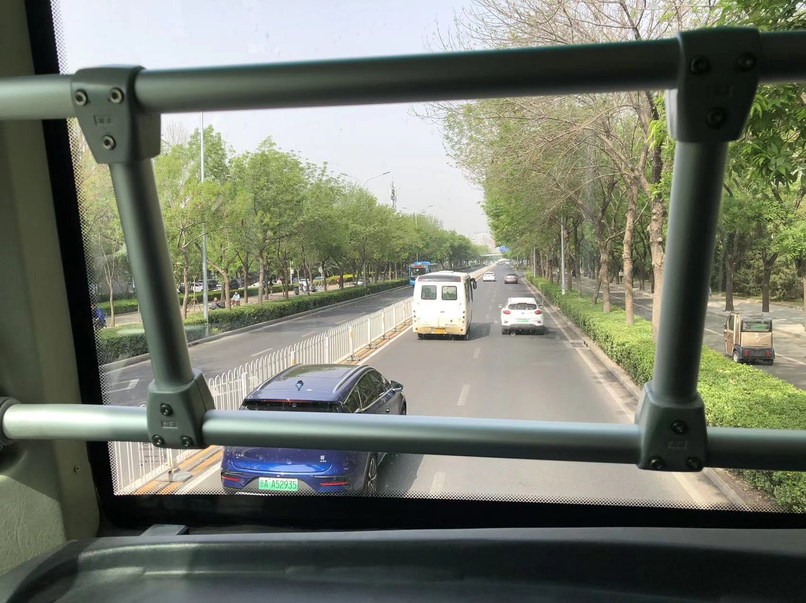 -->

# 进入国图与借阅藏书

国图是**一个**词，但实际上至少包括**两座**建筑：南区和北区。按照我的理解，南区存放古籍、台港澳书籍等，北区存放现代书籍。南区的书有更加严格的管理规定。

<!-- 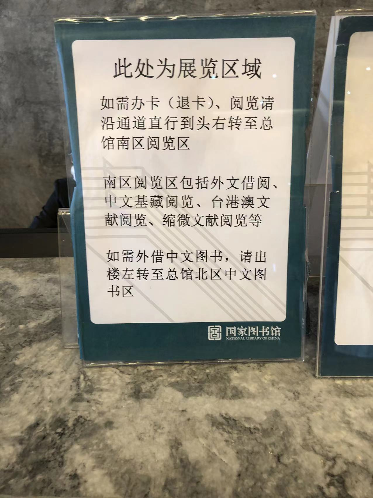 -->

双肩包和饮料不能进入国图，不过国图提供寄存服务。电脑和充电器可以带入国图，这也是为什么国图有不少自习的人。

普通的书籍可以凭借居民二代身份证借阅，但林燿德是台湾作家，他的书籍属于台港澳类别，借阅台港澳书籍需要办理读者卡。读者卡办理非常迅速，三分钟之内即可完成。

在办理读者卡的机器旁边还展览几本特别大的书，我第一次见过这么大的书。

<!-- 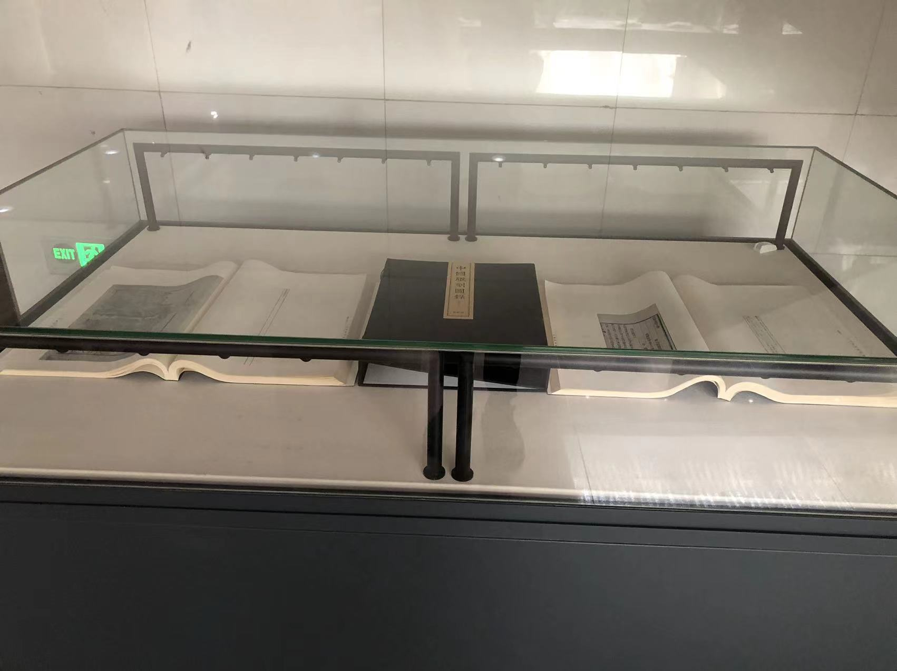 -->

台港澳区借阅书籍需要在机器上预约，而且发出借阅申请后，依照服务人员的说法，会有人去从书库里将书取出，需要至少等待 40 分钟。然而我觉得是在诓我，拿两本书要 40 分钟？

<!-- 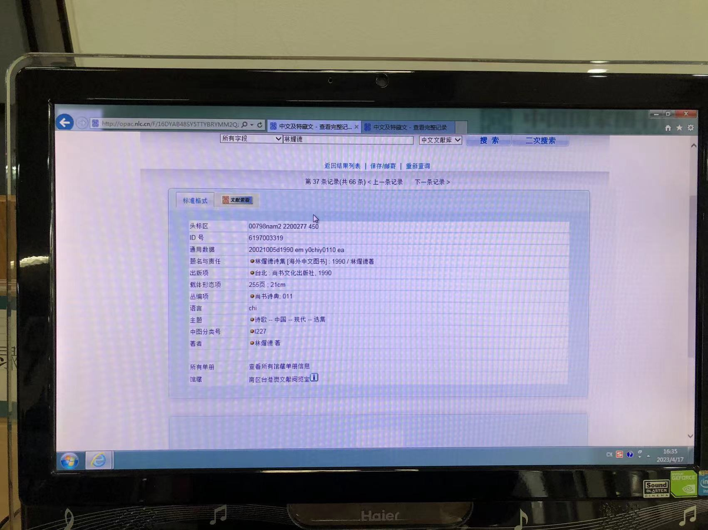 -->

因此我觉得图书管理员实在是个闲职，如果待遇尚可不失为一个养老去处？

# 甲骨文特展与瞎逛

我需要打发 40 分钟。

逛回大厅，有个甲骨文特展，不看白不看，实际这也是本次出游最有趣的经历，拍了好多（我觉得）好玩的照片。

首先是真的有甲骨和甲骨文，太神奇了，一块骨头可以保留几千年！

<!-- 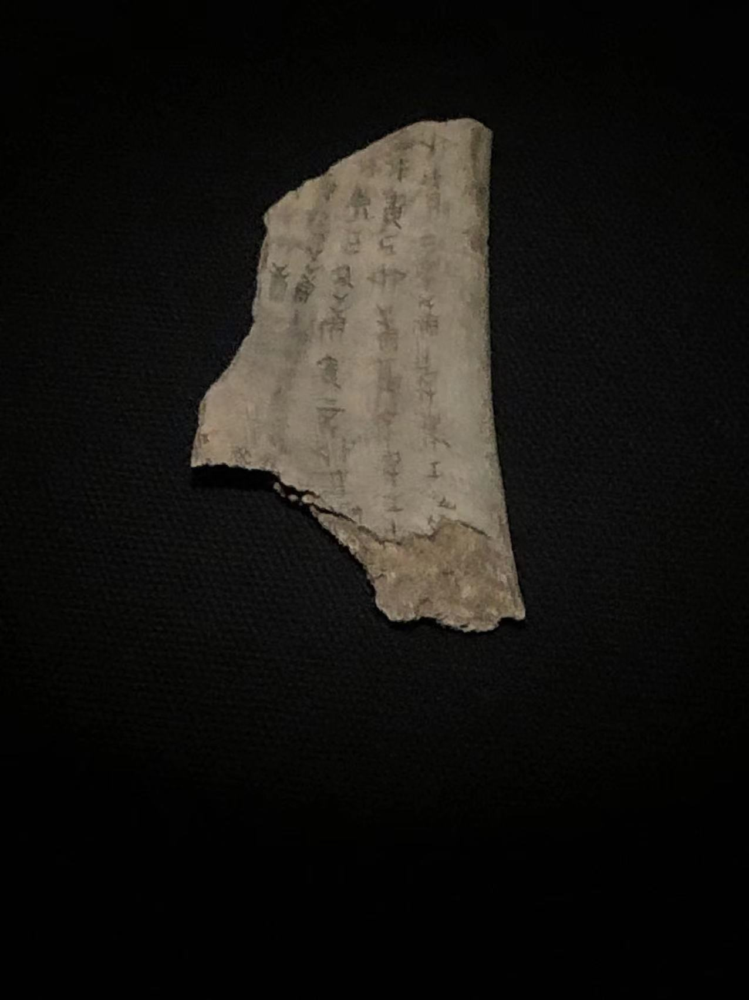 -->

<!-- 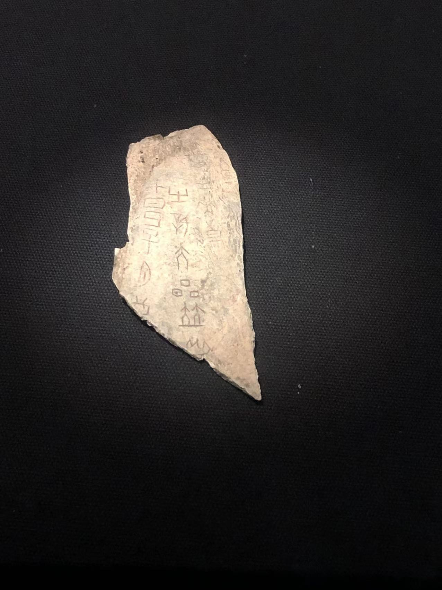 -->

我听到讲解员说「国之大事，在祀在戎」，我对这上面的内容不感兴趣，看旁边的文字说明，应该是占卜一类的，一片骨头上还保留着连续占卜好几次的记录？

感觉就和看艺术展和漫展一样。

用简体字来描述甲骨文化本身有点像返祖。

看到一个成年人在写甲骨文字，我觉得好神奇，数千年前在某个地方，说不定也有一个巫师拿着什么在骨片上刻着。

<!-- 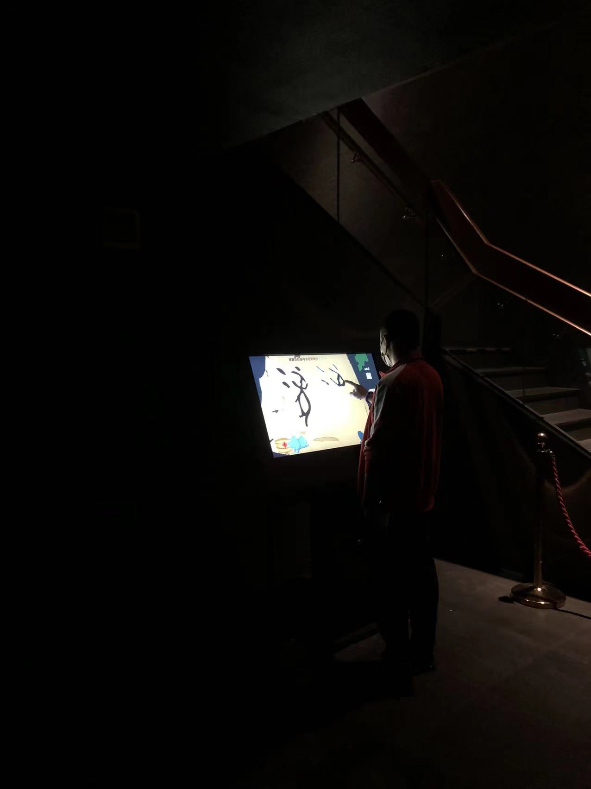 -->

还看到甲骨文字的干支纪年，十根柱子圆形环绕排列，我用手机的全景转一圈拍下来了。真是没有想到，几千年前就有这种记录时间的方式。

<!-- 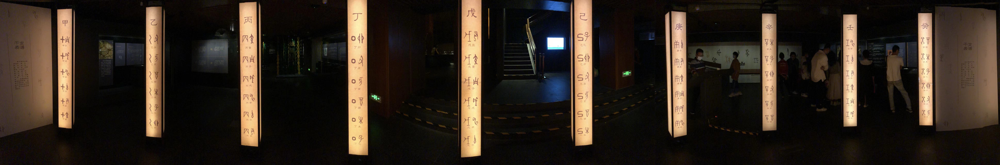 -->

离开的时候，注意到还有游客留言，我克制住了留言的冲动。小朋友肯定不会想到他们正在用「后甲骨文」表达对甲骨文的爱。

<!-- 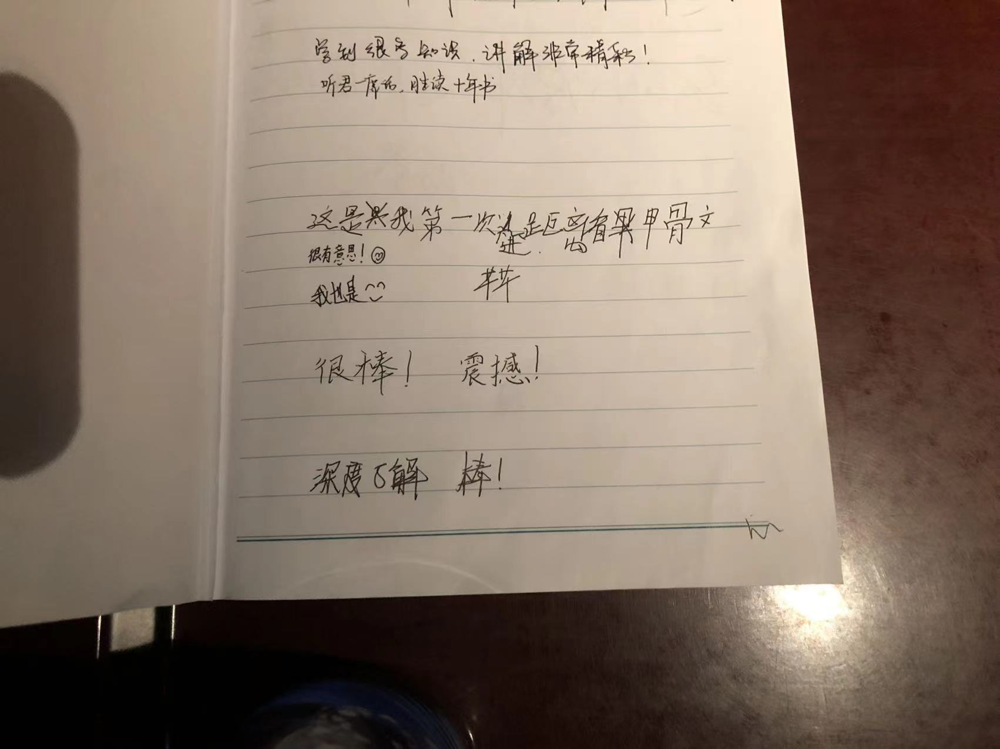 -->

后来离开了特展，看到一个小朋友在玩电子设备，他爸爸在看书。哎，不同人在不同时期有不同爱好。

<!-- 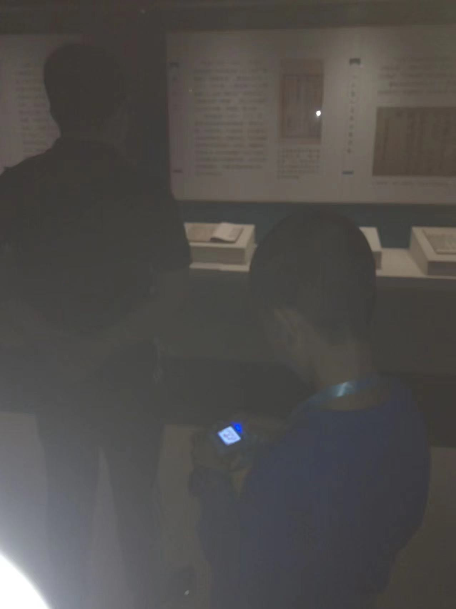 -->

甲骨文特展让我想起一篇小学课文（实际上是[阅读材料](https://mp.weixin.qq.com/s/0e9JzW-rgojHunv6Izyd3g)）和一位帅气高中同学的课前三分钟（为什么那个时候没有录像呢？），主题是表音文字和表意文字。甲骨文是表意文字。

# 诗集

打发完四十分钟后回到台港澳区，取到那两本书，我是无语的。

20 世纪 80 年代台湾书籍和现在大有不同：

1. 从右往左印刷
2. 内容排版为从上往下，从右往左，类似于张雨生写的那些信
3. 繁体字

我真是不理解呐，从右往左写字，手不会蹭到墨水吗？

中午还要回学校午休，一来看不完那么多诗，二来这些东西看得我头晕死了，我真是佩服那些可以阅读长诗的人，所以挑了几首快速读了一下，印象里只剩下《掌纹》、《钢铁蝴蝶》和《你不了解我的哀愁是怎样一回事》。

「你不了解我的哀愁是怎样一回事」这个名字真的是太长了，而且太闷骚了。

说来很惭愧，本来满心欢喜去看林燿德，结果对我也太难了，不论是排版还是遣词都太陌生了，看这种东西需要很大块的时间慢慢看。

我的心情就和趴在桌上的这位读者一样（用陌生人照片不算侵权吧），this is too hard for me...

<!-- 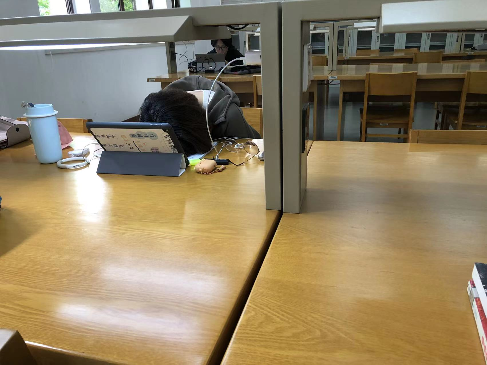 -->

# 结尾

走的时候，我还查了一下 Happier，还真有这本书，存放在北区，国图藏书真丰富（然而还是没有《银碗盛雪》）。

国图门口还有卖纪念品的，好像六块钱只能买一张纸一样的纪念品，洛阳纸贵都没这么夸张吧？

感觉最贵的就是情怀……比如数百元一份的二次元手办

最后的最后，放一首《仓颉》：

<iframe src="https://player.bilibili.com/player.html?aid=632734848&bvid=BV1Rb4y1m7Xu&cid=398477995&page=1&high_quality=1&danmaku=0&autoplay=0" allowfullscreen="allowfullscreen" width="100%" height="500" scrolling="no" frameborder="0" sandbox="allow-top-navigation allow-same-origin allow-forms allow-scripts"></iframe>

文字还是用来表达爱和美比较好，不要用来伤人。
