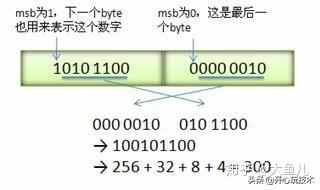

# Protocol Buffers 使用笔记

-   created: 2024-03-04T11:11+08:00
-   modified: 2024-11-26T15:28+08:00
-   published: 2024-12-25T15:30+08:00
-   categories: applications

Protocol Buffers 简称 protobuf 或者 PB，要解决的问题是这样的：
在互联网上传输**大量**数据，如果使用 json 等类似格式，会造成大量开销：

```json
[
    {
        "name": "Alice",
        "age": 16
    },
    {
        "name": "Bob",
        "age": 20
    }
]
```

如果有 1000 个人，'name' 和 'age' 就要出现 1000 次，还有各种换行符之类的开销。
最费时的是，age 看起来是 char，实际要使用的时候是 int，要做类型转换。

如果可以用一份配置文件表示传输 name 和 age，一个数据块直接存储 `(name,age)` 数组，就可以避免很大的开销。

配置文件：`[(name:string, age:int32)]`
数据：`[(Alice,16),(Bob,20)]`

这就是 Protocol Buffers 的想法：根据一份对数据的描述文件，对不同编程语言生成对应的「类」，实现对象的序列化和反序列化。

下载编译器，对 `.proto` 编译，得到对应的类文件，包括 Go, CPP, Python 等。

Protocol Buffers 的中文翻译「协议缓冲」，就好像不同数据传输协议之间的一个缓冲一样。

[Overview \| Protocol Buffers Documentation](https://protobuf.dev/overview/)
[Protocol Buffer Basics: C\+\+ \| Protocol Buffers Documentation](https://protobuf.dev/getting-started/cpptutorial/)

## zigzag-varint

Varint 中的每个 byte 的最高位 bit 有特殊的含义，如果该位为 1，表示后续的 byte 也是该数字的一部分，如果该位为 0，则结束。
其他的 7 个 bit 都用来表示数字。因此小于 128 的数字都可以用一个 byte 表示。
大于 128 的数字，比如 300，会用两个字节来表示：1010 1100 0000 0010。
下图演示了 Google Protocol Buffers 如何解析两个 bytes。注意到最终计算前将两个 byte 的位置相互交换过一次，这是因为 Google Protocol Buffers 字节序采用 little-endian 的方式。



[protobuf 的序列化实现方式](https://juejin.cn/post/6844904134211026957)
