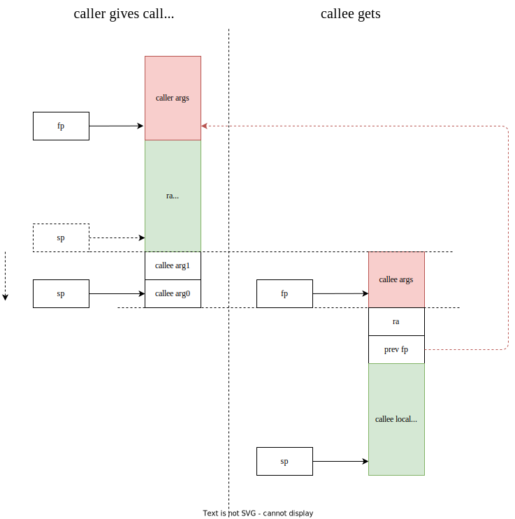

函数调用约定中寄存器的保存问题

-   created: 2024-03-25T17:03+08:00
-   published: 2024-03-29T09:50+08:00
-   modified: 2024-11-27T19:41+08:00
-   categories: compiler

[toc]

一个方便的在线查看汇编网站：[Compiler Explorer](https://godbolt.org/)

## 总结

callee 需要能够看到：

1. local variables：自己的局部变量
2. function arguments：caller 为自己提供的函数参数
3. return address: 要返回到的 caller 的地址

基于 risc-v(32-bits) gcc(trunk)，在 riscv 架构上：

1. local variables 由 stack pointer（sp 寄存器）索引
2. function arguments 由 frame pointer（fp 寄存器，也叫做 s0）索引，前 8 个在寄存器上
3. caller 的信息，包括 return address 和 caller 的 fp，在 frame pointer 下面，  
   也就是 sp 指向的栈区的高地址部分



## 例子

```c
int foo(int p0, int p1, int p2, int p3, int p4, int p5, int p6, int p7, int p8, int p9, int p10) {
    int a = 1;
    int b = 2;
    return p0 + p1 + a;
}

int main() {
    foo(0,1,2,3,4,5,6,7,8,9,10);
    return 0;
}
```

main 调用 foo 对应汇编如下：

```asm
## call foo(0,1,2,3,4,5,6,7,8,9,10) in main():
li      a5,10
sw      a5,8(sp)
li      a5,9
sw      a5,4(sp)
li      a5,8
sw      a5,0(sp)
li      a7,7
li      a6,6
li      a5,5
li      a4,4
li      a3,3
li      a2,2
li      a1,1
li      a0,0
call    foo(int, int, int, int, int, int, int, int, int, int, int)
```

1. 函数参数压栈的顺序是从后往前，10 先被压栈，然后是 9 ……
2. 把 foo 的参数放到 sp 上，sp[0] 就是 倒数第一个参数，sp[1] 是倒数第二个参数，……

这样 foo 作为 callee，看到的内存和寄存器的场景就是：

1. 前 8 个参数在寄存器上
2. sp 指向了函数第 8 个以后的参数

说明现在 callee 的参数是由 sp 索引的

risc-v 32-bits gcc(trunk) 这样处理 fp 和 sp：

1. local variables 由 stack pointer 索引
2. function arguments 由 frame pointer 索引
3. caller 的 ra 等存储在 sp 指向的栈区高地址

callee 要执行 `fp=sp`，这样就可以用 fp 索引调用参数了，  
但是现在 foo 看到的 fp 是前文 main 的函数参数索引，  
如果直接执行 `fp=sp`，原来 fp 的值就被覆盖了，所以要把 fp 保存起来。

这就是 foo 函数开头的逻辑：

1. 存储 caller 的 ra 和 fp
2. 修改 fp 和 sp 方便自己调用

foo 最后的逻辑就是把 fp、ra 恢复到 main 调用前的状态，

foo 的汇编如下：

```asm
foo(int, int, int, int, int, int, int, int, int, int, int):
        addi    sp,sp,-64   # save a stack for local variables
        sw      ra,60(sp)
        sw      s0,56(sp)
        addi    s0,sp,64    # adjust fp to previous stack pointer to index arguments
        sw      a0,-36(s0)
        sw      a1,-40(s0)
        sw      a2,-44(s0)
        sw      a3,-48(s0)
        sw      a4,-52(s0)
        sw      a5,-56(s0)
        sw      a6,-60(s0)
        sw      a7,-64(s0)
        li      a5,1
        sw      a5,-20(s0)
        li      a5,2
        sw      a5,-24(s0)
        lw      a4,-36(s0)
        lw      a5,-40(s0)
        add     a4,a4,a5
        lw      a5,-20(s0)
        add     a5,a4,a5
        mv      a0,a5       # result in a0
        lw      ra,60(sp)
        lw      s0,56(sp)	# restore register fp for caller
        addi    sp,sp,64    # restore register sp for caller
        jr      ra
```

## caller-save 和 callee-save

callee-save 的意思是说，如果 callee 想要用这个寄存器，那么就要预先保存好里面的值，用完了以后恢复。  
比如 fp 和 sp 就是 callee-save，caller 将这两个寄存器交给 callee，callee 为了自己的方便，调整它们的位置，  
但是最后返回的时候，fp 和 sp 要像调用 callee 之前一样。

所以，callee-save 的寄存器在函数调用前后保持不变。


