Python async await

-   created: 2025-01-04T15:27+08:00
-   category: python
-   tags: coroutine

本文代码来自 [Async IO in Python: A Complete Walkthrough](https://realpython.com/async-io-python/#other-features-async-for-and-async-generators-comprehensions)

首先呢，要知道 LWP（light weight process）的概念，要懂平时大家说的「用户态线程」和「内核态线程」是什么东西。

协程就是「用户态线程」，抛开编程语言，假设有两个执行流：

```bash
# flow 1:
some operations

get web page "http://www.baidu.com"

other operations


# flow 2:
some operations

read file "/hello.txt"

other operations
```

因为 get web page 和 read file 这个调用是非常耗费时间的，但是不占用 CPU，  
要是这两个执行流在同一个 core 上执行，完全可以并发（concurrent，某一时刻，两个执行流都开始了但是还没完成），  
让 flow 1 发起 get web page 后挂起，执行 flow 2， 发起 read file 后也挂起，把 CPU 让给其他的执行流。  
等到 get web page 或者 read file 完成后，再把 flow 1 和 flow 2 放到前台执行。

这里我们用了两个假设：

1. 在同一个 core 上执行
2. get web page 和 read file 不是 IO-Bound，可以让渡 CPU



Python 的 async 关键字就是在定义一个 coroutine，第三方库 asyncio 就是在提供调度机制。

```python
#!/usr/bin/env python3
# countasync.py

import asyncio

async def count():
    print("One")
    await asyncio.sleep(1)
    print("Two")

async def main():
    await asyncio.gather(count(), count(), count())

if __name__ == "__main__":
    import time
    s = time.perf_counter()
    asyncio.run(main())
    elapsed = time.perf_counter() - s
    print(f"{__file__} executed in {elapsed:0.2f} seconds.")
```

使用 ipython 交互：

```python
In [1]: import asyncio
   ...:
   ...: async def count():
   ...:     print("One")
   ...:     await asyncio.sleep(1)
   ...:     print("Two")
   ...:
   ...: async def main():
   ...:     await asyncio.gather(count(), count(), count())
   ...:

In [2]: coro = main()

In [3]: coro
Out[3]: <coroutine object main at 0x1122ed970>

In [4]: coro_count = count()

In [5]: coro_count
Out[5]: <coroutine object count at 0x112067640>
```

创建好的 coroutine 之间可以有依赖关系，比如上面的 main 就通过 `await` 依赖于 count。

`await f()` 关键字相当于

1. 创建了一个协程 `coro_f`
2. 把 `coro_f` 放到了 event loop
3. await 的调用者需要等待 `coro_f` 执行结束，才可以继续执行
   即建立了 coro 之间的依赖关系

`await sth` 的 sth 需要是 awaitable 的。

async 在 coro 上面又 wrap 一层，叫做 task，
通过 `asyncio.run(coro)` 来启动协程，做了两件事：

1. 为 coro 创建对应的 task
2. 把 task 放到 event loop 里开始执行。

`asyncio.gather` 的函数签名如下：

```python
def gather(*coros_or_futures, return_exceptions=False)
```

相当于把传进来的协程 tuple 加到 event loop 里。
await 就是要让现在的 caller 协程等着这些 callee 结束后再执行。

asyncio 在 coro 上 wrap 了一层 task，可以通过 create_task 直接从 coro 创建  
该函数还会将创建好的 task 添加到 event loop 中。

```python
def create_task(coro, *, name=None, context=None)
```

## 总结

1. async 和 await 关键字是在定义协程（coro）
2. async 在 coro 上又封装了一层，叫做 task
3. async 通过把 task 放到 event loop 里调度
