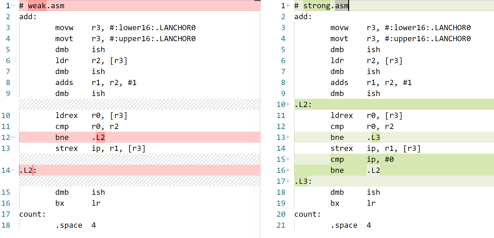

# CAS 在 ARM 架构与 x86_64 架构上的实现

-   created: 2024-11-13T16:25+08:00
-   published: 2024-11-13T16:36+08:00
-   modified: 2024-12-02T10:44+08:00
-   categories: operating-system
-   tags: lock-free

[toc]

## 总结

1. CAS 全称是 compare and swap，在 read-modify-write 中的 write 使用 cas
2. x86-64 上，cas 对应的指令是 `cmpxchg [shared_var], src`，把 `$eax` 和 `[shared_var]` 比较
    1. `cmpxchg`失败了会把 `[shared_var]` 写回到 `$eax` 里面
    2. 如果多核的话，需要 `lock cmpxchg`
3. 语言层面有 `compare_exchange(obj, expected, desired)`，也是失败了会回写 `expected`
4. arm 等平台通过 `LL/SC` 实现 cas，weak 和 strong 的区别是检查 `ll/sc` 中间是否被打断过。
   打断的原因可能是其他线程 ABA 了，也可能是 spurious failure
5. 语言层面没有解决 ABA 问题，因为 load-modify-cas，中 load 和 cas 不是用 `LL/SC` 实现的
   还是要用 version 或者其他方法
6. 注意`LL/SC`防止 false sharing，要用内存对齐

## CAS

为什么我们需要 CAS，因为 CPU 无法直接修改内存中的变量，而是需要通过寄存器来修改。

考虑如下的例子：

```cpp
int x;

int add() {
    x += 1;
}
```

如果有多个线程都在执行 add，以下的汇编代码可能被交错执行，从而导致错误。
注：用方括号`[x]`表示这个值在内存中，所有汇编格式为 `op destination source`

```assembly
load $0 [x]
$0 = $0 + 1
store [x] $0
```

交错执行：

```assembly
# thread A:
load $0 [x]
$0 = $0 + 1

# thread B:
load $0 [x]
$0 = $0 + 1
store [x] $0

# thread A:
# Thread A 将 $0 写入 [x]，thread B 相当于白干
store [x] $0
```

在对变量 x 进行修改前，肯定要先读取 x，我们约定把这个值叫做 old，未来要写入 x 的值叫做 update。

每次把 update 写入 x 前，取出 x 中的值和 old 值比较一下，相等才可以写入。

```assembly
# 模拟读取 [x] 并修改的操作
load $old [x]
$update = $old + 1

# the load-compare-exchange instructions can't be interrupt,
# which means they are atomic

load $temp [x]
if $temp == $old:
    store [x] $update
	ret 1
else:
	ret 0
```

## `cmpxchg`

在 x86-64 平台上，有指令 `cmpxchg [shared_var], $src `。

比较 `[shared_var]` 和 `$eax`，如果相等就写入 `$src` 到 `[shared_var]`，否则把 `[shared_var]` 写到 `$eax`。

特别注意！这条指令还做了比 CAS 更多的事情：那就是如果 cas 操作失败，把 `[shared_var]` 写到 `$eax`

下面是 GPT 的介绍。

### Syntax & Operation

The syntax for `cmpxchg` is as follows:

```
cmpxchg destination, source
```

1. **Comparison**: The instruction compares the value in the `destination` operand with the value in the `EAX` register (or `RAX` in 64-bit mode).
2. **Exchange**:
    - If the values are equal, the value in the `source` operand is stored in the `destination`.
    - If the values are not equal, the `destination` value is loaded into the `EAX` register (or `RAX`).

### Flags

The `cmpxchg` instruction affects the zero flag (ZF):

-   **ZF = 1**: The values were equal, and the exchange occurred.
-   **ZF = 0**: The values were not equal, and the original value of `destination` is in `EAX` (or `RAX`).

### Example

Here’s a simple example of how `cmpxchg` might be used:

```assembly
mov eax, [shared_variable]   ; Load the current value of shared_variable into EAX
mov ebx, new_value           ; Load the new value into EBX
cmpxchg [shared_variable], ebx ; Compare and exchange
```

1. The current value of `shared_variable` is loaded into `EAX`.
2. A new value (`new_value`) is loaded into `EBX`.
3. The `cmpxchg` instruction compares the value in `EAX` (original value of `shared_variable`) with `shared_variable`.
    - If they are equal, it sets `shared_variable` to `new_value`.
    - **If not, `EAX` is updated** with the current value of `shared_variable`, indicating that the exchange did not occur.

## 单核多线程：`cmpxchg`

假设 Thread A 和 Thread B 在单核上执行如下汇编：

```assembly
load $0 [x]

.begin:
$1 = $0 + 1

# interrupt happens at here
cmpxchg [x] $1

jne .begin
```

Thread A 在 cmpxchg 前因为调度而被中断，`A.$0` 和 `A.$1` 都写 A 的上下文内存中，
然后 Thread B 开始执行，成功完成 `[x]+=1`，然后 B 被切换出去，A 再执行。

Thread A 从上下文恢复 `$0` 和 `$1`，再执行 `cmpxchg [x] $1`，会发现 `$0` 已经不等于 `[x]` 了。
于是 failed，重新跳转到开头。

说明单核多线程下，`cmpxchg` 是可行的。

## 多核多线程：`lock cmpxchg`

还是一样的汇编代码，Thread A 在 CoreX 上，Thread B 在 CoreY 上，
这次没有任何中断打断 Thread A 或者 Thread B。

```assembly
load $0 [x]

.begin:
$1 = $0 + 1

# both Threads try to access [x]
cmpxchg [x] $1

jne .begin
```

多核心下，可能不同 thread 同时访存，导致同一时刻两个 core 上的 cmpxchg 发现 `[x]` 和 `$eax` 的值都一样，
从而 Thread A 和 Thread B 都被成功执行。

为了解决这个问题，x86_64 汇编提供 lock prefix 用于锁定总线/cache，如果一个 core 锁定了，另一个 core 就没法执行 cmpxchg 指令了。

## C 语言中的 CAS

C 提供了 `atomic_compare_exchange_weak(obj, expected, desired)` 和 `atomic_compare_exchange_strong` 两个“函数”，如果 `obj !=expected`，会把 `obj` 写回到 `expected` 中。

### 失败了会回写

验证程序：

1.  <a href="./test-fail-cas.c" target="_blank">test-fail-cas.c</a>
2.  <a href="./test-fail-cas.cpp" target="_blank">test-fail-cas.cpp</a>

```c
#include <stdatomic.h>
#include <stdio.h>

_Atomic int count = 0;

int main() {
  int old = atomic_load(&count);
  old += 1;
  int update = 100;
  int cas_res = atomic_compare_exchange_weak(&count, &old, update); // must fail
  printf("cas_res: %d, count: %d, old: %d\n", cas_res, count, old); // 0, 0, 0
  return 0;
}
```

### x86-64 汇编分析

下面我们分析下它的汇编结果。

-   我们暂时不需要知道为什么会有 weak 和 strong 的分别，这两个函数在 `x86_64` 平台得到的汇编结果一样的
-   为什么“函数”两个字要加引号呢？
    因为其调用没有 function stack，只是看起来像个 function，编译器直接将其映射到 cmpxchg 指令。

```c
#include <stdatomic.h>

_Atomic int count = 0;
int add(int val)
{
    int old = atomic_load(&count);
    int new = old + val;
	atomic_compare_exchange_weak(&count, &old, new); // must fail
    return old;
}
```

汇编结果见 https://godbolt.org/z/nvWW14ahW

```assembly
add:
        mov     eax, DWORD PTR count[rip]
        add     edi, eax
        lock cmpxchg    DWORD PTR count[rip], edi
        ret
count:
        .zero   4
```

1. eax 就是 `cmpxchg [X] $src` 用来比较 `[x]` 的寄存器
2. `cmpxchgl` 可以认为是 `cmpxchg` 的 wide-bits 版本
3. 多核心所以使用 lock prefix

## ABA problem

如果要用链表实现无锁栈，需要考虑 ABA problem

这里提供一个简单的 [lock-free stack.c](./c11-lock-free-stack.c) 例子，使用 C11 标准，通过 version 解决 ABA。
源码来自：[C11 Lock\-free Stack](https://nullprogram.com/blog/2014/09/02/)

## LL/SC

为了解决 ABA 问题，`compare exchange` 被拆开

```assembly
# 假设现在已知 [x] 旧值在 $old 中
load $old, [x]

# 想要修改为 $update 中的值
$update = $old + 1

if [x] == $old:
    store [x] $update
	ret 1
else:
	ret 0
```

如果最初在 load 的时候，做一个标志位，标识 `[x]` 被 touch 了，store 的时候检查这个标志位。

当 load 和 store 中间有其他 thread 写入内存，不论其他 thread 对 [x] 修改的结果是否同 $secret 一致，store 都将 fail。
这样就能检测 ABA problem。

## weak 和 strong 的区别

为了我们方便查看 weak 和 strong 版本的差异，这次我们直接使用 weak 和 strong 返回值，查看其对应 arm 汇编。

C 和对应汇编地址：https://godbolt.org/z/Kznxqb1hE

```c
// weak.c
#include <stdatomic.h>

_Atomic int count = 0;
int add(void)
{
    int old = atomic_load(&count);
    int new = old + 1;
    atomic_compare_exchange_weak(&count, &old, new); // <- use weak here
    return old;
}
```

```c
// strong.c
#include <stdatomic.h>

_Atomic int count = 0;
int add(void)
{
    int old = atomic_load(&count);
    int new = old + 1;
	atomic_compare_exchange_strong(&count, &old, new); // <- use strong here
    return old;
}
```

开启 O1 进行编译：

```assembly
# weak.asm
add:
        movw    r3, #:lower16:.LANCHOR0
        movt    r3, #:upper16:.LANCHOR0
        dmb     ish
        ldr     r2, [r3]
        dmb     ish
        adds    r1, r2, #1
        dmb     ish
        ldrex   r0, [r3]
        cmp     r0, r2
        bne     .L2
        strex   ip, r1, [r3]
.L2:
        dmb     ish
        bx      lr
count:
        .space  4
```

```assembly
# strong.asm
add:
        movw    r3, #:lower16:.LANCHOR0
        movt    r3, #:upper16:.LANCHOR0
        dmb     ish
        ldr     r2, [r3]
        dmb     ish
        adds    r1, r2, #1
        dmb     ish
.L2:
        ldrex   r0, [r3]
        cmp     r0, r2
        bne     .L3
        strex   ip, r1, [r3]
        cmp     ip, #0
        bne     .L2
.L3:
        dmb     ish
        bx      lr
count:
        .space  4
```

特别注意：因为 `ldrex $r0` 所以 return 的值正好就是最新的 count，不需要再做 `load old count` 的操作。

diff：



区别在于，strex 后是否有 bne

### strex 做了什么

注意：strex 不检查是否 equal（因为前面已经有 ldrex-cmp-bne 来保证内存中和寄存器是 equal 的），只看对应 cache line 是否被 written

`strex   ip, r1, [r3]` 指令检查上次 ldrex 后 `[r3]` 所在 cache line 是否被 written

1. 如果被 written 就直接将 ip 置 1，不写入
2. 如果没有 written 就 ip 置 0，并将 r1 写入 `[r3]`

### weak 和 strong 在 strex 后的区别

-   weak 版本如果发现`[r3]` 所在 cache line 被 written 会直接返回 failed，但是此时 `[r3]`并不一定被修改了，原因如下：
    -   原因 1：`[r3]` 所在 cache line 的其他变量被修改
    -   原因 2：`[r3]` 确实被其他 thread 写入，但是写入前后的值一致
    -   原因 3：只是因为中断发生，没有任何 thread 写入，但是 cache line 就是被 written 了
-   strong 版本如果发现 written 会再次尝试，直到 `[r3]` 所在 cache line 没有被 written。

atomic_compare_exchange_weak 会因为 LL/SC 被打断而提前返回，
atomic_compare_exchange_strong 如果发现 LL/SC 被打断会再次尝试，直到一次没有被打断。

weak 会因为 spurious failure 返回，而 strong 会一直尝试直到没有发生 spurious failure。

### 语言层面没有解决 ABA problem

```c
// weak.c
#include <stdatomic.h>

_Atomic int count = 0;
int add(void)
{
    int old = atomic_load(&count);
    int new = old + 1; // other thread may modify old with the same value
    atomic_compare_exchange_weak(&count, &old, new); // <- use weak here
    return old;
}
```

虽然用 LL/SC 实现了 cas，但是因为在 load 到 old 时候，这条 load 指令并不是 LL，
所以对于本线程的 load-modify-cas 操作，cas 没法判断在 modify 期间，其他线程是否修改了 `shared_var`。

LL/SC 只是保证了 `compare_echange()` 函数内部没有 ABA problem。

### 何时用 weak，何时用 strong？

如果只是应对 x86_64 无所谓，都一样

weak 和 strong 区别就是，当 `obj==expected` 后，发现 cache line 被 written 过（可能其他线程写了，也可能自己被中断了），要不要再试一遍 cas？

weak 说不用了，我直接失败，strong 会一直尝试，保证自己没有被打断。

我觉得要具体情况具体分析，比如 suprious failure 的概率，不同线程写入的值相等的概率。

比如假设 spurious failure 概率非常小，多个线程对一个变量自增 1。在 LL 和 SC 中间如果 发现 cache line 被 written 了，那么就是其他线程已经更新了，不用再 retrieve 一遍，用 weak 更好。

可以参考：https://stackoverflow.com/a/25217283/20752995

## [小心 LL/SC 带来的 False Sharing](https://cloud.tencent.com/developer/article/1516818)

2.3.3 False sharing(伪共享)
现代处理器中，cache 是以 cache line 为单位的，一个 cache line 长度 L 为 64-128 字节，并且 cache line 呈现长度进一步增加的趋势。主存储和 cache 数据交换在 L 字节大小的 L 块中进行，即使缓存行中的一个字节发生变化，所有行都被视为无效，必需和主存进行同步。存在这么一个场景，有两个变量 share_1 和 share_2，两个变量内存地址比较相近被加载到同一 cache line 中，cpu core1 对变量 share_1 进行操作，cpu core2 对变量 share_2 进行操作，从 cpu core2 的角度看，cpu core1 对 share_1 的修改，会使得 cpu core2 的 cache line 中的 share_2 无效，这种场景叫做 False sharing(伪共享)。

由于 LL/SC 对比较依赖于 cache line，当出现 False sharing 的时候可能会造成比较大的性能损失。加载连接（LL）操作连接缓存行，而存储状态（SC）操作在写之前，会检查本行中的连接标志是否被重置。如果标志被重置，写就无法执行，SC 返回 false。考虑到 cache line 比较长，在多核 cpu 中，cpu core1 在一个 while 循环中变量 share_1 执行 CAS 修改，而其他 cpu core i 在对同一 cache line 中的变量 share_i 进行修改。在极端情况下会出现这样的一个 livelock(活锁)现象：每次 cpu core1 在 LL(share_1)后，在准备进行 SC 的时候，其他 cpu core 修改了同一 cache line 的其他变量 share_i，这样使得 cache line 发生了改变，SC 返回 false，于是 cpu core1 又进入下一个 CAS 循环，考虑到 cache line 比较长，cache line 的任何变更都会导致 SC 返回 false，这样使得 cup core1 在一段时间内一直在进行一个 CAS 循环，cpu core1 都跑到 100%了，但是实际上没做什么有用功。

为了杜绝这样的 False sharing 情况，我们应该使得不同的共享变量处于不同 cache line 中，一般情况下，如果变量的内存地址相差住够远，那么就会处于不同的 cache line，于是我们可以采用填充（padding）来隔离不同共享变量，如下：

```
struct Foo {
       int volatile nShared1;
       char   _padding1[64];     // padding for cache line=64 byte
       int volatile nShared2;
       char   _padding2[64];     // padding for cache line=64 byte
};
```

上面，nShared1 和 nShared2 就会处于不同的 cache line，cpu core1 对 nShared1 的 CAS 操作就不会被其他 core 对 nShared2 的修改所影响了。

上面提到的 cpu core1 对 share_1 的修改会使得 cpu core2 的 share_2 变量的 cache line 失效，造成 cpu core2 需重新加载同步 share_2；同样，cpu core2 对 share_2 变量的修改，也会使得 cpu core1 所在的 cache line 实现，造成 cpu core1 需要重新加载同步 share_1。这样 cpu core1 的一个修改造成 cpu core2 的一个 cache miss，cpu core2 的一个修改造成 cpu core1 的一个 cache miss 的反复现象就是所谓的 Cache ping-pong 问题，出现大量 Cache ping-pong 意味着大量的 cache miss，会造成巨大的性能损失。我们同样可以采用填充（padding）来隔离不同共享变量来解决 cache ping-pong。

## [padding 的其他写法 by Claude](https://poe.com/s/qPI9XGri3SyMIkn71p0U)

除了使用 padding 字段，还有以下几种方法让变量落在不同的 cache line 上：

1. 使用 alignas 关键字:

```cpp
struct Foo {
    alignas(64) int volatile nShared1;
    alignas(64) int volatile nShared2;
};
```

2. 使用编译器特定的属性:

```cpp
// GCC/Clang
struct Foo {
    int volatile nShared1 __attribute__((aligned(64)));
    int volatile nShared2 __attribute__((aligned(64)));
};

// MSVC
struct Foo {
    __declspec(align(64)) int volatile nShared1;
    __declspec(align(64)) int volatile nShared2;
};
```

3. 使用 C++17 的 new alignment 操作符:

```cpp
alignas(std::hardware_destructive_interference_size) int volatile nShared1;
alignas(std::hardware_destructive_interference_size) int volatile nShared2;
```

4. 使用标准库提供的特定宏(C++17):

```cpp
#include <new>
struct Foo {
    alignas(std::hardware_constructive_interference_size) int volatile nShared1;
    alignas(std::hardware_constructive_interference_size) int volatile nShared2;
};
```

需要注意的是：

-   hardware_destructive_interference_size 表示避免 false sharing 所需的最小对齐尺寸
-   hardware_constructive_interference_size 表示让数据落在同一 cache line 的最大对齐尺寸
-   不同平台上这些值可能不同，但通常是 64 或 128 字节

要确认具体对齐是否成功，可以使用:

```cpp
std::cout << offsetof(Foo, nShared1) << std::endl;
std::cout << offsetof(Foo, nShared2) << std::endl;
```

要检查对齐后的结构体大小：

```cpp
std::cout << sizeof(Foo) << std::endl;
```

我可以提供更多关于这些方法的详细信息，如果你感兴趣的话。
